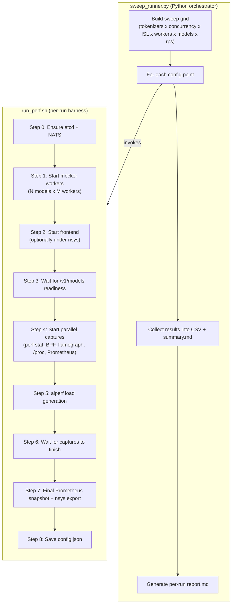
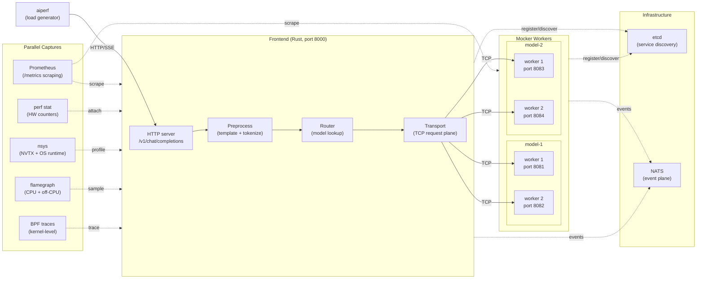

# 前端性能 Profiling

面向 Dynamo 前端（frontend）性能的统一可观测性（observability）与基准测试套件。

## 快速开始

```bash
cd ~/dev/dynamo
source dynamo/bin/activate

# 单次运行（mocker + frontend + aiperf + Prometheus）
cd benchmarks/frontend/scripts
./run_perf.sh --model Qwen/Qwen3-0.6B --concurrency 32 --num-requests 640 \
    --speedup-ratio 1000000 --skip-bpf --skip-nsys --skip-flamegraph --skip-perf

# Sweep（多个配置点）
python3 sweep_runner.py --tokenizers hf --concurrency 32 --isl 512 \
    --benchmark-duration 30 --speedup-ratio 1000000 \
    -- --skip-bpf --skip-nsys --skip-flamegraph --skip-perf
```

## 架构

基准测试套件分为两层：一个 Python 编写的 sweep 编排器构建配置网格，一个 shell
harness 执行每一次具体运行。



### 运行时拓扑

在一次基准测试运行中，活跃的进程如下。前端会接收来自 aiperf 的 HTTP 请求，
对输入做 tokenize，通过请求面（TCP）路由到某个后端模型，并把响应 token 流
回客户端。



### 多模型命名

当 `--num-models` 为 1 时，对外暴露的模型名与 HF 模型路径保持一致（例如
`Qwen/Q.6B`）。当 `--num-models` 大于 1 时，每个模型实例会获得一个合成
名（`model-1`、`model-2`、...），但所有实例共用相同的 `--model-path` 来加载
权重与 tokenizer 配置。

## 前置条件

| 工具 | 是否必需 | 安装方式 |
|------|----------|---------|
| etcd | 是 | `apt install etcd` 或 [releases](https://github.com/etcd-io/etcd/releases) |
| nats-server | 是 | `apt install nats-server` 或 [nats.io](https://nats.io/download/) |
| aiperf | 是 | `uv pip install "git+https://github.com/ai-dynamo/aiperf.git@main"`（在 dynamo venv 中） |
| jq | 是 | `apt install jq` |
| perf | 可选 | `apt install linux-tools-$(uname -r)` |
| bpftrace | 可选 | `apt install bpftrace`（需要 root 或 CAP_BPF + CAP_PERFMON） |
| inferno | 可选 | `cargo install inferno`（用于火焰图） |
| nsys | 可选 | NVIDIA Nsight Systems |

## sweep_runner.py

性能 sweep 的主入口。它会遍历配置网格，并把每个点委托给 `run_perf.sh`。

### 基础用法

```bash
# 冒烟测试（1 次运行）
python3 sweep_runner.py --tokenizers hf --concurrency 32 --isl 512 \
    --benchmark-duration 30 --speedup-ratio 1000000 \
    -- --skip-bpf --skip-nsys --skip-flamegraph --skip-perf

# 完整 tokenizer 对比
python3 sweep_runner.py --tokenizers hf,fastokens \
    --concurrency 32,64 --isl 512,1024,2048 \
    --benchmark-duration 60 --speedup-ratio 1000000

# 传输层饱和（变化 worker 数与请求数）
python3 sweep_runner.py --tokenizers hf --concurrency 4096 \
    --num-requests 16384,32768 --workers 1,2,4,8 --speedup-ratio 1000000

# 仅预览 sweep 计划而不执行
python3 sweep_runner.py --dry-run --tokenizers hf,fastokens \
    --concurrency 32,64 --isl 512,1024
```

### 多模型与 Worker 维度的 Sweep

`--num-models` 与 `--workers` 这两个标志控制启动多少个模型实例以及每个模型有
几个后端 worker。它们是研究前端在多租户与并行 worker 配置下扩展性的主要旋钮。

#### 扩展模型数量（每个模型 worker 数固定）

便于衡量增加被服务的模型数量对前端路由、传输层 fan-out、各模型延迟的影响。

```bash
# 在 1, 2, 3, 4 个模型实例之间扫描，每个模型 1 个 worker，75 rps
for m in 1 2 3 4; do
    python3 sweep_runner.py \
        --tokenizers hf \
        --concurrency 512 \
        --isl 512 \
        --workers 1 \
        --num-models $m \
        --rps 75 \
        --benchmark-duration 60 \
        --speedup-ratio 1000000 \
        --output-dir artifacts/sweep_models/m${m} \
        -- --skip-bpf
done

# 对比结果
for m in 1 2 3 4; do
    echo "=== m=$m ==="
    cat artifacts/sweep_models/m${m}/summary.md
    echo
done
```

#### 扩展每模型 worker 数（模型数量固定）

便于衡量在重负载下，针对单个模型增加后端 worker 是否能缓解传输层瓶颈。

```bash
# 对单个模型在 1, 2, 4, 8 个 worker 之间扫描
python3 sweep_runner.py \
    --tokenizers hf \
    --concurrency 512 \
    --isl 512 \
    --workers 1,2,4,8 \
    --num-models 1 \
    --rps 75 \
    --benchmark-duration 60 \
    --speedup-ratio 1000000 \
    --output-dir artifacts/sweep_workers \
    -- --skip-bpf
```

#### 模型 + Worker 联合网格

要在两个维度上做完全因子（full factorial）扫描，给两个标志分别提供多个值即可。
每种组合都会产生一次独立的运行。

```bash
# 2x3 网格：(1 model, 2 models) x (1, 2, 4 workers)
python3 sweep_runner.py \
    --tokenizers hf \
    --concurrency 256 \
    --isl 512 \
    --workers 1,2,4 \
    --num-models 2 \
    --rps 50 \
    --benchmark-duration 60 \
    --speedup-ratio 1000000 \
    --output-dir artifacts/sweep_grid \
    -- --skip-bpf
```

> **注意：** `--num-models` 是一个整数（不是逗号分隔列表）。要在不同模型数
> 之间做扫描，请按上面 "扩展模型数量" 中的示例在外层循环中实现。

#### 在结果中应该关注的内容

| 指标 | 来源 | 含义 |
|--------|-----------------|-------------------|
| Req/s 与 Tok/s | `summary.md` | 前端能否撑起目标负载 |
| TTFT p50/p99 | `summary.md` | 端到端首 token 延迟（包含 preprocess + 路由 + 传输层） |
| `transport_roundtrip` p50 | `report.md` 第 4 节 | 在 TCP 请求面上花的时间；当 worker 饱和时会变大 |
| Tokio worker 繁忙率 | `report.md` 第 7 节 | 各 async worker 处于忙碌状态的时间比例；高于 0.95 表明饱和 |
| 事件循环停顿 | `report.md` 第 7 节 | Tokio runtime 停顿的频率；高值意味着在 async executor 上有阻塞工作 |
| `preprocess.tokenize` | `report.md` 第 5 节（NVTX） | 单请求 tokenize 成本；不同 tokenizer 后端差异较大 |

### 配合 profiler

```bash
# 配合 perf stat + 火焰图（无需 root）
python3 sweep_runner.py --tokenizers hf --concurrency 64 --isl 1024 \
    --benchmark-duration 60 --speedup-ratio 1000000

# 全开（包括 BPF，需要 sudo）
sudo -E python3 sweep_runner.py --tokenizers hf --concurrency 64 --isl 1024 \
    --benchmark-duration 60 --speedup-ratio 1000000

# nsys profiling（需要 PATH 中有 nsys）
python3 sweep_runner.py --tokenizers hf --concurrency 64 --isl 1024 \
    --benchmark-duration 60 --speedup-ratio 1000000 \
    -- --nsys-path /opt/nvidia/nsight-systems/bin/nsys
```

`--` 之后的 profiler 控制参数会原样透传给 run_perf.sh：

| 标志 | 作用 |
|------|--------|
| `--skip-bpf` | 跳过 BPF tracing |
| `--skip-nsys` | 跳过 Nsight Systems |
| `--skip-flamegraph` | 跳过 CPU / off-CPU 火焰图 |
| `--skip-perf` | 跳过 perf stat 硬件计数器 |

### 全部选项

| 选项 | 默认值 | 说明 |
|--------|---------|-------------|
| `--model` | `Qwen/Qwen3-0.6B` | HF 模型路径 |
| `--backend` | `mocker` | 引擎：`mocker`（合成）或 `vllm` |
| `--tokenizers` | `hf,fastokens` | 逗号分隔的 tokenizer 后端 |
| `--concurrency` | `50,100,200` | 逗号分隔的并发等级 |
| `--isl` | `512,1024,2048` | 逗号分隔的输入序列长度 |
| `--osl` | `256` | 输出序列长度 |
| `--workers` | `2` | 每个模型的 worker 数（逗号分隔） |
| `--num-models` | `1` | 模型实例数量（每个实例有 `--workers` 个 worker） |
| `--rps` | - | 逗号分隔的目标请求速率（req/s） |
| `--aiperf-targets` | `first` | `first`：仅 model-1。`all`：对每个模型都跑 aiperf |
| `--speedup-ratio` | `1.0` | mocker 加速因子；用较大值（如 1000000）可使 mocker 几乎瞬时返回 |
| `--benchmark-duration` | `60` | aiperf 运行时长（秒） |
| `--num-requests` | - | 逗号分隔的请求数（覆盖 duration） |
| `--output-dir` | 自动 | 输出目录 |
| `--max-consecutive-fails` | `2` | 失败 N 次后跳过剩余的 ISL |
| `--cooldown` | `3` | 两次运行之间的间隔秒数 |
| `--dry-run` | - | 仅打印计划，不执行 |
| `--no-report` | - | 跳过逐次运行的报告生成 |

## run_perf.sh

底层的逐次运行 harness。通常由 sweep_runner.py 调用，但也可直接用于单次运行。

```bash
# 最小化（不带 profiler）
./run_perf.sh --model Qwen/Qwen3-0.6B --concurrency 32 --num-requests 640 \
    --speedup-ratio 1000000 --skip-bpf --skip-nsys --skip-flamegraph --skip-perf

# 全量可观测性（BPF 需要 sudo）
sudo -E ./run_perf.sh --model Qwen/Qwen3-0.6B --concurrency 64 \
    --benchmark-duration 60 --speedup-ratio 1000000

# 多模型，每个模型 2 个 worker
./run_perf.sh --model Qwen/Qwen3-0.6B --num-models 2 --workers 2 \
    --concurrency 32 --benchmark-duration 30 --speedup-ratio 1000000 \
    --skip-bpf --skip-nsys --skip-flamegraph --skip-perf

# 4 个模型，每个 1 个 worker，限速 75 rps
./run_perf.sh --model Qwen/Qwen3-0.6B --num-models 4 --workers 1 \
    --concurrency 512 --benchmark-duration 60 --request-rate 75 \
    --speedup-ratio 1000000 --skip-bpf
```

## 结果分析

```bash
# 单次运行报告（由 sweep_runner.py 自动生成）
python3 analysis/create_report.py analyze artifacts/sweep_<ts>/hf_c32_isl512_w2

# 自动找到最近一次运行
python3 analysis/create_report.py analyze

# Prometheus 指标差量（初始 vs 最终快照）
diff <(grep "^dynamo_frontend" artifacts/.../prometheus/initial_snapshot.txt | sort) \
     <(grep "^dynamo_frontend" artifacts/.../prometheus/final_snapshot.txt | sort)

# nsys SQLite 查询（启用 nsys 时）
sqlite3 artifacts/.../nsys/frontend.sqlite \
    "SELECT name, COUNT(*), ROUND(AVG(end-start)/1e3,1) as avg_us
     FROM NVTX_EVENTS WHERE end > start GROUP BY name ORDER BY avg_us DESC"
```

## 输出结构

```text
artifacts/sweep_YYYYMMDD_HHMMSS/
    results.csv                        Sweep results (all runs)
    summary.md                         Comparison table
    hf_c32_isl512_w2/                  Per-run directory
        config.json                    Run parameters
        report.md                      Analysis report
        aiperf/
            profile_export_aiperf.json aiperf metrics
        prometheus/
            initial_snapshot.txt        Pre-load metrics
            final_snapshot.txt          Post-load metrics
            timeseries.jsonl            Per-second scrapes
        system/
            thread_count.txt            Thread count over time
            fd_count.txt                FD count over time
            proc_status.txt             /proc/PID/status snapshots
        logs/
            frontend.log
            mocker_*.log
        perf/                           (if --with-perf)
            perf_stat.txt
            cpu_flamegraph.svg
        bpf/                            (if --with-bpf, needs root)
            runqlat.txt
            syscall_latency.txt
            ...
        nsys/                           (if --with-nsys)
            frontend.nsys-rep
            frontend.sqlite
```
