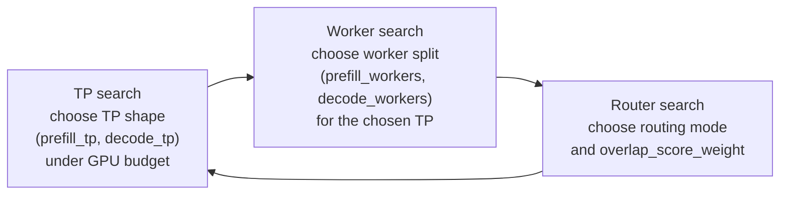

<!--
SPDX-FileCopyrightText: Copyright (c) 2026 NVIDIA CORPORATION & AFFILIATES.
All rights reserved.
SPDX-License-Identifier: Apache-2.0
-->

# Replay Optimize

## 实验目标

本实验在解耦（disaggregated）replay 状态空间上进行搜索，回答一个具体问题：

- 给定固定的 GPU 预算
- 在具有真实前缀重叠的工作负载下
- 在仍允许有意义吞吐的延迟 SLA 下

哪一组 `(prefill_tp, decode_tp, prefill_workers, decode_workers, overlap_score_weight)` 组合能产生最佳的离线 replay 结果？

这是一个在 replay 状态空间上的启发式搜索，而不是对所有可行配置的精确优化。

## Spec 形态（与 DGDR 对齐）

公开 API 接收单个 [`ReplayOptimizeSpec`](specs.py)，由以下组成：

- `EngineSpec` —— 模型、后端、引擎参数（disagg 时分别有 prefill 与 decode；agg 时只有一个 `baseEngineArgs`）
- `HardwareSpec` —— GPU SKU 与总 GPU 预算
- `WorkloadSpec` —— 合成 workload 参数（isl/osl/concurrency/...）**或** trace 来源（`traceFile`/`arrivalSpeedupRatio`），通过是否设置了 `traceFile` 进行区分
- `SLASpec` —— 延迟边界（`ttft`、`itl`、`e2eLatency`，以及对应的 p95 变体）；每项均独立、可选
- `RouterSpec` —— 路由模式、overlap-score-weight 扫描、KV-router 基础配置
- `objective` —— `ReplayObjective.THROUGHPUT`（默认）、`MEAN_TTFT` 或 `MEAN_E2E_LATENCY`
- `maxParallelEvals` —— 同时进行的 replay 评估数量

字段名全部采用 lowerCamelCase，以匹配 operator 自动生成的 [`dgdr_v1beta1_types.py`](../dgdr_v1beta1_types.py)，使后续合入 Go 端 `DynamoGraphDeploymentRequestSpec` 仅是机械替换。方法名（`.violation_penalty()`、`.summarize()`、`.aic_task_kwargs()`）保持 snake_case，以符合 Pydantic 约定。

## 前置条件

请在仓库根目录运行。

使用项目虚拟环境：

```bash
.venv/bin/python --version
```

如果 Python 绑定还无法 import，先构建：

```bash
.venv/bin/maturin develop --uv -m lib/bindings/python/Cargo.toml
```

本示例默认使用基于 AIC 的 replay 优化：

- 用 AIC 枚举密集 TP 候选
- 为 replay 候选配置使用基于 AIC 的引擎计时

将 `aiconfigurator` 安装到项目环境：

```bash
uv pip install --python .venv/bin/python aiconfigurator
```

如果普通安装无法加载可用的性能数据，请从已材料化真实系统数据的源码 checkout 重新安装：

```bash
uv pip install --python .venv/bin/python --force-reinstall /path/to/aiconfigurator
```

如果 replay 优化因 AIC 缺失性能数据库或解析失败（例如 `KeyError: 'gemm_dtype'`）而失败，请检查已安装的文件：

```text
.venv/lib/python*/site-packages/aiconfigurator/systems/data/...
```

如果这些文件以 `version https://git-lfs.github.com/spec/v1` 开头，则你拿到的是 Git LFS 指针 stub，而不是真正的性能表。这种情况下请从一个已包含真实 LFS 材料化载荷（位于 `systems/`）的 checkout 或 wheel 安装 `aiconfigurator`。

直接从源码 checkout 运行时，需要将仓内 Python 包暴露出来：

```bash
export PYTHONPATH=lib/bindings/python/src:components/src
```

如果 replay 搜索使用多 worker 进程，建议使用真实脚本文件而不是 heredoc。这一点在 macOS 上尤为重要，因为 `ProcessPoolExecutor` 子 worker 需要稳定的模块路径，并且 driver 模块必须将入口包裹在 `if __name__ == "__main__":` 之中。

对于 KV-router 的 replay 日志，下面这个过滤器可在保留有用 `info` 输出的同时让运行更可读：

```bash
export DYN_LOG='info,dynamo_kv_router::scheduling::selector=warn'
```

## 实验设置

本扫描使用：

- `EngineSpec.model`：`Qwen/Qwen3-32B`
- `EngineSpec.backend`：`vllm`
- `HardwareSpec.gpuSku`：`h200_sxm`
- `HardwareSpec.totalGpus`：`16`
- `RouterSpec.mode`：`kv_router`
- 合成 `WorkloadSpec`

这里的 GPU 预算是离线 replay 在枚举候选 TP 与 worker 配置时使用的模拟搜索约束。本地不需要真的 16 块 GPU 也能跑这个搜索。

合成 workload 故意设置得足够大，使得 worker 分配与 router 设置都能产生影响：

- `isl=32768`
- `osl=256`
- `requestCount=5000`
- `concurrency=200`
- `sharedPrefixRatio=0.5`
- `numPrefixGroups=50`

base engine 参数保持保守：

- `block_size=512`
- `num_gpu_blocks=20000`
- `enable_prefix_caching=True`
- 显式区分 prefill 与 decode 的 `worker_type`

该设置不会强制触发 scheduler 特有的瓶颈，例如：

- `enable_chunked_prefill`
- 较小的 `max_num_seqs`
- 固定的 `max_num_batched_tokens`

仅当实验确实是关于 scheduler 限制时再加这些。

## 搜索策略

`replay_optimize` 在每一轮按三个维度执行坐标下降，迭代直到当前最优解不再变化或达到 `DEFAULT_SEARCH_ROUNDS`：



每一步会调用 [`evaluate._evaluate_states`](evaluate.py)，它通过 `run_synthetic_trace_replay` 或 `run_trace_replay` replay 候选状态（其底层 harness 详见 [Mocker Trace Replay](../../../../../../docs/benchmarks/mocker-trace-replay.md)），并由 `scoring._pick_best_record` 对结果做排序。排序键为 `spec.objective`（throughput、mean_ttft 或 mean_e2e_latency），以 `spec.sla` 边界为约束，并以 `spec.hardware.totalGpus` 作为可行性闸门。

下降以预算为重点：每一步都将候选剪枝到接近预算上限的状态，因此扫描最终落在一个真正消耗了可用 GPU 预算的 TP/worker 形态上，而非每 GPU 吞吐的 pareto 点。聚合 replay（`optimize_dense_agg_with_replay`）把 1、2 维合成 `(tp, workers)`，其余完全相同；两个入口都见 [`search.py`](search.py)。

## 驱动脚本

规范化的入口点位于 [example.py](example.py)。把它作为真正的模块比在 README 中携带一大段内联代码更好，同时也满足 macOS 上 `ProcessPoolExecutor` 对稳定模块路径的需求。

请把 [example.py](example.py) 当作起点而非冻结 harness，按需修改：

- 修改 `WorkloadSpec` 形态（或通过 `traceFile=...` 切换为 trace 来源）
- 在 `SLASpec` 上添加 SLA 边界（`ttft`、`itl`、`e2eLatency` 或它们的 p95 变体）
- 修改 `RouterSpec.overlapWeights`
- 从 `result.evaluated_df` 或 `result.feasible_df` 打印不同列
- 持久化为 CSV 或 parquet 以便下游分析

要了解可用旋钮，参见 [specs.py](specs.py)、[search.py](search.py) 与 [evaluate.py](evaluate.py)。

[example.py](example.py) 的默认路径就是本 README 所记录的合成解耦扫描。它还接受 `--trace-file` 与 `--arrival-speedup-ratio`，以便同一个 driver 可以无需重写 harness 直接用于下方的 Mooncake 风格 replay 路径。

## 预期输出

返回的对象是 `DenseReplayOptimizationResult`，包含：

- `best_feasible`：在所有 SLA 与 GPU 预算下都满足约束的最佳访问状态
- `best_infeasible`：至少违反一个 SLA 边界或预算约束的最佳访问状态
- `evaluated_df`：所有访问过的状态
- `feasible_df`：仅可行的访问状态

可观察的列：

- 拓扑：`prefill_tp`、`decode_tp`、`prefill_workers`、`decode_workers`
- 路由：`router_mode`、`overlap_score_weight`
- 预算：`total_gpus_used`
  这是候选 replay 状态的模拟 GPU 占用，不是搜索机器上实际分配的 GPU 数量。
- 吞吐：`output_throughput_tok_s`
- 缓存行为：`prefix_cache_reused_ratio`
- 延迟：`mean_ttft_ms`、`mean_tpot_ms`、`mean_e2e_latency_ms`

注意，报告 DataFrame 仍使用 Rust replay runner 的键名（`mean_ttft_ms`、`mean_tpot_ms`、`mean_e2e_latency_ms`），即便 `SLASpec` 输入用的是 DGDR camelCase 名称（`ttft`、`itl`、`e2eLatency`）。`SLASpec` 内部带有翻译映射；重命名 Rust 输出键将作为后续工作在 Rust replay runner 中完成。

在本地测试中，该设置产生了一个非平凡的 mean-E2E 胜者大致为：

- `prefill_tp=4`、`decode_tp=1`、`prefill_workers=3`、`decode_workers=4`、`overlap_score_weight=0.5`
- `output_throughput_tok_s ~= 970`、`prefix_cache_reused_ratio ~= 0.5`、
  `mean_ttft_ms ~= 42800`、`mean_tpot_ms ~= 35`、`mean_e2e_latency_ms ~= 51900`

请将其视为合理性检查的范围，而非固定断言。当前参考前沿见 `run-replay-bench` skill 的回归锚点表。

## 调优本扫描

要扩大或转移搜索范围，每次只改一个轴：

- `HardwareSpec.totalGpus`
- `RouterSpec.overlapWeights`
- `WorkloadSpec.sharedPrefixRatio`
- `WorkloadSpec.numPrefixGroups`
- 基础的 prefill/decode engine 参数

如果想直接对比路由策略，请使用 `RouterSpec(mode="both")` 而不是默认仅 KV-router 的搜索。

## 真实流量 replay

`replay_optimize` 已内建 trace 驱动 replay 支持。`WorkloadSpec` 接受一个 `traceFile`（以及可选的 `arrivalSpeedupRatio`）作为判别项；当其设置后，[evaluate.py](evaluate.py) 会改走 `run_trace_replay(...)` 而非 `run_synthetic_trace_replay(...)`。

如果你希望在相同搜索结构下，对真实 Mooncake 风格 workload（而不是上面的合成共享前缀 workload）进行评估，应使用单独的 trace 驱动实验。

### 下载 Mooncake Trace

公共起点可使用 FAST'25 toolagent trace：

```bash
curl -sL \
  https://raw.githubusercontent.com/kvcache-ai/Mooncake/refs/heads/main/FAST25-release/traces/toolagent_trace.jsonl \
  -o /tmp/toolagent_trace.jsonl
```

```bash
wget -O /tmp/toolagent_trace.jsonl \
  https://raw.githubusercontent.com/kvcache-ai/Mooncake/refs/heads/main/FAST25-release/traces/toolagent_trace.jsonl
```

### 替换合成 workload

如果你使用 [example.py](example.py)，传入 `--trace-file /tmp/toolagent_trace.jsonl`，并可选地加 `--arrival-speedup-ratio 0.8`。

如果想直接修改 driver，将合成的 `WorkloadSpec`：

```python
workload=WorkloadSpec(
    isl=32768,
    osl=256,
    requestCount=5000,
    concurrency=200,
    sharedPrefixRatio=0.5,
    numPrefixGroups=50,
),
```

替换为：

```python
workload=WorkloadSpec(
    traceFile="/tmp/toolagent_trace.jsonl",
    arrivalSpeedupRatio=1.0,
),
```

如果想以原始到达率的 0.80 倍重放同一 trace，保持文件不变并设置 `arrivalSpeedupRatio=0.8`。

主要行为变化是：workload 不再在内存中生成请求，而是从 JSONL trace 重放请求到达。在该路径下：

- `traceFile` 指向 Mooncake 风格的 JSONL 输入
- `arrivalSpeedupRatio` 压缩或拉伸 trace 的到达过程
- 仅合成 workload 才相关的旋钮（如 `isl`、`osl`、`requestCount`、`concurrency`、`sharedPrefixRatio`、`numPrefixGroups`）会被 trace replay 路径忽略

关于公共 toolagent trace 的重要说明：

- 数据集使用 Mooncake 风格的 `hash_ids`，每个 block 含 `512` 个 token
- 底层 `run_trace_replay(...)` API 默认 `trace_block_size` 为 `512`
- `WorkloadSpec` 目前还未暴露独立的 `traceBlockSize` 字段
- [Prefix Data Generator](../../../../../../benchmarks/prefix_data_generator/README.md) 中的工具，可在运行此搜索之前先检视 trace 或合成更大派生 trace
