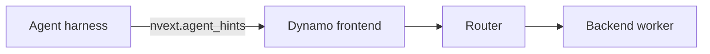

Agent 提示是 harness 通过 `nvext.agent_hints` 发送的可选逐请求元数据。Dynamo 在前端解析这些提示，并将其传递给路由器，以及（在支持的情况下）后端运行时。

仅在表达与服务相关的意图时使用 hints。如需被动追踪身份，请使用
[`nvext.agent_context`](agent-tracing.md#request-schema)。

## 请求结构

```json
{
    "model": "my-model",
    "messages": [
        { "role": "user", "content": "Continue the report." }
    ],
    "nvext": {
        "agent_hints": {
            "priority": 5,
            "osl": 1024,
            "speculative_prefill": true
        }
    }
}
```

| 提示 | 描述 |
|------|-------------|
| `priority` | 统一的请求优先级。值越高，请求会越早进入路由器队列；该值会被转发给支持优先级调度或驱逐的后端。 |
| `osl` | 期望的输出序列长度（以 token 为单位）。在启用 `--router-track-output-blocks` 时，路由器使用它进行输出 block 跟踪和负载均衡的精确性。 |
| `speculative_prefill` | 为 true 时，Dynamo 可以在当前轮次完成后预填充预测的下一轮前缀，为下一次请求预热 KV 缓存。 |

## 请求流程



前端解析 `nvext.agent_hints`，路由器使用 hints 进行排队与 worker 选择，受支持的后端使用转发的 hints 进行引擎级调度和缓存策略。

## 后端支持

后端支持因运行时而异。SGLang 的标志和行为请参阅
[SGLang for Agentic Workloads](../backends/sglang/agents.md)。

| 特性 | vLLM | SGLang | TensorRT-LLM |
|---------|:----:|:------:|:-------------:|
| 优先级感知路由 | Yes | Yes | Yes |
| 基于优先级的缓存驱逐 | Planned | Yes | Planned |
| 推测式预填充 | Yes | Yes | Yes |
| 子 agent KV 隔离与会话控制 | No | Experimental | No |

## 相关请求扩展

`agent_hints` 与 `agent_context` 是分开的：

- `agent_context` 是用于追踪和关联的被动身份。
- `agent_hints` 是用于路由、调度与缓存行为的主动服务意图。

用于 SGLang 子 agent KV 隔离的会话控制元数据位于
`nvext.session_control` 下，参见 [NVIDIA Request Extensions](../components/frontend/nvext.md#session-control)。
