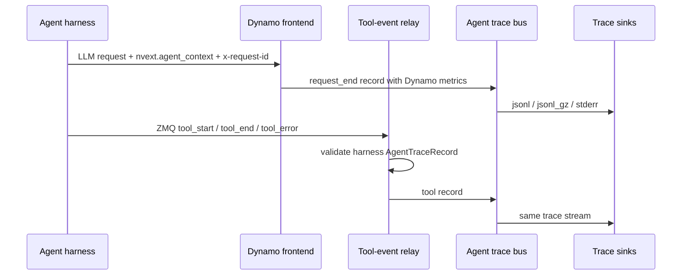

Dynamo agent tracing 会为 agent 类请求写出面向"在线服务"视角的 trace 记录。
每次 LLM 调用会携带被动的 `nvext.agent_context` 身份信息（session 与 trajectory ID），
Dynamo 把它和自身的请求指标一起记录下来，并可选地包含 harness 发布的工具生命周期事件。
agent context 不会改变路由、调度或缓存行为；trace 输出是尽力而为（best-effort）的性能分析数据，
而不是持久的审计数据。



## 请求 Schema

每次 harness 发起的 LLM 调用都应包含 `nvext.agent_context`：

```json
{
    "model": "my-model",
    "messages": [
        { "role": "user", "content": "Research Dynamo agent tracing." }
    ],
    "nvext": {
        "agent_context": {
            "session_type_id": "deep_research",
            "session_id": "research-run-42",
            "trajectory_id": "research-run-42:researcher",
            "parent_trajectory_id": "research-run-42:planner"
        }
    }
}
```

| 字段                  | 是否必需 | 含义                                                                         |
| ---------------------- | :------: | --------------------------------------------------------------------------- |
| `session_type_id`      |   是    | 可复用的工作负载/profile 类别，例如 `deep_research` 或 `coding_agent`。 |
| `session_id`           |   是    | 顶层 agent 运行（session）的标识。 |
| `trajectory_id`        |   是    | 一次 agent 运行内部的某条推理/工具 trajectory。 |
| `parent_trajectory_id` |   否    | 子 agent 的父 trajectory。 |

一个 `session_id` 内可以包含多条父子 trajectory。这些字段名与
[Agent Trajectory Interchange Format][atif-rfc] 保持一致，因此 harness 的 trajectory 文件
和 Dynamo 服务端 trace 可以在不重命名字段的情况下直接 join；详见本页底部折叠区。

[atif-rfc]: https://github.com/harbor-framework/harbor/blob/main/rfcs/0001-trajectory-format.md

### OpenAI 客户端集成

使用 OpenAI Python 客户端时，请通过 `extra_body` 传递 Dynamo 的扩展字段，
通过 `extra_headers` 设置 `x-request-id`：

```python
import uuid


def instrument_llm_request(kwargs, agent_context):
    body = dict(kwargs.get("extra_body") or {})
    nvext = dict(body.get("nvext") or {})
    nvext["agent_context"] = dict(agent_context)
    body["nvext"] = nvext

    headers = dict(kwargs.get("extra_headers") or {})
    headers.setdefault("x-request-id", str(uuid.uuid4()))

    out = dict(kwargs)
    out["extra_body"] = body
    out["extra_headers"] = headers
    return out
```

`x-request-id` 是 harness 自己用来标识某一次 LLM 调用的逻辑 ID。Dynamo 会把它复制到
`request.x_request_id`；它与 Dynamo 内部的 request ID 是两回事。

### Harness 集成模式

已有的 harness 不需要 import 任何 Dynamo 包，也不需要链接 Dynamo 运行时 API。
框架集成应当遵循以下结构：

- 增加一个小的工具模块，把当前的 `agent_context` 存入 context variable。
- 用该 context 包裹每一次 agent 运行，让 LLM 调用与工具记录共享同一个
  `session_id` 与 `trajectory_id`。
- 在每次 OpenAI 兼容的 LLM 请求前，调用一个 helper 来合并
  `extra_body.nvext.agent_context` 并设置 `x-request-id`。
- 当 LLM 调用或工具记录可能在线程池、子进程、子 agent 启动路径中产生时，
  请确保把 context 也透传过去。
- 当从某个已知父 trajectory 启动子 agent 时，请同时填写 `parent_trajectory_id`。

## 启用 trace 输出

大多数本地 profiling 场景下，建议使用滚动压缩的 JSONL：

```bash
export DYN_AGENT_TRACE_SINKS=jsonl_gz
export DYN_AGENT_TRACE_OUTPUT_PATH=/tmp/dynamo-agent-trace
```

它会写出类似如下的文件：

```text
/tmp/dynamo-agent-trace.000000.jsonl.gz
/tmp/dynamo-agent-trace.000001.jsonl.gz
```

如果想接收 harness 发出的工具事件，请配置 Dynamo 要绑定的本地 ZMQ 端点。
harness 进程会作为生产者连接到该端点：

```bash
export DYN_AGENT_TRACE_TOOL_EVENTS_ZMQ_ENDPOINT=tcp://127.0.0.1:20390
```

然后启动任意 Dynamo OpenAI 兼容后端即可。

<details>
<summary>环境变量参考</summary>

| 环境变量                       |               是否必需               | 默认值     | 说明                                                                                                                                       |
| ------------------------------------------ | :----------------------------------: | ----------- | ------------------------------------------------------------------------------------------------------------------------------------------------- |
| `DYN_AGENT_TRACE_SINKS`                    |                 是                 | 未设置 | 启用本地 trace sink。可选值：`jsonl`、`jsonl_gz`、`stderr`，或它们的逗号分隔列表（如 `jsonl_gz,stderr`）。 |
| `DYN_AGENT_TRACE_OUTPUT_PATH`              | 选择了 `jsonl` 或 `jsonl_gz` 时必需 | 未设置 | 本地 trace 输出路径。`jsonl` 时为完整文件路径；`jsonl_gz` 时为衍生 `.jsonl.gz` 分段文件的前缀。 |
| `DYN_AGENT_TRACE_CAPACITY`                 |                  否                  | `1024`      | 进程内 trace bus 的容量。 |
| `DYN_AGENT_TRACE_JSONL_BUFFER_BYTES`       |                  否                  | `1048576`   | JSONL writer 的缓冲区大小。`jsonl_gz` 时表示在追加一个完整 gzip member 之前的最大未压缩批量大小。 |
| `DYN_AGENT_TRACE_JSONL_FLUSH_INTERVAL_MS`  |                  否                  | `1000`      | JSONL 周期性 flush 间隔。`jsonl_gz` 时每次 flush 都会追加一个完整 gzip member。 |
| `DYN_AGENT_TRACE_JSONL_GZ_ROLL_BYTES`      |                  否                  | `268435456` | `jsonl_gz` 分段滚动阈值（按未压缩字节数计）。 |
| `DYN_AGENT_TRACE_JSONL_GZ_ROLL_LINES`      |                  否                  | 未设置 | 可选的 `jsonl_gz` 分段滚动阈值（按记录条数计）。 |
| `DYN_AGENT_TRACE_REPLAY_HASHES`            |                  否                  | 默认启用    | 默认在请求记录中输出用于重放（replay）的 prompt block 哈希。设置为 `0`、`false`、`off`、`no` 等假值可禁用。哈希所用的块大小取自模型 deployment card 的 KV 缓存块大小。 |
| `DYN_AGENT_TRACE_TOOL_EVENTS_ZMQ_ENDPOINT` |                  否                  | 未设置 | Dynamo 用于接收 harness 工具事件的本地 ZMQ PULL 端点。设置后即启用工具事件接入。 |
| `DYN_AGENT_TRACE_TOOL_EVENTS_ZMQ_TOPIC`    |                  否                  | 未设置 | 可选的 topic 过滤器，作用于 ZMQ 第一帧消息。 |

</details>

`DYN_AGENT_TRACE_SINKS` 是本地输出的总开关。仅设置 `DYN_AGENT_TRACE_OUTPUT_PATH` 并不会
启用 tracing。仅设置 ZMQ 端点会启用工具事件接入，但若没有同时配置 sink，则不会落本地文件。

## 工具事件

harness 维护一个长连接的本地 ZMQ PUSH socket，把工具生命周期记录推送到 Dynamo 绑定的端点。
Dynamo 接受 harness 发来的 `tool_start`、`tool_end`、`tool_error` 三种记录，
并把它们写入与 LLM 请求记录同一条 trace 流。

ZMQ 上的线协议为：

```text
[topic, seq_be_u64, msgpack(AgentTraceRecord)]
```

请使用有界队列、独立的后台发布线程、单调递增的序列号，
以及带 high-water mark 的 PUSH socket。终态的工具记录应当是自包含的，
包含 `started_at_unix_ms`、`ended_at_unix_ms` 和 `duration_ms`，
因为队列压力、进程退出、网络故障仍可能导致先前的 `tool_start` 记录丢失。
`tool_start` 可保留用于实时/进行中状态查看，但不应作为重建已完成 span 的必要条件。

### 端点归属

Dynamo 拥有共享 ZMQ 端点的 bind 权限。harness 只是生产者，它们只能 connect。

这种方向选择对生产环境的进程树很重要。Agent 框架通常会在子进程中运行工具、子 agent、
插件或模型 wrapper。如果每个加载了 tracing 集成的进程都尝试 bind 同一个本地端点，
那么只有一个进程能成功，其他进程在启动时就会失败。
让 Dynamo 作为唯一 bind 的收集器，所有 harness 进程都以 PUSH 方式 connect，
父子进程就可以分别独立地输出自己的工具记录，并各自保留自己的
`agent_context.trajectory_id` 与 `parent_trajectory_id`。

```text
Dynamo frontend
  -> ZMQ PULL bind -> trace bus -> sinks

parent harness process
  -> queued ZMQ PUSH connect -> Dynamo

child tool / subagent process
  -> queued ZMQ PUSH connect -> Dynamo
```

记录中必须包含 `agent_context`。工具事件应当与周围的 LLM 调用共享同一个
`session_type_id`、`session_id` 和 `trajectory_id`；当子 agent 工具有 parent trajectory 时，
请把 `parent_trajectory_id` 也带上。Dynamo 据此把请求与工具记录归并到同一条
session/trajectory 通道。`tool_call_id` 只在一个 trajectory 内唯一，并不全局唯一；
离线消费方应当按 `session_id`、`trajectory_id`、`tool_call_id` 三者联合 join 工具记录。

```json
{
    "schema": "dynamo.agent.trace.v1",
    "event_type": "tool_end",
    "event_time_unix_ms": 1777312801500,
    "event_source": "harness",
    "agent_context": {
        "session_type_id": "deep_research",
        "session_id": "research-run-42",
        "trajectory_id": "research-run-42:researcher"
    },
    "tool": {
        "tool_call_id": "call-abc",
        "tool_class": "web_search",
        "status": "succeeded",
        "started_at_unix_ms": 1777312801080,
        "ended_at_unix_ms": 1777312801500,
        "duration_ms": 420.5
    }
}
```

## 查看 trace

直接读取压缩后的 trace 记录：

```bash
gzip -cd "${DYN_AGENT_TRACE_OUTPUT_PATH}".*.jsonl.gz | jq .
```

每一行都是一个记录器封装：

```json
{ "timestamp": 1234, "event": { "schema": "dynamo.agent.trace.v1" } }
```

将 trace 转成 Chrome Trace JSON 以便在 Perfetto UI 中查看：

```bash
uv run --no-project python benchmarks/agent_trace/convert_to_perfetto.py \
  "${DYN_AGENT_TRACE_OUTPUT_PATH}".*.jsonl.gz \
  --output "${DYN_AGENT_TRACE_OUTPUT_PATH}.perfetto.json"
```

在 [Perfetto UI](https://ui.perfetto.dev/) 中打开 `${DYN_AGENT_TRACE_OUTPUT_PATH}.perfetto.json`。
每次 LLM 请求会成为一个时间线 slice，按 session 与 trajectory 通道分组。
工具的终态记录会成为相邻工具轨道上的工具 slice。

常用的转换器参数：

| 参数                      | 含义                                                                        |
| ------------------------- | ------------------------------------------------------------------------------ |
| `--include-markers`       | 输出首 token 的瞬时标记。 |
| `--no-stages`             | 仅显示请求 slice，不显示 prefill/decode 阶段 slice。 |
| `--separate-stage-tracks` | 把 prefill/decode 阶段放到相邻轨道上，便于调试时间线嵌套关系。 |

## 用 Mocker 重放 trace

请求 trace 行默认带有"无文本"的重放哈希。可以把一个 trace 分片
转成 Mooncake JSONL，再通过 mocker 重放：

```bash
cargo run -p dynamo-bench --bin agent_trace_to_mooncake -- \
  --input-path "${DYN_AGENT_TRACE_OUTPUT_PATH}".*.jsonl.gz \
  --output-file /tmp/dynamo-agent-trace.mooncake.jsonl
```

启动重放时请使用转换器打印出的 `trace_block_size`。多 worker KV-router 重放示例：

```bash
TRACE_BLOCK_SIZE=128
uv run --no-sync python -m dynamo.replay /tmp/dynamo-agent-trace.mooncake.jsonl \
  --trace-format mooncake \
  --trace-block-size "${TRACE_BLOCK_SIZE}" \
  --replay-mode offline \
  --router-mode kv_router \
  --num-workers 4 \
  --extra-engine-args "{\"block_size\":${TRACE_BLOCK_SIZE}}" \
  --report-json /tmp/dynamo-agent-trace.replay-report.json
```

`kv_router` 需要不止一个 mock worker。如果只想做单聚合 worker 的冒烟测试，
请改用 `--router-mode round_robin --num-workers 1`。

### 重放范围与后续工作

当前已支持：

- 默认在每条 `request_end` 记录中输出累计的输入 block 哈希。
- 单轮 agent trace 可以转换为 Mooncake JSONL，带有绝对时间戳与紧凑的 `hash_ids`。
- Mocker 把这些行作为 wall-clock 到达事件读入，并基于配置的引擎、路由与容量模型来模拟缓存行为。
- 同一 `trajectory_id` 内并发的 LLM 调用会被保留为并行到达，
  因为转换后的行不共享 `session_id`。

后续路线图：

- 实时 KV cache 流转目前由 mocker 模拟，并不是按字节回放原始运行。
  更高保真的回放需要显式的 replay 事件流或 sidecar，而不是在转换器中推断写入。
- 输出 token 的文本/id 不会被重建。重放只驱动 `max_output_tokens`，
  并不会重新生成原始响应文本。
- 工具与轮次之间的因果依赖在单行 Mooncake 输出里没有建模。
  依赖前一个工具结果的请求会按其绝对到达时间被回放，
  而不是按"等工具完成"的语义。
- 端到端重放整次 agent 运行也在路线图中。当前的重放是请求级的；
  重建工具决策、agent 控制流或外部工具副作用属于后续工作。

## 记录语义

Dynamo 在响应流结束或被丢弃后输出 `request_end`。
对于服务路径未记录的字段，可空字段会被省略。

```json
{
    "schema": "dynamo.agent.trace.v1",
    "event_type": "request_end",
    "event_time_unix_ms": 1777312801000,
    "event_source": "dynamo",
    "agent_context": {
        "session_type_id": "deep_research",
        "session_id": "research-run-42",
        "trajectory_id": "research-run-42:researcher",
        "parent_trajectory_id": "research-run-42:planner"
    },
    "request": {
        "request_id": "dynamo-request-id",
        "x_request_id": "llm-call-42",
        "model": "my-model",
        "input_tokens": 128,
        "output_tokens": 16,
        "cached_tokens": 112,
        "request_received_ms": 1777312800000,
        "prefill_wait_time_ms": 12.1,
        "prefill_time_ms": 70.3,
        "ttft_ms": 82.4,
        "total_time_ms": 1000.1,
        "avg_itl_ms": 1.8,
        "kv_hit_rate": 0.875,
        "kv_transfer_estimated_latency_ms": 4.2,
        "queue_depth": 3,
        "worker": {
            "prefill_worker_id": 0,
            "prefill_dp_rank": 0,
            "decode_worker_id": 1,
            "decode_dp_rank": 0
        },
        "replay": {
            "trace_block_size": 64,
            "input_length": 128,
            "input_sequence_hashes": [14879255164371896291, 274632075616497421]
        }
    }
}
```

请求记录会捕获 Dynamo 自有的服务指标：

| 字段                              | 含义                                                  |
| ---------------------------------- | -------------------------------------------------------- |
| `request_id`                       | 该次 LLM 调用对应的 Dynamo 请求 ID。 |
| `x_request_id`                     | 调用方提供的逻辑请求 ID（若有）。 |
| `model`                            | 请求所指定的模型名。 |
| `input_tokens`                     | 已知时的 prompt/输入 token 数。 |
| `output_tokens`                    | 已知时的最终输出 token 数。 |
| `cached_tokens`                    | 已知时由前缀/KV 缓存命中提供的 prompt token 数。 |
| `request_received_ms`              | 请求到达时间（Unix epoch 毫秒）。 |
| `prefill_wait_time_ms`             | 从收到请求到开始 prefill 的等待时长。 |
| `prefill_time_ms`                  | 从开始 prefill 到首 token 的耗时。 |
| `ttft_ms`                          | 从收到请求到首 token 的耗时。 |
| `total_time_ms`                    | 从收到请求到请求完成的总耗时。 |
| `avg_itl_ms`                       | 首 token 之后的平均 token 间延迟。 |
| `kv_hit_rate`                      | 路由观测到的有效 KV 缓存命中率。 |
| `kv_transfer_estimated_latency_ms` | 解耦推理 KV 传输延迟的估计上界。 |
| `queue_depth`                      | 路由该请求时观测到的路由队列深度。 |
| `worker`                           | prefill/decode worker 的 ID 与 DP rank（若已记录）。 |
| `replay`                           | 用于 Mooncake/mocker 转换的"无文本"重放元数据。在 agent tracing 启用时默认输出，除非 `DYN_AGENT_TRACE_REPLAY_HASHES` 为假值。在启用 tracing 之前，严格的 trace 消费方必须能容忍这个可选对象。 |
| `replay.trace_block_size`          | 模型 deployment card 中的 KV 缓存块大小，用于推导重放哈希。 |
| `replay.input_length`              | 重放哈希所代表的 prompt/输入 token 数。 |
| `replay.input_sequence_hashes`     | 稳定的、感知序列顺序的 prompt block 哈希。这些是重放标签，并非原始 token，也不是 Mooncake 的紧凑 `hash_ids`。 |

trace 记录不包含 prompt/响应内容、原始 token ID、采样参数、finish reason 或错误状态。
重放哈希在不存储 prompt 文本的前提下暴露了 prompt 前缀的复用结构。
要捕获请求/响应负载，请使用 audit sink；要做基于 span 的可观测性，请使用 OpenTelemetry 导出。

如果是本地的负载调试，可以同时启用 audit log 与 agent tracing。
audit 与 agent trace 共享相同的 `jsonl` 与 `jsonl_gz` sink 原语，
两路流可以并行落盘：

```bash
export DYN_AGENT_TRACE_SINKS=jsonl_gz
export DYN_AGENT_TRACE_OUTPUT_PATH=/tmp/dynamo-trace
export DYN_AUDIT_SINKS=jsonl_gz
export DYN_AUDIT_OUTPUT_PATH=/tmp/dynamo-audit
export DYN_AUDIT_FORCE_LOGGING=true
```

audit 记录包含原始的 OpenAI 兼容请求、最终聚合后的响应，以及 harness 提供的
`nvext.agent_context`。当需要把负载文本与重放哈希、计时指标关联时，
通过 `request_id` 把 audit 记录与 agent trace 记录 join 起来：

```bash
gzip -cd /tmp/dynamo-audit.*.jsonl.gz   | jq -c '.event' > /tmp/audit.jsonl
gzip -cd /tmp/dynamo-trace.*.jsonl.gz   | jq -c '.event' > /tmp/trace.jsonl
jq -s 'group_by(.request_id // .request.request_id)' \
  /tmp/audit.jsonl /tmp/trace.jsonl
```

audit 也支持 `stderr` 与 `nats` sink；`DYN_AUDIT_SINKS` 接受逗号分隔列表
（例如 `jsonl_gz,nats`）。

重放哈希描述的是每次 LLM 请求所看到的累计输入。它们本身并不声明"发生了缓存搬移"、
"观测到了缓存复用"，也不代表"先前一次 decode 把 block 写入了 KV cache"。
Mooncake 转换会把这些 sequence 哈希映射成每文件紧凑的 `hash_ids`，
并在每一行加入绝对的请求到达 `timestamp`。重放器/mocker 会把带有显式逐轮时间戳的行
视为 wall-clock 到达，因此当原始 agent 并发地发起多次 LLM 调用时，
来自同一 `trajectory_id` 的调用是可以相互重叠的。
而使用 `delay` 的行则保留闭环 session 行为：下一轮要等上一轮完成再加上 delay。
然后重放器/mocker 把这些行视为请求读取，
并基于配置的引擎、路由、容量、准入和时序模型来模拟 KV 写入与事件。
模拟出来的缓存行为只能精确到这些重放参数所覆盖的范围。

## 一致性模型

trace 输出是尽力而为的性能分析数据，而非持久审计数据。Dynamo 把 LLM 请求记录与
harness 工具记录写入同一条 trace 流，但并不以事务方式提交。

工具记录延迟到达是预期内的现象。每条规范化记录都带有 `event_time_unix_ms`，
离线工具应当按事件时间排序，而不是按 JSONL 行序。Perfetto 转换器在渲染请求与工具 slice 前
会做这一步。

trace 文件不保证完整性。如果 Dynamo 在 sink worker 排空之前就退出、
trace bus 或 sink 落后导致丢数据、ZMQ/事件平面路径丢事件，记录就有可能缺失。

## 当前覆盖范围

- agent context 是被动元数据。
- agent 请求 trace 输出当前仅接入到 `/v1/chat/completions`。
- 支持的 sink 为 `jsonl`、`jsonl_gz`、`stderr`。
- 工具事件通过 Dynamo 自管的 ZMQ 中继接入。
- Dynamo 不为 harness 工具事件单独暴露其他直接的事件平面入口。
- 未来的 scheduler/profiler 消费方应从规范化的 trace bus 读取数据。

<details>
<summary>与 ATIF 的对齐</summary>

[Agent Trajectory Interchange Format（ATIF）][atif-rfc] 是
[Harbor 框架][harbor]维护的 JSON 格式，作为完整 agent trajectory（用户输入、agent 步骤、
工具调用、观察结果、子 agent、奖励等）的数据 schema。Dynamo 并不输出 ATIF；
它输出的是 `dynamo.agent.trace.v1`，一种面向"在线服务"视角的 trace，覆盖请求计时、token、缓存、
队列深度、worker 落点等。两种格式互补，并且因为标识符命名一致而能够顺畅 join：

| Dynamo 字段           | ATIF 中的角色                       | 含义                                                         |
| ---------------------- | ------------------------------- | --------------------------------------------------------------- |
| `session_id`           | `session_id`                    | agent 运行身份。多个 trajectory 共享一个 session。 |
| `trajectory_id`        | `trajectory_id`                 | 一次运行内的某条父或子 trajectory。 |
| `parent_trajectory_id` | 子 agent 关系的元数据  | 子 agent 的可选父 trajectory。 |
| `session_type_id`      | 生产方特定的元数据      | 可复用的工作负载/profile 类别。 |

harness 的 ATIF 文件与 Dynamo 的 trace 流可以离线按 `session_id` + `trajectory_id` 直接 join，
无需修改 schema。要完整重建 ATIF 仍需要 harness 提供的 trajectory 数据；
Dynamo trace 记录刻意省略了 prompt 与响应内容。

[harbor]: https://github.com/harbor-framework/harbor

</details>
