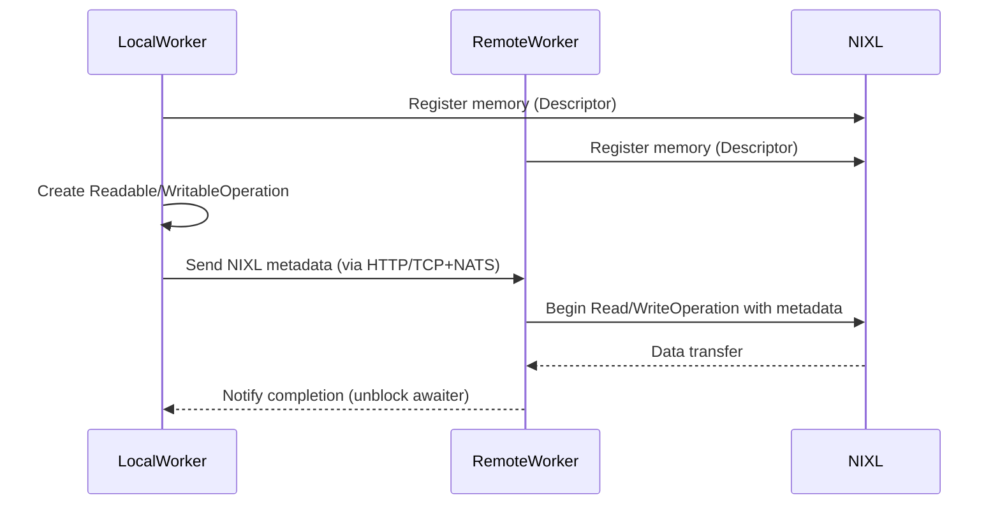
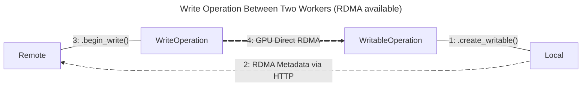
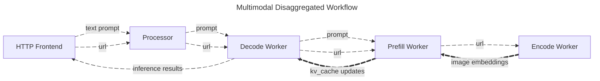

Dynamo NIXL Connect 专门用于在 Dynamo Graph 中的模型/worker 之间移动数据，特别针对那些注册（registration）和内存区域需要动态变化的用例。
Dynamo connect 通过一组 Python 类，基于 NIXL 的 I/O 子系统为此类用例提供工具集。
这种放宽的注册带来一定的性能开销，但简化了集成过程。
特别是对于较大的数据传输操作，例如多模型 graph 中模型之间的传输，该开销可以忽略不计。
任何由 Dynamo 容器托管的应用都可以导入 `dynamo.nixl_connect` 库。

> [!Note]
> Dynamo NIXL Connect 会自动选择当前可用的最佳数据传输方式。
> 可用方式取决于运行 graph 的机器与网络的硬件与软件配置。
> GPU Direct RDMA 操作要求传输双方都具备：
> - 可执行 RDMA 操作的 NIC 与 GPU
> - 支持 GPU-NIC 直接交互（即"零拷贝"）和 RDMA 操作的设备驱动
> - 支持 InfiniBand 或 RoCE 的网络
>
> 上述任一条件不满足时，graph 的 worker 将无法使用 GPU Direct RDMA，将退回到次优方法以保障基本功能。
> 更多信息请参阅 [GPUDirect RDMA](https://docs.nvidia.com/cuda/pdf/GPUDirect_RDMA.pdf) 文档。

```python
import dynamo.nixl_connect
```

所有使用 NIXL Connect 库的操作都从 [`Connector`](connector.md) 类与所需的操作类型开始。
共支持四种操作类型：

 1. **注册本地可读内存**：

    将本地内存缓冲区注册到 NIXL 子系统，使远端 worker 可以读取。

 2. **注册本地可写内存**：

    将本地内存缓冲区注册到 NIXL 子系统，使远端 worker 可以写入。

 3. **从已注册的远端内存读取**：

    将远端 worker 注册为可读的远端内存缓冲区读取到本地内存缓冲区。

 4. **写入到已注册的远端内存**：

    将本地内存缓冲区写入到远端 worker 注册为可写的远端内存缓冲区。

在条件具备时，正确配对操作即可完成高吞吐量的 GPU Direct RDMA 数据传输。
依据上面的列表，正确配对方式为 1 与 3 或 2 与 4，
即一端为"可（读|写）操作"，另一端为对应的"（读|写）操作"。
具体来说，read 操作必须与 readable 操作配对，write 操作必须与 writable 操作配对。



## 示例

### 通用示例

下图中，Local 创建了一个 [`WritableOperation`](writable-operation.md)，用于从 Remote 接收数据。
随后 Local 将所请求操作的元数据发送给 Remote。
Remote 使用该元数据创建 [`WriteOperation`](write-operation.md)，并在条件具备时通过 GPU Direct RDMA 将数据从 Remote 的 GPU 内存传输到 Local 的 GPU 内存。



> [!Note]
> 当 RDMA 不可用时，NIXL 数据传输仍会通过非加速方法完成。

### 多模态示例

在 [Dynamo 多模态解耦示例](../../features/multimodal/multimodal-vllm.md) 中：

 1. HTTP 前端接收一段文本提示和一张图片的 URL。

 2. 提示和 URL 被入队到 Processor，再被分发给第一个可用的 Decode Worker。

 3. Decode Worker 接着请求一个 Prefill Worker 为驱动 Decode Worker 的 LLM 提供 KV 数据。

 4. Prefill Worker 接着请求 Encode Worker 处理图片并提供其 embedding。

 5. Encode Worker 获取图片，对其进行处理，使用专门的视觉模型在图像上执行推理（inference），最终将 embedding 提供给 Prefill Worker。

 6. Prefill Worker 接收来自 Encode Worker 的 embedding，并为 Decode Worker 的 LLM 生成 KV 缓存（KV$）更新，并将更新直接写入预留给该数据的 GPU 内存。

 7. 最后，Decode Worker 执行所请求的推理。



> [!Note]
> 该示例中，使用 Dynamo NIXL Connect 库的是 Prefill Worker 与 Encode Worker 之间的数据传输。
> Decode Worker 与 Prefill Worker 之间的 KV 缓存（KV cache）传输使用了另一个 connector，但底层同样基于 NIXL 的 I/O 子系统。

#### 代码示例

参阅 [NixlReadEmbeddingSender](https://github.com/ai-dynamo/dynamo/blob/main/components/src/dynamo/common/multimodal/embedding_transfer.py)，
了解它如何通过创建 [`ReadableOperation`](readable-operation.md) 直接与 Encode Worker 协调，
通过 Dynamo 的 round-robin 分发器发送操作的元数据，并在等待操作完成后再使用传输到的数据。

参阅 [NixlReadEmbeddingReceiver](https://github.com/ai-dynamo/dynamo/blob/main/components/src/dynamo/common/multimodal/embedding_transfer.py)，
了解结果 embedding 是如何通过创建 [`Descriptor`](descriptor.md) 注册到 NIXL 子系统的，
[`ReadOperation`](read-operation.md) 是如何使用请求方 worker 提供的元数据创建的，
以及 worker 是如何等待数据传输完成后再产出响应的。


## Python 类

  - [Connector](connector.md)
  - [Descriptor](descriptor.md)
  - [Device](device.md)
  - [ReadOperation](read-operation.md)
  - [ReadableOperation](readable-operation.md)
  - [WritableOperation](writable-operation.md)
  - [WriteOperation](write-operation.md)


## 参考资料

  - [NVIDIA Dynamo](https://developer.nvidia.com/dynamo) @ [GitHub](https://github.com/ai-dynamo/dynamo)
  - [NVIDIA Inference Transfer Library (NIXL)](https://developer.nvidia.com/blog/introducing-nvidia-dynamo-a-low-latency-distributed-inference-framework-for-scaling-reasoning-ai-models/#nvidia_inference_transfer_library_nixl_low-latency_hardware-agnostic_communication%C2%A0) @ [GitHub](https://github.com/ai-dynamo/nixl)
  - [Dynamo Multimodal Example](https://github.com/ai-dynamo/dynamo/tree/main/examples/backends/vllm/launch)
  - [NVIDIA GPU Direct](https://developer.nvidia.com/gpudirect)
