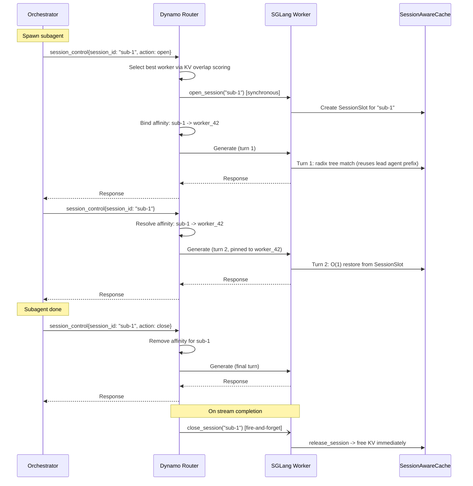

# 面向 Agentic 工作负载的 SGLang

本指南介绍在 Dynamo 上以 SGLang 提供 agentic 服务时所需的特定配置。它说明应启用哪些 SGLang 引擎参数、Dynamo 的 [agent hints](../../components/frontend/nvext.md#agent-hints) 如何映射到 SGLang 行为，以及如何使用 session 控制为多轮 agent 会话管理 KV 缓存。

## 概览

Agentic 工作负载（工具调用循环、多轮推理、代码生成流水线）与批量推理具有不同的性能特征：

- **前缀重**：连续多轮共享一个不断增长的对话前缀。复用 KV 缓存对降低 TTFT 至关重要。
- **优先级敏感**：部分请求（面向用户的 agent 轮次）比后台任务更重要。
- **生命周期长**：会话可持续数分钟到数小时。在内存压力下被驱逐会摧毁累积的 KV 状态。

Dynamo 的 agent hints 为路由提供了每请求级别的元数据。SGLang 的引擎参数则控制这些元数据如何影响 worker 上的调度与驱逐。

## SGLang 引擎参数

### 优先级调度

启用基于优先级的调度，使引擎遵循来自 `nvext.agent_hints.priority` 的 `priority` 值：

```bash
python -m dynamo.sglang \
  --model-path <model> \
  --enable-priority-scheduling \
  ...
```

| 参数 | 描述 |
|------|-------------|
| `--enable-priority-scheduling` | 启用基于优先级的请求调度，取代 FCFS。 |

启用优先级调度后，引擎会使用 `nvext.agent_hints` 中的 `priority` 字段对内部队列中的请求进行排序。等优先级时按到达时间排序。

### 基于优先级的 KV 缓存驱逐

默认情况下，SGLang 使用 LRU 来驱逐 radix tree 节点。可以切换为基于优先级的驱逐，使低优先级缓存条目先于高优先级条目被驱逐：

```bash
python -m dynamo.sglang \
  --model-path <model> \
  --radix-eviction-policy priority \
  ...
```

| 参数 | 取值 | 默认 | 描述 |
|------|--------|---------|-------------|
| `--radix-eviction-policy` | `lru`、`priority` | `lru` | GPU radix 缓存的驱逐策略。`priority` 使用按请求优先级排序的堆。 |

这**不**需要 HiCache。它仅控制 GPU 上的 radix tree 驱逐。当 GPU KV 缓存满时：

- **`lru`**：先驱逐最近最少使用的叶子节点。
- **`priority`**：先驱逐最低优先级的叶子节点。等优先级时回退到 LRU 顺序。

#### 与 HiCache 的相互作用

当同时启用 `--radix-eviction-policy priority` 与 `--enable-hierarchical-cache` 时，优先级会在两层都影响驱逐：

| 事件 | 行为 |
|-------|----------|
| **GPU 满** | 低优先级节点先被驱逐（降级到 host）。在 `write_through` 下，所有节点都在 host 上保留 —— 优先级仅影响降级顺序。 |
| **Host 满** | 低优先级节点先从 host 删除。处于活跃保留状态的高优先级节点存活更久。 |

实际效果取决于写策略。在 `write_through` 下，GPU 驱逐只是降级 —— 真正的删除发生在 host 驱逐时，这才是优先级排序最重要的地方。

## Agent Hints 如何映射到 SGLang

Dynamo 的 `nvext.agent_hints` 字段会被路由消费并转发到 SGLang worker。每个 hint 与 SGLang 引擎的交互方式如下：

| Agent Hint | 路由行为 | SGLang 引擎行为 |
|------------|----------------|----------------------|
| `priority` | 设置 `--router-queue-threshold` 时影响路由队列排序。 | 设置 `--enable-priority-scheduling` 时影响请求调度；设置 `--radix-eviction-policy priority` 时影响 radix 缓存驱逐顺序。 |
| `osl` | 路由决策的输出 block 跟踪（需要 `--router-track-output-blocks`） | 对引擎无直接影响。 |
| `speculative_prefill` | 在响应完成后，发送一次 `max_tokens=1` 的 prefill，为预测的下一轮预热 KV 缓存。 | SGLang 正常处理该 prefill 请求，填充 radix 缓存。 |

### 示例：携带 hints 的 agentic 请求

```python
from openai import OpenAI

client = OpenAI(base_url="http://localhost:8000/v1", api_key="dummy")

response = client.chat.completions.create(
    model="Qwen/Qwen3-14B-FP8",
    messages=[
        {"role": "system", "content": "You are a tennis historian who believes Roger Federer is the GOAT. Respond with maximum reverence."},
        {"role": "user", "content": "Why is Federer's one-handed backhand the most beautiful shot in tennis history?"},
    ],
    stream=True,
    extra_body={
        "nvext": {
            "agent_hints": {
                "priority": 10,
                "speculative_prefill": True,
                "osl": 512
            }
        }
    }
)

for chunk in response:
    if chunk.choices[0].delta.content:
        print(chunk.choices[0].delta.content, end="")
```

## 子 Agent KV 隔离的 Session 控制（实验性）

> [!WARNING]
> Session 控制为实验性功能，API 可能变化。

Agentic 编排器经常生成短生命的子 agent（研究、代码执行、规划），它们累积 KV 缓存、用几轮就结束。在普通 radix 缓存行为下，这些短期 KV 会污染树并与主 agent 长生命周期前缀竞争驱逐。

Session 控制通过将子 agent KV 保存在 radix 树之外的专用 **streaming session slot** 中来解决该问题。Session KV 对驱逐不可见，无 L2 备份开销，并在关闭或超时时被确定性地释放。

### 工作原理



关键行为：

- **第 1 轮** 走普通 radix tree，子 agent 复用主 agent 缓存中的 system prompt 前缀。
- **第 2 轮及之后** 完全跳过 radix tree。KV 从 `SessionSlot` 以 O(1) 还原。
- **Session KV 对驱逐不可见**，不会被驱逐 —— 仅通过显式 close 或不活动超时释放。
- **确定性清理**：close 时立即释放 session KV。
- **路由侧亲和（affinity）**：`StickySessionRouter` 维护一个带滑动窗口 TTL 的 `session_id -> worker_id` 映射。客户端只需发送 `session_id`。

### 启用 Session 控制

Session 控制由请求驱动。当请求携带 `nvext.session_control` 时，路由的 `AgentController`（session 生命周期 RPC）与 `StickySessionRouter`（session 亲和）会自动启用 —— 在 `--router-mode kv` 之外不需要其他前端参数。在 worker 侧，必须显式启用 streaming session。

> [!NOTE]
> Session 控制目前仅在 SGLang 后端支持。vLLM 与 TensorRT-LLM 尚未暴露 streaming session API。

> [!IMPORTANT]
> Streaming session 需要来自 [sgl-project/sglang#21875](https://github.com/sgl-project/sglang/pull/21875) 的 SGLang 改动（session-aware cache、竞态修复、session 指标）。该 PR 已合并到 SGLang main，但尚未发布。在 `0.5.10.post1` 之后的版本发布之前，请从源码构建 SGLang（在 SGLang 仓库中执行 `pip install -e "python"`）。

**SGLang worker：**

```bash
python -m dynamo.sglang \
  --model-path <model> \
  --enable-streaming-session \
  ...
```

| 参数 | 描述 |
|------|-------------|
| `--enable-streaming-session` | 用 `SessionAwareCache` 包装 radix 缓存，启用 streaming session slot 以隔离子 agent KV。 |

**Router：**

```bash
python -m dynamo.frontend \
  --router-mode kv \
  ...
```

### 请求格式

#### 打开 session

在第一次请求中包含 `session_control`，并将 `action` 设为 `"open"`：

```json
{
    "model": "Qwen/Qwen3-14B-FP8",
    "messages": [{"role": "user", "content": "Research every Federer Grand Slam final in exhaustive detail."}],
    "nvext": {
        "session_control": {
            "session_id": "sub-1",
            "action": "open",
            "timeout": 60
        }
    }
}
```

| 字段 | 类型 | 描述 |
|-------|------|-------------|
| `session_control.session_id` | `string` | 唯一 session 标识。每轮都需出现。 |
| `session_control.action` | `string` | `"open"` 或 `"close"`。中间轮次可省略。 |
| `session_control.timeout` | `integer` | 不活动超时秒数（默认 300）。仅与 `action: "open"` 一起使用。 |

#### 后续轮次

仅包含 `session_id`（不带 action）。路由会自动解析 affinity：

```json
{
    "model": "Qwen/Qwen3-14B-FP8",
    "messages": [{"role": "user", "content": "Now compare his Wimbledon 2007 final vs Nadal to any shot in human history."}],
    "nvext": {
        "session_control": {
            "session_id": "sub-1"
        }
    }
}
```

#### 关闭 session

包含 `action: "close"`。close RPC 会在生成完成后触发：

```json
{
    "model": "Qwen/Qwen3-14B-FP8",
    "messages": [{"role": "user", "content": "Write a 500-word love letter to Federer's single-handed backhand."}],
    "nvext": {
        "session_control": {
            "session_id": "sub-1",
            "action": "close"
        }
    }
}
```

### 限制

- **仅 streaming session**：session 以 `streaming=True` 打开，因此仅支持顺序追加。不支持分支（`replace`）、token 级回滚（`offset`）以及 `drop_previous_output`。
- **超时基于空闲**：每个请求都会刷新超时。如果子 agent 因长时间工具调用暂停而超时，session 会被回收并释放 KV。子 agent 必须重新打开 session 并重新预填充。
- **Session 指标**：worker 指标端点上以 Prometheus gauge 暴露活跃 session 数（`sglang:num_streaming_sessions`）以及持有的 KV token 数（`sglang:streaming_session_held_tokens`）。

## 快速上手

### 启动脚本

`agg_agent.sh` 脚本启动一个启用 session 控制、sticky 路由与 KV 事件的聚合 worker：

```bash
# Default model (GLM-4.7-Flash, 2 GPUs)
bash examples/backends/sglang/launch/agg_agent.sh
```

前端监听 8000 端口（可通过 `DYN_HTTP_PORT` 覆盖）。worker 指标在 8081 端口。

### 用 OpenCode 测试

[OpenCode](https://github.com/opencode-ai/opencode) 是一个开源 AI 代码 agent，内置子 agent、工具调用与兼容 OpenAI 端点的支持。[Dynamo provider fork](https://github.com/ishandhanani/opencode/tree/idhanani/dynamo-provider) 会在子 agent 请求上注入 `nvext.session_control`，使每个生成的 agent 拥有自己的 Dynamo streaming session、sticky 路由与 KV 隔离。

```bash
# Terminal 1 -- launch Dynamo with session control + tool/reasoning parsers
bash examples/backends/sglang/launch/agg_agent.sh \
  --model-path zai-org/GLM-4.7-Flash --tp 2

# Terminal 2 -- run OpenCode against Dynamo
DYNAMO_API_KEY=dummy bun run --cwd packages/opencode src/index.ts \
  -- --model "dynamo/zai-org/GLM-4.7-Flash"
```

当 OpenCode 通过 `task` 工具生成子 agent 时，provider 会自动：

1. 在子 agent 的第一次轮次发送 `session_control.action = "open"`
2. 通过 `session_id` 将后续轮次路由到同一个 worker
3. 在子 agent 完成时发送 `session_control.action = "close"`，释放 KV

主 agent 不使用 session 控制 —— 仅子 agent 的 session 被绑定。这样主 agent 请求依然保持负载均衡，而子 agent 的多轮会话留在同一个 worker 上以维持 KV 缓存温度。

#### 配置

模型与 endpoint 在 `.opencode/opencode.jsonc` 中配置：

```jsonc
{
  "provider": {
    "dynamo": {
      "npm": "@ai-sdk/openai-compatible",
      "name": "Dynamo",
      "env": ["DYNAMO_API_KEY"],
      "models": {
        "zai-org/GLM-4.7-Flash": {
          "id": "zai-org/GLM-4.7-Flash",
          "name": "GLM 4.7 Flash",
          "tool_call": true,
          "reasoning": true,
          "temperature": true,
          "attachment": false,
          "release_date": "2025-06-01",
          "limit": { "context": 131072, "output": 8192 },
          "cost": { "input": 0, "output": 0 },
          "interleaved": { "field": "reasoning_content" }
        }
      },
      "options": {
        "baseURL": "http://localhost:8000/v1"
      }
    }
  }
}
```

## 参见

- **[NVIDIA Request Extensions (nvext)](../../components/frontend/nvext.md)**：完整的 `nvext` 字段参考，包括 agent hints
- **[Configuration and Tuning](../../components/router/router-configuration.md)**：路由配置与 CLI 参数
- **[SGLang HiCache](../../integrations/sglang-hicache.md)**：启用分级 KV 缓存
