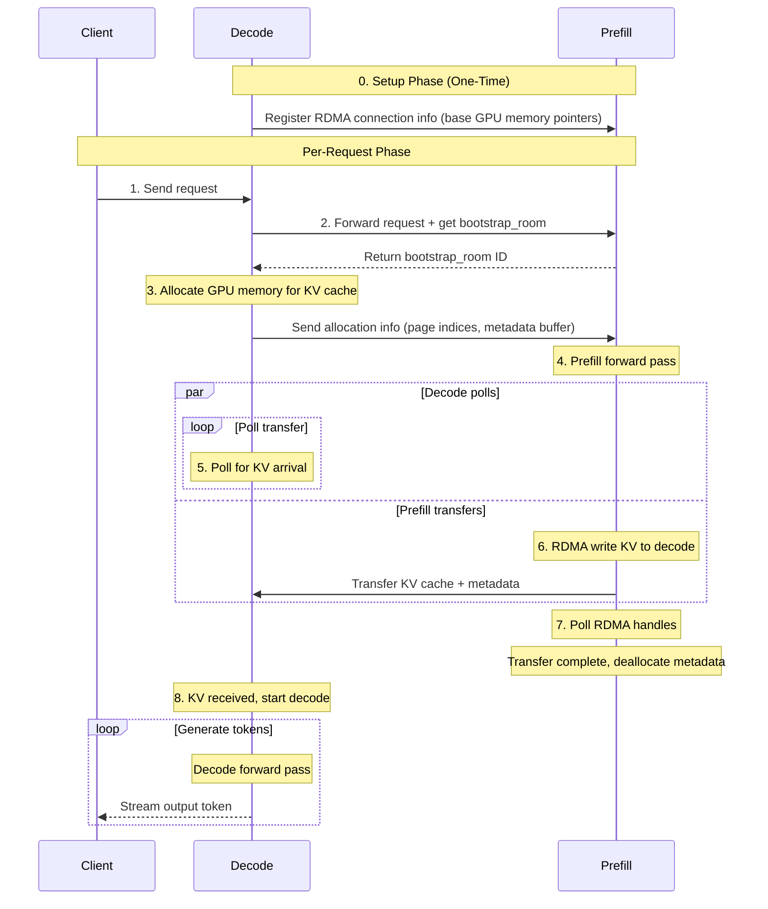

本文介绍 SGLang 的分离式预填充-解码架构如何工作，包括独立运行以及在 Dynamo 内的运行方式。

## 概述

分离式服务将 LLM 推理的预填充和解码阶段分配给不同的 worker。该架构带来：
- 独立扩缩预填充与解码资源
- 更好的资源利用率（预填充计算受限，解码内存受限）
- 通过 RDMA 在 worker 之间高效传输 KV 缓存

## Dynamo 如何与 SGLang 分离式集成

**SGLang 独立模式：**
1. 负载均衡器接收来自客户端的请求
2. 从可用 worker 池中随机选择一个 `(prefill, decode)` 对
3. 通过 asyncio 任务向 `prefill` 与 `decode` worker 发送请求
4. 内部完成从 prefill → decode 的分离

**Dynamo 模式：**

由于 Dynamo 拥有发现机制，因此不使用负载均衡器。具体做法是：
1. 先路由到一个 decode worker
2. 通过轮询或 KV 感知选择一个 prefill worker
3. 将请求发送到两个 worker
4. 使用 SGLang 的 bootstrap server（属于 `tokenizer_manager` 的一部分）配合 NIXL/Mooncake 处理 KV 传输

## 分离式流程

下图展示了分离式服务的完整请求流程：

### 关键步骤说明

**Setup 阶段（一次性）**
- Decode worker 向 prefill worker 注册其 RDMA 连接信息
- 包括用于直接内存访问的 GPU 基地址指针

**Per-Request 流程**
1. **请求发起**：客户端向 decode worker 发送请求
2. **Bootstrap room 分配**：decode 转发给 prefill 并接收用于协调的 bootstrap_room ID
3. **内存分配**：decode 为即将到来的 KV 缓存分配 GPU 内存页
4. **预填充执行**：prefill worker 处理 prompt 并生成 KV 缓存
5. **KV 传输**：prefill 通过 RDMA 直接写入 decode 的 GPU 内存（与此同时 decode 轮询完成状态）
6. **清理**：prefill 在确认完成后释放传输元数据
7. **解码阶段**：decode worker 使用已传输的 KV 缓存生成 token
8. **流式返回**：token 在生成时流式返回给客户端

### 性能特征

- **RDMA 传输**：零拷贝 GPU 到 GPU 传输，CPU 介入极少
- **并行操作**：decode 可在 prefill 传输数据的同时进行轮询
- **一次性建立**：RDMA 连接一次建立，重复用于所有请求
