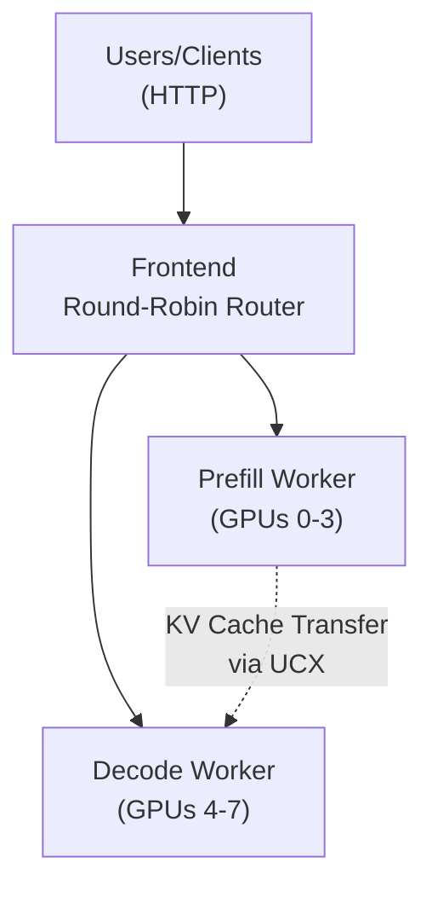

关于 TensorRT-LLM 的通用特性与配置，请参阅 [Reference Guide](trtllm-reference-guide.md)。

---

Dynamo 支持基于 TensorRT-LLM 对 gpt-oss-120b 进行解耦服务。本指南演示如何在单台 8 GPU 的 B200 节点上以解耦 prefill/decode 模式部署 gpt-oss-120b：1 个 prefill worker 占 4 GPU，1 个 decode worker 占 4 GPU。

## 概述

本部署使用 TensorRT-LLM 的解耦服务，其中：
- **Prefill Worker**：在 4 GPU 上以 tensor parallelism 高效处理输入 prompt
- **Decode Worker**：在 4 GPU 上生成输出 token，针对 token 生成吞吐进行优化
- **Frontend**：提供兼容 OpenAI 的 API 端点，使用轮询路由

解耦方式同时为低延迟（每用户每秒最大 token 数）与高吞吐（每 GPU 每秒最大 token 数）使用场景做优化——把计算密集的 prefill 阶段与内存受限的 decode 阶段分离。

## 前置条件

- 1 台带 8 GPU 的 NVIDIA B200 节点（本指南聚焦单节点 B200 部署）
- CUDA Toolkit 12.8 或更高
- 安装了 [NVIDIA Container Toolkit](https://docs.nvidia.com/datacenter/cloud-native/container-toolkit/latest/install-guide.html) 的 Docker
- 用于模型权重的高速 SSD 存储（约需 240GB）
- HuggingFace 账号与 [访问令牌](https://huggingface.co/settings/tokens)
- [HuggingFace CLI](https://huggingface.co/docs/huggingface_hub/en/guides/cli)


使用以下命令确保 `etcd` 与 `nats` 服务运行：

```bash
docker compose -f deploy/docker-compose.yml up
```

## 操作说明

### 1. 下载模型

```bash
export MODEL_PATH=<LOCAL_MODEL_DIRECTORY>
export HF_TOKEN=<INSERT_TOKEN_HERE>

pip install -U "huggingface_hub[cli]"

huggingface-cli download openai/gpt-oss-120b --exclude "original/*" --exclude "metal/*" --local-dir $MODEL_PATH
```

### 2. 运行容器

设置容器镜像：
```bash
export DYNAMO_CONTAINER_IMAGE=nvcr.io/nvidia/ai-dynamo/tensorrtllm-runtime:1.1.1
```

以必要的配置启动 Dynamo TensorRT-LLM 容器：

```bash
docker run \
    --gpus all \
    -it \
    --rm \
    --network host \
    --volume $MODEL_PATH:/model \
    --volume $PWD:/workspace \
    --shm-size=10G \
    --ulimit memlock=-1 \
    --ulimit stack=67108864 \
    --ulimit nofile=65536:65536 \
    --cap-add CAP_SYS_PTRACE \
    --ipc host \
    -e HF_TOKEN=$HF_TOKEN \
    -e TRTLLM_ENABLE_PDL=1 \
    -e TRT_LLM_DISABLE_LOAD_WEIGHTS_IN_PARALLEL=True \
    $DYNAMO_CONTAINER_IMAGE
```

该命令：
- 容器停止时自动移除（`--rm`）
- 允许容器使用主机 IPC 资源以获得最佳性能（`--ipc=host`）
- 以交互模式运行容器（`-it`）
- 设置共享内存与栈限制以获得最佳性能
- 把模型目录挂载到容器的 `/model`
- 把当前 Dynamo 工作区挂载到容器的 `/workspace/dynamo`
- 启用 [PDL](https://docs.nvidia.com/cuda/cuda-c-programming-guide/index.html#programmatic-dependent-launch-and-synchronization) 并禁用并行权重加载
- 把 HuggingFace token 设为容器内环境变量

### 3. 理解配置

部署使用配置文件与命令行参数控制行为：

#### 配置文件

**Prefill 配置（`examples/backends/trtllm/engine_configs/gpt-oss-120b/prefill.yaml`）**：
- `enable_attention_dp: false` - prefill 关闭 attention 数据并行
- `enable_chunked_prefill: true` - 启用高效的分块 prefill 处理
- `moe_config.backend: CUTLASS` - 对 MoE 层使用优化的 CUTLASS kernel
- `cache_transceiver_config.backend: ucx` - 使用 UCX 进行高效 KV 缓存传输
- `cuda_graph_config.max_batch_size: 32` - CUDA graph 的最大 batch size

**Decode 配置（`examples/backends/trtllm/engine_configs/gpt-oss-120b/decode.yaml`）**：
- `enable_attention_dp: true` - decode 启用 attention 数据并行
- `disable_overlap_scheduler: false` - 启用 decode 的 overlap 以提升效率
- `moe_config.backend: CUTLASS` - 对 MoE 层使用优化的 CUTLASS kernel
- `cache_transceiver_config.backend: ucx` - 使用 UCX 进行高效 KV 缓存传输
- `cuda_graph_config.max_batch_size: 128` - CUDA graph 的最大 batch size

#### 命令行参数

两种 worker 都接收以下关键参数：
- `--tensor-parallel-size 4` - 4 GPU 用于 tensor parallelism
- `--expert-parallel-size 4` - 4 GPU 上 expert parallelism
- `--free-gpu-memory-fraction 0.9` - 分配 90% GPU 内存

Prefill 专用参数：
- `--max-num-tokens 20000` - prefill 处理的最大 token 数
- `--max-batch-size 32` - prefill 的最大 batch size

Decode 专用参数：
- `--max-num-tokens 16384` - decode 处理的最大 token 数
- `--max-batch-size 128` - decode 的最大 batch size

### 4. 启动部署

注意 GPT-OSS 是带工具调用支持的推理模型。为确保响应被正确处理，应在启动 worker 时正确配置 `--dyn-reasoning-parser` 与 `--dyn-tool-call-parser`。

可使用提供的启动脚本，或手动运行各组件：

#### 选项 A：使用启动脚本

```bash
cd /workspace/examples/backends/trtllm
./launch/gpt_oss_disagg.sh
```

#### 选项 B：手动启动

1. **启动前端**：
```bash
# 启动带轮询路由的前端
python3 -m dynamo.frontend --router-mode round-robin --http-port 8000 &
```

2. **启动 prefill worker**：
```bash
CUDA_VISIBLE_DEVICES=0,1,2,3 python3 -m dynamo.trtllm \
  --model-path /model \
  --served-model-name openai/gpt-oss-120b \
  --extra-engine-args examples/backends/trtllm/engine_configs/gpt-oss-120b/prefill.yaml \
  --dyn-reasoning-parser gpt_oss \
  --dyn-tool-call-parser harmony \
  --disaggregation-mode prefill \
  --max-num-tokens 20000 \
  --max-batch-size 32 \
  --free-gpu-memory-fraction 0.9 \
  --tensor-parallel-size 4 \
  --expert-parallel-size 4 &
```

3. **启动 decode worker**：
```bash
CUDA_VISIBLE_DEVICES=4,5,6,7 python3 -m dynamo.trtllm \
  --model-path /model \
  --served-model-name openai/gpt-oss-120b \
  --extra-engine-args examples/backends/trtllm/engine_configs/gpt-oss-120b/decode.yaml \
  --dyn-reasoning-parser gpt_oss \
  --dyn-tool-call-parser harmony \
  --disaggregation-mode decode \
  --max-num-tokens 16384 \
  --free-gpu-memory-fraction 0.9 \
  --tensor-parallel-size 4 \
  --expert-parallel-size 4
```

### 5. 验证部署就绪

轮询 `/health` 端点确认 prefill 与 decode worker 端点都已启动：
```
curl http://localhost:8000/health
```

发送推理请求前请确认两个端点都可用：
```
{
  "endpoints": [
    "dyn://dynamo.tensorrt_llm.generate",
    "dyn://dynamo.prefill.generate"
  ],
  "status": "healthy"
}
```

如果只列出一个 worker 端点，另一个可能仍在启动中。监控 worker 日志跟踪启动进度。

### 6. 测试部署

发送测试请求验证部署：

```bash
curl -X POST http://localhost:8000/v1/responses \
  -H "Content-Type: application/json" \
  -d '{
    "model": "openai/gpt-oss-120b",
    "input": "Explain the concept of disaggregated serving in LLM inference in 3 sentences.",
    "max_output_tokens": 200,
    "stream": false
  }'
```

服务端暴露标准的 OpenAI 兼容 API 端点，接受 JSON 请求。可按需调整 `max_tokens`、`temperature` 等参数。

### 7. Reasoning 与工具调用

Dynamo 在 OpenAI Chat Completion 端点上支持 reasoning 与工具调用。基于 Dynamo 构建的应用通常的工作流是：应用拥有一组工具来辅助 assistant 给出准确答案，且通常是多轮的——涉及工具选择与基于工具结果的生成。

此外，可通过 `chat_template_args` 配置 reasoning 强度。提高 reasoning 强度可使模型更精确但更慢。支持三档：`low`、`medium`、`high`。

下面是一个发送多轮请求以完成用户查询并使用 reasoning 与工具调用的示例：
**应用设置（伪代码）**
```Python
# 应用定义的工具
def get_system_health():
    for component in system.components:
        if not component.health():
            return False
    return True

# 以 ChatCompletion tool 风格 JSON 表达的声明
tool_choice = '{
  "type": "function",
  "function": {
    "name": "get_system_health",
    "description": "Returns the current health status of the LLM runtime—use before critical operations to verify the service is live.",
    "parameters": {
      "type": "object",
      "properties": {}
    }
  }
}'

# 当用户查询到达时执行下列工作流
def user_query(app_request):
    # 第一轮
    # 用 prompt 与工具选择创建 chat completion
    request = ...
    response = send(request)

    if response["finish_reason"] == "tool_calls":
        # 第二轮
        function, params = parse_tool_call(response)
        function_result = function(params)
        # 用 prompt、assistant 响应与函数结果创建请求
        request = ...
        response = send(request)
    return app_response(response)
```


**第一次请求带工具**


```bash
curl localhost:8000/v1/chat/completions   -H "Content-Type: application/json"   -d '
{
  "model": "openai/gpt-oss-120b",
  "messages": [
    {
      "role": "user",
      "content": "Hey, quick check: is everything up and running?"
    }
  ],
  "chat_template_args": {
      "reasoning_effort": "low"
  },
  "tools": [
    {
      "type": "function",
      "function": {
        "name": "get_system_health",
        "description": "Returns the current health status of the LLM runtime—use before critical operations to verify the service is live.",
        "parameters": {
          "type": "object",
          "properties": {}
        }
      }
    }
  ],
  "response_format": {
    "type": "text"
  },
  "stream": false,
  "max_tokens": 300
}'
```
**带工具选择的第一次响应**
```JSON
{
  "id": "chatcmpl-d1c12219-6298-4c83-a6e3-4e7cef16e1a9",
  "choices": [
    {
      "index": 0,
      "message": {
        "tool_calls": [
          {
            "id": "call-1",
            "type": "function",
            "function": {
              "name": "get_system_health",
              "arguments": "{}"
            }
          }
        ],
        "role": "assistant",
        "reasoning_content": "We need to check system health. Use function."
      },
      "finish_reason": "tool_calls"
    }
  ],
  "created": 1758758741,
  "model": "openai/gpt-oss-120b",
  "object": "chat.completion",
  "usage": null
}
```
**第二次请求带工具调用结果**
```bash
curl localhost:8000/v1/chat/completions   -H "Content-Type: application/json"   -d '
{
  "model": "openai/gpt-oss-120b",
  "messages": [
    {
      "role": "user",
      "content": "Hey, quick check: is everything up and running?"
    },
    {
      "role": "assistant",
      "tool_calls": [
        {
          "id": "call-1",
          "type": "function",
          "function": {
            "name": "get_system_health",
            "arguments": "{}"
          }
        }
      ]
    },
    {
      "role": "tool",
      "tool_call_id": "call-1",
      "content": "{\"status\":\"ok\",\"uptime_seconds\":372045}"
    }
  ],
  "chat_template_args": {
      "reasoning_effort": "low"
  },
  "tools": [
    {
      "type": "function",
      "function": {
        "name": "get_system_health",
        "description": "Returns the current health status of the LLM runtime—use before critical operations to verify the service is live.",
        "parameters": {
          "type": "object",
          "properties": {}
        }
      }
    }
  ],
  "response_format": {
    "type": "text"
  },
  "stream": false,
  "max_tokens": 300
}'
```
**带最终消息的第二次响应**
```JSON
{
  "id": "chatcmpl-9ebfe64a-68b9-4c1d-9742-644cf770ad0e",
  "choices": [
    {
      "index": 0,
      "message": {
        "content": "All systems are green—everything’s up and running smoothly! 🚀 Let me know if you need anything else.",
        "role": "assistant",
        "reasoning_content": "The user asks: \"Hey, quick check: is everything up and running?\" We have just checked system health, it's ok. Provide friendly response confirming everything's up."
      },
      "finish_reason": "stop"
    }
  ],
  "created": 1758758853,
  "model": "openai/gpt-oss-120b",
  "object": "chat.completion",
  "usage": null
}
```
## 基准测试

### 使用 AIPerf 进行性能测试

Dynamo 容器包含 [AIPerf](https://github.com/ai-dynamo/aiperf/tree/main?tab=readme-ov-file#aiperf)——NVIDIA 用于基准测试生成式 AI 模型的工具。它帮助测量部署的吞吐、延迟与其他性能指标。

**在容器内（完成上述部署步骤之后）运行下列基准**：

```bash
# 创建基准结果目录
mkdir -p /tmp/benchmark-results

# 运行基准——该命令以高并发合成负载测试部署
aiperf profile \
    --model openai/gpt-oss-120b \
    --tokenizer /model \
    --endpoint-type chat \
    --endpoint /v1/chat/completions \
    --streaming \
    --url localhost:8000 \
    --synthetic-input-tokens-mean 32000 \
    --synthetic-input-tokens-stddev 0 \
    --output-tokens-mean 256 \
    --output-tokens-stddev 0 \
    --extra-inputs max_tokens:256 \
    --extra-inputs min_tokens:256 \
    --extra-inputs ignore_eos:true \
    --extra-inputs "{\"nvext\":{\"ignore_eos\":true}}" \
    --concurrency 256 \
    --request-count 6144 \
    --warmup-request-count 1000 \
    --num-dataset-entries 8000 \
    --random-seed 100 \
    --artifact-dir /tmp/benchmark-results \
    -H 'Authorization: Bearer NOT USED' \
    -H 'Accept: text/event-stream'
```

### 这个基准做了什么

该命令：
- **测试 chat completions** 流式响应，针对解耦部署
- **模拟高负载**：256 并发，6144 总请求
- **使用长上下文输入**（32K tokens）测试 prefill 性能
- **生成一致输出**（256 tokens）测量 decode 吞吐
- **包含预热**（1000 请求）以稳定性能指标
- **保存详细结果** 到 `/tmp/benchmark-results` 供分析

可调整的关键参数：
- `--concurrency`：并发请求数（影响 GPU 利用率）
- `--synthetic-input-tokens-mean`：平均输入长度（测试 prefill 容量）
- `--output-tokens-mean`：平均输出长度（测试 decode 吞吐）
- `--request-count`：基准的总请求数

### 在容器外安装 AIPerf

如果你希望在容器外运行基准：

```bash
# 安装 AIPerf
pip install aiperf

# 然后运行同样的基准命令，按需调整 tokenizer 路径
```

## 架构概览

解耦架构把 prefill 与 decode 阶段分离：



## 关键特性

1. **解耦服务**：把计算密集的 prefill 与内存受限的 decode 操作分离
2. **优化资源使用**：prefill 与 decode 使用不同并行策略
3. **可扩展架构**：可基于工作负载方便地调整 worker 数
4. **TensorRT-LLM 优化**：利用 TensorRT-LLM 高效 kernel 与内存管理

## 故障排查

### 常见问题

1. **CUDA Out-of-Memory 错误**
   - 降低启动命令中的 `--max-num-tokens`（当前 prefill 20000、decode 16384）
   - 把 `--free-gpu-memory-fraction` 从 0.9 降到 0.8 或 0.7
   - 确保模型 checkpoint 与期望格式兼容

2. **Worker 无法连接**
   - 确保 etcd 与 NATS 运行：`docker ps | grep -E "(etcd|nats)"`
   - 检查容器间网络连通
   - 确认 CUDA_VISIBLE_DEVICES 与 GPU 配置一致
   - 确认没有其他进程占用所分配 GPU

3. **性能问题**
   - 在部署运行时用 `nvidia-smi` 监控 GPU 利用率
   - 查看 worker 日志找瓶颈或错误
   - 确保手动命令中的 batch size 与配置文件一致
   - 基于负载调整 chunked prefill 设置
   - 连接问题时确保端口 8000 未被其他应用占用

4. **容器启动问题**
   - 确认 NVIDIA Container Toolkit 已正确安装
   - 确认 Docker 守护进程在带 GPU 支持下运行
   - 确保有足够磁盘空间存放模型权重与容器镜像

5. **token 重复 / 生成无法停止**
   - 使用 `reasoning_effort: high` 时，模型可能产生重复 token 且无法停止
   - **解决方案**：在请求中设置 `top_p=1`。这是 [OpenAI 推荐的采样参数](https://huggingface.co/openai/gpt-oss-120b/discussions/21)
   - 使用推荐参数的请求示例：
     ```bash
     curl localhost:8000/v1/chat/completions -H "Content-Type: application/json" -d '{
       "model": "openai/gpt-oss-120b",
       "messages": [{"role": "user", "content": "Explain why Roger Federer is considered one of the greatest tennis players of all time"}],
       "chat_template_args": {
          "reasoning_effort": "high"
        },
       "top_p": 1,
       "max_tokens": 300
     }'
     ```

## 后续步骤

- **进阶配置**：探索 TensorRT-LLM 引擎构建选项以进一步优化
- **监控**：搭建 Prometheus 与 Grafana 用于生产监控
- **性能基准**：使用 AIPerf 测量并优化部署性能
