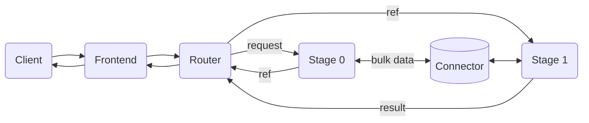
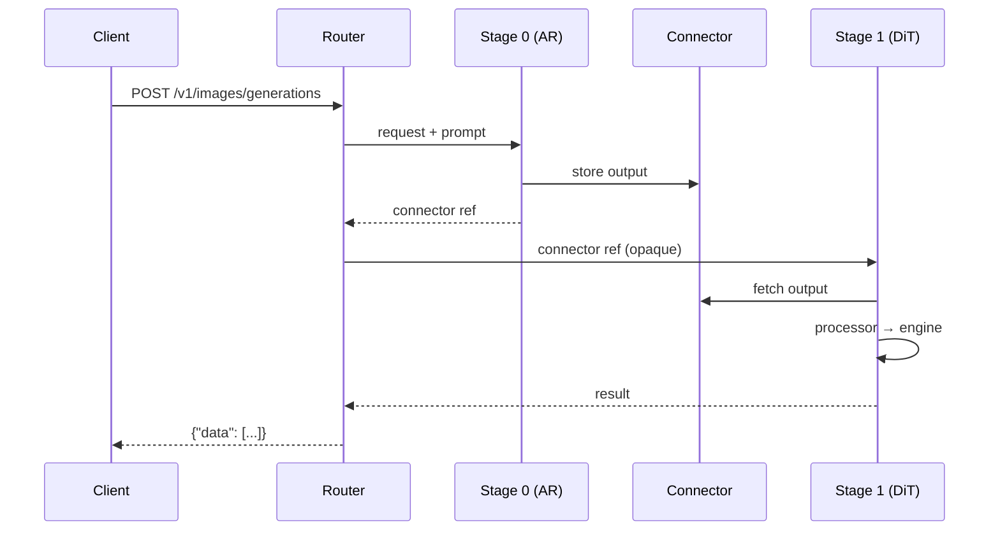

Dynamo 通过 [vLLM-Omni](https://github.com/vllm-project/vllm-omni) 后端支持多模态生成。该集成通过 OpenAI 兼容的 API 端点暴露文本到文本、文本到图像、文本到视频以及文本到音频（TTS）能力。

## 前置条件

本指南假定你熟悉如 [vLLM 后端指南](README.md) 中所述的 Dynamo + vLLM 部署方式。

### 安装

Dynamo 容器镜像已预装 vLLM-Omni。如果你使用 `pip install ai-dynamo[vllm]`，由于匹配的发布版本尚未上 PyPI，**不会**自动包含 vLLM-Omni。请从源码单独安装，并将 vLLM-Omni 版本与你已安装的 vLLM 版本进行匹配（见 [vLLM-Omni releases](https://github.com/vllm-project/vllm-omni/releases) 页面）：

```bash
pip install git+https://github.com/vllm-project/vllm-omni.git@<version>
```

> **不支持 ARM64：** 当前 vLLM-Omni 仅在 `amd64` 构建中安装。在 `arm64` 上，容器构建会跳过安装，vLLM-Omni 功能不可用。

## 支持的模态

| 模态 | 端点 | `--output-modalities` |
|---|---|---|
| 文本到文本 | `/v1/chat/completions` | `text`（默认）|
| 文本到图像 | `/v1/chat/completions`、`/v1/images/generations` | `image` |
| 文本到视频 | `/v1/videos` | `video` |
| 图像到视频 | `/v1/videos` | `video` |
| 文本到音频（TTS）| `/v1/audio/speech` | `audio` |

`--output-modalities` 决定 Worker 注册哪些端点。设为 `image` 时，`/v1/chat/completions`（返回内联 base64 图像）与 `/v1/images/generations` 同时可用。设为 `video` 时，Worker 提供 `/v1/videos`。设为 `audio` 时，Worker 提供 `/v1/audio/speech`。

## 已测试模型

| 模态 | 模型 |
|---|---|
| 文本到文本 | `Qwen/Qwen2.5-Omni-7B` |
| 文本到图像 | `Qwen/Qwen-Image`、`AIDC-AI/Ovis-Image-7B`、`zai-org/GLM-Image`（解耦）|
| 文本到视频 | `Wan-AI/Wan2.1-T2V-1.3B-Diffusers`、`Wan-AI/Wan2.2-T2V-A14B-Diffusers` |
| 图像到视频 | `Wan-AI/Wan2.2-TI2V-5B-Diffusers`、`Wan-AI/Wan2.2-I2V-A14B-Diffusers` |
| 文本到音频（TTS）| `Qwen/Qwen3-TTS-12Hz-1.7B-CustomVoice`、`Qwen/Qwen3-TTS-12Hz-1.7B-VoiceDesign` |

如需运行非默认模型，向任何启动脚本传入 `--model`：

```bash
bash examples/backends/vllm/launch/agg_omni_image.sh --model AIDC-AI/Ovis-Image-7B
bash examples/backends/vllm/launch/agg_omni_video.sh --model Wan-AI/Wan2.2-T2V-A14B-Diffusers
```

## 文本到文本

启动一个聚合（aggregated）部署（前端 + omni worker）：

```bash
bash examples/backends/vllm/launch/agg_omni.sh
```

它会在单个 GPU 上启动 `Qwen/Qwen2.5-Omni-7B`，使用单阶段 thinker 配置。

验证部署：

```bash
curl -s http://localhost:8000/v1/chat/completions \
  -H "Content-Type: application/json" \
  -d '{
    "model": "Qwen/Qwen2.5-Omni-7B",
    "messages": [{"role": "user", "content": "What is 2+2?"}],
    "max_tokens": 50,
    "stream": false
  }'
```

该脚本使用一个自定义阶段配置（`stage_configs/single_stage_llm.yaml`），将 thinker 阶段配置为文本生成。详见 [Stage 配置](#stage-配置)。

## 文本到图像

使用 `Qwen/Qwen-Image` 通过提供的脚本启动：

```bash
bash examples/backends/vllm/launch/agg_omni_image.sh
```

### 通过 `/v1/chat/completions`

```bash
curl -s http://localhost:8000/v1/chat/completions \
  -H "Content-Type: application/json" \
  -d '{
    "model": "Qwen/Qwen-Image",
    "messages": [{"role": "user", "content": "A cat sitting on a windowsill"}],
    "stream": false
  }'
```

响应中以内联方式包含 base64 编码的图像：

```json
{
  "choices": [{
    "delta": {
      "content": [
        {"type": "image_url", "image_url": {"url": "data:image/png;base64,..."}}
      ]
    }
  }]
}
```

### 通过 `/v1/images/generations`

```bash
curl -s http://localhost:8000/v1/images/generations \
  -H "Content-Type: application/json" \
  -d '{
    "model": "Qwen/Qwen-Image",
    "prompt": "A cat sitting on a windowsill",
    "size": "1024x1024",
    "response_format": "url"
  }'
```

## 文本到视频

使用 `Wan-AI/Wan2.1-T2V-1.3B-Diffusers` 通过提供的脚本启动：

```bash
bash examples/backends/vllm/launch/agg_omni_video.sh
```

通过 `/v1/videos` 生成视频：

```bash
curl -s http://localhost:8000/v1/videos \
  -H "Content-Type: application/json" \
  -d '{
    "model": "Wan-AI/Wan2.1-T2V-1.3B-Diffusers",
    "prompt": "A drone flyover of a mountain landscape",
    "seconds": 2,
    "size": "832x480",
    "response_format": "url"
  }'
```

响应将根据 `response_format` 返回视频 URL 或 base64 数据：

```json
{
  "id": "...",
  "object": "video",
  "model": "Wan-AI/Wan2.1-T2V-1.3B-Diffusers",
  "status": "completed",
  "data": [{"url": "file:///tmp/dynamo_media/videos/req-abc123.mp4"}]
}
```

`/v1/videos` 端点还通过 `nvext` 字段接受 NVIDIA 扩展，用于精细控制：

| 字段 | 描述 | 默认值 |
|---|---|---|
| `nvext.fps` | 每秒帧数 | 24 |
| `nvext.num_frames` | 帧数（覆盖 `fps * seconds`）| -- |
| `nvext.negative_prompt` | 用于引导的负向 prompt | -- |
| `nvext.num_inference_steps` | 去噪步数 | 50 |
| `nvext.guidance_scale` | CFG guidance scale | 5.0 |
| `nvext.seed` | 用于可复现的随机种子 | -- |
| `nvext.boundary_ratio` | MoE 专家切换边界（I2V）| 0.875 |
| `nvext.guidance_scale_2` | 低噪声专家的 CFG scale（I2V）| 1.0 |

## 图像到视频

图像到视频（I2V）使用与文本到视频相同的 `/v1/videos` 端点，新增字段 `input_reference` 用于提供源图像。图像可以是 HTTP URL、base64 data URI 或本地文件路径。

使用 `Wan-AI/Wan2.2-TI2V-5B-Diffusers` 通过提供的脚本启动：

```bash
bash examples/backends/vllm/launch/agg_omni_i2v.sh
```

从图像生成视频：

```bash
curl -s http://localhost:8000/v1/videos \
  -H "Content-Type: application/json" \
  -d '{
    "model": "Wan-AI/Wan2.2-TI2V-5B-Diffusers",
    "prompt": "A bear playing with yarn, smooth motion",
    "input_reference": "https://example.com/bear.png",
    "size": "832x480",
    "response_format": "url",
    "nvext": {
      "num_inference_steps": 40,
      "num_frames": 33,
      "guidance_scale": 1.0,
      "boundary_ratio": 0.875,
      "guidance_scale_2": 1.0,
      "seed": 42
    }
  }'
```

`input_reference` 字段接受：
- **HTTP/HTTPS URL**：`"https://example.com/image.png"`
- **Base64 data URI**：`"data:image/png;base64,iVBORw0KGgo..."`
- **本地文件路径**：`"/path/to/image.png"` 或 `"file:///path/to/image.png"`

I2V 专属的 `nvext` 字段（`boundary_ratio`、`guidance_scale_2`）控制 Wan2.x 模型中双专家 MoE 去噪调度。详见 [Wan2.2-I2V model card](https://huggingface.co/Wan-AI/Wan2.2-I2V-A14B-Diffusers)。

## 文本到音频（TTS）

使用 `Qwen/Qwen3-TTS-12Hz-1.7B-CustomVoice` 通过提供的脚本启动：

```bash
bash examples/backends/vllm/launch/agg_omni_audio.sh
```

### CustomVoice（预设说话人）

```bash
curl -X POST http://localhost:8000/v1/audio/speech \
  -H "Content-Type: application/json" \
  -d '{
    "input": "Hello, how are you?",
    "voice": "vivian",
    "language": "English"
  }' --output output.wav
```

### CustomVoice 含风格指令

```bash
curl -X POST http://localhost:8000/v1/audio/speech \
  -H "Content-Type: application/json" \
  -d '{
    "input": "I am so excited!",
    "voice": "vivian",
    "instructions": "Speak with great enthusiasm"
  }' --output excited.wav
```

### VoiceDesign（描述一个声音）

```bash
bash examples/backends/vllm/launch/agg_omni_audio.sh --model Qwen/Qwen3-TTS-12Hz-1.7B-VoiceDesign

curl -X POST http://localhost:8000/v1/audio/speech \
  -H "Content-Type: application/json" \
  -d '{
    "input": "Hello world",
    "task_type": "VoiceDesign",
    "instructions": "A warm, friendly female voice with a gentle tone"
  }' --output voicedesign.wav
```

### 参数

`/v1/audio/speech` 端点遵循 [vLLM-Omni](https://docs.vllm.ai/projects/vllm-omni/en/latest/) API 格式。所有 TTS 专属参数为顶层字段：

| 字段 | 描述 | 默认值 |
|---|---|---|
| `input` | 待合成文本（必填）| -- |
| `model` | TTS 模型名 | 自动检测 |
| `voice` | 说话人名（如 vivian、ryan）。会按模型 config 校验。| Vivian |
| `response_format` | 音频格式：wav、mp3、pcm、flac、aac、opus | wav |
| `speed` | 速率系数（0.25-4.0）| 1.0 |
| `task_type` | CustomVoice、VoiceDesign 或 Base（Qwen3-TTS）| CustomVoice |
| `language` | 语言代码。会按模型 config 校验。| Auto |
| `instructions` | 声音风格/情绪描述。VoiceDesign 必填。| -- |
| `ref_audio` | 参考音频 URL 或 base64 data URI。Base 任务必填。| -- |
| `ref_text` | 参考音频的文本（Base 任务）| -- |
| `max_new_tokens` | 最大生成 token 数（1-4096）| 2048 |

可用的 voice 与 language 在启动时从模型 `config.json` 动态加载。非 Qwen3-TTS 的音频模型（如 MiMo-Audio）使用通用文本 prompt，并忽略 TTS 专属参数。

## CLI 参考

omni 后端使用专用入口：`python -m dynamo.vllm.omni`。

| 参数 | 描述 |
|---|---|
| `--omni` | 启用 vLLM-Omni 协调器（所有 omni 工作负载必填）|
| `--output-modalities <modality>` | 输出模态：`text`、`image`、`video` 或 `audio` |
| `--stage-configs-path <path>` | 阶段配置 YAML 路径（可选；省略时 vLLM-Omni 使用模型默认值）|
| `--boundary-ratio <float>` | MoE 专家切换边界（默认：0.875）|
| `--flow-shift <float>` | 调度器 flow_shift（720p 用 5.0，480p 用 12.0）|
| `--vae-use-slicing` | 启用 VAE slicing 以优化显存 |
| `--vae-use-tiling` | 启用 VAE tiling 以优化显存 |
| `--default-video-fps <int>` | 生成视频的默认帧率（默认：16）|
| `--enable-layerwise-offload` | 启用 DiT 模块的逐层下卸载，以减小 GPU 显存占用 |
| `--layerwise-num-gpu-layers <int>` | 生成期间保留在 GPU 上的就绪层数（默认：1）|
| `--cache-backend <backend>` | 扩散缓存：`cache_dit` 或 `tea_cache` |
| `--cache-config <json>` | 以 JSON 字符串提供的缓存配置（覆盖默认）|
| `--enable-cache-dit-summary` | 启用扩散前向后的 cache-dit 汇总日志 |
| `--enforce-eager` | 关闭扩散模型的 torch.compile |
| `--enable-cpu-offload` | 启用扩散模型的 CPU 下卸载 |
| `--ulysses-degree <int>` | 扩散中 Ulysses 序列并行使用的 GPU 数（默认：1）|
| `--ring-degree <int>` | 扩散中 ring 序列并行使用的 GPU 数（默认：1）|
| `--cfg-parallel-size <int>` | classifier-free guidance 并行使用的 GPU 数（1 或 2，默认：1）|
| `--media-output-fs-url <url>` | 用于存储生成媒体的文件系统 URL（默认：`file:///tmp/dynamo_media`）|
| `--media-output-http-url <url>` | 用于改写响应中媒体路径的基础 URL（可选）|

## 存储配置

生成的图片、视频与音频文件通过 [fsspec](https://filesystem-spec.readthedocs.io/) 存储，支持本地文件系统、S3、GCS、Azure Blob 等。

默认情况下，媒体写入本地文件系统 `file:///tmp/dynamo_media`。如需使用云存储：

```bash
bash examples/backends/vllm/launch/agg_omni_video.sh \
  --media-output-fs-url s3://my-bucket/media \
  --media-output-http-url https://cdn.example.com/media
```

设置 `--media-output-http-url` 时，响应 URL 会被改写为 `{base-url}/{storage-path}`（例如 `https://cdn.example.com/media/videos/req-id.mp4`）。未设置时返回原始的文件系统路径。

S3 凭据可通过标准 AWS 环境变量（`AWS_ACCESS_KEY_ID`、`AWS_SECRET_ACCESS_KEY`）配置，或使用 IAM 角色。详见 [fsspec S3 文档](https://s3fs.readthedocs.io/en/latest/#credentials)。

## Stage 配置

Omni 流水线通过 YAML 阶段配置（stage configs）来定义。示例参见 [`examples/backends/vllm/launch/stage_configs/single_stage_llm.yaml`](https://github.com/ai-dynamo/dynamo/blob/main/examples/backends/vllm/launch/stage_configs/single_stage_llm.yaml)。stage 配置格式与多阶段流水线的完整文档请参阅 [vLLM-Omni Stage Configs 文档](https://docs.vllm.ai/projects/vllm-omni/en/latest/configuration/stage_configs/)。

## 解耦多阶段服务

对于具有多阶段流水线的模型（如 AR + Diffusion），Dynamo 支持解耦式服务：每个阶段在独立 GPU 上作为独立进程运行。这允许独立扩缩容、GPU 隔离以及每阶段的多 Worker 副本。

### 架构

每个阶段在独立 GPU 上作为独立进程运行。一个轻量路由（router）协调它们，扮演**纯消息代理（pure message broker）** —— 它从不查看或转换阶段间数据。



**工作原理：**

- 路由将初始请求发送给 Stage 0，并收到一个轻量级的 connector 引用（指向共享内存中的输出）。
- 路由原封不动地将该引用转发给 Stage 1，从不读取数据本体。
- 每个阶段从 connector 取回输入，运行任意模型专属处理器（如 `ar2diffusion`、`thinker2talker`），再运行其引擎。
- 最终阶段的结果回到路由，进行格式化与响应。
- connector 引用随流水线推进而累积，因此任何阶段都可以访问所有先前阶段的输出。

### 数据流



### 快速开始：GLM-Image（2 阶段、2 GPU）

GLM-Image 是一个 2 阶段的文本到图像模型：AR 阶段（生成先验 token id）与 DiT 阶段（扩散去噪 + VAE 解码）。内置 vLLM-Omni 阶段配置已将每个阶段分配到独立 GPU。

> **实验性：** GLM-Image 支持为实验性质；某些 prompt 与尺寸下生成可能失败或产出错误/乱码输出。

```bash
bash examples/backends/vllm/launch/disagg_omni_glm_image.sh
```

测试：

```bash
curl -s http://localhost:8000/v1/images/generations \
  -H "Content-Type: application/json" \
  -d '{
    "model": "zai-org/GLM-Image",
    "prompt": "A red apple on a white table",
    "size": "1024x1024",
    "response_format": "url"
  }' | jq
```

### 阶段副本扩缩容

每个阶段会独立向 Dynamo 服务发现注册。要扩缩容某个瓶颈阶段，可在不同 GPU 上启动具有相同 `--stage-id` 的额外 Worker —— 路由会自动在该阶段的所有副本之间负载均衡。其它阶段不受影响。

### 已测试模型

| 模型 | 阶段 | 输出 | 阶段配置 |
|---|---|---|---|
| GLM-Image (`zai-org/GLM-Image`) | AR -> DiT | Image | `glm_image.yaml`（内置）|

### CLI 参数（解耦模式）

| 参数 | 描述 |
|---|---|
| `--stage-id <int>` | 作为指定 stage ID 的单阶段 Worker 运行。需要 `--stage-configs-path`。|
| `--omni-router` | 作为 stage 路由运行。需要 `--stage-configs-path`。与 `--stage-id` 互斥。|
| `--stage-configs-path <path>` | vLLM-Omni 阶段配置 YAML 的路径。|

## 当前限制

- 仅 I2V 通过 `/v1/videos` 的 `input_reference` 支持图像输入。其他端点仅接受文本 prompt。
- omni Worker 不发布 KV 缓存事件。
- 每个 Worker 同一时间仅支持一种输出模态。
- 音频：尚不支持流式（`stream: true`）。
- 音频：尚不支持 Base 任务（声纹复刻）。
- 解耦模式：尚不支持 `async_chunk=true`（阶段间流式）。
