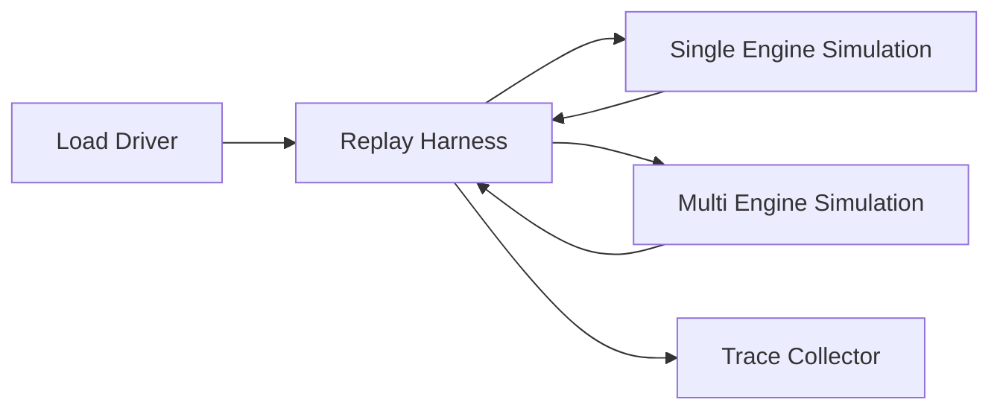
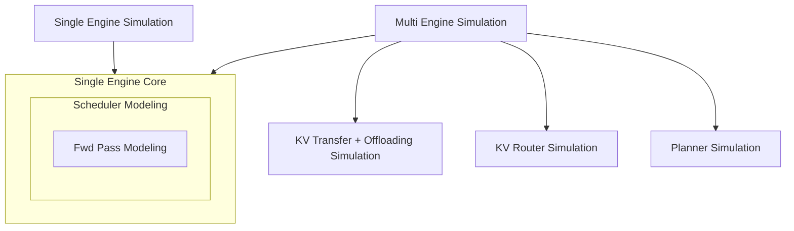

本指南介绍通过 `python -m dynamo.replay` 对 Mooncake 风格 JSONL trace 进行回放（replay）的支持。它会打印一份 AIPerf 风格的汇总表、把完整的回放报告 JSON 写入磁盘，并直接暴露 `offline|online`、`round_robin|kv_router`、`arrival_speedup_ratio`、闭环并发以及合成（synthetic）工作负载等输入。

与常规 `dynamo.mocker` 用法不同，offline 回放不会启动 worker、注册端点，也不需要 NATS、etcd 或前端（frontend）。Online 回放则会走 mock-worker 的真实运行时路径。

适用场景：

- 基于已保存的 trace 对调度器（scheduler）行为进行基准测试
- 跨多种 mocker 配置比较时序与缓存行为
- 在 CI 中校验回放逻辑而无需搭建分布式栈

## Harness 概览

回放 harness 将一个负载驱动器（trace 文件或合成工作负载生成器）接入一个或多个 mocker 引擎仿真，并把请求/Token 时序复制（tee）到 trace 收集器。



负载驱动器要么是 Mooncake 风格的 JSONL trace（带时间戳、ISL/OSL、`hash_ids`），要么是按 `isl`/`osl`/`concurrency` 参数化的合成生成器。单引擎仿真（`SES`）是 vLLM 引擎、`num_workers == 1` 的快速路径；多引擎仿真（`MES`）覆盖聚合（aggregated）多 worker 回放、解耦（disaggregated）prefill/decode 回放与 KV 路由（router）回放。Trace 收集器输出 AIPerf 风格汇总表、JSON 报告以及供下游分析的逐请求时序字段。

每种仿真组合的组件不同。SES 直接驱动引擎核（scheduler + 前向计算建模）。MES 则在引擎核之上叠加 KV 传输/卸载、KV 路由与 planner 仿真：



参见 [`lib/mocker/src/replay/offline/README.md`](../../lib/mocker/src/replay/offline/README.md) 了解 offline harness 内部（逻辑时钟、事件队列、worker 模型）；参见 [`docs/mocker/mocker.md`](../mocker/mocker.md) 了解引擎核细节（scheduler、KV block manager）。

## 快速开始

通过专用回放 CLI 运行 offline 回放：

```bash
python -m dynamo.replay /path/to/mooncake_trace.jsonl \
    --num-workers 4 \
    --replay-mode offline \
    --router-mode round_robin \
    --trace-block-size 512 \
    --extra-engine-args '{"block_size":64}' \
    --report-json /tmp/replay-report.json
```

如果不依赖 trace 文件、只需固定请求形状，使用同一 CLI 进行合成回放：

```bash
python -m dynamo.replay \
    --input-tokens 5000 \
    --output-tokens 500 \
    --request-count 1000 \
    --arrival-interval-ms 1.0 \
    --num-workers 1 \
    --replay-mode offline \
    --replay-concurrency 100 \
    --extra-engine-args '{"block_size":512}' \
    --report-json /tmp/replay-report.json
```

需要共享前缀或多轮（multi-turn）结构但又不依赖 trace 文件时，使用合成工作负载回放：

```bash
python -m dynamo.replay \
    --input-tokens 5000 \
    --output-tokens 500 \
    --request-count 200 \
    --turns-per-session 3 \
    --shared-prefix-ratio 0.5 \
    --num-prefix-groups 8 \
    --inter-turn-delay-ms 250 \
    --replay-mode offline \
    --replay-concurrency 32 \
    --extra-engine-args '{"block_size":512}' \
    --report-json /tmp/replay-report.json
```

`python -m dynamo.replay` 在 stdout 上打印 AIPerf 风格汇总表，并将完整回放报告 JSON 写入磁盘。

## 输入格式

Trace 文件必须为 Mooncake 风格 JSONL。每行应包含：

- `timestamp` 或 `created_time`
- `input_length` 或 `input_tokens`
- `output_length` 或 `output_tokens`
- `hash_ids`

例：

```json
{"timestamp": 0, "input_length": 6755, "output_length": 500, "hash_ids": [0, 1, 2, 3]}
{"timestamp": 0, "input_length": 4096, "output_length": 128, "hash_ids": [9, 10, 11, 12]}
```

不带 `session_id` 的行是相互独立、按时间戳调度的请求。该形式适合 wall-clock 请求 trace，包括应保持并行的 LLM 调用形成的 agent-converted trace。

回放也支持多轮 session。同一 session 中所有 turn 使用同一 `session_id`。多轮 session 是闭环：第 `n+1` 轮要等第 `n` 轮完成，再加上显式的 `delay`/`delay_ms`，或同 session 连续行间推断出的时间戳差。

例：

```json
{"session_id":"session-a","timestamp":1000,"input_length":2048,"output_length":128,"hash_ids":[1,2,3,4]}
{"session_id":"session-a","delay_ms":50,"input_length":2560,"output_length":128,"hash_ids":[1,2,3,4,5]}
{"session_id":"session-b","timestamp":1010,"input_length":1024,"output_length":64,"hash_ids":[9,10]}
{"session_id":"session-b","timestamp":1060,"input_length":1536,"output_length":64,"hash_ids":[9,10,11]}
```

第二条 `session-a` 行需等首轮完成后再延 50 ms。第二条 `session-b` 行也需等首轮完成后再延 50 ms（由时间戳推断）。

回放对 trace 文件使用两个不同的"块大小"概念：

- `--trace-block-size`：数据集中每个 `hash_id` 代表的 token 数
- 引擎 `block_size`：回放引擎与路由将合成 token 重切（re-chunk）成序列哈希时使用的块大小

公开的 Mooncake/toolagent trace 每个 `hash_id` 用 `512` 个 token，因此回放它们通常应使用 `--trace-block-size 512`。引擎 `block_size` 仍可更小，例如 vLLM 在线基准设置使用 `block_size=64`。对于 `engine_type=sglang`，回放在内部仍使用规范化的 `block_size`；`sglang.page_size` 作为兼容别名被接受，并在回放开始前归一化为 `block_size`。

## 回放接口

### `python -m dynamo.replay`

专用回放 CLI 暴露：

- 位置参数 `trace_file`，或同时给出 `--input-tokens`、`--output-tokens`、`--request-count`
- `--replay-mode offline|online`
- `--router-mode round_robin|kv_router`
- `--num-workers`
- `--num-prefill-workers`
- `--num-decode-workers`
- `--replay-concurrency`
- `--arrival-interval-ms`
- `--arrival-speedup-ratio`
- `--trace-block-size`
- `--turns-per-session`
- `--shared-prefix-ratio`
- `--num-prefix-groups`
- `--inter-turn-delay-ms`
- `--extra-engine-args`（JSON 字符串）
- `--prefill-engine-args`（JSON 字符串）
- `--decode-engine-args`（JSON 字符串）
- `--router-config`（JSON 字符串）
- `--aic-backend`
- `--aic-system`
- `--aic-backend-version`
- `--aic-tp-size`
- `--aic-model-path`
- `--report-json`

默认值：

- `--replay-mode offline`
- `--router-mode round_robin`

例：

```bash
python -m dynamo.replay /path/to/mooncake_trace.jsonl \
    --replay-mode online \
    --router-mode kv_router \
    --num-workers 4 \
    --arrival-speedup-ratio 10 \
    --trace-block-size 512 \
    --extra-engine-args '{"block_size":64}' \
    --router-config '{"router_queue_policy":"fcfs","router_temperature":0.0}' \
    --report-json /tmp/replay-report.json
```

SGLang 回放使用相同的 CLI。最小化的 extra-engine-args 文件可直接使用 `block_size`，或使用兼容别名 `sglang.page_size`：

```json
{
  "engine_type": "sglang",
  "num_gpu_blocks": 512,
  "sglang": {
    "page_size": 2
  }
}
```

`--extra-engine-args` 与 `--router-config` 都接受部分 JSON 对象。引擎相关设置如 `block_size`、`engine_type`、`dp_size`、`speedup_ratio`、`decode_speedup_ratio` 应放入 `--extra-engine-args`，而非作为顶层回放 CLI 标志。`--trace-block-size` 是独立选项，仅用于 trace 文件回放。未指定的字段沿用 `MockEngineArgs::default()` 与 `KvRouterConfig::default()` 的默认值。

回放有两个独立的 AIC 接口：

- 通过 `--extra-engine-args`/分阶段 engine JSON 提供的引擎时序 AIC
- 通过顶层 `--aic-*` 标志，配合 `--router-config` 中的 `router_prefill_load_model: "aic"`，提供路由侧 prompt 负载 AIC

Offline disagg 回放使用分阶段 engine 参数，而非 `--extra-engine-args`：

- `--prefill-engine-args` 配置 prefill worker
- `--decode-engine-args` 配置 decode worker
- `--num-prefill-workers` 与 `--num-decode-workers` 配置 pool 大小

对于 offline disagg 回放，分阶段 JSON 必须显式设置 `worker_type`：

- `--prefill-engine-args` 必须 `worker_type: "prefill"`
- `--decode-engine-args` 必须 `worker_type: "decode"`

分阶段配置必须使用相同的引擎 `block_size`。`--trace-block-size` 仍然是独立的 trace 文件输入旋钮。

### 合成回放

合成回放绕过 trace 加载，按固定输入/输出长度（可选合成到达间隔）在内存中生成请求：

```bash
python -m dynamo.replay \
    --input-tokens 5000 \
    --output-tokens 500 \
    --request-count 200 \
    --arrival-interval-ms 0.5 \
    --replay-mode offline \
    --replay-concurrency 50 \
    --extra-engine-args '{"block_size":512}'
```

适用于不需要 Mooncake 风格前缀结构的参数扫描。

当 `--turns-per-session > 1` 时，`--request-count` 表示 session 数（而非发出 turn 的总数）。完成请求总数为：

- `request_count * turns_per_session`

合成工作负载选项：

- `--turns-per-session`：每个合成 session 的 turn 数
- `--shared-prefix-ratio`：前缀组内共享的 prompt 块比例
- `--num-prefix-groups`：共享前缀组数；`0` 关闭分组
- `--inter-turn-delay-ms`：每个 turn 完成到同 session 下一 turn 可被发出之间的固定延时

## 模式

### 固定调度回放

默认 trace 回放保留 trace 中的时间戳，并按其调度到达：

```bash
python -m dynamo.replay /path/to/mooncake_trace.jsonl \
    --replay-mode offline \
    --num-workers 4 \
    --trace-block-size 512 \
    --extra-engine-args '{"block_size":64}'
```

当你希望确定性地重放原始请求到达模式时使用此模式。对于 wall-clock 请求 trace，请省略 `session_id`，让每行按时间戳独立调度。共享 `session_id` 的行将作为闭环 session 重放，每后续 turn 等待前一 turn 完成。

### 闭环并发回放

使用 `--replay-concurrency` 忽略首轮 trace 到达时序，保持固定数量的 in-flight 请求：

```bash
python -m dynamo.replay /path/to/mooncake_trace.jsonl \
    --replay-mode offline \
    --num-workers 4 \
    --replay-concurrency 16
```

适合在固定并发下比较 scheduler 行为，而不沿用原始 trace 调度。

对多轮 session，并发模式仍强制保留 session 顺序与轮间延时：

- 首轮时间戳被忽略
- 第 `n+1` 轮在第 `n` 轮完成前不可调度
- 完成后仍应用 `delay`/`delay_ms`/合成 `--inter-turn-delay-ms`
- TTFT 按并发上限下的实际派发计算，而非被忽略的 trace 时间戳

### Online 回放

Online 回放会启动 mock worker，并在 live 运行时路径上回放 trace。当你希望回放包括 live 请求派发、live 输出处理与当前路由集成所用的异步 KV 事件传播模型时使用：

```bash
python -m dynamo.replay /path/to/mooncake_trace.jsonl \
    --replay-mode online \
    --router-mode kv_router \
    --num-workers 4 \
    --arrival-speedup-ratio 10 \
    --trace-block-size 512 \
    --extra-engine-args '{"block_size":64}'
```

### 到达加速（Arrival Speedup）

使用 `--arrival-speedup-ratio` 在不改变 mocker 计算模型的前提下，对到达过程进行压缩或拉伸。值越大，到达相对原 trace 越早。

```bash
python -m dynamo.replay /path/to/mooncake_trace.jsonl \
    --replay-mode offline \
    --num-workers 4 \
    --arrival-speedup-ratio 5 \
    --trace-block-size 512 \
    --extra-engine-args '{"block_size":64}'
```

### 路由模式

回放当前支持：

- `round_robin`
- `kv_router`

`kv_router` 使用共享的本地调度器与一个进程内 KV indexer。路由策略调优通过 `--router-config` 提供，没有专门的顶层回放标志。在 offline 回放中：

- `kv_router` 仅在 `num_workers > 1` 时支持
- 启用了路由排队，使用仿真时间而非 wall-clock
- KV 可见性相对请求生命周期事件略有延迟
- 入队由路由生命周期边（`add_request`、`mark_prefill_completed`、`free`）驱动
- pass 内瞬态 prefill 占用仍在路由层近似建模，而非精确建模
- 当 `router_prefill_load_model` 为 `"aic"` 时，回放为每个被准入的请求预测一次预期 prefill 时长，并仅对每个 worker 上最旧的活跃 prefill 请求做衰减

要手动比较队列策略，可保持同一 trace 与引擎参数不变，仅在 `--router-config` 中切换 `router_queue_policy`：

```bash
python -m dynamo.replay /path/to/mooncake_trace.jsonl \
    --replay-mode offline \
    --router-mode kv_router \
    --num-workers 4 \
    --trace-block-size 512 \
    --extra-engine-args '{"block_size":64}' \
    --router-config '{"router_queue_policy":"fcfs"}'

python -m dynamo.replay /path/to/mooncake_trace.jsonl \
    --replay-mode offline \
    --router-mode kv_router \
    --num-workers 4 \
    --trace-block-size 512 \
    --extra-engine-args '{"block_size":64}' \
    --router-config '{"router_queue_policy":"lcfs"}'
```

`lcfs` 在饱和场景下故意是更差的对照策略；它用于实验，不应作为生产默认。

如需在回放中启用路由侧 AIC prefill 负载建模：

```bash
python -m dynamo.replay /path/to/mooncake_trace.jsonl \
    --replay-mode offline \
    --router-mode kv_router \
    --num-workers 4 \
    --trace-block-size 512 \
    --extra-engine-args '{"block_size":64}' \
    --router-config '{"router_track_prefill_tokens":true,"router_prefill_load_model":"aic"}' \
    --aic-backend vllm \
    --aic-system h200_sxm \
    --aic-model-path nvidia/Llama-3.1-8B-Instruct-FP8 \
    --aic-tp-size 1
```

对 offline disagg 回放，同样的顶层 `--aic-*` 标志被支持，但估算器仅作用于 prefill 阶段的路由。

## 输出

报告包含：

- 请求计数
- 输入与输出 token 总量
- 虚拟时长与 wall-clock 运行时
- 请求与 token 吞吐
- 前缀缓存复用率
- TTFT、TTST、TPOT、ITL 与端到端延迟汇总
- 单用户输出 token 吞吐汇总

专用回放 CLI 的报告 schema 与 Python API（`dynamo.replay.run_trace_replay(...)`、`dynamo.replay.run_synthetic_trace_replay(...)`）一致。

未提供 `--report-json` 时，`python -m dynamo.replay` 会在当前工作目录写入带时间戳的 `dynamo_replay_report_*.json` 文件。

## 回放约束

通用回放约束：

- `extra_engine_args.engine_type` 必须为 `vllm` 或 `sglang`
- 聚合（aggregated）回放需要现有的 aggregated 参数路径
- disagg 回放需要同时提供 `prefill_engine_args` 与 `decode_engine_args`
- disagg 回放需要 `router_mode=kv_router`
- 回放 `dp_size` 必须为 `1`
- disagg 回放的 `prefill_engine_args` 与 `decode_engine_args` 必须有相同 `block_size`

额外的 offline 约束：

- offline `kv_router` 需要 `num_workers > 1`
- 单 worker offline 回放仍是 `vllm` 的专用快速路径，但现在同时支持平铺式请求回放与工作负载驱动的多轮回放
- 即使 `num_workers=1`，`sglang` 也仍然走共享多 worker 回放运行时
- offline disagg 回放是带 prefill 与 decode 两个 worker pool 的两阶段独立运行时

额外的 online 约束：

- 当前 live 回放路径同样仅支持聚合 worker

违反这些约束时，回放会立即以验证错误失败。

## 实用提示

- `python -m dynamo.replay` 必须二选一：要么提供 trace 文件，要么同时提供 `--input-tokens`、`--output-tokens`、`--request-count`
- `--replay-concurrency` 同时适用于 trace 回放与合成回放
- mocker 计算速度旋钮如 `speedup_ratio`，在所选回放模式的 engine-args JSON 中传入仍会影响仿真时序
- `--arrival-speedup-ratio` 影响 trace 时间戳，不影响 worker 计算速度
- `--trace-block-size` 仅影响 trace `hash_ids` 展开为 token 的方式
- `--arrival-interval-ms` 仅适用于合成回放
- `--turns-per-session`、`--shared-prefix-ratio`、`--num-prefix-groups`、`--inter-turn-delay-ms` 仅适用于合成回放
- 在独立回放 CLI 上，`--extra-engine-args`、`--prefill-engine-args`、`--decode-engine-args`、`--router-config` 都是 JSON 字符串
- 顶层 `--aic-*` 标志仅用于路由侧 prompt 负载建模；引擎时序 AIC 仍属于 engine-args JSON
- offline 回放无需 planner 运行时设置、路由注册或外部事件传输
- trace 文件回放允许 `--trace-block-size` 与引擎 `block_size` 取不同值
- Mooncake/toolagent trace 通常用 `--trace-block-size 512`，而引擎 `block_size` 常保持 `64`

## 何时使用本工具 vs AIPerf

使用 offline 回放：

- 你需要一种快速、仅 scheduler 的仿真
- 你希望在 CI 中确定性地覆盖回放行为
- 你不需要 HTTP 服务、前端行为或网络效应

使用 [Dynamo Benchmarking](benchmarking.md)：

- 你需要面向 live 端点的端到端基准
- 你需要前端、传输或集群级行为
- 你想要 AIPerf 仪表盘与面向端点的指标
