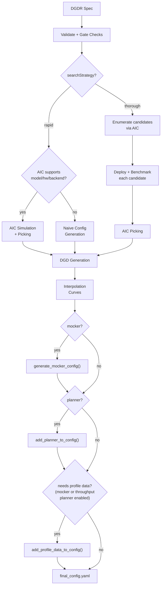

## 概览

Dynamo Profiler 用于分析模型推理（inference）性能并生成优化后的部署配置（DynamoGraphDeployments）。给定模型、硬件与 SLA 目标，它会确定最佳并行策略、选择最优的 prefill 与 decode 引擎配置，并产出可直接部署的 DGD YAML。

profiler 接受 `DynamoGraphDeploymentRequestSpec`（DGDR）作为输入，使用 [AI Configurator（AIC）](https://github.com/ai-dynamo/aiconfigurator) 进行性能仿真、候选枚举与配置选取（picking）。当启用 planner 时，profiler 还会生成用于运行时自动伸缩（autoscaling）的引擎插值曲线。

## 工作流

- **What**：要部署的模型（`model`）
- **How**：性能要求（SLA 目标：`sla.ttft`、`sla.itl`）
- **Where**：运行位置（通过 `hardware` 给出可选 GPU 偏好）
- **Which**：使用哪种后端（`backend`：auto、vllm、sglang 或 trtllm）
- **Which**：使用哪个镜像（`image`）

profiler 流水线如下：



### 各阶段说明

1. **校验**：校验 DGDR 规约 — 检查必填字段（`image`、`hardware.gpuSku`、`hardware.numGpusPerNode`）、SLA 目标与 gate 检查（参见 [Gate 检查与约束](#gate-checks-and-constraints)）。

2. **搜索策略**：profiler 基于 `searchStrategy` 分支：
   - **Rapid**：使用 AIC 仿真在并行配置间估计性能。无需 GPU，约 30 秒完成。
   - **Thorough**：通过 AIC 枚举候选并行配置，逐一在真实 GPU 上部署，使用 AIPerf 基准并选取最优。耗时 2-4 小时，仅支持解耦（disagg）模式。

3. **选取（Picking）**：profiler 自动按 DGDR 规约选取三种模式之一（参见 [选取模式](#picking-modes)）。

4. **DGD 生成**：选定配置经 AIC 生成器流水线渲染为完整 DGD YAML，包含正确的并行度、副本数、容器镜像与 PVC 挂载。

5. **插值**（吞吐型 planner / mocker）：启用 planner 时，profiler 生成详细的性能插值曲线 — prefill 的 TTFT vs ISL、decode 的 ITL vs KV 缓存利用率。它们以 NPZ 文件保存，最终装配阶段会被打包到 ConfigMap 中。

6. **最终装配**（3 个可组合层）：
   1. **Mocker 基础**：若启用 mocker，则将基础 DGD 替换为 mocker DGD 模板（`generate_mocker_config`）。否则保留 AIC 选定的 DGD。
   2. **Planner 服务**：若启用 planner，则将 Planner pod 与 planner-config ConfigMap 注入 DGD（`add_planner_to_config`）。
   3. **Profile 数据**：若启用 mocker 或启用 planner 的吞吐型扩缩，则创建插值数据 ConfigMap 并挂载到所有消费者 — Planner 服务和/或 mocker worker（`add_profile_data_to_config`）。

   结果写入 `final_config.yaml`。

## 搜索策略

### Rapid

使用 AIC 性能仿真估计最优配置，无需部署真实引擎。约 30 秒完成。

```yaml
searchStrategy: rapid
```

- 支持所有后端：vLLM、SGLang、TensorRT-LLM
- 若 AIC 不支持该模型/硬件/后端组合，则回退到朴素配置（按显存匹配的 TP 计算）
- profiling 阶段不消耗 GPU 资源

### Thorough

枚举候选并行配置，逐一作为真实 K8s 工作负载部署，并用 AIPerf 进行基准测试。

```yaml
searchStrategy: thorough
```

- 仅支持解耦（disaggregated）模式
- 不支持 `auto` 后端 — 必须指定 `vllm`、`sglang` 或 `trtllm`
- 视候选数耗时 2-4 小时
- 由于来自真实硬件的测量，准确度最高

## 选取模式

profiler 基于 DGDR 规约自动选择选取模式：

### Autoscale

当**启用 planner**（`features.planner` 中开启 scaling）时触发。独立选取 prefill 与 decode 引擎，每个 1 副本。运行时由 planner 负责扩缩。

### Load Match

当指定**目标负载**（`workload.requestRate` 或 `workload.concurrency`）时触发。寻找在 SLA 之下、以最少 GPU 服务该负载的配置。

```yaml
workload:
  requestRate: 5.0   # target 5 req/s
```

### Default

**既无 planner 也无目标负载**时触发。在给定 GPU 预算与 SLA 之下最大化吞吐。

## Planner 集成

启用 planner 时，profiler 会生成基于吞吐自动伸缩所需的引擎插值数据。`pre_deployment_sweeping_mode` 字段控制如何产出该数据：

```yaml
features:
  planner:
    optimization_target: sla              # required for throughput-based scaling and specific SLA targets
    pre_deployment_sweeping_mode: rapid   # rapid | thorough | none
    enable_throughput_scaling: true
```

要使 `enable_throughput_scaling` 与 planner 的 `ttft_ms`/`itl_ms` SLA 目标生效，`optimization_target` 必须设为 `sla`。`PlannerConfig` 默认值为 `throughput`，使用静态队列/利用率阈值：会静默地把 `enable_throughput_scaling` 翻为 `false`（因此跳过预部署 profiling、不生成 `planner-profile-data-XXXX`），并忽略 `features.planner.ttft_ms`/`itl_ms`。`enable_load_scaling` 不受影响（easy-mode 保持负载扩缩启用）。各 `optimization_target` 值的完整解释见 [Planner Guide](../planner/planner-guide.md#optimization-target)。

- **rapid**：使用 AIC 仿真生成插值曲线（约 30s，无需 GPU）
- **thorough**：在真实 GPU 上部署所选引擎配置，跨 ISL/并发范围扫描（2-4 小时）
- **none**：跳过插值。仅在使用 load-based scaling 且未启用 throughput-based scaling 时有效。

profiler 在生成的 DGD 中保存两个 ConfigMap：
- **planner-config-XXXX**：序列化的 `PlannerConfig` JSON（其中 `profile_results_dir` 指向 profiling 数据挂载点）
- **planner-profile-data-XXXX**：prefill 与 decode 的插值数据（JSON）。仅当同时设置 `optimization_target: sla` 与 `enable_throughput_scaling: true`（或启用 mocker）时生成。

完整的 `PlannerConfig` 参考见 [Planner Guide](../planner/planner-guide.md)。

## Mocker

当 `features.mocker.enabled: true` 时，profiler 输出一个无需真实 GPU、可仿真引擎行为的 mocker DGD。适合测试 planner 行为以及大规模配置校验。

mocker 需要预部署扫描以生成仿真性能 profile — 启用 mocker 时 `pre_deployment_sweeping_mode` 不可为 `none`。

## Gate 检查与约束

profiler 在启动时执行以下规则：

| 条件 | 行为 |
|-----------|----------|
| `searchStrategy: thorough` + `backend: auto` | 拒绝。请指定具体后端。 |
| `enable_throughput_scaling: true` 但未设置 `optimization_target: sla` | 静默矫正。`PlannerConfig` 默认 `optimization_target` 为 `throughput`，校验时会把 `enable_throughput_scaling` 翻为 `false`。要保持吞吐扩缩启用，请显式设 `optimization_target: sla`。 |
| `enable_throughput_scaling: true` + `pre_deployment_sweeping_mode: none`（或未设置） | 拒绝。吞吐型扩缩需要预部署扫描。 |
| `enable_throughput_scaling: true` + `pre_deployment_sweeping_mode: rapid` + AIC 不支持 | 拒绝。AIC 不支持该模型/硬件/后端组合；请将 `pre_deployment_sweeping_mode` 切到 `thorough`。 |
| `e2eLatency` 与显式设置的 `ttft` 或 `itl` 同时提供 | 被 SLA 校验器拒绝。仅提供 `e2eLatency`；不需要将 `ttft` 与 `itl` 显式置空。 |
| SLA 不可达 | 记录警告，并将 SLA 更新为可达的最佳值。 |
| Load-match 所需 GPU 多于可用 | 记录警告。 |

## 支持矩阵

| 后端 | 稠密模型 | MoE 模型 |
|---------|-------------|------------|
| vLLM | ✅ | 🚧 |
| SGLang | ✅ | ✅ |
| TensorRT-LLM | ✅ | 🚧 |

profiler 在以下并行映射上扫描 prefill 与 decode：

| 模型架构 | Prefill 并行映射 | Decode 并行映射 |
|---------|-------------|------------|
| MLA+MoE（DeepseekV3ForCausalLM、DeepseekV32ForCausalLM） | TEP、DEP | TEP、DEP |
| GQA+MoE（Qwen3MoeForCausalLM） | TP、TEP、DEP | TP、TEP、DEP |
| 其他模型 | TP | TP |

> [!NOTE]
> 具体的"模型 × 并行映射"支持取决于后端。profiler 不保证所推荐的 P/D 引擎配置在该后端中受支持且无 bug。

## 部署

### Kubernetes 部署（DGDR）

推荐部署方式是通过 DGDR。完整 DGDR YAML（涵盖 rapid、thorough、MoE、自定义 SLA 与覆盖等场景）见 [Profiler Examples](profiler-examples.md)。

#### 容器镜像

每个 DGDR 都需要一个用于 profiling 与部署的容器镜像：

- **`image`**（可选）：profiling job 使用的容器镜像，必须包含 profiler 代码与依赖。

```yaml
spec:
  image: "nvcr.io/nvidia/ai-dynamo/dynamo-frontend:1.1.1"
```

#### 快速开始：使用 DGDR 部署

**Step 1：创建 DGDR**

可使用样例配置或创建你自己的：

```yaml
apiVersion: nvidia.com/v1beta1
kind: DynamoGraphDeploymentRequest
metadata:
  name: my-model-profiling
spec:
  model: "Qwen/Qwen3-0.6B"
  backend: vllm
  image: "nvcr.io/nvidia/ai-dynamo/dynamo-frontend:1.1.1"
```

**Step 2：应用 DGDR**

```bash
export NAMESPACE=your-namespace
kubectl apply -f my-profiling-dgdr.yaml -n $NAMESPACE
```

**Step 3：监控进度**

```bash
# View status
kubectl get dgdr -n $NAMESPACE

# Detailed status
kubectl describe dgdr my-model-profiling -n $NAMESPACE

# Watch profiling job logs
kubectl logs -f job/profile-my-model-profiling -n $NAMESPACE
```

**DGDR 状态阶段：**
- `Pending`：初始状态，正在准备 profiling
- `Profiling`：正在运行 profiling job（AIC 约 20-30 秒，online 约 2-4 小时）
- `Ready`：profiling 完成，状态中可见生成的 DGD spec
- `Deploying`：正在生成并应用 DGD 配置
- `Deployed`：DGD 已成功部署并运行
- `Failed`：发生错误（详见 events）

**Step 4：访问你的部署**

```bash
# Find the frontend service
kubectl get svc -n $NAMESPACE | grep frontend

# Port-forward to access locally
kubectl port-forward svc/<deployment>-frontend 8000:8000 -n $NAMESPACE

# Test the endpoint
curl http://localhost:8000/v1/models
```

> [!NOTE]
> DGDR 是**不可变（immutable）**的。要更新 SLA 或配置，请删除现有 DGDR 并新建一个。

## profiling 方法

profiler 遵循 5 步流程：

1. **硬件搭建**：使用默认或用户指定的硬件配置。可选地，cluster-scoped operator 可启用自动 GPU 发现，从集群节点检测规格。
2. **识别扫描范围**：自动确定每引擎所用 GPU 的最小与最大数量。最小由模型规模与 GPU 显存决定；最大稠密模型设为 1 个节点，MoE 模型设为 4 个节点。
3. **并行映射扫描**：使用输入 ISL 与 OSL 测试不同并行映射下的引擎性能。
   - 对稠密模型，prefill 与 decode 都测试不同 TP 大小。
   - 对 MoE 模型（SGLang），将 TEP 与 DEP 同时作为 prefill 与 decode 的候选评估。
   - **Prefill**：
     - TP/TEP：以 batch size = 1 测量 TTFT（假设 ISL 足够长以让计算饱和），不开启 KV 复用。
     - DEP：注意力使用数据并行。发送总并发为 `attention_dp_size × attn_dp_num_req_ratio`（默认 4）的单次 burst，并以该 burst 的 AIPerf 汇总中 `time_to_first_token.max / attn_dp_num_req_ratio` 作为报告 TTFT。
   
   - **Decode**：在不同的 in-flight 请求数下（从 1 到 KV 缓存可承受的最大值）测量 ITL。为避免 piggy-back prefill 影响 ITL，脚本启用 KV 复用并通过先发送相同 prompt 进行预热。
   
4. **推荐**：在满足 TTFT 与 ITL SLA 的前提下，为 prefill 与 decode 选出每 GPU 吞吐最高的并行映射。
5. **对推荐的 P/D 引擎进行深入 profiling**：用 ISL 插值 TTFT，用活跃 KV 缓存与 decode 上下文长度插值 ITL，以获得更准确的性能估计。

   - **Prefill**：在 batch size=1 下，跨不同输入长度测量 TTFT 与每 GPU 吞吐。
   - **Decode**：在不同 KV 缓存负载与 decode 上下文长度下测量 ITL 与每 GPU 吞吐。

### 真机引擎上的 AIPerf

通过在 Kubernetes 中创建真实测试部署、测量其性能来对模型 profiling。

- **耗时**：2-4 小时
- **准确度**：最高（真实测量）
- **GPU 要求**：完整访问以测试不同并行映射
- **后端**：vLLM、SGLang、TensorRT-LLM

基于 AIPerf 的 profiling 是默认行为。使用 `searchStrategy: thorough` 进行全面真机 profiling：

```yaml
spec:
  searchStrategy: thorough  # Deep exploration with real engine profiling
```

### AI Configurator 仿真

使用性能仿真，在不部署真实引擎的情况下快速估计最优配置。

- **耗时**：20-30 秒
- **准确度**：估计值（对异常配置可能存在误差）
- **GPU 要求**：无
- **后端**：全部（vLLM、SGLang、TensorRT-LLM）

`searchStrategy: rapid` 默认使用 AI Configurator：

```yaml
spec:
  searchStrategy: rapid  # Fast profiling with AI Configurator simulation (default)
```

> [!NOTE]
> `aicBackendVersion` 指定 AI Configurator 仿真的 TensorRT-LLM 版本。可用版本见 [AI Configurator supported features](https://github.com/ai-dynamo/aiconfigurator#supported-features)。

**当前支持：**
- **后端**：vLLM、SGLang、TensorRT-LLM
- **系统**：H100 SXM、H200 SXM、B200 SXM、GB200 SXM、A100 SXM
- **模型**：广泛支持，包括 GPT、Llama、Mixtral、DeepSeek、Qwen 等

完整列表见 [AI Configurator 文档](https://github.com/ai-dynamo/aiconfigurator#supported-features)。

### 自动 GPU 发现

operator 自动从集群节点发现 GPU 资源，提供硬件信息（GPU 型号、显存、每节点 GPU 数）以及自动的 profiling 搜索空间计算。

**要求：**
- **Cluster-scoped operator**（推荐）：默认具有节点读权限，GPU 发现自动可用。

> **DEPRECATED：** 以下内容仅适用于 namespace-scoped operator，已弃用并将在未来版本移除。新部署请使用 cluster-wide 模式。

- **Namespace-scoped operator**（已弃用）：通过 Helm 安装时默认启用 GPU 发现 — chart 会自动配置所需的 ClusterRole/ClusterRoleBinding

**对 namespace-scoped operator（已弃用）**，GPU 发现由 Helm value 控制：

```bash
# GPU discovery enabled (default) — Helm provisions read-only node access automatically
helm install dynamo-platform ... --set dynamo-operator.gpuDiscovery.enabled=true

# GPU discovery disabled — you must provide hardware config manually in each DGDR
helm install dynamo-platform ... --set dynamo-operator.gpuDiscovery.enabled=false
```

若禁用 GPU 发现，请在 DGDR 中手动提供硬件配置：

```yaml
spec:
  hardware:
    numGpusPerNode: 8
    gpuSku: h100_sxm
    vramMb: 81920
```

如同时禁用 GPU 发现且未提供手动硬件配置，DGDR 将在准入时被拒绝。

## 配置

### DGDR 配置结构

所有 profiler 配置都通过 v1beta1 DGDR spec 字段提供：

```yaml
apiVersion: nvidia.com/v1beta1
kind: DynamoGraphDeploymentRequest
metadata:
  name: my-deployment
spec:
  model: "Qwen/Qwen3-0.6B"
  backend: vllm
  image: "nvcr.io/nvidia/ai-dynamo/dynamo-frontend:1.1.1"

  searchStrategy: rapid  # or thorough
  autoApply: true

  workload: { ... }
  sla: { ... }
  hardware: { ... }
  features: { ... }
  overrides: { ... }
```

### SLA 配置（可选）

```yaml
workload:
  isl: 3000      # Average input sequence length (tokens)
  osl: 150       # Average output sequence length (tokens)

sla:
  ttft: 200.0    # Target Time To First Token (milliseconds)
  itl: 20.0      # Target Inter-Token Latency (milliseconds)
```

- **ISL/OSL**：基于你的预期流量模式
- **TTFT**：首 token 延迟目标（越低需要越多 GPU，影响 prefill 引擎）
- **ITL**：token 生成延迟目标（越低需要越多 GPU，影响 decode 引擎）
- **权衡**：更紧的 SLA 需要更多 GPU 资源

### 硬件配置（可选）

```yaml
hardware:
  gpuSku: h200_sxm            # GPU SKU identifier (auto-detected)
  vramMb: 81920               # VRAM per GPU in MiB
  totalGpus: 16               # Total GPUs available in the cluster
  numGpusPerNode: 8           # GPUs per node (for multi-node MoE)
```

- **numGpusPerNode**：决定稠密模型每节点 GPU 上限，并为多节点 MoE 引擎配置 Grove
- **gpuSku**：GPU SKU 标识，由控制器自动检测

> [!TIP]
> 若不指定硬件约束，控制器会基于模型规模与可用集群资源自动检测。

### 搜索策略（可选）

控制 profiling 的搜索深度：

```yaml
spec:
  searchStrategy: rapid   # "rapid" (default) for fast sweep; "thorough" for deeper exploration
```

- **rapid**：在并行映射上做快速扫描（默认）
- **thorough**：探索更多配置以获得更优结果

### Planner 配置（可选）

通过 features 段向 SLA planner 传参：

```yaml
features:
  planner:
    planner_min_endpoint: 2                    # Minimum endpoints to maintain
    planner_adjustment_interval: 60            # Adjustment interval (seconds)
    planner_load_predictor: linear             # Load prediction method
```

> [!NOTE]
> Planner 参数使用 `planner_` 前缀。完整列表见 [SLA Planner 文档](../planner/planner-guide.md)。

### Model Cache PVC（高级）

对大模型，使用包含模型权重的预填充 PVC，而非从 HuggingFace 下载：

```yaml
modelCache:
  pvcName: "model-cache"
  pvcModelPath: "hub/models--deepseek-ai--DeepSeek-R1"
  pvcMountPath: "/opt/model-cache"
```

要求：
- PVC 必须与 DGDR 在同一 namespace
- 模型权重必须可在 `{mountPath}/{pvcPath}` 访问

### 引擎配置（自动配置）

控制器从高层字段自动处理模型与后端配置：

```yaml
# You specify:
spec:
  model: "Qwen/Qwen3-0.6B"
  backend: vllm

# Controller auto-injects into the profiling job
```

请**不要**在 profiling 配置覆盖中手动设置 model 或 backend。

### 使用现有的 DGD 配置

通过 overrides 段提供基础 DGD 配置：

```yaml
overrides:
  dgd:
    apiVersion: nvidia.com/v1alpha1
    kind: DynamoGraphDeployment
    metadata:
      name: my-dgd
    spec:
      # ... your base DGD spec
```

profiler 会将该 DGD 配置作为**基础模板**，再基于你的 SLA 目标进行优化。

## 集成

### 与 SLA Planner

Profiler 生成 SLA Planner 用于自动伸缩决策的插值数据。

**Prefill 插值**（`selected_prefill_interpolation/raw_data.npz`）：
- `prefill_isl`：测试过的输入序列长度的 1D 数组
- `prefill_ttft`：每个 ISL 对应 TTFT（ms）的 1D 数组
- `prefill_thpt_per_gpu`：每个 ISL 对应每 GPU 吞吐（tokens/s/GPU）的 1D 数组

**Decode 插值**（`selected_decode_interpolation/raw_data.npz`）：
- `max_kv_tokens`：decode 引擎中的 KV token 总容量
- `x_kv_usage`：活跃 KV 使用率 [0, 1] 的 1D 数组
- `y_context_length`：测试过的平均上下文长度 1D 数组
- `z_itl`：每个 (KV usage, context length) 点对应 ITL（ms）的 1D 数组
- `z_thpt_per_gpu`：每个点对应每 GPU 吞吐（tokens/s/GPU）的 1D 数组

### 与 Dynamo Operator

使用 DGDR 时，Dynamo Operator：

1. 自动创建 profiling job
2. 将 profiling 数据存入 ConfigMap（`planner-profile-data`）
3. 生成优化的 DGD 配置
4. 部署带 SLA Planner 集成的 DGD

#### 失败处理

profiling 失败不会在 Kubernetes Job 层重试（`backoffLimit: 0`）。
大多数 profiler 错误 — 校验失败、不支持的模型/硬件组合、缺失配置 — 都是确定性的，重试也不会成功；重跑完整 profiling 只会浪费 GPU 时间。

profiler 报告失败时，output-copier sidecar 会把错误细节（阶段、错误信息、profiler 状态）写入输出 ConfigMap 并以成功退出。DGDR 控制器从 ConfigMap 读取失败信息，并把 DGDR 直接转入 `Failed` 阶段，并记录具体子阶段失败原因（如 `SweepingDecodeFailed`、`GeneratingDGDFailed`）。可用 `kubectl describe dgdr <name>` 在 conditions 中查看失败详情。

生成的 DGD 通过 label 跟踪：
```yaml
metadata:
  labels:
    dgdr.nvidia.com/name: my-deployment
    dgdr.nvidia.com/namespace: your-namespace
```

### 与可观测性

监控 profiling job：

```bash
kubectl logs -f job/profile-<dgdr-name> -n $NAMESPACE
kubectl describe dgdr <name> -n $NAMESPACE
```

## 高级主题

### 手动部署控制

禁用 auto-deploy，以便在应用前审阅生成的 DGD：

```yaml
spec:
  autoApply: false
```

随后手动提取并应用：

```bash
# Extract generated DGD from DGDR status
kubectl get dgdr my-deployment -n $NAMESPACE -o jsonpath='{.status.profilingResults.selectedConfig}' | kubectl apply -f -

# Or save to file for review
kubectl get dgdr my-deployment -n $NAMESPACE -o jsonpath='{.status.profilingResults.selectedConfig}' > my-dgd.yaml
```

### Mocker 部署

部署一个无需 GPU、可仿真引擎的 mocker 部署：

```yaml
spec:
  model: <model-name>
  backend: trtllm
  features:
    mocker:
      enabled: true    # Deploy mocker instead of real backend
  autoApply: true
```

profiling 仍会针对真实后端运行以收集性能数据。mocker 使用这些数据来仿真真实的时序行为。适合大规模实验、测试 Planner 行为以及验证配置。

### 访问 profiling 产物

默认情况下，profiling 数据存于 ConfigMap。如需详细产物（图表、日志、原始数据），可通过 overrides 挂载 PVC：

```yaml
overrides:
  profilingJob:
    template:
      spec:
        volumes:
        - name: profiling-output
          persistentVolumeClaim:
            claimName: "dynamo-pvc"
```

**ConfigMap（始终创建）：**
- `dgdr-output-<name>`：生成的 DGD 配置
- `planner-profile-data`：Planner 用的 profiling 数据（JSON）

**PVC 产物（可选）：**
- 性能图（PNG）
- 每个被 profile 部署的 DGD 配置
- AIPerf profiling 产物
- 原始 profiling 数据（`.npz` 文件）
- profiler 日志

访问 PVC 结果：
```bash
kubectl apply -f deploy/utils/manifests/pvc-access-pod.yaml -n $NAMESPACE
kubectl wait --for=condition=Ready pod/pvc-access-pod -n $NAMESPACE --timeout=60s
kubectl cp $NAMESPACE/pvc-access-pod:/data ./profiling-results
kubectl delete pod pvc-access-pod -n $NAMESPACE
```

### 输出性能图

profiler 生成图以可视化性能数据：

**并行映射扫描图：**
- `prefill_performance.png`：TTFT vs 并行映射规模
- `decode_performance.png`：ITL vs 并行映射规模与 in-flight 请求

**深入 profiling 图：**
- `selected_prefill_interpolation/prefill_ttft_interpolation.png`：TTFT vs ISL
- `selected_prefill_interpolation/prefill_throughput_interpolation.png`：吞吐 vs ISL
- `selected_decode_interpolation/decode_itl_interplation.png`：ITL vs KV 使用率与上下文长度
- `selected_decode_interpolation/decode_throughput_interpolation.png`：吞吐 vs KV 使用率与上下文长度

## 运行时 profiling（SGLang）

SGLang worker 暴露用于运行时性能分析的 profiling 端点：

```bash
# Start profiling
curl -X POST http://localhost:9090/engine/start_profile \
  -H "Content-Type: application/json" \
  -d '{"output_dir": "/tmp/profiler_output"}'

# Run inference requests...

# Stop profiling
curl -X POST http://localhost:9090/engine/stop_profile
```

可使用 Chrome 的 `chrome://tracing`、[Perfetto UI](https://ui.perfetto.dev/) 或 TensorBoard 查看 trace。

## 故障排查

### SLA 不可达

profiler 会记录警告并将 SLA 更新为可达的最佳值。改进方法：
- 放宽 SLA 目标（增大 TTFT/ITL）
- 增加 GPU 资源
- 尝试不同后端
- 使用更小或量化后的模型

### profiling 太慢

- 使用 `searchStrategy: rapid` 进行约 30s profiling
- 降低插值粒度
- 通过硬件约束缩小 GPU 搜索空间

### profiling 期间 OOM

- 在引擎配置中减小 `max_batch_size`
- 通过硬件约束跳过更大的 TP 配置
- 使用量化模型版本

### 镜像拉取错误

请在你的 namespace 中为容器镜像仓库配置好 image pull secret。

## 参见

- [Profiler README](README.md) — 快速概览与特性矩阵
- [Profiler Examples](profiler-examples.md) — 完整 DGDR YAML 示例
- [Planner Guide](../planner/planner-guide.md) — PlannerConfig 参考与扩缩模式
- [DGDR API Reference](../../kubernetes/api-reference.md) — 完整 DGDR 规约
