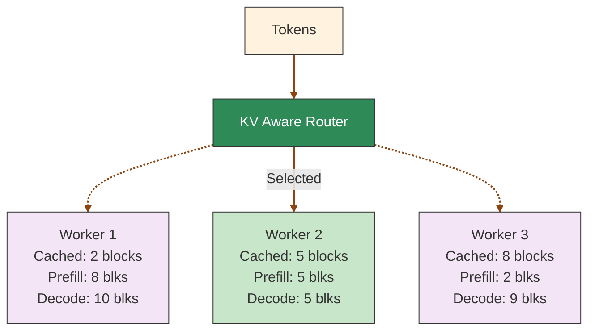

本页解释 Dynamo 路由器如何评估 worker、选择目标，以及如何嵌入到请求路径中。CLI 标志与调优旋钮见[配置与调优](router-configuration.md)。

## KV 缓存路由

KV 缓存路由通过将请求智能地导向拥有最相关缓存数据的 worker，来优化大语言模型推理。通过最大化缓存复用，减少冗余计算，提升吞吐量并降低延迟。



KV 缓存复用为 LLM 服务的负载均衡引入了复杂性。虽然它能显著降低计算成本，但忽略各 worker KV 状态的路由策略可能导致：
- 由于 worker 选择不当而错过缓存复用机会
- 跨 worker 请求分布不均导致系统吞吐量下降

路由器使用一个同时考虑预填充成本（受缓存 block 影响）与解码负载的成本函数来做出最优路由决策。

## 成本计算

1. **Prefill block**：通过将需要 prefill 处理的 token 数除以 block 大小得到。系统根据输入 token 与每个 worker 上可用的缓存 block 进行预测，并在首个输出 token 表明 prefill 完成时更新计数。
2. **Decode block**：根据请求的输入 token 与每个 worker 的活跃序列估算。请求完成、其 block 被释放时更新计数。
3. **成本公式**：`cost = overlap_score_weight * prefill_blocks + decode_blocks`

成本越低代表路由选择越好。
`overlap_score_weight` 在缓存命中优化与负载分布之间取得平衡。
更高的权重偏向缓存复用（改善 TTFT），更低的权重则优先均匀分布负载（改善 ITL）。

## Worker 选择

路由器选择成本最低的 worker。当 `router_temperature` 设置为非零值时，路由器对归一化的成本 logits 进行 softmax 采样，引入选择的随机性，有助于负载分布。

`overlap_score_weight = 1.0` 时的示例计算：
- Worker 1：cost = 1.0 * 8 + 10 = 18
- **Worker 2：cost = 1.0 * 5 + 5 = 10**（被选中——成本最低）
- Worker 3：cost = 1.0 * 2 + 9 = 11

## 使用 KV 缓存路由器

要启用 KV 缓存感知路由，按以下方式启动前端节点：

```bash
python -m dynamo.frontend --router-mode kv
```

当 KV block 被创建或移除时，引擎会通知 Dynamo 路由器，后者随即识别拥有最佳匹配 block 的 worker 并将流量路由过去。

要评估 KV 感知路由的收益，可使用 `--router-mode random|round-robin` 与 KV 感知路由对比工作负载的性能。

详细的 CLI 参数与高级配置选项请见[配置与调优](router-configuration.md)。

## 基础路由

Dynamo 在从一个组件向另一个组件的端点发送请求时支持多种路由策略。

首先，创建一个绑定到组件端点的客户端。这里我们获得绑定到 `VllmWorker` 组件 `generate` 端点的客户端。

```python
client = runtime.endpoint("dynamo.VllmWorker.generate").client()
```

然后可以使用 client 类暴露的默认路由方法向 `VllmWorker` 组件发送请求。

- **随机路由**：默认策略，可通过 `client.generate()` 或 `client.random()` 使用
- **轮询路由**：通过 `client.round_robin()` 在可用 worker 间循环
- **直接路由**：通过 `client.direct(input, component_id)` 显式指向特定 worker
- **最少负载路由**：通过 `--router-mode least-loaded` 路由到活跃连接最少的 worker
- **设备感知加权路由**：通过 `--router-mode device-aware-weighted`，使用 CPU/非 CPU 比例预算并在所选设备组中以最少负载策略选择

在分离式 prefill 路径中，它跳过 bootstrap 优化，使用同步 prefill 路径，与 power-of-two 路由的行为一致。

KV 缓存路由使用直接路由配合特殊的 worker 选择算法。

KV router 性能基准测试请见 [KV Router A/B 基准测试指南](../../benchmarks/kv-router-ab-testing.md)。
自定义路由逻辑与高级模式请见[路由模式](router-examples.md#routing-patterns)。

## 设备感知加权路由

`device-aware-weighted` 适用于 CPU 与非 CPU worker 共享同一端点的异构集群。路由器不再比较原始 in-flight 计数，而是比较 CPU 与非 CPU 组之间能力归一化后的负载，然后在胜出的组内选择负载最少的 worker。

```text
normalized_load = total_inflight(group) / (instance_count(group) x throughput_weight)
```

吞吐量权重对 CPU worker 为 `1`，对非 CPU worker 为 `DYN_ENCODER_CUDA_TO_CPU_RATIO`。这让路由器能按设备能力比例路由，而不是永久饿死较慢的设备。

当只存在一个设备类时，行为退化为标准的最少负载路由。
