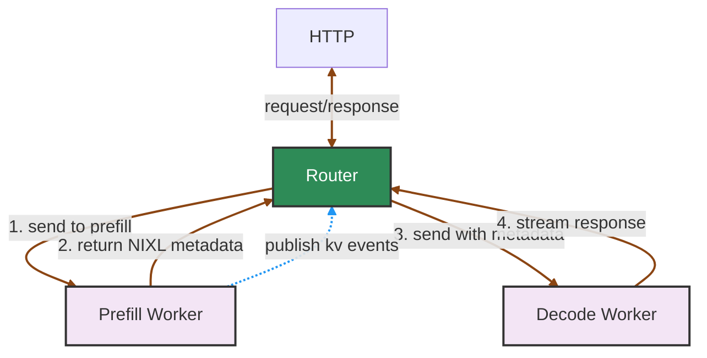

Dynamo 支持分离式服务，由独立的 worker 池分别处理 prefill（prompt 处理）与 decode（token 生成）。当你以 `ModelType.Prefill` 注册 worker 时，前端会自动检测并激活内部的 prefill 路由器。

高层部署矩阵参见 [Router 指南](router-guide.md)。本场景下使用的路由器标志参见[配置与调优](router-configuration.md)。

## Prefill Router 自动激活

在以下情况下，prefill 路由器会被自动创建：
1. 注册了 decode 模型，例如通过 `register_model()` 配合 `ModelType.Chat | ModelType.Completions`。
2. 检测到具有相同模型名且 `ModelType.Prefill` 的 prefill worker。

Prefill 路由器的关键特征：
- **始终禁用活跃 block 跟踪**（`track_active_blocks=false`），因为 prefill worker 不执行 decode。
- **无缝集成**到位于预处理与 decode 路由之间的请求流水线中。
- 当 prefill 失败或没有可用的 prefill worker 时，**优雅地回退**到仅 decode 模式。

分离式模式下 decode 路由阶段的关键特征：
- **禁用重叠打分**（`overlap_score_weight=0`），因为 decode 路由不应追求前缀复用。
- **禁用 KV 复用假设**（`assume_kv_reuse=false`），除非后端确实可以对已传输的 block 做去重。
- **禁用 prefill-token 跟踪**（`track_prefill_tokens=false`），让 decode 侧负载体现 decode 工作量，而不是已经完成的 prompt 工作量。

## 配置示例

当两类 worker 都已注册后，请求会被自动路由。

```python
# Decode worker registration (in your decode worker)
decode_endpoint = runtime.endpoint("dynamo.decode.generate")

await register_model(
    model_input=ModelInput.Tokens,
    model_type=ModelType.Chat | ModelType.Completions,
    endpoint=decode_endpoint,
    model_name="meta-llama/Llama-2-7b-hf",
    # ... other parameters
)

await decode_endpoint.serve_endpoint(decode_handler.generate)

# Prefill worker registration (in your prefill worker)
prefill_endpoint = runtime.endpoint("dynamo.prefill.generate")

await register_model(
    model_input=ModelInput.Tokens,
    model_type=ModelType.Prefill,
    endpoint=prefill_endpoint,
    model_name="meta-llama/Llama-2-7b-hf",
    # ... other parameters
)

await prefill_endpoint.serve_endpoint(prefill_handler.generate)
```

>[!Note]
> 当前在 vLLM 与 TensorRT-LLM 后端启用了带自动 prefill 路由的统一前端。对于 SGLang，请启动一个独立的 standalone router 作为 prefill 路由器，目标指向 prefill 端点。Standalone router（`python -m dynamo.router`）使用 `--router-*` 前缀的标志，例如 `--router-block-size` 与 `--router-kv-events`。请参阅 [Standalone Router README](https://github.com/ai-dynamo/dynamo/blob/main/components/src/dynamo/router/README.md) 与 [`examples/backends/sglang/launch/disagg_router.sh`](https://github.com/ai-dynamo/dynamo/blob/main/examples/backends/sglang/launch/disagg_router.sh)。

## 请求流程

下图展示了分离式服务中主要组件的概览：


