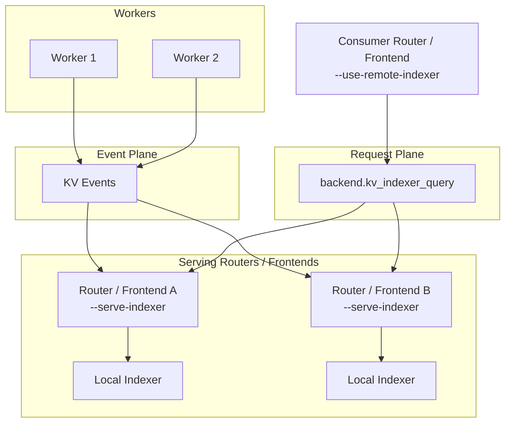

本页涵盖 router 部署的 day-2 运维主题。关于 flag 与调优指南，请参阅 [Configuration and Tuning](router-configuration.md)。

## 部署多个 router 副本

为提高容错能力，你可以启动多个 frontend + router 副本。如果多个 `dynamo.frontend` 进程共享同一主机或网络命名空间，请为每个实例指定不同的 HTTP 端口。在 Kubernetes 或独立主机上，副本通常可以复用同一个容器端口。或者，你可以将 router 作为独立服务 `python -m dynamo.router` 单独部署。

## Dynamo 原生远程 indexer

对于 Dynamo 原生部署，远程 indexer 由 `dynamo.frontend` 或 `dynamo.router` 提供，而不是 `dynamo.indexer`。

- 在希望从 worker component 暴露 `kv_indexer_query` 的 router 或 frontend 副本上使用 `--serve-indexer`。
- 在希望查询该已暴露端点（而不是维护本地 overlap indexer）的消费方 router 或 frontend 上使用 `--use-remote-indexer`。
- `dynamo.indexer` 仍然是面向非 Dynamo 或直接 ZMQ 部署的独立 HTTP + ZMQ 微服务。

frontend 示例：

```bash
# 提供 anchor 服务
python -m dynamo.frontend --router-mode kv --serve-indexer

# 消费方 frontend
python -m dynamo.frontend --router-mode kv --use-remote-indexer
```

提供的服务仅作用于 request-plane（请求面）。每个提供 indexer 服务的 router 或 frontend 仍然保留其常规的本地 KV 事件摄取、空缺检测以及 worker-query 恢复路径；远程消费方仅发起基于哈希的 overlap 查询。

近似模式（`--no-router-kv-events`）在远程服务时仅支持单点：对于给定的 worker component，只能存在一个 `--serve-indexer` 副本。事件驱动模式允许在同一 worker component 后存在多个提供服务的副本。



## Router 状态管理

KV 路由跟踪两类状态：

1. **Prefix block（已缓存的 KV 块）**：维护在一棵 radix tree 中，跟踪每个 worker 上缓存了哪些块。该状态是持久的。在本地 indexer 模式下，状态在启动时通过 worker 重建。在 JetStream 模式下（`--router-durable-kv-events`），它由 JetStream 事件和 object store 快照支持。
2. **Active block（解码中的块）**：跟踪当前用于活跃生成请求的块。该状态是短暂的。一个新的 router 副本启动时其活跃块知识为零，但随着请求处理而最终一致。

关于这些状态背后的架构，请参阅 [Router Design](../../design-docs/router-design.md)。

## 启用 Router 副本同步

```bash
# router 副本 1
python -m dynamo.frontend --router-mode kv --http-port 8000 --router-replica-sync

# router 副本 2
python -m dynamo.frontend --router-mode kv --http-port 8001 --router-replica-sync
```

`--router-replica-sync` 标志启用副本之间的活跃块同步：
- 活跃块通过 NATS core 消息共享。
- 副本之间交换路由决策以维持一致的负载估计。
- 新副本以零活跃块启动，但会通过请求处理与其他副本的活跃同步迅速收敛。

不启用该标志时，每个副本维护各自隔离的活跃块视图，可能导致次优路由。

## 持久化与恢复

持久化行为依赖于事件传输模式。

### NATS Core / Event Plane 配本地 indexer 模式

- 状态持久化在 worker 上。事件是 fire-and-forget，但 worker 保留其本地 indexer 状态。
- 启动时，router 查询每个 worker 的本地 indexer 来重建状态。
- 恢复依赖于 worker 可用。如果某个 worker 离线，其块无法被恢复。
- 该模式简化了基础设施，因为不需要 JetStream。

关于空缺检测与回放的更多内容，请参阅 [KV Event Replay — Dynamo vs vLLM](kv-event-replay-comparison.md)。

### JetStream 模式

JetStream 模式要求 frontend 和 worker 都启用 `--router-durable-kv-events`。

- prefix block 存储在 NATS JetStream，保留 1 小时。
- 快照按可配置阈值保存到 NATS object store。
- 新副本在启动时自动恢复该状态。
- 即使前两个副本都已下线，你也可以启动第三个 router 副本，它会恢复完整的 prefix 状态。

```bash
python -m dynamo.frontend --router-mode kv --http-port 8002 --router-replica-sync
```

>[!Note]
> 如果你需要在 JetStream 模式下以全新状态启动，有两种选择：
> 1. 使用不同的 namespace 或 component，从而创建新的 stream 与 NATS object store 路径。
> 2. 启动一个 router 时使用 `--router-reset-states`，这会清除整个 stream 与 radix 快照。仅在启动一个 component 中的第一个 router 副本时这样做，否则可能让现有副本进入不一致状态。

## 其他说明

状态持久化依赖于事件传输模式：
- **NATS Core / event plane 模式**：状态持久化在 worker 上，启动时 router 通过查询 worker 重建状态。
- **JetStream 模式**：通过 JetStream 与 NATS object store 快照，状态在 router 重启间保持。
- **无 KV 事件**（`--no-router-kv-events`）：不支持状态持久化。

请求面传输与 KV 事件传输相互独立。请求面（`DYN_REQUEST_PLANE` 或 `--request-plane`）控制请求如何到达 worker。KV 事件在 JetStream 或 NATS Core 模式下使用 NATS；当设置 `--event-plane zmq` 时使用 ZMQ。在 `--event-plane zmq` 配 `--discovery-backend file` 或 `mem` 时，router 可以在不依赖 etcd 或 NATS 的情况下运行。使用基于 NATS 的 event plane 时，NATS 会自动初始化；通过 `NATS_SERVER=nats://...` 覆盖默认的 `localhost:4222`。

当 `--router-kv-overlap-score-weight` 设为 0 时，不会创建 KV indexer，且前缀匹配被禁用。当设置 `--no-router-kv-events` 时，仍然会创建 KV indexer，但不会启动事件订阅者；router 根据自身的路由决策预测缓存状态，并通过基于 TTL 的过期。

后端 KV 事件发布与 frontend 的 `--no-router-kv-events` 标志相互独立。frontend 标志控制 router 是否消费事件；后端标志控制 worker 是否发布事件。如果 router 不在消费事件，仍然发布的 worker 会浪费资源但不会造成损害。

- **vLLM**：传 `--kv-events-config '{"enable_kv_cache_events": false}'` 禁用，或 `'{"enable_kv_cache_events": true, "publisher": "zmq", "endpoint": "tcp://*:5557"}'` 启用。
- **SGLang**：传带 JSON 配置的 `--kv-events-config` 启用，省略则保持发布禁用。
- **TRT-LLM**：传 `--publish-events-and-metrics` 启用，省略则保持发布禁用。

CLI 参数 `--router-ttl-secs` 控制当 router 在不接收 worker 事件时的本地缓存预测生命周期。当 worker 配置为发布 KV 事件时，router 依赖 worker 端的逐出事件，此参数被忽略。

`--router-queue-threshold` 与 busy 阈值（`--active-decode-blocks-threshold`、`--active-prefill-tokens-threshold`、`--active-prefill-tokens-threshold-frac`）有不同用途。Busy 阈值在某 worker 超过利用率限制时将其完全从候选集合中剔除。相比之下，`--router-queue-threshold` 会推迟整个路由决策，直到至少有一个 worker 有容量，从而使用最新的负载指标进行路由。Busy 阈值可以在运行时通过 `/busy_threshold` HTTP 端点动态更新，无需重启 frontend。详情参见 [Request Rejection](../../fault-tolerance/request-rejection.md)。
