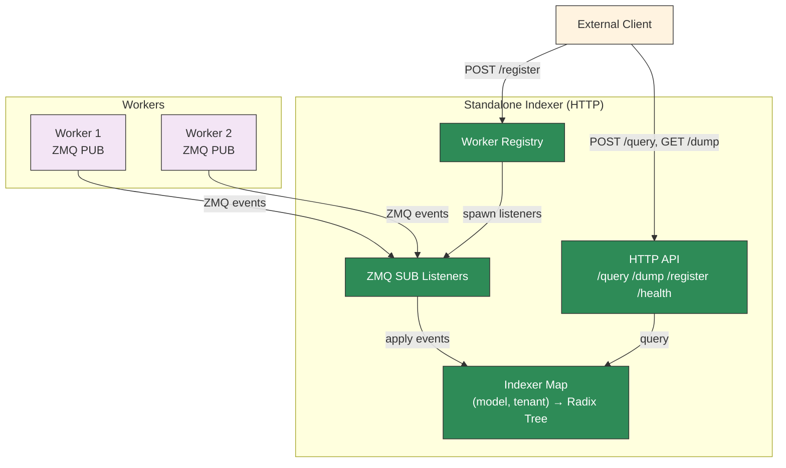
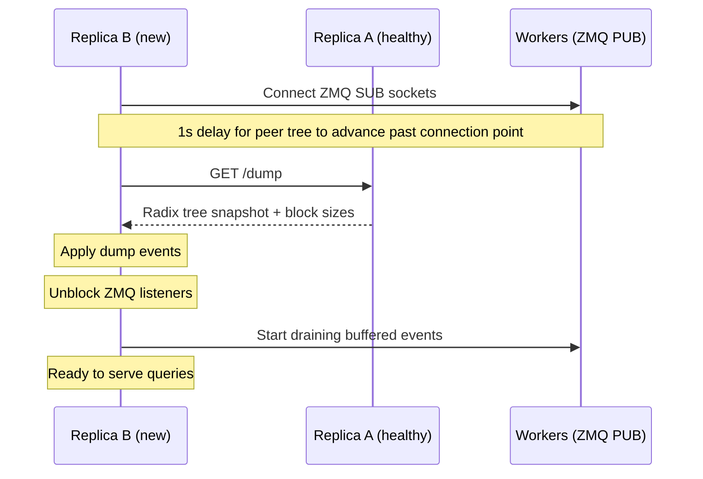

## 概述

独立 KV 索引器（`python -m dynamo.indexer`）是一个轻量服务，维护已缓存 block 的 radix tree，并通过 HTTP 端点提供查询和管理 worker 的能力。

- 它直接订阅来自 worker 的 ZMQ KV 事件流。
- 它通过 HTTP API 提供注册、检视和重叠查询。
- 在独立 ZMQ 路径下保留了 P2P 恢复以及 gap 检测/重放（replay）。
- 它索引设备（device）、host-pinned 与磁盘层（disk tier）的 block，并在 `/query` 响应中按层级返回匹配。

它与 [独立 Router](../../../components/src/dynamo/router/README.md) 不同，独立 Router 是一个完整的路由服务。独立索引器仅提供索引与查询层，不包含路由逻辑。

对于 Dynamo 原生的远程索引，请改用 `dynamo.frontend` 或 `dynamo.router` 上的 `--serve-indexer` 以及消费者上的 `--use-remote-indexer`。该请求面服务复用 router 已有的事件摄取与恢复机制；它**不**由 `dynamo.indexer` 实现。

HTTP API 遵循 [Mooncake KV Indexer RFC](https://github.com/kvcache-ai/Mooncake/issues/1403) 约定。

`DYN_ROUTER_MIN_INITIAL_WORKERS` 在此处也被尊重。当设置为正整数时，独立索引器会等待该数量的 worker 注册后才开启启动就绪门，这与前端/router 的启动行为一致。

## 多模型与多租户支持

索引器为每个 `(model_name, tenant_id)` 对维护一个 radix tree。注册了不同模型名或租户 ID 的 worker 会被隔离到不同的索引器中 —— 对某个 model/tenant 的查询永远不会返回另一个的分数。

- **`model_name`**（`/register` 与 `/query` 必填）：标识模型。服务不同模型的 worker 会得到独立的 radix tree。
- **`tenant_id`**（可选，默认 `"default"`）：在同一模型内启用多租户隔离。单租户部署可省略。
- **`block_size`** 是按索引器维度的：对某个 `(model_name, tenant_id)` 对的首次 `/register` 调用确定其 block size。该对的后续注册必须使用相同 block size，否则请求会失败。

## 兼容性

独立索引器可与任何按预期 msgpack 格式通过 ZMQ 发布 KV 缓存事件的引擎一起工作。包括原生 vLLM 与 SGLang 引擎，它们原生发出 ZMQ KV 事件 —— 不需要 Dynamo 专用包装。

带非设备存储层（host-pinned、disk、external）标签的事件会被路由到下层槽位而非被丢弃，并在 `/query` 响应中以 `cpu` / `disk` reach 形式呈现。

## 用例

- **调试**：检视 radix tree 状态以验证哪些 block 缓存在哪些 worker 上。
- **状态校验**：确认索引器的 KV 缓存状态视图与 router 内部状态一致（用于集成测试）。
- **自定义路由**：构建外部路由逻辑，从索引器查询重叠分数并自行做出 worker 选择决策。
- **监控**：在不运行完整 router 的情况下观察 KV 缓存在 worker 间的分布。
- **独立微服务**：当你希望直接 HTTP 检视并以 ZMQ 摄取时，独立于 router/前端运行索引器。

## P2P 恢复

多个索引器副本可订阅相同的 ZMQ worker 端点以实现容错。当某个副本启动（或崩溃后重启）时，它先从健康的对端引导出 radix tree 状态，然后再处理实时事件。

### 工作机制

1. 通过 `--workers` 或 `/register` 注册 worker。每个 ZMQ 监听器进入 `pending` 状态，并在后台开始首次订阅/连接尝试。
2. 1 秒延迟用于跳过 slow-joiner 窗口的偏移，使 dump 覆盖在新监听器安全开始排空之前可能发生的事件。
3. 索引器从 `--peers` 中第一个可达的对端拉取 `/dump`。
4. 应用 dump 事件以填充 radix tree。
5. 恢复完成后开启 ready 门。任何已成功完成首次 ZMQ 连接的监听器进入 `active` 并开始排空缓冲事件；为仍然下线的 worker 准备的监听器保持 `pending` 直到连接成功。

如果没有对端可达，索引器以空状态启动。

### 示例：双副本配置

```bash
# 副本 A（首个实例，无对端）
python -m dynamo.indexer --port 8090 --block-size 16 \
  --workers "1=tcp://worker1:5557,2=tcp://worker2:5558"

# 副本 B（启动时从 A 恢复）
python -m dynamo.indexer --port 8091 --block-size 16 \
  --workers "1=tcp://worker1:5557,2=tcp://worker2:5558" \
  --peers "http://localhost:8090"
```

两个副本订阅相同的 worker。副本 B 在启动时恢复 A 的树状态，之后双方独立处理后续实时 ZMQ 事件。

### 一致性

dump 是 radix tree 的弱一致 BFS 快照 —— 并发写入可能与遍历竞争。这可以接受，因为：

- **过期 block**（部分被移除的分支）：实时 `Remove` 事件会清理它们。
- **缺失 block**（部分被添加的分支）：实时 `Stored` 事件会补上。
- 实时事件追上后，树最终会收敛到正确状态。

### 对端管理

对端可在启动时通过 `--peers` 注册，或通过 HTTP API 动态注册。对端列表仅用于恢复 —— 对端之间不会实时同步状态。

## 构建

服务通过 Python 绑定包暴露，使用 maturin 构建绑定后用 `python -m dynamo.indexer` 启动。Feature flag 控制编译入哪些能力：

| Feature | 说明 |
|---------|-------------|
| `kv-indexer` | 核心独立索引器服务路径（`python -m dynamo.indexer`：HTTP API、ZMQ 监听器、P2P 恢复） |
| `kv-indexer-metrics` | 可选的 `/metrics` 端点 |

### 独立构建

```bash
cd lib/bindings/python && VIRTUAL_ENV=../../.venv ../../.venv/bin/maturin develop --uv --features kv-indexer
```

安装完成后用 `python -m dynamo.indexer` 启动服务。

### 带指标的独立构建

```bash
cd lib/bindings/python && VIRTUAL_ENV=../../.venv ../../.venv/bin/maturin develop --uv --features kv-indexer,kv-indexer-metrics
```

这样默认 `kv-indexer` 构建保持精简，必要时仍可启用 Prometheus 指标。

## CLI

```bash
python -m dynamo.indexer --port 8090 [--threads 4] [--block-size 16 --model-name my-model --tenant-id default --workers "1=tcp://host:5557,2:1=tcp://host:5558"] [--peers "http://peer1:8090,http://peer2:8091"]
```

| Flag | 默认值 | 说明 |
|------|---------|-------------|
| `--block-size` | （无） | 初始 `--workers` 的 KV 缓存 block 大小（设置 `--workers` 时必填） |
| `--port` | `8090` | HTTP 服务监听端口 |
| `--threads` | `4` | 索引器线程数（1 = 单线程，>1 = 线程池） |
| `--workers` | （无） | 初始 worker，格式为 `instance_id[:dp_rank]=zmq_address,...` 对（dp_rank 默认为 0） |
| `--model-name` | `default` | 初始 `--workers` 的模型名 |
| `--tenant-id` | `default` | 初始 `--workers` 的租户 ID |
| `--peers` | （无） | 用于启动时 P2P 恢复的对端索引器 URL，逗号分隔 |

### 共享启动门

设置 `DYN_ROUTER_MIN_INITIAL_WORKERS=<n>` 要求独立索引器、前端 push-router 路径以及 KV router config-ready 门都在至少 `<n>` 个 worker 之后才继续。不设置或设为 `0` 可禁用启动等待。

## HTTP API

### `GET /health` —— 存活检查

无条件返回 `200 OK`。

```bash
curl http://localhost:8090/health
```

### `GET /metrics` —— Prometheus 指标

以 Prometheus 文本展示格式返回指标。当 Python 绑定使用 `kv-indexer-metrics` feature 构建时可用。

```bash
curl http://localhost:8090/metrics
```

| 指标 | 类型 | 标签 | 说明 |
|--------|------|--------|-------------|
| `dynamo_kvindexer_request_duration_seconds` | Histogram | `endpoint` | HTTP 请求延迟 |
| `dynamo_kvindexer_requests_total` | Counter | `endpoint`, `method` | HTTP 请求总数 |
| `dynamo_kvindexer_errors_total` | Counter | `endpoint`, `status_class` | HTTP 错误响应数（4xx/5xx） |
| `dynamo_kvindexer_models` | Gauge | — | 活跃 model+tenant 索引器数量 |
| `dynamo_kvindexer_workers` | Gauge | — | 已注册 worker 实例数 |
| `dynamo_kvindexer_listeners` | Gauge | `status` | 按状态（`pending`、`active`、`paused`、`failed`）统计的 ZMQ 监听器数 |

### `POST /register` —— 注册端点

为某 instance 注册一个 ZMQ 端点。每次调用为给定的 `(model_name, tenant_id)` 对创建或复用索引器。注册是非阻塞的：如果 worker 尚未上线，监听器会以 `pending` 状态接受，并在首次 ZMQ 连接成功后转为 `active`。

```bash
# 单模型，默认租户
curl -X POST http://localhost:8090/register \
  -H 'Content-Type: application/json' \
  -d '{
    "instance_id": 1,
    "endpoint": "tcp://127.0.0.1:5557",
    "model_name": "llama-3-8b",
    "block_size": 16
  }'

# 带租户隔离
curl -X POST http://localhost:8090/register \
  -H 'Content-Type: application/json' \
  -d '{
    "instance_id": 2,
    "endpoint": "tcp://127.0.0.1:5558",
    "model_name": "llama-3-8b",
    "tenant_id": "customer-a",
    "block_size": 16,
    "dp_rank": 0
  }'
```

| 字段 | 必填 | 默认值 | 说明 |
|-------|----------|---------|-------------|
| `instance_id` | 是 | — | worker 实例标识 |
| `endpoint` | 是 | — | 要订阅的 ZMQ PUB 地址 |
| `model_name` | 是 | — | 模型名（用于选择索引器） |
| `block_size` | 是 | — | KV 缓存 block 大小（必须与引擎匹配） |
| `tenant_id` | 否 | `"default"` | 用于隔离的租户标识 |
| `dp_rank` | 否 | `0` | 数据并行 rank |
| `replay_endpoint` | 否 | — | 用于 gap replay 的 ZMQ ROUTER 地址（如 `tcp://host:5560`） |
| `additional_salt` | 否 | — | 每租户 salt（Mooncake RFC #1403 `additionalsalt`，接受别名）。当前仅解析以保留前向兼容 —— 引擎目前自行加 salt。 |

### `POST /unregister` —— 注销实例

移除一个实例。省略 `tenant_id` 会从给定模型的**所有**租户中移除该实例；指定它则仅作用于该租户的索引器。

```bash
# 从所有租户移除
curl -X POST http://localhost:8090/unregister \
  -H 'Content-Type: application/json' \
  -d '{"instance_id": 1, "model_name": "llama-3-8b"}'

# 从特定租户移除
curl -X POST http://localhost:8090/unregister \
  -H 'Content-Type: application/json' \
  -d '{"instance_id": 1, "model_name": "llama-3-8b", "tenant_id": "customer-a"}'

# 移除特定 dp_rank
curl -X POST http://localhost:8090/unregister \
  -H 'Content-Type: application/json' \
  -d '{"instance_id": 1, "model_name": "llama-3-8b", "tenant_id": "default", "dp_rank": 0}'
```

| 字段 | 必填 | 默认值 | 说明 |
|-------|----------|---------|-------------|
| `instance_id` | 是 | — | 要移除的 worker 实例 |
| `model_name` | 是 | — | 模型名（标识索引器） |
| `tenant_id` | 否 | — | 租户标识（省略以从所有租户移除） |
| `dp_rank` | 否 | — | 要移除的特定 dp_rank（省略以移除全部） |

### `GET /workers` —— 列出已注册实例

```bash
curl http://localhost:8090/workers
```

返回：
```json
[
  {
    "instance_id": 1,
    "source": "zmq",
    "status": "active",
    "endpoints": {
      "0": "tcp://127.0.0.1:5557",
      "1": "tcp://127.0.0.1:5558"
    },
    "listeners": {
      "0": {
        "endpoint": "tcp://127.0.0.1:5557",
        "status": "active"
      },
      "1": {
        "endpoint": "tcp://127.0.0.1:5558",
        "status": "active"
      }
    }
  },
  {
    "instance_id": 2,
    "source": "discovery",
    "status": "active",
    "endpoints": {},
    "listeners": {}
  }
]
```

对于 ZMQ 管理的 worker，`status` 在多个监听器间按优先级 `failed > pending > active > paused` 聚合。每个监听器条目还可能在最近的启动或 recv-loop 尝试失败时暴露 `last_error` 字段。

### `POST /query` —— 按 token id 查询重叠

给定原始 token id，计算 block 哈希并返回每个实例的重叠分数（按匹配 token 数）：

```bash
curl -X POST http://localhost:8090/query \
  -H 'Content-Type: application/json' \
  -d '{"token_ids": [1, 2, 3, 4, 5, 6, 7, 8, 9, 10, 11, 12, 13, 14, 15, 16], "model_name": "llama-3-8b"}'
```

返回：
```json
{
  "scores": {"1": {"0": 32}, "2": {"1": 0}},
  "frequencies": [1, 1],
  "instances": {
    "1": {
      "longest_matched": 48,
      "gpu": 32,
      "dp": {"0": 32},
      "cpu": 48,
      "disk": 48
    },
    "2": {
      "longest_matched": 0,
      "gpu": 0,
      "dp": {"1": 0},
      "cpu": 0,
      "disk": 0
    }
  }
}
```

所有计数都按**匹配 token 数**（block 重叠数 × block size）计。

- `scores` / `frequencies`：旧版设备层重叠。`scores` 嵌套结构为 `instance_id`，再到 `dp_rank`。保留以向后兼容 —— 现有调用方无需修改。
- `instances`：每实例、每层级的拆解，与 [Mooncake RFC #1403](https://github.com/kvcache-ai/Mooncake/issues/1403) 对齐。详见下方 [按实例的层级拆解](#按实例的层级拆解)。

| 字段 | 必填 | 默认值 | 说明 |
|-------|----------|---------|-------------|
| `token_ids` | 是 | — | 要查询的 token 序列 |
| `model_name` | 是 | — | 模型名（选择索引器） |
| `tenant_id` | 否 | `"default"` | 租户标识 |
| `lora_name` | 否 | — | LoRA 适配器（覆盖该查询的索引器级 lora_name） |
| `cache_salt` | 否 | — | 每请求缓存 salt（Mooncake RFC #1403）。当前仅解析以保留前向兼容 —— 引擎目前自行加 salt。 |

### `POST /query_by_hash` —— 按预计算哈希查询重叠

```bash
curl -X POST http://localhost:8090/query_by_hash \
  -H 'Content-Type: application/json' \
  -d '{"block_hashes": [123456, 789012], "model_name": "llama-3-8b"}'
```

响应格式与 `/query` 相同，包含每实例的 `instances` 映射。分数按匹配 token 数计。

| 字段 | 必填 | 默认值 | 说明 |
|-------|----------|---------|-------------|
| `block_hashes` | 是 | — | 预计算的 block 哈希数组 |
| `model_name` | 是 | — | 模型名（选择索引器） |
| `tenant_id` | 否 | `"default"` | 租户标识 |
| `cache_salt` | 否 | — | 每请求缓存 salt（Mooncake RFC #1403）。当前仅解析以保留前向兼容 —— 引擎目前自行加 salt。 |

### 按实例的层级拆解

`instances` 中的每个条目以字符串形式的 `instance_id` 为 key，并报告设备、host-pinned 与 disk 层的前缀触达：

| 字段 | 说明 |
|-------|-------------|
| `gpu` | 设备层匹配的 token 数（该实例任意 `dp_rank` 上最长的设备层前缀） |
| `dp` | 每个 `dp_rank` 的设备层匹配 token 数，格式 `{rank: tokens}` |
| `cpu` | 经过 host-pinned 层匹配的 token 数。**累计**到设备层 —— 包含 `gpu` 中的全部，再加上任何 host-pinned 扩展 |
| `disk` | 经过 disk（或 external）层匹配的 token 数。**累计**经过 device → host-pinned 的遍历 |
| `longest_matched` | `gpu`、`cpu`、`disk` 的最大值 —— 网关可据此排序的单一「最佳前缀长度」 |

层计数是累计的，因为下层遍历会在上一层基础上报告各层的*扩展*。在自然的 offload 流水线（device → host → disk）下，这能保证每个实例都满足 `gpu ≤ cpu ≤ disk` —— 下层是对设备层前缀的扩展而非缩减。

仅消费 `scores` 的旧调用方仍然可用：这些值等于每实例每 `dp_rank` 的 `gpu` 计数。

### `GET /dump` —— 导出所有 radix tree 事件

将完整 radix tree 状态作为 JSON 对象返回，key 为 `model_name:tenant_id`：

```bash
curl http://localhost:8090/dump
```

返回：
```json
{
  "llama-3-8b:default": {
    "block_size": 16,
    "events": [<RouterEvent>, ...]
  },
  "mistral-7b:customer-a": {
    "block_size": 16,
    "events": [<RouterEvent>, ...]
  }
}
```

每个索引器并发导出。`block_size` 字段使恢复中的对端能在不必为每个副本指定 `--block-size` 的情况下创建具有正确 block size 的索引器。

### `POST /register_peer` —— 注册对端索引器

```bash
curl -X POST http://localhost:8090/register_peer \
  -H 'Content-Type: application/json' \
  -d '{"url": "http://peer:8091"}'
```

### `POST /deregister_peer` —— 移除对端索引器

```bash
curl -X POST http://localhost:8090/deregister_peer \
  -H 'Content-Type: application/json' \
  -d '{"url": "http://peer:8091"}'
```

### `GET /peers` —— 列出已注册对端

```bash
curl http://localhost:8090/peers
```

返回：
```json
["http://peer:8091"]
```

## DP Rank 处理

当 worker 向独立 KV 索引器（`/register`）注册时，会提供 `instance_id`、ZMQ `endpoint` 以及可选的 `dp_rank`（默认为 0）。该服务为每次注册启动一个 ZMQ 监听器。

每个传入的 `KvEventBatch` 可能携带可选的 `data_parallel_rank` 字段。如果存在，它会**覆盖**该批次静态注册的 `dp_rank`。这允许单个 ZMQ 端口多路复用多个 DP rank 的事件。

**注意点**：注册表只跟踪显式 `/register` 调用所带的 dp_rank。如果引擎动态发出携带从未注册过的 dp_rank 的批次，索引器会正确存储这些 block（在动态 `WorkerWithDpRank` key 下），但按 dp_rank 的注销（`/unregister` 带 `dp_rank`）找不到它们。整实例注销（`/unregister` 不带 `dp_rank`）仍然通过 `remove_worker` 在树中清理给定 `worker_id` 的全部 dp_rank。

## Gap 检测与重放（Replay）

ZMQ PUB/SUB 是有损的 —— 在反压或短暂断连下消息可能被丢弃。索引器通过跟踪每个批次的序列号检测 gap：若 `seq > last_seq + 1`，则检测到 gap。

当 `/register` 提供了 `replay_endpoint` 时，索引器会将 DEALER socket 连接到引擎的 ROUTER socket，并按序列号请求缺失的批次。引擎从环形缓冲区流回 `(seq, payload)` 对，直到一个空 payload 哨兵为止。

如果未配置 `replay_endpoint`，gap 会被记录为告警但不会被恢复。

序列计数器（`last_seq`）跨注销/注册周期持久化，因此在 gap 后重新注册某 worker 会触发新监听器收到的第一个批次进行 replay。

## 限制

- **独立模式仅支持 ZMQ**：worker 必须通过 ZMQ PUB socket 发布 KV 事件。
- **无路由逻辑**：索引器仅维护 radix tree 并响应查询。它不跟踪活动 block、不管理请求生命周期，也不进行 worker 选择。

## 架构

### 独立模式



### P2P 恢复流程



## 参见

- **[Mooncake KV Indexer RFC](https://github.com/kvcache-ai/Mooncake/issues/1403)**：KV 缓存索引器的社区 API 标准化
- **[配置与调优](router-configuration.md)**：完整的 KV router 配置与调优
- **[Router 设计](../../design-docs/router-design.md)**：架构与事件传输模式
- **[独立 Router](../../../components/src/dynamo/router/README.md)**：完整的路由服务（将请求路由到 worker）
