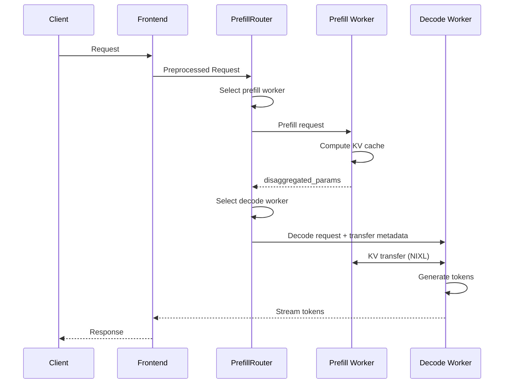

LLM 请求的预填充和解码阶段具有不同的计算特征和内存占用。将这两个阶段分离到专门的 LLM 引擎中，可以更好地分配硬件资源、提升可扩展性，并整体增强性能。例如，对内存受限的解码阶段使用较大的 TP，而对计算受限的预填充阶段使用较小的 TP，可以让两个阶段都被高效地计算。此外，对于长上下文请求，将其预填充阶段分离到专用的预填充引擎中，可以让正在进行的解码请求被高效处理而不会被这些较长的预填充阻塞。

请求的分离式执行包含三个主要步骤：
1. 预填充引擎计算预填充阶段并生成 KV 缓存
2. 预填充引擎将 KV 缓存传输到解码引擎
3. 解码引擎执行解码阶段。

Dynamo 中的分离式设计采用一个灵活的框架，能够在多种条件下提供出色的性能。

## 高效的 KV 传输

高性能分离式服务的关键是高效的 KV 传输。Dynamo 利用 NIXL 直接将 KV 缓存从预填充引擎的显存传输到解码引擎的显存。该 KV 传输是非阻塞的，传输期间 GPU 可以继续进行前向传播以服务其他请求。

### 路由器编排

分离式服务流程由 `PrefillRouter` 编排：

1. **Worker 选择**：路由器使用 KV 感知路由（基于缓存重叠分数和负载）或简单负载均衡选择一个预填充 worker。

2. **预填充执行**：路由器将预填充请求发送给所选的预填充 worker。预填充 worker 计算 KV 缓存并返回包含后端特定传输元数据的 `disaggregated_params`。

3. **解码路由**：路由器将预填充结果注入到解码请求中，然后路由到解码 worker。

4. **KV 传输**：解码 worker 使用传输元数据与预填充 worker 协作。NIXL 通过最优可用传输（NVLink、InfiniBand/UCX 等）处理 GPU 到 GPU 的直接传输。

### 后端特定的传输元数据

传输元数据格式因后端而异：

- **SGLang**：使用 `bootstrap_info`（host、port、room_id）进行 RDMA bootstrap 协调。SGLang 预填充 worker 在初始化期间将其 bootstrap 端点发布到发现服务。借助此机制，预填充可以作为后台任务运行，使解码阶段可以立即开始，同时 KV 传输并行进行。

- **vLLM**：使用 `kv_transfer_params`，包含 block ID 和远端 worker 连接信息。预填充同步运行；解码在继续之前等待预填充完成。

- **TRTLLM**：使用 `opaque_state`，包含序列化的 TRT-LLM 内部元数据。预填充同步运行；解码在继续之前等待预填充完成。

## 运行时可重配置的 xPyD

Dynamo 的分离式设计支持运行时可重配置的 xPyD（x 个预填充 worker，y 个解码 worker）。可在运行时增删 worker：

- **新增 worker**：worker 向发现服务注册并发布其 `RuntimeConfig`（包含 KV 容量）。
- **移除 worker**：worker 排空活跃请求并从发现服务注销。

路由器通过发现服务自动发现新 worker，并将其纳入路由决策中。

