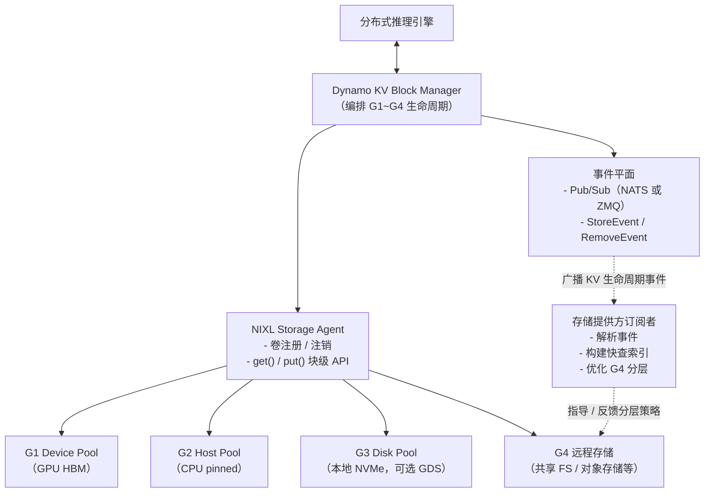

本文深入介绍 Dynamo KV Block Manager（KVBM）的架构、组件、通过 Connector API 与各框架的集成方式以及其工作机制。KVBM 的设计借鉴了 SGLang 和 vLLM 中 KV block manager 的实践，并融合了 GPU 编程中常见的内存分层（memory tiering）历史经验。更多内容参见 [扩展阅读](#further-reading)。

## KVBM 组件


*Dynamo KVBM 的内部组件*

### 核心（Core）

- **KvBlockManager**：对外门面。构造并持有内部状态，对外暴露 pool 和 onboarding API。
- **Scheduler**：当与框架 connector（如 vLLM V1）集成时，相对于模型进度（迭代/层完成）控制传输的执行时机。
- **Config（config.rs）**：描述模型维度、page 大小、layout 选择以及构建 pool 和 layout 所用的运行时 flag。
- **KvBlockManagerState**：中心对象，串联 layout、storage backend 和 pool；持有 OffloadManager、metrics 和 event hook。
- **Events/Metrics**：可观测组件，暴露 counter/gauge 和事件 hook，用于集成和测试。

### Layout 与 Block

- **LayoutConfig 与 LayoutType**：把 tensor 形状翻译为 KV cache layout（layer-separated 或 fully-contiguous），包括 block 数和几何排布。
- **Block 与 Metadata**：带类型的 block 句柄（可变/不可变）、metadata（如优先级）、按 layer / 外维的视图；用于分配、注册和按 `sequence_hash` 查找。

### Transfer Manager

- **TransferManager**：异步传输编排器，按路径（Device→Host、Host→Disk、Host→Device、Disk→Device）维护独立队列。

### Storage 与 Pool

- **Device Pool（G1）**：GPU 上的 KV block pool。分配可变 GPU block，注册完成的 block（不可变），按 sequence hash 查找，是 onboarding 的目标（Host→Device、Disk→Device）。
- **Host Pool（G2）**：CPU pinned-memory 的 KV block pool。接收 Device offload（Device→Host），可向 Device onboarding（Host→Device），也可 offload 到 Disk。使用 pinned（page-locked）内存以提高 CUDA 传输和 NIXL I/O 的效率。
- **Disk Pool（G3）**：本地 SSD NVMe 上的 KV block pool。接收 Host offload（Host→Disk），并为 onboarding 提供数据（Disk→Device）。NIXL descriptor 暴露文件偏移/区域以支持 zero-copy I/O 和可选的 GDS。
- **Remote Storage（G4）**：远程或云端 KV block 存储。KVBM 把 G4 视为通过 NIXL 访问的不透明 blob 存储，不感知其内部 layout 优化。

## KVBM 数据流


*KVBM 中 Device 与其他内存层级之间的数据流*

### Device → Host（Offload）

- 由 connector scheduler 显式触发 offload
- Worker 分配一个 Host block，执行 CUDA D2H / 自定义 kernel 拷贝
- Host pool 注册新的不可变 block（按 sequence hash 去重）

### Host → Disk（Offload）

- **本地 Disk（G3）**：NIXL Write，走 POSIX；条件允许时使用 GDS
- **远程 Disk（G4）**（网络文件系统如 NFS/Lustre/GPFS）：NIXL Write，走 POSIX 写到挂载的 FS；批量/并发逻辑相同
- 触发条件：已注册的 host block，或显式 offload 请求
- Worker 分配一个 Disk block，执行 NIXL Write（Host→Disk）
- Disk pool 注册新的不可变 block（按 sequence hash 去重）

### Host → Device（Onboard）

- 调用以将 host block 拉入 GPU 内存
- Worker 使用给定的 Device 目标，执行 CUDA H2D / 自定义 kernel 拷贝
- Device pool 注册新的不可变 block

### Disk → Device（Onboard）

- 调用以将 disk block 直接拉入 GPU 内存
- Worker 使用给定的 Device 目标，执行 NIXL Read（Disk→Device），可能走 GDS
- Device pool 注册新的不可变 block

## 内部架构深入


*Dynamo KVBM 内部架构与关键模块*

### KvBlockManager 作为编排层

`KvBlockManager<H, D>` 充当跨内存层级——host（CPU）、device（GPU）、remote——的协调者，管理每种后端的 block pool，并对外暴露一致的 block 生命周期 API。它追踪 KV block 在 device 内存（G1）、本机与跨机 CPU 内存（G2）、本地/池化 SSD（G3）、远程存储（G4）中的位置。G1–G4 是 KVBM 支持的关键层级。注意：KVBM 把 G4 视为不透明 blob 存储，不感知其内部 layout 优化。

`KvBlockManager<H, D>` 拥有：

- 一个 device 侧的 `BlockPool<Device>`
- 一个 host 侧的 `BlockPool<Host>`
- 一个支持跨机通信与内存共享的远程 NIXL agent
- 一个 block set 注册表，用于远程查找以及 block metadata 的导入/导出

实现上，`KvBlockManagerState` 承载主要逻辑：由 `KvBlockManagerConfig` 初始化，该配置融合了运行时、模型、layout 三类配置。`NixlOptions` 注入远程感知能力。

### Block Layout 与内存映射

每个 block 是一个二维数组 `[num_layers][page_size × inner_dim]`。`BlockLayout` trait 抽象内存布局。默认实现 `FullyContiguous` 将所有 block 的所有 layer 存储在一个连续区域内，并按对齐感知的方式计算 stride：

```text
block_stride_in_bytes = align_up(num_layers × layer_stride, alignment);
```

CPU 和 GPU pool 共享该内存布局，但使用各自的 storage backend：

- `DeviceStorage` → CUDA device buffer
- `PinnedStorage` → page-locked host 内存
- `SystemStorage` → CPU heap 内存（fallback / 测试用）
- `NixlStorage` → 通过 NIXL RDMA 句柄访问的远程内存（也含存储语义）

每种 layout 由 `LayoutConfig` 构造，storage 要么直接传入，要么通过 `StorageAllocator` 分配。

### BlockPool 与内存池（Active 与 Inactive）

每个 `BlockPool<T>`（`T` 是 `DeviceStorage`、`PinnedStorage` 等）维护两个子池：

- **ActivePool**：当前被序列占用的 block
- **InactivePool**：回收待用的 block（空闲列表）

请求 token block 时（如 `get_mutable_block()`），分配器从 `InactivePool` pop 出一个，切换其状态后返回可写句柄。序列 commit 或被淘汰时，系统 reset 这些 block 并归还到 inactive pool。

### Block 状态机

`BlockState` 跟踪 block 生命周期的状态转换：

| 状态 | 描述 | 所有权 | 合法动作/转移 |
|-------|-------------|-----------|---------------------------|
| Reset | block 未初始化或已被 reset。无关联序列。 | 在 InactivePool 中可复用 | `init_sequence(salt_hash)` → Partial |
| Partial | block 正为新序列填入 token，进行中。 | 由序列创建者持有 | `add_token()` / `add_tokens()`（追加）、`commit()` → Complete、`reset()` → Reset |
| Complete | block 已填满 token 但尚未对外可见。 | 仍归创建线程所有 | `register()` → Registered、`reset()` → Reset |
| Registered | block 最终化，对复用可见。已加入去重缓存。 | 共享所有权（全局注册表） | 自动 `drop()` → 触发 Remove 事件并转回 Reset |

#### 合法状态转移

| From → To | 触发 | 校验 |
|-----------|---------|------------|
| Reset → Partial | `init_sequence(salt_hash)` | 必须未被使用 |
| Partial → Complete | `commit()` | 必须已填满 |
| Complete → Registered | `register()` | 必须最终化 |
| Registered → Reset | `RegistrationHandle` 被 drop | 自动 |
| Partial → Reset | 序列中止 | 显式或 drop |
| Complete → Reset | 失效 | 显式或 drop |

#### Block 生命周期示例

一个序列请求新的 KV block：

1. 分配器从 InactivePool pop → block 处于 Reset
2. `init_sequence()` → 转为 Partial
3. 追加 token → 仍是 Partial
4. 填满后 `commit()` → 变为 Complete
5. `register()` → block 被 hash 并转为 Registered。此后可用于查找。
6. 被淘汰或生命周期结束 → RAII 句柄 `drop()`，block 回到 Reset

### 基于 RAII 与事件平面的生命周期管理

系统使用 RAII 管理内存生命周期。每个 block 持有 metadata 和注册状态，注册与 `EventManager` 耦合。注册和 drop 时：

- `PublishHandle` 触发 Register 事件
- 该句柄被 drop 触发 Remove 事件

这种模式让跨 worker 的共享内存追踪保持一致，无需显式释放逻辑。事件通过 Dynamo Events 平面传播。任何订阅了事件平面的 Dynamo 组件都可监听这些变化。值得注意的是，存储提供方也可以订阅事件平面，构建针对自家平台优化的内部前缀树。

### 通过 NIXL 集成远程内存

NIXL agent 通过 `NixlBlockSet`、`RemoteBlocks` 和 layout 描述符暴露远程内存缓冲区。关键操作：

- `nixl_register()`：向 NIXL runtime 注册内存区域
- `serialize() / deserialize()`：将 layout 和内存转为可传输的描述符
- `import_remote_blockset()`：将远端节点的 block layout 加载到当前 manager
- `get_remote_blocks_mutable()`：从另一节点抓取可传输的内存视图

`RemoteBlocks` 是跨机 block 共享内存的轻量抽象（通过 UCX 或其他后端实现）。

#### 远程内存注册协议

下面描述 Worker（如 Worker 1 和 Worker 2）之间使用 NIXL 进行双向远程内存注册与 layout 同步的协议：

**1. Agent 创建与内存注册**

每个 worker 独立搭建 NixlAgent：
- 通过 `nixl_register()` 注册自己的内存区域（即 device 内存）
- 这些区域对应本地 BlockPool 管理的 block

worker 注册内存后，NIXL 创建可远程访问的描述符，并绑定到内存 layout 上。

**2. Metadata 交换**

注册完成后，worker 之间交换序列化后的 layout metadata，封装在 `SerializedNixlBlockLayout` 中。

为什么这步至关重要？
- LLM 推理负载常常具有不同的 *tensor parallel（TP）* 配置：
  - Worker 1 可能 TP=4，Worker 2 可能 TP=8
  - 即使都用类似的 `FullyContiguous` layout，内部切片和对齐假设也不同
- metadata 交换通过共享以下信息消除这种语义不一致：
  - LayoutConfig（num_layers、page_size、inner_dim、dtype）
  - BlockSetID
  - 基址 + stride（含对齐）
  - Device ID + 内存类型（host/device）
- 双方共享 metadata 后，各自调用 `deserialize()` 即可在本地重建 layout

由此 NIXL 可以：
- 知道每个 layer/block 的实际位置
- 在 RDMA 类传输中进行正确的 gather-scatter

否则远程拉取会导致数据损坏或 token 错位。

**3. 序列化与反序列化：让 layout 可移植**

序列化阶段，KVBM 通过 `FullyContiguous::serialize()` 编码：
- FullyContiguousConfig
- base_offset
- 物理内存描述符（NixlStorage），包含：
  - 内存类型（VRAM、DRAM）
  - 地址与大小
  - Device ID

系统通过 NIXL 传输把它送过去，再注入到 KVBM scheduler 状态中。

反序列化阶段，`SerializedNixlBlockLayout::deserialize()` 把它复原为：
- 完整重建的内存 layout 视图
- 远端内存切片的本地表示，带正确的偏移和大小语义

这也使得对远程内存的直接访问保持一致的逻辑语义。即便系统配置（硬件或 LLM 形状）不同，双方对每个 KV block 的内存视图也能达成一致。

**4. 所有权句柄与生命周期追踪**

NIXL 中的内存所有权与 RAII 句柄紧密绑定：
- block 注册时返回 `PublishHandle`，其内部包装 `RegistrationHandle`
- 该句柄被 drop 时自动发布 Remove 事件，触发：
  - 从 NIXL 层注销 block
  - 从远程 block 注册表中移除
- 由此保证 block 被淘汰或不再用于推理时，跨节点引用都被干净失效

该机制避免了：
- 访问陈旧内存
- GPU/host 上的悬挂指针
- 手动注销带来的 bug

系统可通过 Publisher 批量发布注册事件，提升高并发下的性能。

### 存储后端与可插拔性

将 KVBM 集成新的存储后端时，可扩展或包装 `NixlEnabledStorage` 以支持跨机 RDMA 注册。所有 layout 和 block pool 都对后端泛型，便于在内存层级上做细粒度控制。



#### NIXL Storage 接口（用于后端集成）

NIXL 接口抽象了卷的交互，将其与挂载、metadata 追踪、直接系统 I/O 解耦。它提供：

- `registerVolume(descriptor)`：为 KV cache 数据注册一个逻辑卷
- `unregisterVolume()`：干净地注销并释放卷映射
- `get() / put()`：KVBM 用于读写 token block 的块级 API

这些抽象使得后端无需绑定 host 文件系统栈即可集成，可安全对接块设备、本地文件系统和 RDMA 卷。注意这些 API 仍在定型中。

#### Dynamo 事件平面（发布/订阅协调层）

为支持外部存储优化而不修改 KVBM 逻辑，我们提供 **事件平面**（支持 NATS 和 ZMQ 传输），它会针对所有 block 操作发出生命周期事件：

- **StoreEvent**：KV block 注册时发出
- **RemoveEvent**：KV block 释放或淘汰时发出

每条 KVEvent（约 100 字节）包含：

| 字段 | 描述 |
|-------|-------------|
| `sequence_hash` | KV block 的唯一标识 |
| `prefix_hash` | 用于 query 级聚合的前缀分组 |
| `block_size` | 字节大小 |
| `storage_location` | 逻辑卷标识 |
| `event_type` | Store 或 Remove |
| `extra_metadata` | 预留字段，供合作方做定制优化 |

为提升可扩展性，系统会周期性批量发布事件（如每 ~10 秒一次，也可根据系统负载动态调整）。

#### 存储顾问（Storage Advisor）的概念设计

本节面向有意作为自定义后端集成 KVBM 的存储提供方。**此为可选项，KVBM 与后端集成不强制要求。**

外部存储系统不与 Dynamo 执行流水线紧耦合，而是通过订阅模型被动观察 KV block 生命周期事件：

1. 存储卷由存储方预先准备并挂载
2. 通过 NIXL Storage Agent 的 `registerVolume()` API 向 Dynamo 注册这些卷
3. Dynamo KV Block Manager 仅与逻辑块级 API（`get()` 和 `put()`）交互
4. 事件平面通过 pub/sub（NATS 或 ZMQ）异步广播 KV 生命周期事件
5. 存储厂商实现轻量级订阅进程监听这些事件

为了做到快速查找和动态分层，存储厂商可以基于事件流构建内部数据结构：

- 收到 **StoreEvent** 时：将带 `prefix_hash`、`sequence_hash` 和关联 metadata 的记录插入内部前缀树、hash map 或 LRU 索引
- 收到 **RemoveEvent** 时：删除/修剪对应记录，可选触发清理或层级迁移流程

借助对 KV block 使用模式的实时洞察，存储系统可以实施智能分层策略：

- **热块上提**：高频访问的 KV block 迁移到快速 SSD 卷
- **冷块下沉**：低频块下沉到慢速存储（HDD、云对象存储）
- **主动合并**：若 block 大小或前缀模式提示碎片化，存储后端可合并或重写 block

这样的设计让性能、韧性和扩展性可以在 KV 层和存储后端层之间独立演进。

## 框架集成

KVBM 通过 Connector API 与推理框架（SGLang、TensorRT-LLM、vLLM）集成，影响 KV 缓存行为、调度和前向计算执行。

### Connector 架构

接口由两部分组成：

- **Scheduler（Leader）**：负责 KV block offload/onboard 的编排，构造指定传输数据的 metadata 给 worker。同时维护异步传输完成的 hook。
- **Worker**：读取 scheduler（leader）构造的 metadata，在前向计算结束时异步执行 onboard/offload。


*KVBM 与推理框架（以 vLLM 为例）的典型集成*

### Onboarding 操作


*Host → Device 的 onboard*


*Disk → Device 的 onboard*

### Offloading 操作


*Device → Host & Disk 的 offload*

## 扩展阅读

- [vLLM 自动前缀缓存](https://docs.vllm.ai/en/latest/features/automatic_prefix_caching.html)
- [SGLang HiCache Benchmarks](https://github.com/sgl-project/sglang/tree/main/benchmark/hicache)
- [EMOGI: Efficient Memory-access for Out-of-memory Graph-traversal](https://arxiv.org/abs/2006.06890)

## 参见

- [KVBM 总览](../components/kvbm/README.md)
- [KVBM 指南](../components/kvbm/kvbm-guide.md)
- [NIXL 文档](https://github.com/ai-dynamo/nixl/blob/main/docs/nixl.md)

