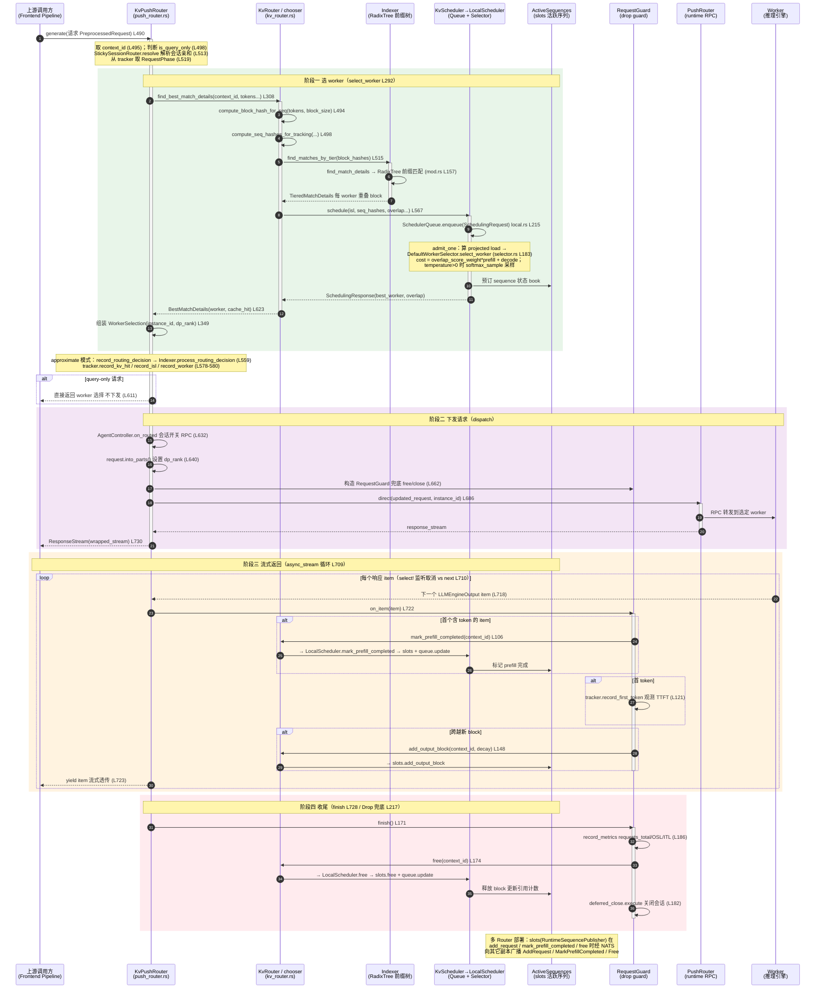
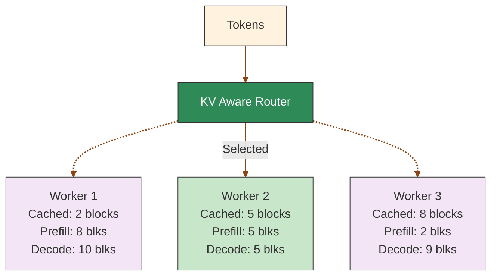
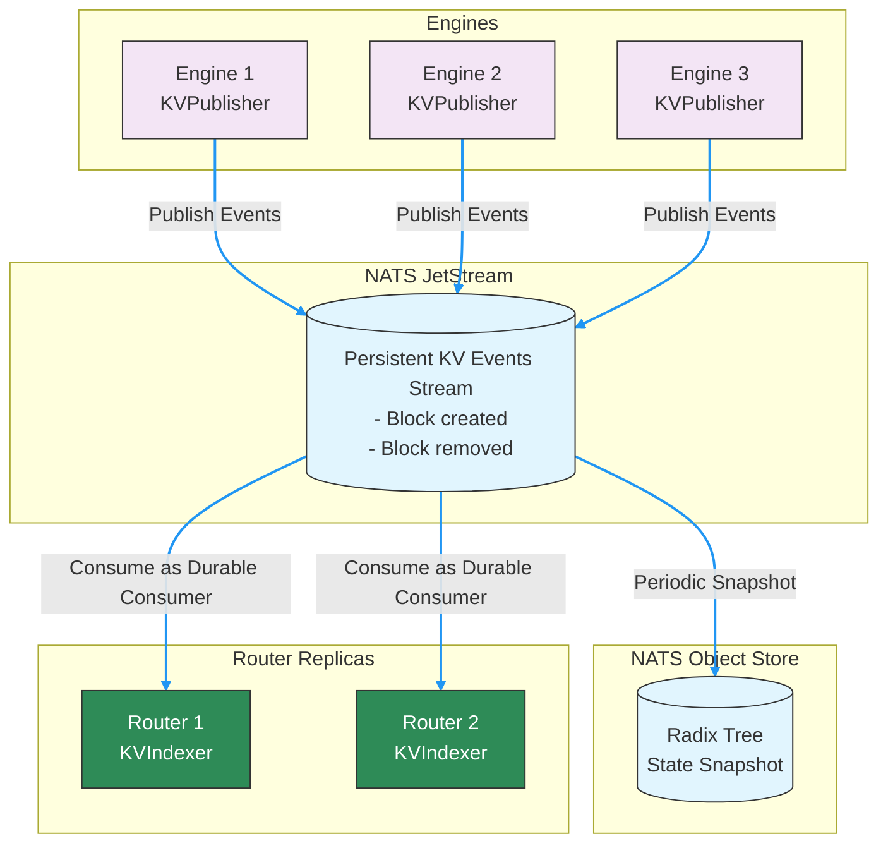
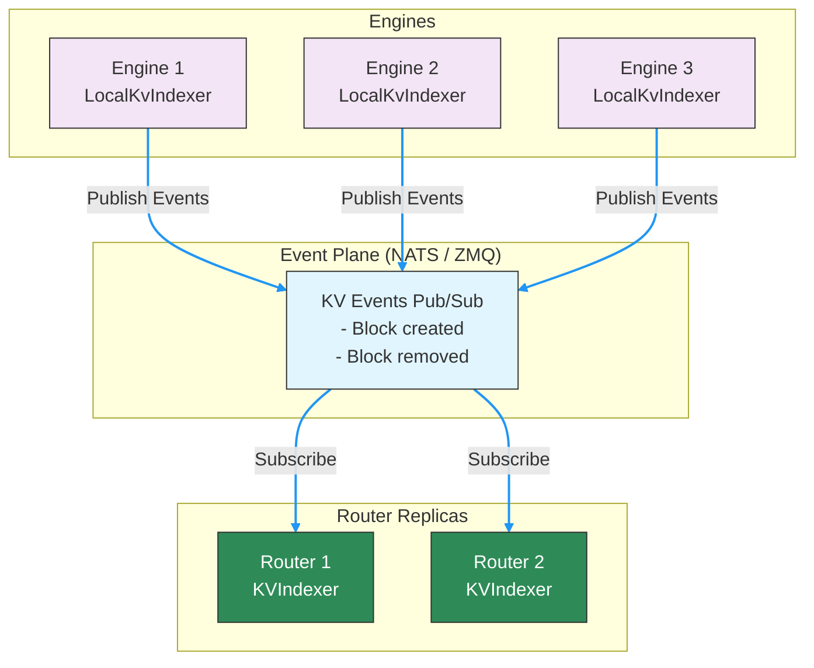
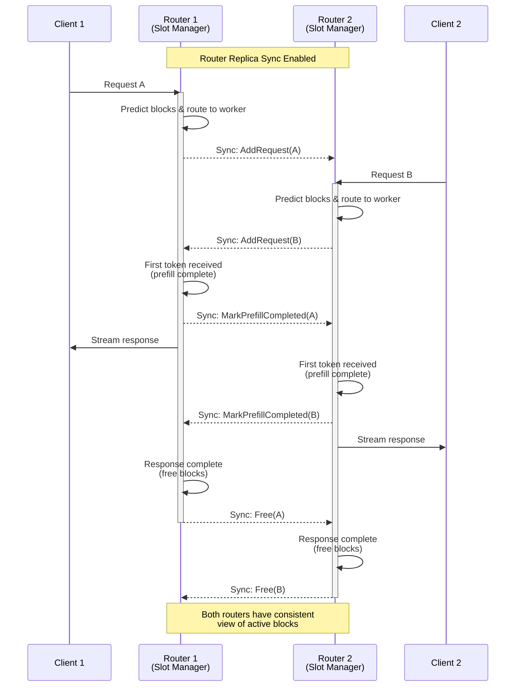

本文描述 Dynamo KV Router 的内部架构，包括 block 跟踪机制、KV 缓存优化体系、事件处理以及传输模式。

## KV Router 架构

KV Router 会为每个 worker 跟踪两个关键指标：

1. **潜在活跃 block 数（Potential Active Blocks）**：如果把请求路由到该 worker，该 worker 用于 decode 的 block 总数。它包含已存在的活跃 block，也包含来自新请求的新增 block。

2. **潜在新增 prefill block 数（Potential New Prefill Blocks）**：在该 worker 上需要从零开始计算的 token 数量，计算方式如下：
   - 新增 prefill token = 输入 token 总数 −（重叠 block 数 × Block 大小）
   - 潜在 prefill block 数 = 新增 prefill token / Block 大小

### Block 跟踪机制

Router 通过两套互补的系统来维护 block 信息：

- **活跃 decoding block（Active Decoding Blocks）**：由 Router 在请求生命周期内本地跟踪：
  - 添加新请求时累加
  - 在 token 生成过程中更新
  - 请求完成时减少

- **缓存 block（Cached Blocks）**：由 KvIndexer 全局维护，使用一棵基于各 worker 上报 KV 事件构建的前缀树（prefix tree）。它为路由决策提供准确的重叠信息。

## 请求处理全链路时序

下图描述一个 `generate` 请求进入 KV Router 后，从「选 worker → 下发 → 流式返回 → 收尾」的完整调用链，粒度到具体的 struct 与方法（标注 `文件 L行号`，未标文件的均在 `push_router.rs`）。入口是 `KvPushRouter` 对 `AsyncEngine` trait 的实现（类比 Spring 里一个实现了统一 `generate` 接口的处理器）。

### 关键调用点说明

- **入口与早返回**：`KvPushRouter::generate`（`push_router.rs:490`）是唯一入口。带 `query_instance_id` 注解的「查询请求」只做匹配、不更新任何状态，在 `push_router.rs:611` 直接返回 worker 选择。
- **选 worker 的两层委托**：`KvPushRouter::select_worker`（`:292`）→ `KvRouter::find_best_match_details`（`kv_router.rs:467`）。`KvRouter` 持有 `indexer` 与 `scheduler` 两个字段（`kv_router.rs:283-284`），分别负责「缓存重叠查询」和「负载调度选 worker」。
- **前缀树匹配**：`Indexer::find_matches_by_tier`（`indexer/mod.rs:182`）查 device 层主前缀树并合并低层 tier，底层走 `KvIndexer::find_match_details` 或并发版 `ConcurrentRadixTree`，返回每个 worker 的重叠 block 数。
- **代价与采样**：调度通过 `LocalScheduler::schedule`（`local.rs:173`）把 `SchedulingRequest` 投入 `SchedulerQueue`（`local.rs:215`）并 await 一个 oneshot channel；真正的 worker 选择在队列的 `admit_one` 中调用 `DefaultWorkerSelector::select_worker`（`selector.rs:183`），按 `cost = overlap_score_weight * prefill_blocks + decode_blocks` 评分，`router_temperature` 非零时用 `softmax_sample` 引入随机性。
- **下发 RPC**：`PushRouter::direct(request, instance_id)`（`push_router.rs:686`，来自 `dynamo_runtime`）把请求 RPC 给选定的 worker instance，返回响应流。
- **生命周期 drop guard**：`RequestGuard`（`push_router.rs:63`）在 `direct()` 之前构造，确保即使 `direct()` 报错或流被提前丢弃，`Drop`（`:217`）也会兜底调用 `KvRouter::free` 与会话关闭，避免泄漏调度槽位与 worker 会话。
- **流式回调三件事**：`RequestGuard::on_item`（`:91`）在收到首个含 token 的 item 时触发 `mark_prefill_completed`（标志 prefill→decode），记录首 token TTFT，并在输出跨越新 block 时调用 `add_output_block` 更新 decode 负载。
- **收尾**：流结束后 `RequestGuard::finish`（`:171`）记录指标并调用 `KvRouter::free`（`kv_router.rs:722`）→ `LocalScheduler::free`（`local.rs:237`）→ `slots.free` + `queue.update`，释放 block 并更新引用计数。
- **副本同步**：`mark_prefill_completed` / `free` / `add_request` 落到 `slots`（`RuntimeSequencePublisher` 封装的 `ActiveSequencesMultiWorker`）时，会经 NATS 向其它 Router 副本广播 `AddRequest` / `MarkPrefillCompleted` / `Free` 事件（详见下文「Router 之间的通信」）。

## KV Cache Router

当今主流的大语言模型（LLM）大多是自回归的，并基于 [transformer 架构](https://proceedings.neurips.cc/paper_files/paper/2017/file/3f5ee243547dee91fbd053c1c4a845aa-Paper.pdf) 构建。一项关键的推理优化技术是把已经计算过的 key/value 缓存起来供后续 token 复用，这就是 [KV Cache](https://developer.nvidia.com/blog/mastering-llm-techniques-inference-optimization/#key-value_caching)。

### KV 缓存路由与负载均衡

Router 使用一个综合考虑 prefill 成本（受缓存 block 数影响）与 decode 负载的代价函数，从而做出最优路由决策。

#### 代价计算

1. **Prefill block 数**：把需要做 prefill 的 token 数除以 block 大小得到。系统会基于输入 token 与每个 worker 上可用的缓存 block 进行预估，并在收到首个输出 token（标志 prefill 完成）时更新计数。

2. **Decode block 数**：根据请求的输入 token 与每个 worker 当前的活跃序列估算。请求结束并释放 block 后会更新计数。

3. **代价公式**：`cost = overlap_score_weight * prefill_blocks + decode_blocks`
   - 代价越低意味着路由越优
   - `overlap_score_weight` 用于在“缓存命中优化”和“负载均衡”之间做权衡
   - 权重越高越偏向缓存复用（提升 TTFT），越低越偏向均衡负载（提升 ITL）

#### Worker 选择

Router 选择代价最低的 worker。当 `router_temperature` 设为非零值时，Router 会在归一化后的代价 logits 上做 softmax 采样，引入一定随机性，有助于负载分散。

`overlap_score_weight = 1.0` 时的示例：
- Worker 1：cost = 1.0 * 8 + 10 = 18
- **Worker 2：cost = 1.0 * 5 + 5 = 10**（被选中——代价最低）
- Worker 3：cost = 1.0 * 2 + 9 = 11

### KV 缓存优化

每个推理框架在每个 worker 上都会有 KV Cache。一个流行的推理框架库是 [vLLM](https://github.com/vllm-project/vllm)，其关键贡献是 [PagedAttention](https://arxiv.org/abs/2309.06180)，通过把请求切分为 block 来高效管理 KV Cache。

另一个流行的推理框架 [SGLang](https://github.com/sgl-project/sglang) 贡献了 [RadixAttention](https://arxiv.org/abs/2312.07104)，引入了一棵前缀树来高效完成 KV Cache block 的匹配、插入和淘汰。这种前缀树结构推广了 KV Cache 复用。

在 Dynamo 中，我们引入了一个 KVPublisher（用于在每个 worker 上发出 KV Cache 事件）和一个 KVIndexer（用于在全局范围内跟踪这些事件）。

### KV Block 管理流程

为了对“开启了 KV Cache 复用的单个 worker 内 KV Cache 是如何工作的，以及 KVPublisher 在哪里接入”有一个直观的认识，我们走一遍 KV Block 管理流程：

1. **请求 tokenization**：把输入 prompt 转成 token。
2. **Block 划分**：把 token 序列切成固定大小的 block（例如每个 block 16 或 64 个 token）。
3. **Block 哈希**：对每个 block 计算哈希，作为唯一标识。当启用了 LoRA 适配器时，适配器名会一并参与哈希，使得不同适配器下的 block 产生不同的标识。
4. **缓存查找**：
    - 对每个 block，系统检查 KV cache 中是否已有匹配 block
    - 若找到匹配，则直接复用现有的 KV cache block
    - 若没找到，则进入下一步
5. **资源分配**：
    - 对没有匹配的 block，系统尝试分配新内存
    - 若内存充足，则完成分配并跳到第 7 步
    - 若内存紧张，则进入第 6 步
6. **缓存淘汰**（必要时）：
    - 系统按淘汰策略（如 LRU、LFU）选出待淘汰的 block
    - 这些 block 从缓存中被淘汰
    - **KVPublisher 发出 KV removed 事件，通知 KVIndexer 该 block 已被移除。**
    - 也有些系统会把使用频率较低的 block 卸载到 CPU 内存。
7. **KV 计算**：
    - 对新增 block，模型计算 key/value 张量
    - 这些张量被存入新分配的 cache block
    - **KVPublisher 发出 KV stored 事件，通知 KVIndexer 有新 block 被存入。**

更多细节可参考：[SGLang](https://lmsys.org/blog/2024-01-17-sglang/)、[TRT-LLM](https://developer.nvidia.com/blog/introducing-new-kv-cache-reuse-optimizations-in-nvidia-tensorrt-llm/) 和 [vLLM](https://docs.vllm.ai/en/latest/design/automatic_prefix_caching.html#design-automatic-prefix-caching)。

## 事件

### KVPublisher

KVPublisher 可以在推理框架中、即“分配/移除 block 的位置”进行初始化和调用。

事件分为两类：
- KV stored 事件
- KV removed 事件

可以通过 Python 绑定来初始化和使用 KVPublisher。

### 确定性事件 ID

引擎并不强制要求在 KV 事件中发出确定性 block 标识，因为 Router 使用基于 token 内容的本地 block 哈希来跨 worker 跟踪与匹配 block。但仍然强烈建议引擎发出确定性 block 标识，这样能让 KvIndexer 内部的查找表更小、更高效。要保证确定性行为，所有 worker 应使用相同的引擎版本与配置。如果你的引擎在事件 ID 上依赖了 Python 内置的 `hash()`，请设置 `PYTHONHASHSEED=0`；否则该设置无效。

### KVIndexer

KVIndexer 在一棵前缀树中构建并维护“缓存 block 的全局视图”。我们对原始前缀树做了修改：在每个节点上额外存储了 worker id，以便能够返回每个 worker 各自匹配到的 block 数量。

KVIndexer 提供 `find_matches_for_request` 方法：以 token 作为输入，返回一个字典，key 是 worker id，value 是匹配到的 KV block 数。

KVIndexer 支持两种后端实现，通过 `--router-event-threads` 选择：

- **单线程 RadixTree**（`--router-event-threads 1`）：事件在一个专用的单线程 tokio runtime 中通过 channel 调度处理。同时支持基于 TTL 的过期机制，用于 `--no-router-kv-events` 近似模式。

- **ConcurrentRadixTree**（默认，`--router-event-threads N`，N > 1）：线程安全的 radix tree，配合一个由 N 个 worker 线程组成的池来处理事件以及近似路由决策的写入（默认 4）。使用 sticky worker routing：同一个 worker 的事件或合成的近似写入始终由同一个线程处理，从而保证“按 worker 序列化”。读操作（`find_matches`）可以与写操作并发执行。

### Router 之间的通信

在多 Router 的分布式部署中，每个 Router 只能看到全部请求中的一部分。为保证一致的路由决策，Router 之间通过三类事件同步状态：

1. **AddRequest**：在请求被分配给某个 worker 时通知其它 Router。包含请求 ID、worker ID、token 序列对应的 block 以及重叠分数（overlap score），用以跟踪整个系统范围内的 block 占用情况。

2. **MarkPrefillCompleted**：表示某请求从 prefill 进入 decode 阶段，使其它 Router 在计算 worker 负载时排除掉已完成的 prefill token。

3. **Free**：表示请求已结束、资源已释放，使所有 Router 都能维护正确的 block 引用计数。

每条事件都携带一个唯一的 router ID，避免自我处理自己的事件。这套异步通信机制在多 Router 处理不同请求流的情况下，仍能维持一致的 KV cache 状态视图，从而保证最优的路由决策。

## 事件传输模式

Router 支持两种 KV cache 状态同步的事件传输模式：

- **NATS Core / Event Plane + Local Indexer（默认）**：fire-and-forget 的发布/订阅模式，worker 在本地维护 radix tree（默认开启）。Router 启动时通过查询 worker 重建状态。延迟更低、配置更简单。同时兼容 NATS Core 与 ZMQ 两种 event plane。

- **JetStream**（在 frontend **与** worker **两侧** 都加上 `--durable-kv-events`）：基于持久化事件流 + 持久消费者。状态借助 NATS object store 的快照在 Router 重启间得以保留。适合需要多副本一致性的生产部署。**重要：** frontend 与所有 worker 必须都指定 `--durable-kv-events`，JetStream 模式才能正常工作。

### JetStream 模式（按需启用）

KV 事件被发送到一个持久化的 NATS JetStream 中。每个 KV Router/Indexer 副本作为持久消费者从这一共享流中拉取消息。这种架构在 Router 副本之间保证一致性，并在重启之间保持持久性。

- **适用场景**：需要持久化与多副本 Router 一致性的生产部署
- **取舍**：需要先搭建 JetStream；由于持久化保证，延迟会略有增加
- **如何启用**：在 frontend **和** 所有 worker **两侧** 都加上 `--durable-kv-events` 开关

> [!Note]
> **frontend 与 worker 必须都指定 `--durable-kv-events`**，JetStream 模式才能正确工作。frontend 用该开关从 JetStream 消费，worker 用它把事件发布到 JetStream 而不是本地 indexer。

### NATS Core / Event Plane + Local Indexer（默认）

默认情况下 worker 启用了 local indexer。每个 worker 维护一棵自己的本地 radix tree（local indexer），并通过通用的 event plane 发布事件（取决于 `--event-plane`，是 NATS Core 还是 ZMQ）。每个 worker 为自己的事件分配单调递增的事件 ID。Router 会检测事件序列中的间隙（gap），并通过直接查询该 worker 的 local indexer 来补回丢失的事件。

- **适用场景**：低延迟场景；不引入 JetStream 的简化部署；单 Router 场景；不使用 NATS（改用 ZMQ event plane）的部署
- **取舍**：状态保存在 worker 上（非集中式）；恢复依赖 worker 可用
- **切换到 JetStream**：在 worker 端（SGLang、TRT-LLM、vLLM、mocker）**与** frontend **两侧** 都加上 `--durable-kv-events`

**间隙检测的工作方式：**
1. 每个 worker 从 0 开始为事件分配单调递增的 ID
2. Router 为每个 worker 跟踪“最近收到的事件 ID”
3. 当收到的事件满足 `event_id > last_id + 1` 时，Router 认为出现了间隙
4. Router 向该 worker 的 local indexer 查询缺失区间 `[last_id+1, event_id-1]`
5. 当发现一个新 worker（Added 事件）时，Router 会把该 worker 的 local indexer 全量状态拉过来

**启动行为：**
- 发现某 worker 时，Router 查询并摄入它的完整 local indexer 状态
- 移除某 worker 时，Router 把它在全局 radix tree 中的 block 全部删除

>[!Note]
> 默认情况下所有 worker 都是 `enable_local_indexer=true`，因此 Router 使用“NATS Core / Event Plane + local indexer”模式。要改用 JetStream 模式，请在 frontend 和所有 worker **两侧** 都指定 `--durable-kv-events`。

### 本地活跃 block 管理与副本同步

除了缓存 block，每个 Router 副本还需要把“活跃 block”（正在用于生成的 block）作为负载指标进行跟踪。由于这类信息对时效性极敏感，需要在以下时机立即预测：
- Router 收到并路由请求时
- 生成首个 token（prefill 完成）时
- 响应结束（请求被释放）时

这部分信息由每个 Router 内部的“slot manager”负责本地管理。为了在系统范围内保持一致，Router 副本之间通过 NATS core 消息同步这些本地预测。

这种双层结构——通过 JetStream 维护持久化的全局 KV cache 状态，通过 Router 副本之间同步瞬时的活跃 block 信息——使系统能够做出在“缓存复用”和“负载分布”之间取得平衡的最优路由决策。

## 参见

- **[Router README](../components/router/README.md)**：KV Router 快速上手指南
- **[配置与调优](../components/router/router-configuration.md)**：Router 启动参数、调优与生产部署
- **[Router 示例](../components/router/router-examples.md)**：Python API 用法与自定义路由模式
- **[为自定义引擎发布 KV 事件](../integrations/kv-events-custom-engines.md)**：把自定义推理引擎接入 KV 感知路由
