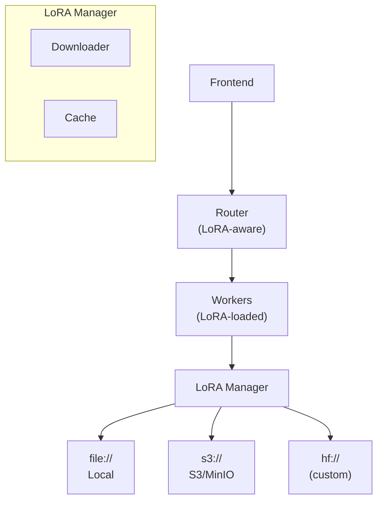

LoRA（Low-Rank Adaptation）让你能够高效地微调与服务专用模型变体，而无需复制完整的模型权重。Dynamo 内置支持 LoRA 适配器（adapter）的动态加载、缓存以及推理（inference）路由。

## 后端（Backend）支持

| 后端 | 状态 | 说明 |
|---------|--------|-------|
| vLLM | ✅ | 完整支持，包括 KV 感知路由 |
| SGLang | 🚧 | 进行中 |
| TensorRT-LLM | ❌ | 暂未支持 |

完整兼容性细节见 [Feature Matrix](../../reference/feature-matrix.md)。

## 概览

Dynamo 的 LoRA 实现提供：

- **动态加载**：运行时加载与卸载 LoRA 适配器，无需重启 worker
- **多种来源**：可从本地文件系统（`file://`）、S3 兼容存储（`s3://`）或 Hugging Face Hub（`hf://`）加载
- **自动缓存**：下载的适配器会被本地缓存，避免重复下载
- **服务发现集成**：已加载的 LoRA 会自动注册，可通过 `/v1/models` 发现
- **KV 感知路由**：把请求路由到已加载相应 LoRA 的 worker
- **Kubernetes 原生**：通过 `DynamoModel` CRD 进行声明式 LoRA 管理

### 架构



LoRA 系统由以下部分组成：

- **Rust 核心**（`lib/llm/src/lora/`）：高性能的下载、缓存与校验
- **Python 管理器**（`components/src/dynamo/common/lora/`）：可扩展的封装层，支持自定义来源
- **Worker 处理器**（`components/src/dynamo/vllm/handlers.py`）：加载/卸载 API 与推理集成

## 快速开始

### 前置条件

- 已安装并启用 vLLM 支持的 Dynamo
- 使用 S3 来源时：已配置 AWS 凭据
- 一个与你的基础模型兼容的 LoRA 适配器

### 本地开发

**1. 启动带 LoRA 支持的 Dynamo：**

```bash
# Start vLLM worker with LoRA flags
DYN_SYSTEM_ENABLED=true DYN_SYSTEM_PORT=8081 \
    python -m dynamo.vllm --model Qwen/Qwen3-0.6B --enforce-eager \
    --enable-lora \
    --max-lora-rank 64
```

**2. 加载一个 LoRA 适配器：**

```bash
curl -X POST http://localhost:8081/v1/loras \
  -H "Content-Type: application/json" \
  -d '{
    "lora_name": "my-lora",
    "source": {
      "uri": "file:///path/to/my-lora"
    }
  }'
```

**3. 用该 LoRA 进行推理：**

```bash
curl -X POST http://localhost:8000/v1/chat/completions \
  -H "Content-Type: application/json" \
  -d '{
    "model": "my-lora",
    "messages": [{"role": "user", "content": "Hello!"}],
    "max_tokens": 100
  }'
```

### S3 兼容存储

生产部署时，把 LoRA 适配器存放到 S3 兼容存储：

```bash
# Configure S3 credentials
export AWS_ACCESS_KEY_ID=your-access-key
export AWS_SECRET_ACCESS_KEY=your-secret-key
export AWS_ENDPOINT=http://minio:9000  # For MinIO
export AWS_REGION=us-east-1

# Load LoRA from S3
curl -X POST http://localhost:8081/v1/loras \
  -H "Content-Type: application/json" \
  -d '{
    "lora_name": "customer-support-lora",
    "source": {
      "uri": "s3://my-loras/customer-support-v1"
    }
  }'
```

## 配置

### 环境变量

| 变量 | 描述 | 默认值 |
|----------|-------------|---------|
| `DYN_LORA_ENABLED` | 启用 LoRA 适配器支持 | `false` |
| `DYN_LORA_PATH` | 下载的 LoRA 在本地的缓存目录 | `~/.cache/dynamo_loras` |
| `AWS_ACCESS_KEY_ID` | S3 access key（用于 `s3://` URI） | - |
| `AWS_SECRET_ACCESS_KEY` | S3 secret key（用于 `s3://` URI） | - |
| `AWS_ENDPOINT` | 自定义 S3 endpoint（如 MinIO） | - |
| `AWS_REGION` | AWS region | `us-east-1` |
| `AWS_ALLOW_HTTP` | 允许 HTTP（非 TLS）连接 | `false` |

### vLLM 参数

| 参数 | 描述 |
|----------|-------------|
| `--enable-lora` | 在 vLLM 中启用 LoRA 适配器支持 |
| `--max-lora-rank` | 最大 LoRA rank（必须 ≥ 你的 LoRA 的 rank） |
| `--max-loras` | 同时加载的 LoRA 最大数量 |

## 后端 API 参考

### 加载 LoRA

从源 URI 加载一个 LoRA 适配器。

```text
POST /v1/loras
```

**请求：**
```json
{
  "lora_name": "string",
  "source": {
    "uri": "string"
  }
}
```

**响应：**
```json
{
  "status": "success",
  "message": "LoRA adapter 'my-lora' loaded successfully",
  "lora_name": "my-lora",
  "lora_id": 1207343256
}
```

### 列出 LoRA

列出所有已加载的 LoRA 适配器。

```text
GET /v1/loras
```

**响应：**
```json
{
  "status": "success",
  "loras": {
    "my-lora": 1207343256,
    "another-lora": 987654321
  },
  "count": 2
}
```

### 卸载 LoRA

从 worker 卸载一个 LoRA 适配器。

```text
DELETE /v1/loras/{lora_name}
```

**响应：**
```json
{
  "status": "success",
  "message": "LoRA adapter 'my-lora' unloaded successfully",
  "lora_name": "my-lora",
  "lora_id": 1207343256
}
```

## Kubernetes 部署

在 Kubernetes 部署中，使用 `DynamoModel` 自定义资源（Custom Resource）以声明式方式管理 LoRA 适配器。

### DynamoModel CRD

```yaml
apiVersion: nvidia.com/v1alpha1
kind: DynamoModel
metadata:
  name: customer-support-lora
  namespace: dynamo-system
spec:
  modelName: customer-support-adapter-v1
  baseModelName: Qwen/Qwen3-0.6B  # Must match modelRef.name in DGD
  modelType: lora
  source:
    uri: s3://my-models-bucket/loras/customer-support/v1
```

### 工作原理

当你创建一个 `DynamoModel` 时：

1. **发现 endpoint**：找出运行 `baseModelName` 的所有 pod
2. **创建 service**：自动创建一个 Kubernetes Service
3. **加载 LoRA**：在每个 endpoint 上调用 LoRA 加载 API
4. **更新状态**：报告哪些 endpoint 已就绪

### 验证部署

```bash
# Check LoRA status
kubectl get dynamomodel customer-support-lora

# Expected output:
# NAME                    TOTAL   READY   AGE
# customer-support-lora   2       2       30s
```

完整 Kubernetes 部署细节请参见：
- [使用 DynamoModel 管理模型](../../kubernetes/deployment/dynamomodel-guide.md)
- [Kubernetes LoRA 部署示例](https://github.com/ai-dynamo/dynamo/tree/main/examples/backends/vllm/deploy/lora/README.md)

## 示例

| 示例 | 描述 |
|---------|-------------|
| [本地 LoRA + MinIO](https://github.com/ai-dynamo/dynamo/tree/main/examples/backends/vllm/launch/lora/README.md) | 配合 S3 兼容存储的本地开发 |
| [Kubernetes LoRA 部署](https://github.com/ai-dynamo/dynamo/tree/main/examples/backends/vllm/deploy/lora/README.md) | 使用 DynamoModel CRD 的生产部署 |

## 故障排查

### LoRA 加载失败

**检查 S3 连通性：**
```bash
# Verify LoRA exists in S3
aws --endpoint-url=$AWS_ENDPOINT s3 ls s3://my-loras/ --recursive
```

**检查缓存目录：**
```bash
ls -la ~/.cache/dynamo_loras/
```

**查看 worker 日志：**
```bash
# Look for LoRA-related messages
kubectl logs deployment/my-worker | grep -i lora
```

### 加载后找不到模型

- 确认 LoRA 名称完全匹配（大小写敏感）
- 检查 LoRA 是否在列表中：`curl http://localhost:8081/v1/loras`
- 确认服务发现注册成功（查看 worker 日志）

### 推理返回的是基础模型的输出

- 确认请求里的 `model` 字段与 `lora_name` 一致
- 检查处理你请求的 worker 上是否真的加载了该 LoRA
- 在解耦（disaggregated）服务下，确保 prefill 与 decode worker 都加载了该 LoRA

## KV 缓存感知的 LoRA 路由

启用 KV 感知路由时，router 在计算 block hash 时会自动把 LoRA 适配器身份纳入考虑。这意味着：

- **每个 adapter 拥有独立的哈希空间**：即使 token 序列相同，缓存在 adapter `A` 下的 block 永远不会与 adapter `B` 或基础模型的 block 混淆。adapter 名字会被混入 `LocalBlockHash` 的计算。
- **同一 adapter 内自动复用前缀**：针对同一 LoRA adapter 的请求与基础模型请求一样，能享受 KV 缓存前缀匹配。
- **无需额外配置**：LoRA 名字会自动通过 KV 事件（`BlockStored`）从引擎传到 router。router 使用事件中的 `lora_name` 字段，把 LoRA 请求路由到拥有匹配缓存 block 的 worker。

整条链路（发布器流水线、用于去重的 KV consolidator、路由查询路径）均端到端支持。

## 另见

- [Feature Matrix](../../reference/feature-matrix.md) - 后端兼容性概览
- [vLLM 后端](../../backends/vllm/README.md) - vLLM 专属配置
- [Dynamo Operator](../../kubernetes/dynamo-operator.md) - Kubernetes operator 概览
- [路由概念](../../components/router/router-concepts.md) - LoRA 感知的请求路由
- [自定义引擎的 KV 事件](../../integrations/kv-events-custom-engines.md) - 发布 LoRA 感知的 KV 事件
