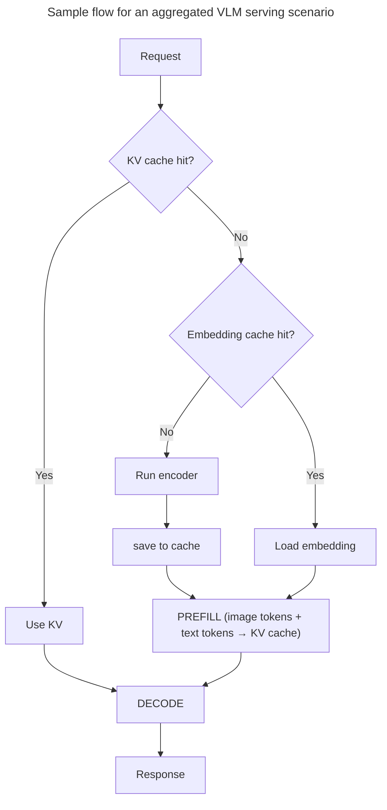

Dynamo 在多个 LLM 后端之间支持多模态推理，使模型可以在文本之外处理图像、视频和音频。

<Warning>
**安全要求**：多模态处理必须在启动时显式启用。所需的标志请参阅各后端文档（[vLLM](multimodal-vllm.md)、[SGLang](multimodal-sglang.md)、[TRT-LLM](multimodal-trtllm.md)）。这可避免无意中处理来自不可信来源的多模态数据。
</Warning>

## 关键特性

Dynamo 通过以下特性来改善视觉与语言工作负载的延迟和吞吐量。这些特性可根据工作负载特征单独使用或组合使用：
| 特性 | 描述 |
|---------|-------------|
| **[嵌入缓存](embedding-cache.md)** | CPU 侧 LRU 缓存，跳过重复图像的重新编码 |
| **[编码器分离](encoder-disaggregation.md)** | 独立的视觉编码器 worker，便于独立扩缩容 |
| **[多模态 KV 路由](multimodal-kv-routing.md)** | 多模态感知的 KV 缓存路由，用于最优 worker 选择 |

## 支持矩阵

| 技术栈 | 图像 | 视频 | 音频 |
|-------|-------|-------|-------|
| **[vLLM](https://github.com/ai-dynamo/dynamo/blob/main/docs/features/multimodal/multimodal-vllm.md)** | ✅ | 🧪  | 🧪 |
| **[TRT-LLM](https://github.com/ai-dynamo/dynamo/blob/main/docs/features/multimodal/multimodal-trtllm.md)** | ✅ | ❌ | ❌ |
| **[SGLang](https://github.com/ai-dynamo/dynamo/blob/main/docs/features/multimodal/multimodal-sglang.md)** | ✅ | 🧪 | ❌ |

**状态：** ✅ 支持 | 🧪 实验性 | ❌ 不支持

## 安全：URL 校验

所有多模态 loader 的远程获取都通过共享的 URL 策略
（`dynamo.common.multimodal.url_validator`）进行。默认仅允许
`https://` 与 `data:` URL，私有 / 内部 IP 被屏蔽，
本地文件访问被禁用。每一次 HTTP 重定向都会再次按照该策略校验。

两个环境变量可在非公开部署中放宽默认设置：

| 变量 | 默认值 | 效果 |
|----------|---------|--------|
| `DYN_MM_ALLOW_INTERNAL` | `0` | 设为 `1` 时允许 `http://`、私有 / 内部 IP，以及显式端口。适用于媒体位于内部网络的本地或私有部署。 |
| `DYN_MM_LOCAL_PATH` | *(空)* | 绝对目录前缀。设置后，`file://` URI 与裸路径可解析至该前缀内时被允许。 |

<Warning>
**绝不要在面向公网的部署中设置 `DYN_MM_ALLOW_INTERNAL=1`。** 这会暴露 SSRF 路径，使得云元数据端点（AWS IMDS、GCE、Azure）和其他内部服务可被访问。
</Warning>

## 示例工作流程

部署多模态模型的参考实现：

- [vLLM 多模态示例](https://github.com/ai-dynamo/dynamo/tree/main/examples/backends/vllm/launch)（图像、视频）
- [TRT-LLM 多模态示例](https://github.com/ai-dynamo/dynamo/tree/main/examples/backends/trtllm/launch)
- [SGLang 多模态示例](https://github.com/ai-dynamo/dynamo/tree/main/examples/backends/sglang/launch)

## 后端文档

各后端的详细部署指南、配置与示例：

- **[vLLM 多模态](https://github.com/ai-dynamo/dynamo/blob/main/docs/features/multimodal/multimodal-vllm.md)**
- **[TensorRT-LLM 多模态](https://github.com/ai-dynamo/dynamo/blob/main/docs/features/multimodal/multimodal-trtllm.md)**
- **[SGLang 多模态](https://github.com/ai-dynamo/dynamo/blob/main/docs/features/multimodal/multimodal-sglang.md)**
