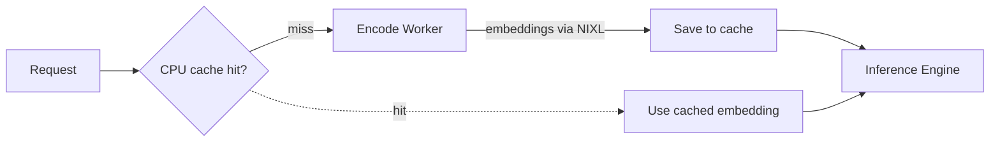

## 概述

嵌入缓存是一个 CPU 侧的 LRU 缓存，用于存储视觉编码器的输出。当多个请求中出现同一张图像时，会复用缓存的嵌入而无需再次运行视觉编码器。这降低了编码器的 GPU 负载，并降低了重复图像的延迟。
> 注意：此特性也可被称为 **encoder cache**（编码器缓存）。嵌入缓存与 KV 缓存是分开的，KV 缓存在预填充后复用注意力 key/value 状态以跳过预填充直接进入解码阶段。关于 KV 缓存复用与路由，请参阅 [Multimodal KV Routing](https://github.com/ai-dynamo/dynamo/blob/main/docs/features/multimodal/multimodal-kv-routing.md)。
## 何时使用

当工作负载在不同请求间存在重复图像时使用嵌入缓存。常见场景：

- 商品目录查询，用户对同一商品图片进行多次提问
- 引用共享图表或图形的文档处理流水线
- 在多轮对话中讨论同一张图片的会话，例如代码生成场景中的架构图

如果工作负载完全由唯一图像组成，缓存不会带来收益。

## 支持矩阵

| 后端 | 聚合式 | 分离式（E/PD） | 备注 |
|---------|------------|----------------------|-------|
| **vLLM** | ✅ | ✅ | 聚合式使用 vLLM 原生 `ec_both`；分离式使用 Dynamo `EmbeddingCacheManager` |
| **TRT-LLM** | ❌ | ✅ | 在 PD worker 中使用 Dynamo `MultimodalEmbeddingCacheManager` |
| **SGLang** | ❌ | ❌ | 暂不支持 |

此支持需要 vLLM `0.17.0` 或更高版本。

## 工作原理

预填充 worker 拥有 CPU 侧的 LRU 缓存。命中时，编码 worker 被完全跳过；未命中时，编码 worker 生成嵌入，通过 NIXL 传输，预填充 worker 将其保存到缓存中。



**启动（vLLM）：**

```bash
cd $DYNAMO_HOME/examples/backends/vllm
bash launch/disagg_multimodal_e_pd.sh --multimodal-embedding-cache-capacity-gb 10
```

**启动（TRT-LLM）：**

```bash
cd $DYNAMO_HOME/examples/backends/trtllm
./launch/disagg_e_pd.sh --multimodal-embedding-cache-capacity-gb 10
```

## 配置

| 参数 | 描述 | 默认值 |
|-----------|-------------|---------|
| `--multimodal-embedding-cache-capacity-gb` | CPU 侧 LRU 缓存大小（GB） | 0（禁用） |

请根据预期的唯一图像工作集大小设置容量。更大的缓存可容纳更多嵌入，但消耗更多主机内存。

更多细节请参阅各后端文档（[vLLM](https://github.com/ai-dynamo/dynamo/blob/main/docs/features/multimodal/multimodal-vllm.md#embedding-cache)、[TRT-LLM](https://github.com/ai-dynamo/dynamo/blob/main/docs/features/multimodal/multimodal-trtllm.md#embedding-cache)）。
