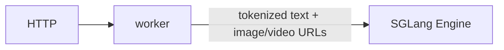
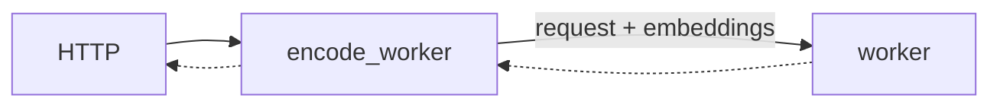
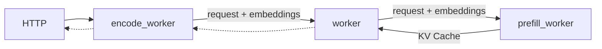

本文档全面介绍如何在 Dynamo 中通过 SGLang 后端进行多模态推理。SGLang 多模态支持 **EPD**、**E/PD** 与 **E/P/D** 三种流程，并在解耦（disaggregated）模式下使用 NIXL（RDMA）实现张量的零拷贝传输。

## 支持矩阵

| 模态 | 输入格式 | 聚合（Aggregated） | 解耦（Disaggregated） | 备注 |
|----------|--------------|------------|---------------|-------|
| **图像** | HTTP/HTTPS URL | 是 | 是 | 视觉编码器生成 embedding |
| **图像** | Data URL（Base64） | 否 | 否 |  |
| **视频** | HTTP/HTTPS/`file://` URL | 是 | 是 | 视觉编码器生成 embedding |
| **音频** | HTTP/HTTPS URL | 否 | 否 | SGLang 后端不支持 |

### 支持的 URL 格式

| 格式 | 示例 | 描述 |
|--------|---------|-------------|
| **HTTP/HTTPS** | `http://example.com/image.jpg` | 远程媒体文件 |
| **file://** | `file:///tmp/test.mp4` | 后端可访问的本地文件 |

## 部署模式

SGLang 支持 EPD、E/PD 与 E/P/D 模式。详细解释见 [Multimodal Architecture Patterns](README.md#architecture-patterns)。

| 模式 | 是否支持 | 启动脚本 | 备注 |
|---------|-----------|---------------|-------|
| EPD（简单聚合） | ✅ | `agg_vision.sh` | 内部编码 |
| E/PD（编码独立） | ✅ | `multimodal_epd.sh` | 视觉编码器独立 |
| E/P/D（完全解耦） | ✅ | `multimodal_disagg.sh` | KV 缓存通过 bootstrap |
| EP/D（传统解耦） | ❌ | 不适用 | 不支持 |

### 组件标志

| 组件 | 标志 | 用途 |
|-----------|------|---------|
| Encode Worker | `--multimodal-encode-worker` | 面向前端，负责视觉编码与 embedding 生成（Rust 前端做分词） |
| PD Worker | `--multimodal-worker` | 带 embedding 的 prefill + decode |
| Decode Worker | `--multimodal-worker --serving-mode=decode` | 解耦的入口 |
| Prefill Worker | `--multimodal-worker --serving-mode=prefill` | 由 Decode 调用，参与 bootstrap 协调 |

### SGLang 特有特性

- **Python 中的视觉编码器**：Encode worker 使用 SGLang 的 MMEncoder，对模型不敏感地完成视觉编码
- **Token 扩展**：单个 `<|image_pad|>` token 会根据 embedding 形状被替换为 N 个 token
- **NIXL 传输**：embedding 通过 NIXL 从 Encoder → PD Worker 传输
- **没有 Rust 处理**：分词与图像处理全部发生在 Python 中

## 使用最新发布版本

建议使用 dynamo 的最新稳定版本以避免 breaking change：

[](https://github.com/ai-dynamo/dynamo/releases/latest)

可在 [latest release](https://github.com/ai-dynamo/dynamo/releases/latest) 找到最新版本，并通过以下命令切到对应分支：

```bash
git checkout $(git describe --tags $(git rev-list --tags --max-count=1))
```

## EPD 服务（简单聚合）

### 组件

- worker：[DecodeWorkerHandler](https://github.com/ai-dynamo/dynamo/blob/main/components/src/dynamo/sglang/request_handlers/llm/decode_handler.py) 在同一进程中处理 encode、prefill 与 decode。

### 流程

`DecodeWorkerHandler` 接收带有图像/视频 URL 的多模态请求，并直接交给 SGLang 的 engine。SGLang 内部 `mm_data_processor` 负责图像/视频的获取、加载、编码与 token 扩展。



### 启动

```bash
cd $DYNAMO_HOME/examples/backends/sglang
./launch/agg_vision.sh --model-path Qwen/Qwen2-VL-7B-Instruct
```

**客户端：**

```bash
curl http://localhost:8000/v1/chat/completions \
  -H "Content-Type: application/json" \
  -d '{
    "model": "Qwen/Qwen2.5-VL-7B-Instruct",
    "messages": [
      {
        "role": "user",
        "content": [
          {
            "type": "text",
            "text": "Explain why Roger Federer is considered one of the greatest tennis players of all time"
          },
          {
            "type": "image_url",
            "image_url": {
              "url": "http://images.cocodataset.org/test2017/000000155781.jpg"
            }
          }
        ]
      }
    ],
    "max_tokens": 50,
    "stream": false
  }' | jq
```

视频请求走相同的聚合路径：

```bash
curl http://localhost:8000/v1/chat/completions \
  -H "Content-Type: application/json" \
  -d '{
    "model": "Qwen/Qwen2-VL-7B-Instruct",
    "messages": [
      {
        "role": "user",
        "content": [
          {
            "type": "text",
            "text": "Describe the video in detail"
          },
          {
            "type": "video_url",
            "video_url": {
              "url": "https://samplelib.com/mp4/sample-5s.mp4"
            }
          }
        ]
      }
    ],
    "max_tokens": 50,
    "stream": false
  }' | jq
```

## E/PD 服务（编码独立）

### 组件

- workers：
  - [MultimodalEncodeWorkerHandler](https://github.com/ai-dynamo/dynamo/blob/main/components/src/dynamo/sglang/request_handlers/multimodal/encode_worker_handler.py) 负责图像编码与 embedding 生成
  - [MultimodalWorkerHandler](https://github.com/ai-dynamo/dynamo/blob/main/components/src/dynamo/sglang/request_handlers/multimodal/worker_handler.py) 负责 prefill 与 decode。

### 流程

Rust 前端对请求做分词并把图像 URL 提取到 `multi_modal_data`。`MultimodalEncodeWorker` 接收预分词的请求，下载并编码图像，将 embedding 传给 MultimodalWorker。完成事件通过 NATS 发送，而 embedding 张量通过 NIXL 接口经 RDMA 传输。`MultimodalWorker` 然后在同一引擎中完成 prompt 的 prefill 与 decode，与 [LLM 聚合服务](../../backends/sglang/README.md) 示例一致。仅 encode worker 作为可用 endpoint 注册到 Dynamo 前端。PD worker 不注册 —— 它是内部组件，通过 NATS 通信。




### 启动

```bash
cd $DYNAMO_HOME/examples/backends/sglang
./launch/multimodal_epd.sh
```

**客户端：**

```bash
curl http://localhost:8000/v1/chat/completions \
  -H "Content-Type: application/json" \
  -d '{
    "model": "Qwen/Qwen2.5-VL-7B-Instruct",
    "messages": [
      {
        "role": "user",
        "content": [
          {
            "type": "text",
            "text": "Explain why Roger Federer is considered one of the greatest tennis players of all time"
          },
          {
            "type": "image_url",
            "image_url": {
              "url": "http://images.cocodataset.org/test2017/000000155781.jpg"
            }
          }
        ]
      }
    ],
    "max_tokens": 50,
    "stream": false
  }' | jq
```

## E/P/D 服务（完全解耦）

### 组件

- workers：
  - [MultimodalEncodeWorkerHandler](https://github.com/ai-dynamo/dynamo/blob/main/components/src/dynamo/sglang/request_handlers/multimodal/encode_worker_handler.py) 负责图像编码与 embedding 生成
  - [MultimodalWorkerHandler](https://github.com/ai-dynamo/dynamo/blob/main/components/src/dynamo/sglang/request_handlers/multimodal/worker_handler.py) 负责 decode
  - [MultimodalPrefillWorkerHandler](https://github.com/ai-dynamo/dynamo/blob/main/components/src/dynamo/sglang/request_handlers/multimodal/worker_handler.py) 负责 prefill

### 流程

在 Qwen2.5-VL 等模型中，embedding 仅在 prefill 阶段需要。Rust 前端做分词并提取图像 URL。`MultimodalEncodeWorker` 接收预分词的请求，编码图像，并通过 NIXL 把 embedding 传给 Decode Worker（解耦的入口），后者再与 Prefill Worker 协调。Prefill Worker 处理 embedding 后将 KV 缓存转发回 Decode Worker，由其继续生成 token。



### 启动

```bash
cd $DYNAMO_HOME/examples/backends/sglang
./launch/multimodal_disagg.sh
```

**客户端：**

```bash
curl http://localhost:8000/v1/chat/completions \
  -H "Content-Type: application/json" \
  -d '{
    "model": "Qwen/Qwen2.5-VL-7B-Instruct",
    "messages": [
      {
        "role": "user",
        "content": [
          {
            "type": "text",
            "text": "Explain why Roger Federer is considered one of the greatest tennis players of all time"
          },
          {
            "type": "image_url",
            "image_url": {
              "url": "http://images.cocodataset.org/test2017/000000155781.jpg"
            }
          }
        ]
      }
    ],
    "max_tokens": 50,
    "stream": false
  }' | jq
```

## Bootstrap 协调

SGLang 解耦使用 bootstrap 机制完成 P->D 协调：

### 请求流（重要）

```text
Client → Frontend → Processor → Encode → DECODE Worker → Prefill Worker
                                               ↑
                                    Entry point for disaggregation!
```

### Bootstrap 过程

1. **Decode Worker** 收到来自 Encode Worker 的请求
2. **Decode Worker** 通过 NATS 调用 Prefill Worker 请求 bootstrap 信息
3. **Prefill Worker** 生成 `{host, port, room}` 并立刻返回
4. **两个 worker** 通过 bootstrap 坐标连接到同一个 "room"
5. **SGLang 内部** 经由 bootstrap 连接传输 KV 缓存状态（不走 NIXL）

### 与 vLLM 的关键区别

- vLLM：Frontend → Prefill → Decode（Prefill 是入口）
- SGLang：Frontend → Processor → Encode → **Decode → Prefill**（Decode 是入口）

## 组件间通信

### 控制流（NATS）

所有组件间通信都通过 NATS：

#### E/PD 模式（编码独立）

```text
Processor → Encode Worker → PD Worker
  (NATS)        (NATS + NIXL embeddings)
```

#### E/P/D 模式（完全解耦）

```text
Processor → Encode Worker → DECODE Worker → Prefill Worker
  (NATS)        (NATS)            (NATS)
                             ↓
                    Decode requests bootstrap
                             ↓
                    Prefill returns {host, port, room}
                             ↓
                    Both connect via bootstrap
                             ↓
                    SGLang internal KV cache transfer
```

### 详细消息流

```text
Processor → Encode Worker:
  - NATS round_robin with SglangMultimodalRequest
  - Contains: tokenized input_ids, image URL, sampling params

Encode Worker → Decode/PD Worker:
  - NATS round_robin to "backend" component
  - Contains: expanded token_ids, NIXL metadata, embeddings shape
  - NIXL transfer: embeddings tensor

Decode Worker → Prefill Worker (disagg only):
  - NATS call to "prefill" component
  - Decode requests bootstrap coordinates
  - Prefill returns: {bootstrap_host, bootstrap_port, bootstrap_room}

Prefill ↔ Decode (via bootstrap):
  - SGLang internal connection (not NATS)
  - KV cache state shared via bootstrap mechanism
```

### 数据传输（NIXL）

NIXL 仅用于 embedding 传输：

```python
# Encode Worker
descriptor = connect.Descriptor(precomputed_embeddings)
with connector.create_readable(descriptor) as readable:
    request.serialized_request = readable.metadata()
    await pd_worker_client.round_robin(request)
    await readable.wait_for_completion()

# PD Worker
embeddings = torch.empty(request.embeddings_shape, dtype=torch.float16)
descriptor = connect.Descriptor(embeddings)
read_op = await connector.begin_read(request.serialized_request, descriptor)
await read_op.wait_for_completion()
```

## 视觉编码细节

### Encode Worker 组件

encode worker 使用 SGLang 的 `MMEncoder`，对模型不敏感地完成视觉编码。`MMEncoder` 内部处理视觉模型加载、图像预处理与特征提取：

```python
from sglang.srt.disaggregation.encode_server import MMEncoder

self.encoder = MMEncoder(
    server_args=config.server_args,
    dist_init_method="tcp://127.0.0.1:0",
    rank=0,
)

# At request time:
image_grid_dim, mm_embedding = await self.encoder._encode([image_url])
```

### Token 扩展过程

1. Processor 插入单个 image token（例如 `<|image_pad|>`）
2. Encode worker 生成 embedding：`shape = (batch, num_patches, hidden_dim)`
3. Encode worker 把单个 token 替换为 `num_patches` 个 token
4. 下游 worker 收到扩展后的 token 序列

例如：

```python
# Before: ["Hello", "<|image_pad|>", "world"]
# After:  ["Hello", "<|image_pad|>", "<|image_pad|>", ...(576 tokens), "world"]
```

## Chat 模板处理

SGLang 使用其自身的 chat 模板系统：

```python
from sglang.srt.parser.conversation import chat_templates

conv = chat_templates["qwen2-vl"].copy()
conv.append_message(conv.roles[0], f"{conv.image_token} Describe this image")
processed = tokenizer(text=conv.get_prompt(), return_tensors="pt")
```

支持的模板：`qwen2-vl`、`llama-3`、`vicuna` 等。

## NIXL 使用

| 场景 | 是否使用 NIXL？ | 数据传输 | 备注 |
|----------|------------|---------------|-------|
| EPD（简单聚合） | 否 | 不适用 | 全部处理在 SGLang 内部完成 |
| E/PD（编码独立） | 是 | Encoder → PD（embedding） | 视觉编码器独立 |
| E/P/D（完全解耦） | 是 | Encoder → Prefill（embedding） | KV 缓存走 SGLang bootstrap |

**关键区别：** SGLang 的 P/D 使用 bootstrap 机制传输 KV 缓存，而不是像 vLLM 那样使用 NIXL。

## 环境变量

### `SGLANG_ENCODER_MM_LOAD_WORKERS`

控制 encoder 同时获取与加载图像所使用的线程数。当请求包含多张图像（URL、文件路径或 base64 数据）时，每张图在独立线程中加载。默认值 4。当瓶颈在图像加载（网络获取或磁盘 I/O）而非 GPU 计算时可增加该值。如果瓶颈是视觉编码器本身，则该值无效，因为所有图像加载完成后编码在 GPU 上是顺序进行的。

```bash
# Example: allow up to 16 concurrent image loads per encoder
export SGLANG_ENCODER_MM_LOAD_WORKERS=16
```

仅作用于 EPD 的 encode worker（其内部使用 [SGLang 的 MMEncoder](https://github.com/sgl-project/sglang/blob/main/python/sglang/srt/disaggregation/encode_server.py)）。

## Profiling

Dynamo 的 SGLang 多模态 worker 内置了用于 `nsys` 的 NVTX 标记。它们默认禁用（零开销），通过设置 `DYN_NVTX=1` 启用。

```bash
cd $DYNAMO_HOME/examples/backends/sglang
DYN_NVTX=1 nsys profile --trace=cuda,nvtx -o profile.nsys-rep \
  bash launch/multimodal_epd.sh ...
```

| 环境变量 | 默认 | 描述 |
|---|---|---|
| `DYN_NVTX` | `0` | 设为 `1` 以在多模态 encode/prefill/decode worker 路径中启用 NVTX range/mark 标注，便于 `nsys` profiling |

发出的关键 NVTX range：

| Range | Worker | 描述 |
|-------|--------|-------------|
| `mm:enc:generate` | Encode | 整个 encode 请求生命周期 |
| `mm:enc:vision_encode` | Encode | 视觉编码调用（`MMEncoder._encode`） |
| `mm:enc:embedding_transfer` | Encode | embedding 向下游 worker 的交接 |
| `mm:nixl:begin_read` | PD（聚合）/ Prefill | 启动 NIXL 对 embedding 的读取 |
| `mm:nixl:wait_completion` | PD（聚合）/ Prefill | 等待 NIXL embedding 传输完成 |
| `mm:pd:generate` | 聚合 worker / Decode worker（`MultimodalWorkerHandler`） | worker 侧整段请求生命周期 |
| `mm:pd:generate_agg` | PD（聚合） | 聚合生成路径 |
| `mm:pd:load_multimodal` | PD（聚合） | 用传输到的 embedding 构建 multimodal items |
| `mm:pd:generate_disagg` | Decode worker（解耦入口） | 解耦生成路径 |
| `mm:prefill:bootstrap` | Prefill（解耦） | 在返回 `{bootstrap_host, bootstrap_port, bootstrap_room}` 前的 bootstrap 协调路径 |
| `mm:prefill:load_multimodal` | Prefill（解耦） | 在 prefill worker 中用传输到的 embedding 构建 multimodal items |
| `mm:prefill:engine_async_generate` | Prefill（解耦） | SGLang prefill 引擎调用（`engine.async_generate`） |
| `mm:pd:ttft` | 聚合 worker / Decode worker（`MultimodalWorkerHandler`） | worker 入口 TTFT：从请求到达此 worker 到首个输出 token（不含 client->frontend->worker 的网络耗时） |
| `mm:dec:first_token` | 聚合 worker / Decode worker（`MultimodalWorkerHandler`） | decode 阶段的首 token range（在 decode 流启动时开始；并非 worker 入口 TTFT） |

## 已知限制

- **不支持 Data URL** —— 仅支持 HTTP/HTTPS URL；不支持 `data:image/...` base64 URL
- **不支持预计算 embedding** —— 不能使用 `.pt`、`.pth`、`.bin` embedding 文件；视觉编码器对每个请求都会运行
- **不支持音频** —— 没有音频编码器实现
- **仅 Processor 注册到 Dynamo** —— Worker 是内部组件，前端只把请求路由到 Processor
- **解耦路由** —— Decode Worker 是入口（再调用 Prefill），不能直接路由到 Prefill worker
- **模型泛化有限** —— Token 扩展逻辑与模型相关；新增模型可能需要更新实现

## 支持的模型

SGLang 多模态**仅支持基于图像的视觉-语言模型**：

- **Qwen2-VL** / **Qwen2.5-VL** —— `Qwen/Qwen2.5-VL-7B-Instruct`
- **Qwen3-VL** —— `Qwen/Qwen3-VL-30B-A3B-Instruct`
- 由 SGLang 的 MMEncoder 支持的模型

## 关键文件

| 文件 | 描述 |
|------|-------------|
| `components/src/dynamo/sglang/main.py` | 组件初始化，Encode Worker 注册 |
| `components/src/dynamo/sglang/request_handlers/multimodal/encode_worker_handler.py` | 面向前端：视觉编码、embedding 生成（接收预分词输入） |
| `components/src/dynamo/sglang/request_handlers/multimodal/worker_handler.py` | PD/Prefill/Decode worker，NIXL 读取 |
| `components/src/dynamo/sglang/protocol.py` | 请求/响应数据结构 |
| `components/src/dynamo/sglang/register.py` | 注册逻辑（由 Encode Worker 调用） |
