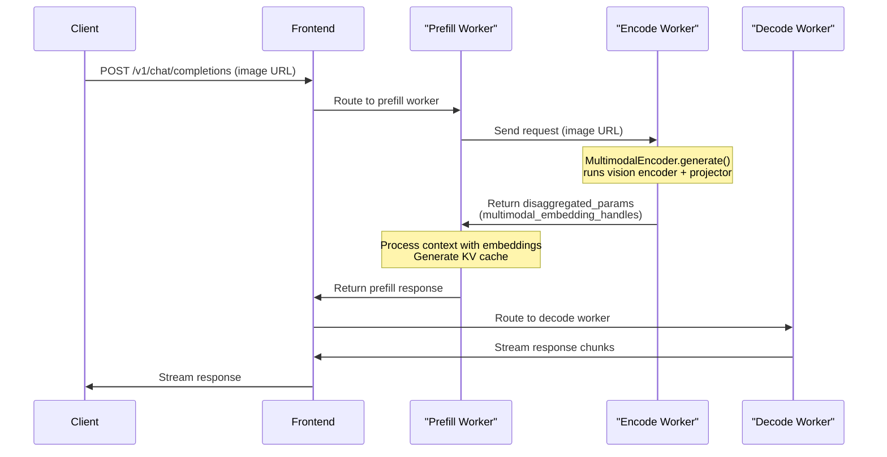
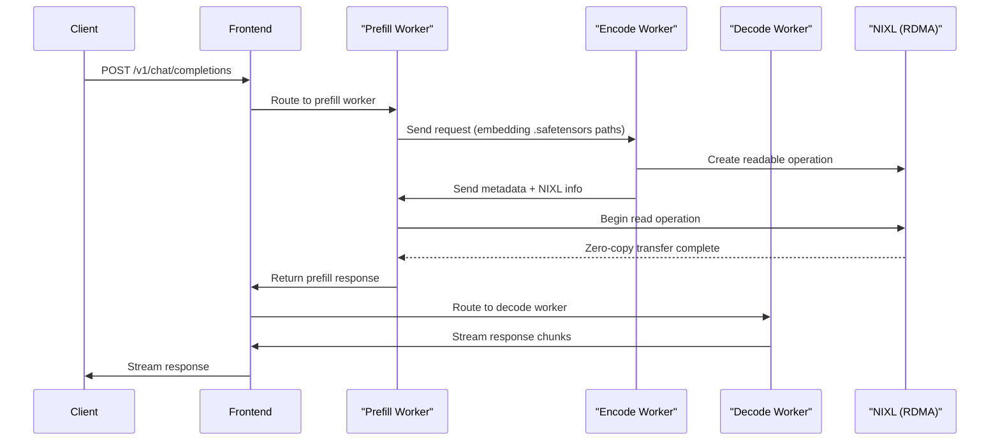
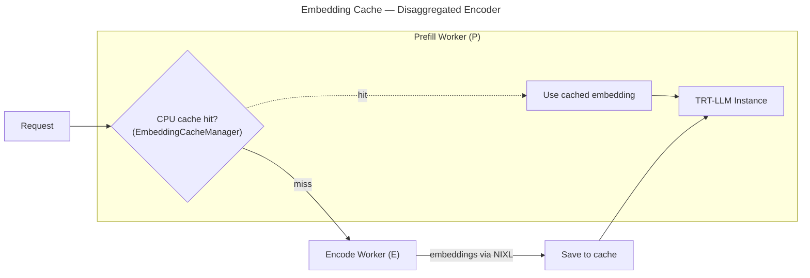

本文档详细介绍如何在 Dynamo 中使用 TensorRT-LLM 后端进行多模态推理。

可通过以下方式提供多模态输入：
- 发送图像 URL
- 提供预计算 embedding 文件的路径

> **注意：** 在单次请求中应只提供 **图像 URL 或 embedding 文件路径**（二选一）。

## 支持矩阵

| 模态 | 输入格式 | 聚合（Aggregated）| 解耦（Disaggregated）| 备注 |
|----------|--------------|------------|---------------|-------|
| **图像** | HTTP/HTTPS URL | 是 | 是 | 完整支持所有图像模型 |
| **图像** | 预计算 Embedding（.safetensors）| 是 | 是 | 直接使用 embedding 文件 |
| **视频** | HTTP/HTTPS URL | 否 | 否 | 未实现 |
| **音频** | HTTP/HTTPS URL | 否 | 否 | 未实现 |

### 支持的 URL 格式

| 格式 | 示例 | 描述 |
|--------|---------|-------------|
| **HTTP/HTTPS** | `http://example.com/image.jpg` | 远程媒体文件 |
| **预计算 Embedding** | `/path/to/embedding.safetensors` | 本地 embedding 文件（仅 .safetensors）|

## 部署模式

TRT-LLM 支持聚合与传统解耦两种模式。详细说明参见 [Architecture Patterns](README.md#architecture-patterns)。

| 模式 | 是否支持 | 启动脚本 | 备注 |
|---------|-----------|---------------|-------|
| 聚合（Aggregated） | ✅ | `agg.sh` | 部署最简单，单 Worker |
| EP/D（传统解耦） | ✅ | `disagg_multimodal.sh` | 预填充处理编码，2 个 Worker |
| E/P/D（完整 - 图像 URL）| ✅ | `epd_multimodal_image_and_embeddings.sh` | 独立 encoder 使用 `MultimodalEncoder`，3 个 Worker |
| E/P/D（完整 - 预计算 Embedding）| ✅ | `epd_multimodal_image_and_embeddings.sh` | 独立 encoder 使用 NIXL 传输，3 个 Worker |
| E/P/D（大模型）| ✅ | `epd_disagg.sh` | 适用于 Llama-4 Scout/Maverick，多节点 |

### 组件参数

| 组件 | 参数 | 用途 |
|-----------|------|---------|
| Worker | `--modality multimodal` | 完整流水线（聚合）|
| Prefill Worker | `--disaggregation-mode prefill` | 图像处理 + 预填充（多模态分词在此发生）|
| Decode Worker | `--disaggregation-mode decode` | 仅解码 |
| Encode Worker | `--disaggregation-mode encode` | 图像编码（E/P/D 流程）|

## 聚合服务

以聚合模式启动 Llama-4 Maverick BF16 的快速步骤：

```bash
cd $DYNAMO_HOME

export AGG_ENGINE_ARGS=./examples/backends/trtllm/engine_configs/llama4/multimodal/agg.yaml
export SERVED_MODEL_NAME="meta-llama/Llama-4-Maverick-17B-128E-Instruct"
export MODEL_PATH="meta-llama/Llama-4-Maverick-17B-128E-Instruct"
./examples/backends/trtllm/launch/agg.sh
```

**客户端：**
```bash
curl localhost:8000/v1/chat/completions -H "Content-Type: application/json" -d '{
    "model": "meta-llama/Llama-4-Maverick-17B-128E-Instruct",
    "messages": [
        {
            "role": "user",
            "content": [
                {
                    "type": "text",
                    "text": "Describe the image"
                },
                {
                    "type": "image_url",
                    "image_url": {
                        "url": "https://huggingface.co/datasets/huggingface/documentation-images/resolve/main/diffusers/inpaint.png"
                    }
                }
            ]
        }
    ],
    "stream": false,
    "max_tokens": 160
}'
```

## 解耦服务

以 `Qwen/Qwen2-VL-7B-Instruct` 为例：

```bash
cd $DYNAMO_HOME

export MODEL_PATH="Qwen/Qwen2-VL-7B-Instruct"
export SERVED_MODEL_NAME="Qwen/Qwen2-VL-7B-Instruct"
export PREFILL_ENGINE_ARGS="examples/backends/trtllm/engine_configs/qwen2-vl-7b-instruct/prefill.yaml"
export DECODE_ENGINE_ARGS="examples/backends/trtllm/engine_configs/qwen2-vl-7b-instruct/decode.yaml"
export MODALITY="multimodal"

./examples/backends/trtllm/launch/disagg.sh
```

```bash
curl localhost:8000/v1/chat/completions -H "Content-Type: application/json" -d '{
    "model": "Qwen/Qwen2-VL-7B-Instruct",
    "messages": [
        {
            "role": "user",
            "content": [
                {
                    "type": "text",
                    "text": "Describe the image"
                },
                {
                    "type": "image_url",
                    "image_url": {
                        "url": "https://huggingface.co/datasets/huggingface/documentation-images/resolve/main/diffusers/inpaint.png"
                    }
                }
            ]
        }
    ],
    "stream": false,
    "max_tokens": 160
}'
```

对于 `meta-llama/Llama-4-Maverick-17B-128E-Instruct` 这类大模型，解耦服务需要多节点部署（见下文 [多节点部署](#多节点部署slurm)），而聚合服务可在单节点运行。原因是该模型在解耦配置下过大，无法装入单节点 GPU。例如，以解耦模式运行此模型需要 2 个 8x H200 节点或 4 个 4x GB200 节点。

## 完整 E/P/D 流程（图像 URL）

为获得高性能多模态推理，Dynamo 支持基于 TRT-LLM `MultimodalEncoder` 的独立 encoder + **Encode-Prefill-Decode（E/P/D）** 流程。它将视觉编码与预填充、解码分离，从而获得更好的 GPU 利用率与可扩展性。

### 支持的输入格式

| 格式 | 示例 | 描述 |
|--------|---------|-------------|
| **HTTP/HTTPS URL** | `https://example.com/image.jpg` | 远程图像文件 |
| **Base64 Data URL** | `data:image/jpeg;base64,...` | 内联 base64 编码图像 |

### 工作机制

完整 E/P/D 流程：

1. **Encode Worker**：运行 TRT-LLM 的 `MultimodalEncoder.generate()`，通过视觉编码器与投影器处理图像 URL
2. **Prefill Worker**：接收携带多模态 embedding 句柄的 `disaggregated_params`，处理上下文并生成 KV cache
3. **Decode Worker**：使用 KV cache 进行流式 token 生成

encode Worker 使用 TRT-LLM 的 `MultimodalEncoder` 类（继承自 `BaseLLM`），仅需要模型路径与 batch size —— 由于只跑视觉编码器与投影器，无需配置 KV cache。

### 启动方式

```bash
cd $DYNAMO_HOME

# 启动支持图像 URL 的 3-Worker E/P/D 流程
./examples/backends/trtllm/launch/epd_multimodal_image_and_embeddings.sh
```

### 请求示例

```bash
curl localhost:8000/v1/chat/completions -H "Content-Type: application/json" -d '{
    "model": "llava-v1.6-mistral-7b-hf",
    "messages": [
        {
            "role": "user",
            "content": [
                {"type": "text", "text": "Describe the image"},
                {
                    "type": "image_url",
                    "image_url": {
                        "url": "https://huggingface.co/datasets/huggingface/documentation-images/resolve/main/diffusers/inpaint.png"
                    }
                }
            ]
        }
    ],
    "max_tokens": 160
}'
```

### E/P/D 架构（图像 URL）



### 与 EP/D（传统解耦）的关键差异

| 维度 | EP/D（传统）| E/P/D（完整）|
|--------|-------------------|--------------|
| **编码** | 由 prefill worker 处理图像编码 | 专用 encode worker |
| **Prefill 负载** | 较高（编码 + 预填充）| 较低（仅预填充）|
| **适用场景** | 部署更简单 | 视觉负载较重时扩展性更好 |
| **启动脚本** | `disagg_multimodal.sh` | `epd_multimodal_image_and_embeddings.sh` |

## 使用 E/P/D 流程的预计算 Embedding

为获得高性能多模态推理，Dynamo 支持预计算 embedding，并通过 **NIXL（RDMA）** 在 Encode-Prefill-Decode（E/P/D）流程中实现零拷贝张量传输。

### 支持的文件类型

- `.safetensors` —— Safe tensor 文件（[safetensors 格式](https://huggingface.co/docs/safetensors)）

> **安全提示：** `.pt`、`.pth` 与 `.bin` 文件**会被拒绝**，因为它们使用 Python pickle 反序列化，可能执行任意代码。仅接受 `.safetensors` 格式。

### Embedding 文件格式

embedding 文件必须使用 `.safetensors` 格式。文件中第一个 tensor key 会被作为 embedding 张量。

**保存 embedding：**

```python
from safetensors.torch import save_file
import torch

embedding_tensor = torch.rand(1, 576, 4096)  # [batch, seq_len, hidden_dim]
save_file({"embedding": embedding_tensor}, "embedding.safetensors")
```

### 启动方式

```bash
cd $DYNAMO_HOME/examples/backends/trtllm

# 启动带 NIXL 的 3-Worker E/P/D 流程
./launch/epd_disagg.sh
```

> **注意：** 该脚本面向 8 节点 H200 + `Llama-4-Scout-17B-16E-Instruct` 模型，并假设你已准备好与该模型匹配的 `.safetensors` embedding 文件。

### 配置

```bash
# Prefill → Encode 通信使用的 encode 端点
export ENCODE_ENDPOINT="dyn://dynamo.tensorrt_llm_encode.generate"

# 安全：允许的 embedding 文件目录（默认：/tmp）
export ALLOWED_LOCAL_MEDIA_PATH="/tmp"

# 安全：最大文件大小，防 DoS（默认：50MB）
export MAX_FILE_SIZE_MB=50
```

### 使用预计算 Embedding 的请求示例

```bash
curl localhost:8000/v1/chat/completions -H "Content-Type: application/json" -d '{
    "model": "meta-llama/Llama-4-Maverick-17B-128E-Instruct",
    "messages": [
        {
            "role": "user",
            "content": [
                {"type": "text", "text": "Describe the image"},
                {"type": "image_url", "image_url": {"url": "/path/to/embedding.safetensors"}}
            ]
        }
    ],
    "max_tokens": 160
}'
```

### E/P/D 架构

E/P/D 流程实现 **3-Worker 架构**：

- **Encode Worker**：加载预计算 embedding，通过 NIXL 传输
- **Prefill Worker**：接收 embedding，处理上下文并生成 KV cache
- **Decode Worker**：进行流式 token 生成



## Embedding 缓存

Dynamo 在聚合与解耦两种 TRT-LLM 设置中都支持 embedding 缓存：

| 设置 | 实现 | 启动脚本 | 状态 |
|---------|---------------|---------------|--------|
| **解耦 Encoder** | 由 Dynamo 在 PD Worker 层管理（位于 TRT-LLM 引擎之上）| `disagg_e_pd.sh` + `--multimodal-embedding-cache-capacity-gb` | 支持 |
| **聚合** | 不适用 | 不适用 | 暂不支持 |

该缓存使用 `MultimodalEmbeddingCacheManager` 在 CPU 上维护一份 encoder embedding 的 LRU 缓存。当再次见到相同图像时，会复用缓存中的 embedding 而非重新编码。

### 解耦 Encoder（Prefill Worker 中的 Embedding 缓存）

在解耦设置中，Prefill Worker（P）拥有 CPU 侧的 LRU embedding 缓存（`EmbeddingCacheManager`）。每次请求时 P 先查缓存 —— 命中则完全跳过 Encode Worker。未命中时，P 路由到 Encode Worker（E），通过 NIXL 接收 embedding，将其存入缓存，然后将 embedding 与请求一并送入 TRT-LLM 实例进行预填充。



`disagg_e_pd.sh` 脚本会启动一个独立的 encode Worker 与一个 PD Worker。额外参数会被透传到 PD Worker。通过 `--multimodal-embedding-cache-capacity-gb` 启用 embedding 缓存：

```bash
cd $DYNAMO_HOME/examples/backends/trtllm
./launch/disagg_e_pd.sh --multimodal-embedding-cache-capacity-gb 10
```

## NIXL 使用

| 场景 | 脚本 | 是否使用 NIXL？ | 数据传输 |
|----------|--------|------------|---------------|
| 聚合 | `agg.sh` | 否 | 全部在单 Worker 内 |
| EP/D（传统解耦）| `disagg_multimodal.sh` | 可选 | Prefill → Decode（KV cache 通过 UCX 或 NIXL）|
| E/P/D（图像 URL）| `epd_multimodal_image_and_embeddings.sh` | 否 | Encoder → Prefill（句柄通过参数），Prefill → Decode（KV cache）|
| E/P/D（预计算 Embedding）| `epd_multimodal_image_and_embeddings.sh` | 是 | Encoder → Prefill（embedding 通过 NIXL RDMA）|
| E/P/D（大模型）| `epd_disagg.sh` | 是 | Encoder → Prefill（embedding 通过 NIXL），Prefill → Decode（KV cache）|

> **注意：** 用于 KV cache 传输的 NIXL 目前为 beta 状态，且仅支持 AMD64（x86_64）架构。

## ModelInput 类型与注册

TRT-LLM Worker 通过以下方式向 Dynamo 注册：

| ModelInput 类型 | 预处理 | 适用场景 |
|-----------------|---------------|----------|
| `ModelInput.Tokens` | Rust 前端可能进行分词，但多模态流程在 Python Worker 中重新分词并构造输入；Rust 的 token_ids 会被忽略 | 所有 TRT-LLM Worker |

```python
# TRT-LLM Worker - 使用 Tokens 注册
await register_model(
    ModelInput.Tokens,      # Rust 仅做最少的预处理
    model_type,             # ModelType.Chat 或 ModelType.Prefill
    generate_endpoint,
    model_name,
    ...
)
```

## 组件间通信

| 传输阶段 | 消息 | NIXL 传输 |
|----------------|---------|---------------|
| **Frontend → Prefill** | 含图像 URL 或 .safetensors embedding 路径的请求 | 否 |
| **Prefill → Encode（图像 URL）** | 含图像 URL 的请求 | 否 |
| **Encode → Prefill（图像 URL）** | 包含 `multimodal_embedding_handles`、已处理 prompt、token id 的 `ep_disaggregated_params` | 否 |
| **Prefill → Encode（Embedding 路径）** | 含 .safetensors embedding 文件路径的请求 | 否 |
| **Encode → Prefill（Embedding 路径）** | NIXL 可读元数据 + shape/dtype + 辅助数据 | 是（embedding 张量经 RDMA）|
| **Prefill → Decode** | 含 `_epd_metadata`（prompt、token id）的 `disaggregated_params` | 可配置（KV cache：默认 NIXL，可选 UCX）|

## 已知限制

- **不支持视频** —— 没有视频编码器实现
- **不支持音频** —— 没有音频编码器实现
- **多模态预处理/分词在 Python 中完成** —— Rust 可转发 token_ids，但多模态请求会在 Python Worker 中解析并重新分词
- **多节点 H100 限制** —— 由于头数无法被整除（`num_attention_heads: 40` 不能被 `tp_size: 16` 整除），无法在 8 节点 H100 上以 TP=16 加载 `meta-llama/Llama-4-Maverick-17B-128E-Instruct`
- **llava-v1.6-mistral-7b-hf 模型崩溃** —— TRTLLM 后端与 `TensorRT LLM version: 1.2.0rc6.post1` 兼容性的已知问题。要使用 Llava 模型，请通过 HF 在本地下载 revision `revision='52320fb52229`。
- **Embedding 文件崩溃** —— TRTLLM 后端与 `TensorRT LLM version: 1.2.0rc6.post1` 兼容性的已知问题：在 `attach_multimodal_embeddings(` 中解析 embedding 文件会崩溃。下次 TRTLLM 升级修复。

## 受支持的模型

[TensorRT-LLM 受支持模型](https://github.com/NVIDIA/TensorRT-LLM/blob/main/docs/source/models/supported-models.md) 中列出的多模态模型在 Dynamo 中均受支持。

常见示例：
- **Llama 4 视觉模型**（Maverick、Scout）—— 推荐用于大规模部署
- **LLaVA 模型**（如 `llava-hf/llava-v1.6-mistral-7b-hf`）—— E/P/D 示例的默认模型
- **Qwen2-VL 模型** —— 在传统解耦模式下受支持
- 其它受 TRT-LLM 支持的视觉-语言模型

## 关键文件

| 文件 | 描述 |
|------|-------------|
| `components/src/dynamo/trtllm/main.py` | Worker 初始化与启动 |
| `components/src/dynamo/trtllm/engine.py` | TensorRTLLMEngine 包装（LLM 与 MultimodalEncoder）|
| `components/src/dynamo/trtllm/constants.py` | DisaggregationMode 枚举（AGGREGATED、PREFILL、DECODE、ENCODE）|
| `components/src/dynamo/trtllm/encode_helper.py` | Encode Worker 的请求处理（embedding-path 与完整 EPD 流程）|
| `components/src/dynamo/trtllm/multimodal_processor.py` | 多模态请求处理 |
| `components/src/dynamo/trtllm/request_handlers/handlers.py` | 请求处理器（EncodeHandler、PrefillHandler、DecodeHandler）|
| `components/src/dynamo/trtllm/request_handlers/handler_base.py` | 含 disaggregated params 编/解码的基类 handler |
| `components/src/dynamo/trtllm/utils/disagg_utils.py` | 用于网络传输的 DisaggregatedParamsCodec |
| `components/src/dynamo/trtllm/utils/trtllm_utils.py` | 命令行参数解析 |
