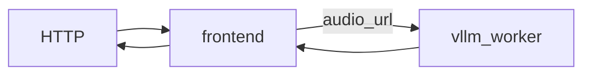
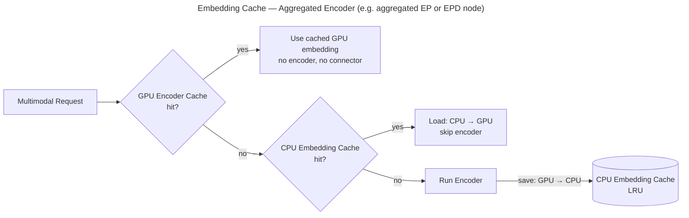
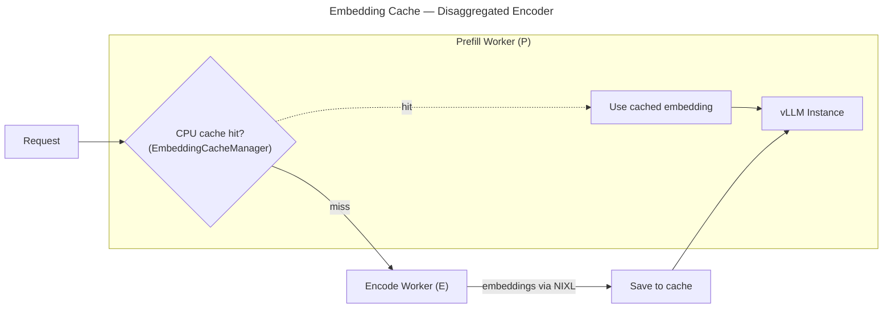

本文档全面介绍如何在 Dynamo 中使用 vLLM 后端（backend）进行多模态推理
（inference）。

<Warning>
**安全要求**：所有多模态 worker 都必须在启动时显式设置 `--enable-multimodal` 标志。这是一项安全特性，用于防止不受信来源的多模态数据被无意中处理。如果启用了多模态 worker 模式但未设置 `--enable-multimodal`，worker 将在启动时失败。该标志类似于 vllm serve 中的 `--enable-mm-embeds`，但同时还把覆盖范围扩展到所有形式的多模态内容（url、embeddings、b64）。
</Warning>

## 支持矩阵

| 模态                     | 聚合（Aggregated） | 解耦（Disaggregated） |
| ------------------------ | ---------- | ------------- |
| **图像（Image）**          | Yes        | Yes           |
| **视频（Video）**          | Yes        | Yes           |
| **音频（Audio）**          | Yes        | No            |

### 支持的 URL 格式

| 格式         | 示例                              | 说明                |
| -------------- | ------------------------------------ | -------------------------- |
| **HTTP/HTTPS** | `http://example.com/image.jpg`       | 远程媒体文件         |
| **Data URL**   | `data:image/jpeg;base64,/9j/4AAQ...` | Base64 编码的内联数据 |

## 部署形态

本仓库中主要的多模态 vLLM 启动器有：

| 形态                     | 启动脚本               | 适用场景                                                                            |
| --------------------------- | --------------------------- | ----------------------------------------------------------------------------------- |
| 聚合（Aggregated）             | `agg_multimodal.sh`         | 由单个多模态 worker 提供最简单的图像 / 视频服务                        |
| E/PD（Encode + PD）          | `disagg_multimodal_e_pd.sh` | 把 encoder 拆出来的简单示例，便于测试 embedding-cache 工作流    |
| E/P/D（完全解耦）             | `disagg_multimodal_epd.sh`  | encode、prefill、decode 分别独立 worker 的图像 / 视频服务 |

## 图像 / 视频服务

Dynamo 为视觉语言模型（VLM）支持多模态图像与视频请求。`Qwen/Qwen3-VL-2B-Instruct`
是个不错的示例，因为同一个模型可以通过标准的 OpenAI chat 接口同时处理 `image_url`
与 `video_url` 请求。

### 聚合服务

最简单的图像 / 视频部署使用单 worker 聚合启动器：

```bash
cd $DYNAMO_HOME/examples/backends/vllm
bash launch/agg_multimodal.sh --model Qwen/Qwen3-VL-2B-Instruct
```

**图像请求：**

```bash
curl http://localhost:8000/v1/chat/completions \
  -H "Content-Type: application/json" \
  -d '{
      "model": "Qwen/Qwen3-VL-2B-Instruct",
      "messages": [
        {
          "role": "user",
          "content": [
            {
              "type": "text",
              "text": "What is in this image?"
            },
            {
              "type": "image_url",
              "image_url": {
                "url": "http://images.cocodataset.org/test2017/000000155781.jpg"
              }
            }
          ]
        }
      ],
      "max_tokens": 64,
      "temperature": 0.0,
      "stream": false
    }'
```

**视频请求：**

```bash
curl http://localhost:8000/v1/chat/completions \
  -H "Content-Type: application/json" \
  -d '{
      "model": "Qwen/Qwen3-VL-2B-Instruct",
      "messages": [
        {
          "role": "user",
          "content": [
            {
              "type": "text",
              "text": "Describe the video in detail"
            },
            {
              "type": "video_url",
              "video_url": {
                "url": "https://qianwen-res.oss-cn-beijing.aliyuncs.com/Qwen3-Omni/demo/draw.mp4"
              }
            }
          ]
        }
      ],
      "max_tokens": 64,
      "stream": false
    }' | jq
```

### E/PD 服务（Encode + PD）

当你希望使用一个独立的 encode worker 和一个聚合的 prefill/decode worker 时，
使用 `disagg_multimodal_e_pd.sh`。这条路径主要适合以图像为中心的负载，以及
embedding-cache 实验。

<Warning>
在当前的 vLLM 路径下，部署独立 encode worker 时，只有 `image_url` 输入会被路由到 encode worker。`video_url` 输入仍由聚合的 PD worker 处理。
</Warning>

```bash
cd $DYNAMO_HOME/examples/backends/vllm

# 多 GPU 部署
bash launch/disagg_multimodal_e_pd.sh --model Qwen/Qwen3-VL-2B-Instruct

# 单 GPU（小模型功能性测试）
bash launch/disagg_multimodal_e_pd.sh --model Qwen/Qwen3-VL-2B-Instruct --single-gpu

```

### E/P/D 服务（完全解耦）

当你希望针对多模态负载提供 encode、prefill、decode 分别独立的 worker 时，使用
`disagg_multimodal_epd.sh`。

<Warning>
在当前 vLLM 实现中，独立的 encode worker 仅用于 `image_url` 输入。`video_url` 输入仍由 prefill worker 处理，而非 encode worker。
</Warning>

```bash
cd $DYNAMO_HOME/examples/backends/vllm

# 多 GPU 部署
bash launch/disagg_multimodal_epd.sh --model Qwen/Qwen3-VL-2B-Instruct

# 单 GPU（小模型功能性测试）
bash launch/disagg_multimodal_epd.sh --model Qwen/Qwen3-VL-2B-Instruct --single-gpu
```

## 音频服务

Dynamo 对支持音频的模型支持 `audio_url` 请求。音频会由后端 worker 通过 vLLM
的 `AudioMediaIO` 按原始采样率加载 —— vLLM 模型自带的 processor 会在内部完成
重采样与特征抽取。Omni 模型可以在同一个请求中处理 `image_url`、`video_url`
与 `audio_url`。

### 聚合服务

使用相同的聚合多模态启动器，但模型换成支持音频的模型：

```bash
pip install 'vllm[audio]'  # installs librosa and other audio dependencies
cd $DYNAMO_HOME/examples/backends/vllm
bash launch/agg_multimodal.sh --model Qwen/Qwen3-Omni-30B-A3B-Instruct
```



**音频请求：**

```bash
curl http://localhost:8000/v1/chat/completions \
  -H "Content-Type: application/json" \
  -d '{
      "model": "Qwen/Qwen3-Omni-30B-A3B-Instruct",
      "messages": [
        {
          "role": "user",
          "content": [
            {
              "type": "text",
              "text": "What sound is this?"
            },
            {
              "type": "audio_url",
              "audio_url": {
                "url": "https://raw.githubusercontent.com/yuekaizhang/Triton-ASR-Client/main/datasets/mini_en/wav/1221-135766-0002.wav"
              }
            }
          ]
        }
      ],
      "max_tokens": 100,
      "stream": false
    }' | jq
```

## Embedding 缓存

Dynamo 在聚合与解耦两种部署下都支持 embedding 缓存：

| 部署形态                 | 实现方式                                                | 启动脚本               |
| ------------------------- | -------------------------------------------------------------- | --------------------------- |
| **聚合（Aggregated）**    | 通过 vLLM 0.17+ 的 ECConnector 原生支持                  | `agg_multimodal.sh`（或直接使用 `vllm serve`） |
| **解耦 encoder**          | 在 worker 层的 Dynamo 受管缓存，在 vLLM engine 之上 | `disagg_multimodal_e_pd.sh` |

### 聚合 worker

单个 vLLM 实例会把已经编码的 embedding 缓存到 CPU 上，使重复出现的图像可以
完全跳过编码阶段。在 vLLM 0.17+ 中原生支持。



**用 Dynamo 启动：**

```bash
bash examples/backends/vllm/launch/agg_multimodal.sh \
    --model Qwen/Qwen3-VL-30B-A3B-Instruct-FP8 \
    --multimodal-embedding-cache-capacity-gb 10
```

当容量 > 0 时，`dynamo.vllm` 会自动用 `DynamoMultimodalEmbeddingCacheConnector`
配置 `ec_both` 模式。

**用 `vllm serve` 启动（独立运行，不依赖 Dynamo）：**

```bash
vllm serve Qwen/Qwen3-VL-30B-A3B-Instruct-FP8 \
    --ec-transfer-config "{
        \"ec_role\": \"ec_both\",
        \"ec_connector\": \"DynamoMultimodalEmbeddingCacheConnector\",
        \"ec_connector_module_path\": \"dynamo.vllm.multimodal_utils.multimodal_embedding_cache_connector\",
        \"ec_connector_extra_config\": {\"multimodal_embedding_cache_capacity_gb\": 10}
    }"
```

`multimodal_embedding_cache_capacity_gb` 参数控制 CPU 端 LRU 缓存的大小（GB），
0 表示禁用。需要 vLLM 0.17+。

### 解耦 encoder（embedding 缓存位于 prefill worker）

在解耦部署中，Prefill Worker（P）持有一份 CPU 端的 LRU embedding 缓存
（`EmbeddingCacheManager`）。每来一个请求，P 都会先查缓存 —— 如果命中，则完全
跳过 Encode Worker；如果未命中，P 会把请求路由到 Encode Worker（E），通过
NIXL 接收回 embedding，存入缓存，然后将 embedding 与请求一起送进 vLLM 实例
进行 prefill。



**启动：**

```bash
cd $DYNAMO_HOME/examples/backends/vllm
bash launch/disagg_multimodal_e_pd.sh --multimodal-embedding-cache-capacity-gb 10
```

**客户端：** 使用与 [聚合服务](#aggregated-serving) 中所示的相同 `image_url`
请求格式即可。

## 多模态 worker 上的 LoRA 适配器

多模态 worker 支持通过管理 API 在运行时动态加载和卸载 LoRA 适配器。这使得
微调过的多模态模型可以与基础模型并存提供服务。

### 加载 LoRA 适配器

通过 `load_lora` 接口在运行中的多模态 worker 上加载适配器：

```bash
# 对 components 的 worker（基于 URI，要求 DYN_LORA_ENABLED=true）
curl -X POST http://<worker-host>:<port>/load_lora \
  -H "Content-Type: application/json" \
  -d '{
    "lora_name": "my-vlm-adapter",
    "source": {"uri": "s3://my-bucket/adapters/my-vlm-adapter"}
  }'

# 对 example 的 worker（基于路径）
curl -X POST http://<worker-host>:<port>/load_lora \
  -H "Content-Type: application/json" \
  -d '{
    "lora_name": "my-vlm-adapter",
    "lora_path": "/path/to/adapter"
  }'
```

### 使用 LoRA 发送请求

将请求中的 `model` 字段设置为 LoRA 适配器的名称：

```bash
curl -X POST http://<frontend-host>:<port>/v1/chat/completions \
  -H "Content-Type: application/json" \
  -d '{
    "model": "my-vlm-adapter",
    "messages": [
      {"role": "user", "content": [
        {"type": "text", "text": "Describe this image"},
        {"type": "image_url", "image_url": {"url": "https://example.com/image.jpg"}}
      ]}
    ]
  }'
```

未带 LoRA 名称（或带的是基础模型名）的请求会使用基础模型。

### 卸载 LoRA 适配器

```bash
curl -X POST http://<worker-host>:<port>/unload_lora \
  -H "Content-Type: application/json" \
  -d '{"lora_name": "my-vlm-adapter"}'
```

### 列出已加载的适配器

```bash
curl -X POST http://<worker-host>:<port>/list_loras
```

### 解耦模式

在解耦（prefill/decode）部署中，**同一个 LoRA 适配器必须同时被加载到 prefill 与
decode worker 上**。请求中的 LoRA 标识（`model` 字段）会从 prefill worker 自动
传递到 decode worker。

```bash
# 在 prefill worker 上加载
curl -X POST http://<prefill-worker>/load_lora \
  -d '{"lora_name": "my-adapter", "source": {"uri": "s3://bucket/adapter"}}'

# 在 decode worker 上加载（同一个适配器）
curl -X POST http://<decode-worker>/load_lora \
  -d '{"lora_name": "my-adapter", "source": {"uri": "s3://bucket/adapter"}}'
```

如果某个 LoRA 只在 prefill worker 上加载、而在 decode worker 上未加载，则
decode worker 在处理该请求时会回退使用基础模型。

## 受支持的模型

vLLM 支持的多模态模型列表请参见
[vLLM Supported Multimodal Models](https://docs.vllm.ai/en/latest/models/supported_models/#list-of-multimodal-language-models)。
其中列出的模型一般都可以用于聚合服务，但不保证本仓库都对其逐一做过显式测试。
