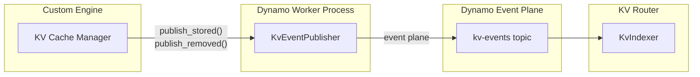
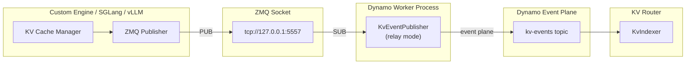

本文档说明如何为自定义推理引擎实现 KV 事件发布，使其能够参与 Dynamo 的 KV 缓存（KV cache）感知路由。

## 概述

KV 路由（router）依赖来自后端 Worker 的实时事件来追踪每个 Worker 上存储了哪些 KV 缓存块。当你的自定义引擎分配或驱逐（evict）KV 缓存块时，应发布这些事件，使路由能够做出最优的路由决策。

事件通过 **Dynamo event plane** 发布 —— 这是一个与传输层无关的发布/订阅层，同时支持 NATS 与 ZMQ 后端（详见 [Event Plane](../design-docs/event-plane.md)）。`KvEventPublisher` 绑定层处理所有传输细节 —— 你的引擎代码无需直接与 event plane 打交道。

`KvEventPublisher` 支持两种发布模式：

1. **直接发布（Direct publishing）** —— 引擎调用 `publish_stored()` / `publish_removed()` 直接通过 event plane 推送事件。这是自定义引擎最简单的方案。
2. **ZMQ 中继（ZMQ relay）** —— 适用于通过 ZMQ socket 发出原始 KV 事件的引擎（如 SGLang 与 vLLM）。Publisher 订阅该 ZMQ 端点并自动将事件中继到 event plane。

## 事件类型

KV 缓存支持三类事件：

| 事件类型 | 描述 | 何时发布 |
|------------|-------------|-----------------|
| `BlockStored` | 新块加入缓存 | KV 缓存分配成功后 |
| `BlockRemoved` | 块被驱逐出缓存 | 块被驱逐或释放时 |
| `AllBlocksCleared` | 所有块均被移除 | 缓存重置或 Worker 重启时 |

### 事件结构

每个事件包含：
- **`event_id`**：每个 Worker 内单调递增的标识（由 Publisher 内部管理）
- **`dp_rank`**：数据并行的 rank（未启用 DP 时为 0）
- **`data`**：`Stored`、`Removed` 或 `Cleared` 之一

`BlockStored` 事件包含：
- **`token_ids`**：所存储块对应的 token id 列表
- **`block_hashes`**：来自引擎块管理器的**序列块哈希（sequence block hash）** 列表。这些是累积哈希，包含从序列开头到当前块（含）的所有 token，而不仅是该块内部的 token。这样能在请求间实现前缀匹配。
- **`num_block_tokens`**：每个块的 token 数（应都等于 `kv_block_size`）
- **`parent_hash`**：父块的哈希。除序列中的第一个块（无父块）外，其它所有块都必须提供。
- **`lora_name`**：LoRA 适配器名称字符串（基础模型可省略或为 `None`）。设置后，适配器名称会参与块哈希的计算，使不同 LoRA（或基础模型）下的同一块绝不会被混淆。

`BlockRemoved` 事件包含：
- **`block_hashes`**：被驱逐的序列块哈希列表

## 直接发布（推荐用于自定义引擎）

直接在引擎代码中调用 `publish_stored()` 与 `publish_removed()`。Publisher 负责事件 ID、序列化和传输。



**适用场景：**
- 从零构建自定义推理引擎
- 引擎没有基于 ZMQ 的事件系统
- 希望集成路径最简单

### 基础设置

```python
from dynamo.llm import KvEventPublisher

class CustomEnginePublisher:
    def __init__(self, component, block_size: int, dp_rank: int = 0):
        self.block_size = block_size
        self.kv_publisher = KvEventPublisher(
            component=component,
            kv_block_size=block_size,
            dp_rank=dp_rank,
        )

    def on_blocks_stored(self, token_ids: list[int], block_hashes: list[int],
                         parent_hash: int | None = None,
                         lora_name: str | None = None):
        """在 KV 缓存块分配完成后调用。"""
        num_block_tokens = [self.block_size] * len(block_hashes)
        self.kv_publisher.publish_stored(
            token_ids=token_ids,
            num_block_tokens=num_block_tokens,
            block_hashes=block_hashes,
            parent_hash=parent_hash,
            lora_name=lora_name,
        )

    def on_blocks_removed(self, block_hashes: list[int]):
        """在 KV 缓存块被驱逐时调用。"""
        self.kv_publisher.publish_removed(block_hashes=block_hashes)
```

### 与你的引擎集成

```python
from dynamo.llm import register_model

async def main():
    component, endpoint = await register_model(
        model="my-model",
        generator=my_generate_fn,
    )

    publisher = CustomEnginePublisher(
        component=component,
        block_size=16,  # 与引擎 block size 保持一致
    )

    def on_prefill_complete(request_id, token_ids, blocks):
        block_hashes = [block.hash for block in blocks]
        publisher.on_blocks_stored(token_ids=token_ids, block_hashes=block_hashes)

    def on_cache_eviction(evicted_blocks):
        block_hashes = [block.hash for block in evicted_blocks]
        publisher.on_blocks_removed(block_hashes=block_hashes)
```

## ZMQ 中继（适用于已有原始 KV 事件的引擎）

对于已经通过 ZMQ socket 发布原始 KV 事件的引擎（如 SGLang 与 vLLM），可以使用同一个 `KvEventPublisher`，并传入 `zmq_endpoint`。Publisher 会订阅该 ZMQ socket，并自动将事件中继到 event plane。



**适用场景：**
- 引擎已通过 ZMQ 发布 KV 事件（如 SGLang 或 vLLM）
- 希望将事件发布与引擎主循环解耦

### 设置

向同一个 `KvEventPublisher` 传入 `zmq_endpoint`（以及可选的 `zmq_topic`）：

```python
from dynamo.llm import KvEventPublisher

kv_publisher = KvEventPublisher(
    component=component,
    kv_block_size=block_size,
    zmq_endpoint="tcp://127.0.0.1:5557",  # 引擎发布事件所用的端点
    zmq_topic="",                          # 订阅所有 topic
)
```

无需再调用 `publish_stored()` / `publish_removed()` —— Publisher 会从 ZMQ socket 读取事件并自动转发。

### ZMQ 线缆格式

ZMQ 消息格式（兼容 SGLang / vLLM）：

| Frame | 描述 |
|-------|-------------|
| 1 | Topic（空字符串表示所有 topic）|
| 2 | 序列号（8 字节，大端）|
| 3 | Msgpack payload：`[timestamp, [events], dp_rank]` |

payload 中每个事件是一个字典，含 `type` 字段（`BlockStored`、`BlockRemoved` 或 `AllBlocksCleared`）。

`BlockStored`：
```python
{
    "type": "BlockStored",
    "block_hashes": [signed_i64, ...],      # 序列块哈希
    "parent_block_hash": signed_i64 | None,  # 父块哈希
    "token_ids": [int, ...],                 # token id
    "block_size": int,                       # 每块 token 数
    "lora_name": str | None,                 # LoRA 适配器名称
}
```

`BlockRemoved`：
```python
{
    "type": "BlockRemoved",
    "block_hashes": [signed_i64, ...],
}
```

`AllBlocksCleared`：
```python
{"type": "AllBlocksCleared"}
```

## API 参考

### `KvEventPublisher`

```python
KvEventPublisher(
    component: Component,
    kv_block_size: int,
    dp_rank: int = 0,
    enable_local_indexer: bool = False,
    zmq_endpoint: str | None = None,   # 设置后启用中继模式
    zmq_topic: str | None = None,      # 设置 zmq_endpoint 时默认值为 ""
)
```

| 参数 | 描述 |
|-----------|-------------|
| `component` | 该 Publisher 所属的 Dynamo 组件 |
| `kv_block_size` | 每块 token 数（必须 > 0，且需与引擎一致）|
| `dp_rank` | 数据并行 rank（默认 0）|
| `enable_local_indexer` | 启用 Worker 本地的 KV 索引器，用于直接进行重叠查询 |
| `zmq_endpoint` | 中继模式下要订阅的 ZMQ 端点（如 `"tcp://127.0.0.1:5557"`）|
| `zmq_topic` | ZMQ topic 过滤（默认 `""` 表示所有 topic）|

#### `publish_stored()`

```python
publish_stored(
    token_ids: list[int],
    num_block_tokens: list[int],
    block_hashes: list[int],
    parent_hash: int | None = None,
    block_mm_infos: list[dict | None] | None = None,
    lora_name: str | None = None,
)
```

发布块存储事件。事件 ID 由内部管理。当提供 `lora_name` 时，适配器名称会被混入块哈希的计算，因此不同适配器下缓存的块会得到不同的哈希。

#### `publish_removed()`

```python
publish_removed(block_hashes: list[int])
```

发布块移除事件。事件 ID 由内部管理。

#### `shutdown()`

```python
shutdown()
```

停止后台任务（ZMQ 监听、事件转发）。

## 最佳实践

1. **`kv_block_size` 必须**与引擎实际使用的 block size 一致。

2. **`parent_hash` 必须存在** —— 除序列首块外的所有块均需要 —— 它将块串联起来以支持前缀匹配。

3. **块哈希为有符号 64 位整数**（在 Python API 中）。Publisher 内部负责类型转换。

4. **事件顺序自动维护** —— Publisher 会分配单调递增的事件 ID。无需自行追踪事件 ID。

## 参见

- **[Event Plane](../design-docs/event-plane.md)**：传输选项（NATS、ZMQ）与配置
- **[配置与调优](../components/router/router-configuration.md)**：路由参数、调优与生产部署
- **[路由设计](../design-docs/router-design.md)**：架构细节与事件传输模式
