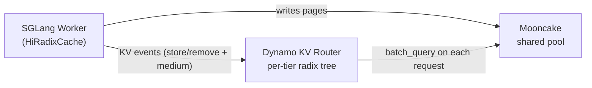

本指南介绍如何在 Dynamo 上运行 SGLang 的层级缓存（Hierarchical Cache，HiCache），以及当多个 worker 共享外部存储池（例如 Mooncake）时，Dynamo KV router 如何与 HiCache 集成实现按层级（tier-aware）选择 worker。

## 概述

SGLang HiCache 在 RadixAttention 之上扩展出一个多层级 KV 缓存（KV cache），透明地在 GPU HBM、主机内存和可选的外部存储后端（如 Mooncake）之间搬移 page。HiCache 自身的完整说明——参数列表、存储后端、内存布局、预取策略——请参阅 SGLang 的官方文档：

- [SGLang HiCache Design](https://docs.sglang.ai/advanced_features/hicache_design.html)
- [SGLang HiCache Best Practices](https://docs.sglang.ai/advanced_features/hicache_best_practices.html)

Dynamo 在 HiCache 之上额外提供：

- **按层级路由（Tier-aware routing）。** KV router 跟踪每个块所在的缓存层级（GPU / Host / External），并在为候选 worker 打分时使用该信息——不仅仅看设备上的重叠（device overlap）。
- **共享池感知（Shared-pool awareness）。** 配置了 Mooncake 等外部后端后，router 会在查询自身索引器的同时并行查询共享池，从而能为"集群中任何 worker 都能拉取"的块抵扣预填充成本，而不只是看候选 worker 本地持有的块。

如果你只运行单个启用 HiCache 的 worker、且没有共享池，Dynamo 端无需任何额外配置——worker 会照常向 router 上报 KV 事件。

## 在 Dynamo 上运行带 HiCache 的 SGLang

启动一个启用 HiCache 的 worker：

```bash
python -m dynamo.sglang \
  --model-path Qwen/Qwen3-0.6B \
  --page-size 64 \
  --enable-hierarchical-cache \
  --hicache-ratio 2 \
  --hicache-write-policy write_through \
  --hicache-storage-backend nixl \
  --skip-tokenizer-init
```

然后启动前端：

```bash
python -m dynamo.frontend --http-port 8000
```

<Note>
HiCache 相关参数（`--enable-hierarchical-cache`、`--hicache-ratio`、`--hicache-write-policy`、`--hicache-storage-backend`、`--hicache-mem-layout` 等）都是 SGLang 原生参数——Dynamo 原样透传。完整参数列表与调优建议请参阅 [SGLang 的 best-practices 文档](https://docs.sglang.ai/advanced_features/hicache_best_practices.html)。
</Note>

## 按层级感知的共享 KV 缓存路由

当你扩展到多个 SGLang worker 并且它们共享一个外部存储池（例如 [Mooncake](https://github.com/kvcache-ai/Mooncake)）时，可以让 Dynamo 路由感知层级。它会从 worker 事件中跟踪每个层级的驻留情况，并直接查询共享池，使集群中任何 worker 缓存过的块——不只是候选 worker GPU 上的块——都计入打分。

### 为什么

默认情况下，router 的 radix tree 仅反映每个 worker **GPU HBM** 上的块。HiCache 会在设备池满时静默地把块下放到主机内存乃至 Mooncake，但 router 看不到这些迁移。某个 worker 即便在 host + Mooncake 中已经持有完整请求前缀，看起来也跟一个冷 worker 完全一样。结果是 router 把"几毫秒就能从 Mooncake 拉到"和"必须重新计算"等同看待。

### 事件模型

SGLang 的 `HiRadixCache` 在每次层级迁移时会发出带 `medium` 字段的 `BlockStored` / `BlockRemoved` 事件：

| 迁移                                        | 发出的事件    |
| ------------------------------------------------- | ---------------- |
| 全新预填充把块写入 GPU                | `store(GPU)`     |
| GPU → Host 拷贝（异步 DMA 完成后）       | `store(CPU)`     |
| GPU 被驱逐，块仍在 Host 上         | `remove(GPU)`    |
| Host 被驱逐（块从所有 worker 层级中消失）   | `remove(CPU)`    |
| Host → GPU 提升（`load_back`）                | `store(GPU)`     |
| External → Host 预取（L2 物化）     | `store(CPU)`     |

router 依赖以下几个性质：

- **顺序。** `store(new_tier)` 在 `remove(old_tier)` 之前发出，使块在迁移期间对 router 始终可见。
- **DMA 安全。** 对于 GPU→Host 拷贝，`store(CPU)` 会延迟到 `finish_event.synchronize()` 确认 DMA 已落地后才触发——事件绝不会在数据真正驻留前发出。
- **按层级跟踪。** 一个块可以同时在 GPU 和 Host 上。router 会同时记录两者，并在打分时选择优先级最高的层级来计算重叠。

### 工作机制



每个请求到来时，router 会并行执行两次查询：

- 自身的 radix tree（由 worker KV 事件构建，按层级区分）。
- 向 Mooncake master 发起的批量查询，找出共享池可达的块。

如果共享池查询失败，router 回退到仅使用索引器打分并打印警告。请求仍会成功。

### 打分

对每个候选 worker，router 计算一个 **logit**（越小越优）：

```text
# Without shared cache
logit = overlap_weight * (prefill_tokens / block_size) + decode_blocks

# With shared cache
shared_beyond    = shared_cache_hits.hits_beyond(worker_device_overlap)
reduction        = shared_cache_multiplier * shared_beyond * block_size
adjusted_prefill = max(0, prefill_tokens - reduction)
logit            = overlap_weight * (adjusted_prefill / block_size) + decode_blocks
```

`hits_beyond(n)` 统计位置 `>= n` 的共享缓存 page——即"超出我设备前缀之外、但仍可从 Mooncake 拉取而无需重算的 page"。

**示例。** 请求 4 个块，`shared_cache_multiplier = 0.5`、`block_size = 1`、`overlap_weight = 1.0`。共享池中包含块 0–3。

| Worker | Device 重叠 | `hits_beyond` | 抵扣 | 调整后预填充 | Logit          |
| ------ | -------------- | ------------- | --------- | ---------------- | -------------- |
| W0     | 2 (A, B)       | 2 (C, D)      | 1.0       | 3.0              | 3.0            |
| W1     | 0              | 4 (A, B, C, D)| 2.0       | 2.0              | **2.0 — wins** |

W1 即使本地没有重叠也胜出，因为共享池覆盖了它的整个前缀。这个乘数代表了从 Mooncake 取数相对于 GPU 重新计算的成本比——`0.5` 意味着"从共享池拉取的代价是重算的一半"。

## 前置条件

> [!IMPORTANT]
> 按层级感知的共享缓存路由需要 [sgl-project/sglang#22894](https://github.com/sgl-project/sglang/pull/22894)（"fix(hicache): emit KV events for L2 host cache insertions"）中的 SGLang 改动。该 PR **尚未合并**到 SGLang main。在它合并并随某个 SGLang 版本发布之前，无法通过现成的 `pip install sglang` 使用此功能——你必须从 PR 分支构建 SGLang（在 SGLang 仓库中执行 `gh pr checkout 22894 && pip install -e python/`）。一旦 #22894 进入正式版本，本节会更新最低所需版本。

没有 PR #22894，worker 事件只会携带 `medium=GPU`，无论是否配置 Mooncake，router 都看不到 Host 层级的驻留。

此外还需要：

- Dynamo router 启动时设置 `--shared-cache-type hicache`（参见 [Configuration](#configuration)）。
- Dynamo 前端宿主机能够访问到 Mooncake master。Worker 端的 Mooncake 配置（master 地址、page size、TP/PP 布局、split-head 布局）会在 worker 以 `--hicache-storage-backend mooncake` 启动时通过其注册元数据自动发布。

## 安装配置

**SGLang worker** —— 使用 Mooncake 存储的 HiCache：

```bash
python -m dynamo.sglang \
  --model-path Qwen/Qwen3-0.6B \
  --page-size 64 \
  --enable-hierarchical-cache \
  --hicache-ratio 2 \
  --hicache-write-policy write_through \
  --hicache-storage-backend mooncake \
  --hicache-storage-backend-extra-config '{"master_server_address": "mooncake-master.internal:50051"}' \
  --skip-tokenizer-init
```

在其他 GPU / 主机上以同样的 Mooncake 配置启动更多 worker，使它们后端连接到同一个集群。

**Dynamo 前端** —— 启用按层级路由：

```bash
python -m dynamo.frontend \
  --http-port 8000 \
  --router-mode kv \
  --shared-cache-type hicache \
  --shared-cache-multiplier 0.5
```

## 配置

| 参数                        | 环境变量                       | 默认值 | 说明                                                                                                                                                       |
| --------------------------- | ----------------------------- | ------- | ----------------------------------------------------------------------------------------------------------------------------------------------------------- |
| `--shared-cache-type`       | `DYN_SHARED_CACHE_TYPE`       | `none`  | `none` 关闭共享池查询；`hicache` 启用 Mooncake 查询。                                                                                          |
| `--shared-cache-multiplier` | `DYN_SHARED_CACHE_MULTIPLIER` | `0.0`   | 共享池命中的抵扣系数。`0.0` 仍会查询但忽略结果；`0.5` 把一次共享命中视为半次设备命中；`1.0` 把共享命中和设备命中等同看待。 |

为方便不重启 router 进行 A/B 实验，可以通过 `RouterConfigOverride.shared_cache_multiplier` 做单请求级覆盖。

worker 不需要额外参数。当配置 `--hicache-storage-backend mooncake` 时，Dynamo 会通过 worker 的 `ModelRuntimeConfig.engine_specific` 发布所需元数据（page size、TP/PP 布局、master 地址），位于键 `sglang_hicache_mooncake` 下。

## 验证

**事件携带 medium。** 以 `--log-level debug` 启动 worker 并 grep 日志：

```bash
python -m dynamo.sglang ... --log-level debug 2>&1 | grep -E 'BlockStored|BlockRemoved'
# BlockStored(block_hashes=[...], medium=CPU_PINNED)
# BlockRemoved(block_hashes=[...], medium=GPU)
```

如果 `medium` 不存在或始终为 `GPU`，说明 worker 使用的 SGLang 版本不包含 PR #22894。

**Router 看到了共享池。** 前端的 Prometheus 端点会暴露两个新的 histogram：

| 指标                              | 含义                                                                 |
| ----------------------------------- | ----------------------------------------------------------------------- |
| `router_shared_cache_hit_rate`      | 请求块在共享池中命中的比例（0.0–1.0）。          |
| `router_shared_cache_beyond_blocks` | 共享池中*超出*所选 worker 设备重叠的块数。 |

```bash
curl -s localhost:8000/metrics | grep shared_cache
```

## 故障排查

| 现象                                                  | 可能原因                                                          | 解决                                                                                           |
| -------------------------------------------------------- | --------------------------------------------------------------------- | --------------------------------------------------------------------------------------------- |
| `shared_cache_hit_rate` 始终为 0                      | router 宿主机访问不到 Mooncake master                      | 检查网络路径；router 在无法连上 Mooncake 时会打印 `Shared cache query failed`。 |
| 事件始终只有 `medium=GPU`                      | SGLang 缺少 [PR #22894](https://github.com/sgl-project/sglang/pull/22894) | 从 PR 分支重新构建 SGLang。                                                      |
| Worker 已注册但 router 从不查询共享池 | `--shared-cache-type` 仍为默认 `none`                          | 在前端设置 `--shared-cache-type hicache`。                                            |
| 已发起查询但选中的 worker 几乎不变         | `--shared-cache-multiplier 0.0`                                       | 调高乘数——常见起点为 `0.3`–`0.7`。                                 |
| Page-size 不匹配警告                              | router 的 `--page-size` 与 worker 的 `--page-size` 不一致               | 二者必须一致；router 按 worker 的 page size 计算 page 哈希。                        |
| router 日志 "no workers have HiCache enabled"            | 没有 worker 发布过 `sglang_hicache_mooncake` 元数据                | 确认 worker 是以 `--hicache-storage-backend mooncake` 启动的。                            |

## 延伸阅读

- [SGLang HiCache Design](https://docs.sglang.ai/advanced_features/hicache_design.html) 与 [Best Practices](https://docs.sglang.ai/advanced_features/hicache_best_practices.html)
- [Mooncake](https://github.com/kvcache-ai/Mooncake) —— 用作外部层级的共享 KV 存储
- [SGLang PR #22894](https://github.com/sgl-project/sglang/pull/22894) —— 带层级标注的事件依赖
- [KVBM Guide](../components/kvbm/kvbm-guide.md) —— Dynamo 自家的 block manager，是 HiCache 的替代方案
- [KV Events for Custom Engines](kv-events-custom-engines.md) —— 面向 SGLang 之外其他后端的事件协议契约
