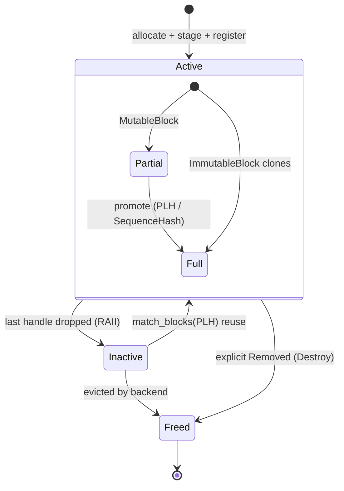

Mocker 是一款轻量、高保真的 LLM 推理引擎模拟器，完全用 Rust 实现。它在不需要 GPU 的情况下复现生产引擎的核心调度（scheduling）、内存管理与时序行为，对于测试 Dynamo 的路由、KV 缓存（KV cache）事件、解耦服务以及 planner 组件非常有价值。

## 概述

mocker 模拟：

- 带 LRU 驱逐的**基于 block 的 KV 缓存管理**
- 用于 vLLM 与 SGLang 的**引擎特定连续批处理调度器**
- 带基于哈希的 block 去重的**前缀缓存**
- 提升批处理效率的**分块 prefill（chunked prefill）**
- 用于 prefill 与 decode 阶段的**真实时序模型**
- **解耦服务**（prefill/decode 分离）
- 与 router 集成的 **KV 事件发布**
- **数据并行**（每个引擎多个 DP rank）

> **注意：** 虽然 mocker 以 vLLM 作为主要参考实现，但其核心组件 —— 基于 block 的 KV 缓存管理、连续批处理调度器、LRU 驱逐器与前缀缓存 —— 都是所有现代 LLM 推理引擎（包括 SGLang 与 TensorRT-LLM）的基础。这里模拟的架构模式与具体引擎无关，并广泛适用于推理生态。

## 快速开始

### 基础用法

```bash
# 启动单个 mocker worker
python -m dynamo.mocker --model-path Qwen/Qwen3-0.6B

# 启动并自定义 KV 缓存配置
python -m dynamo.mocker \
    --model-path Qwen/Qwen3-0.6B \
    --num-gpu-blocks-override 8192 \
    --block-size 64 \
    --max-num-seqs 256

# 启动并加速时序以加快测试
python -m dynamo.mocker \
    --model-path Qwen/Qwen3-0.6B \
    --speedup-ratio 10.0
```

### 解耦服务

```bash
# 启动 prefill worker
python -m dynamo.mocker \
    --model-path Qwen/Qwen3-0.6B \
    --disaggregation-mode prefill \
    --bootstrap-ports 50100

# 启动 decode worker（在另一个终端）
python -m dynamo.mocker \
    --model-path Qwen/Qwen3-0.6B \
    --disaggregation-mode decode
```

### 在一个进程内启动多个 worker

```bash
# 启动 4 个 mocker worker，共享同一个 tokio runtime
python -m dynamo.mocker \
    --model-path Qwen/Qwen3-0.6B \
    --num-workers 4
```

## CLI 参数

| 参数 | 默认值 | 说明 |
|----------|---------|-------------|
| `--model-path` | 必填 | HuggingFace 模型 ID 或用于 tokenizer 的本地路径 |
| `--endpoint` | 自动派生 | Dynamo 端点字符串。默认值依赖于命名空间，prefill worker 使用与聚合/decode worker 不同的默认端点 |
| `--model-name` | 从 model-path 派生 | 用于 API 响应的模型名 |
| `--num-gpu-blocks-override` | 16384 | KV 缓存 block 数量 |
| `--block-size` | 64（`vllm`）/ 引擎特定 | 每 KV 缓存 block 的 token 数。对 `sglang`，省略时实际 page/block 大小默认为 1，或当提供 `--sglang-page-size` 时为该值 |
| `--max-num-seqs` | 256 | 最大并发序列数 |
| `--max-num-batched-tokens` | 8192 | 每个 batch 的最大 token 数 |
| `--enable-prefix-caching` | True | 启用前缀缓存 |
| `--no-enable-prefix-caching` | - | 禁用前缀缓存 |
| `--enable-chunked-prefill` | True | 启用 chunked prefill |
| `--no-enable-chunked-prefill` | - | 禁用 chunked prefill |
| `--preemption-mode` | `lifo` | 内存压力下的 decode 驱逐策略：`lifo`（vLLM v1 风格）或 `fifo` |
| `--speedup-ratio` | 1.0 | 时序加速因子 |
| `--decode-speedup-ratio` | 1.0 | 仅 decode 的加速倍率（如用于 Eagle 推测） |
| `--data-parallel-size` | 1 | DP 副本数 |
| `--startup-time` | None | 模拟的启动延迟（秒） |
| `--planner-profile-data` | None | 指向 mocker 格式的 `.npz` 文件或 profiler 结果目录 |
| `--num-workers` | 1 | 每进程 worker 数 |
| `--reasoning` | None | 用于发出 reasoning token 跨度的 JSON 配置，包含 `start_thinking_token_id`、`end_thinking_token_id` 与 `thinking_ratio` |
| `--engine-type` | `vllm` | 引擎模拟类型：`vllm` 或 `sglang` |
| `--sglang-schedule-policy` | `fifo` / `fcfs` | SGLang 调度策略：`fifo`/`fcfs`（默认）或 `lpm`（最长前缀匹配） |
| `--sglang-page-size` | 1 | SGLang radix-cache 页大小（token 数）。当 `--engine-type sglang` 且省略 `--block-size` 时也作为有效 block size |
| `--sglang-max-prefill-tokens` | 16384 | SGLang 每 batch 最大 prefill-token 预算 |
| `--sglang-chunked-prefill-size` | 8192 | SGLang chunked-prefill 的 chunk 大小 |
| `--sglang-clip-max-new-tokens` | 4096 | SGLang 对最大新 token 的接纳预算上限 |
| `--sglang-schedule-conservativeness` | 1.0 | SGLang 调度保守度因子 |
| `--aic-perf-model` | False | 使用 AIC SDK 进行延迟预测，而非内插/多项式模型。仅按需启用：默认 mocker 与 replay 路径不使用 AIC。需要安装 `aiconfigurator` 并对所请求的 `system/backend/version` 三元组提供可用的 AIC systems/perf 数据 |
| `--aic-system` | `h200_sxm` | AIC system 名（如 `h200_sxm`）。与 `--aic-perf-model` 一起使用 |
| `--aic-backend-version` | Auto | AIC 后端引擎版本（如 vLLM 的 `0.12.0`）。未设置时使用该后端的默认版本 |
| `--aic-tp-size` | 1 | AIC 延迟预测的 tensor 并行尺寸。仅影响 AIC 性能模型查找，不影响 mocker 调度 |
| `--extra-engine-args` | None | 包含 mocker 配置的 JSON 文件路径；会覆盖单独的 CLI 参数 |
| `--stagger-delay` | -1 (auto) | worker 启动间隔（秒）。0 禁用，-1 启用自动 |
| `--disaggregation-mode` | `agg` | worker 模式：`agg`（聚合）、`prefill` 或 `decode` |
| `--durable-kv-events` | False | 已弃用的 JetStream KV-event 模式；优先使用本地索引器 / event-plane 订阅路径 |
| `--zmq-kv-events-ports` | None | 用于 KV 事件发布的 ZMQ PUB 基础端口（逗号分隔），每个 worker 一个 |
| `--zmq-replay-ports` | None | 用于 gap 恢复的 ZMQ ROUTER 基础端口（逗号分隔），每个 worker 一个 |
| `--bootstrap-ports` | None | 解耦模式下每个 worker 的 rendezvous 基础端口（逗号分隔） |
| `--kv-transfer-bandwidth` | 64.0 | KV 缓存传输带宽（GB/s）。设为 0 可禁用 |
| `--kv-cache-dtype` | auto | 用于按 token 字节计算的 KV 缓存 dtype |
| `--kv-bytes-per-token` | 自动计算 | KV 缓存的每 token 字节（覆盖自动计算） |
| `--discovery-backend` | 由环境驱动（`etcd`） | 发现后端：`kubernetes`、`etcd`、`file` 或 `mem` |
| `--request-plane` | 由环境驱动（`tcp`） | 请求传输：`nats`、`http` 或 `tcp` |
| `--event-plane` | 由环境驱动（`nats`） | 事件传输：`nats` 或 `zmq` |

## 环境变量

| 变量 | 默认值 | 说明 |
|----------|---------|-------------|
| `DYN_MOCKER_KV_CACHE_TRACE` | off | 设为 `1` 或 `true` 以记录结构化的 KV 缓存分配与驱逐 trace |

> **注意：** 对本地规模测试与 router 基准测试，应优先使用 `--num-workers` 而不是启动多个独立的 mocker 进程。所有 worker 共享一个 tokio runtime 与线程池，更轻量也更接近测试 harness 对 mocker 的使用方式。

## Trace Replay

mocker 通过专用的 replay CLI 支持 Mooncake 风格 trace 的回放，该 CLI 直接暴露
`offline|online`、`round_robin|kv_router`、`arrival_speedup_ratio`、闭环并发接纳、合成工作负载生成以及离线解耦 prefill/decode 回放：

replay CLI 默认 `--replay-mode offline` 与 `--router-mode round_robin`。聚合回放使用 `--extra-engine-args`。离线解耦回放则使用
`--prefill-engine-args` 加 `--decode-engine-args`，再配合
`--num-prefill-workers` 与 `--num-decode-workers`。

```bash
python -m dynamo.replay /path/to/mooncake_trace.jsonl \
    --num-workers 4 \
    --replay-mode offline \
    --router-mode kv_router \
    --arrival-speedup-ratio 5 \
    --trace-block-size 512 \
    --extra-engine-args '{"block_size":64}' \
    --router-config '{"router_queue_policy":"fcfs"}' \
    --report-json /tmp/replay-report.json
```

同一 CLI 也支持无 trace 文件的合成回放：

```bash
python -m dynamo.replay \
    --input-tokens 5000 \
    --output-tokens 500 \
    --request-count 1000 \
    --arrival-interval-ms 1.0 \
    --num-workers 1 \
    --replay-mode offline \
    --replay-concurrency 100 \
    --extra-engine-args '{"block_size":512}' \
    --report-json /tmp/replay-report.json
```

合成回放还支持工作负载风格生成，用于共享前缀和多轮测试：

```bash
python -m dynamo.replay \
    --input-tokens 5000 \
    --output-tokens 500 \
    --request-count 200 \
    --turns-per-session 3 \
    --shared-prefix-ratio 0.5 \
    --num-prefix-groups 8 \
    --inter-turn-delay-ms 250 \
    --replay-mode offline \
    --replay-concurrency 32 \
    --extra-engine-args '{"block_size":512}' \
    --report-json /tmp/replay-report.json
```

对于 trace 文件，当记录共享 `session_id` 时回放也理解多轮会话。第一轮使用 `timestamp`/`created_time`；后续轮可用 `delay` 或 `delay_ms`：

```json
{"session_id":"session-a","timestamp":1000,"input_length":2048,"output_length":128,"hash_ids":[1,2,3,4]}
{"session_id":"session-a","delay":250,"input_length":2560,"output_length":128,"hash_ids":[1,2,3,4,5]}
```

对于 trace 文件回放，`--trace-block-size` 控制每个 `hash_id` 在数据集中代表多少 token，而引擎 `block_size` 仍控制回放引擎与 router 哈希。公共 Mooncake/toolagent trace 使用 `--trace-block-size 512`；引擎 `block_size` 仍可保持为 `64` 以匹配实时运行配置。

独立 replay CLI 会向 stdout 打印 AIPerf 风格的汇总表，并把完整的回放报告 JSON 写入磁盘。

时序语义：

- trace 模式遵守第一轮时间戳与轮间延迟
- concurrency 模式忽略第一轮时间戳，但仍强制轮间延迟
- 在 concurrency 模式中，TTFT 从在 in-flight 上限下的实际派发开始计算

完整用法、约束与基准测试指南，参见 [Mocker Trace Replay](../benchmarks/mocker-trace-replay.md)。

回放支持聚合 `vllm` 与 `sglang` 引擎配置。内部回放使用规范化的 `block_size`；对 `sglang`，当两者都提供时仍可接受 `sglang.page_size` 作为兼容别名，前提是它与 `block_size` 一致。

离线回放也支持解耦 `kv_router` 模式。在该模式下：

- `--prefill-engine-args` 必须描述 prefill worker
- `--decode-engine-args` 必须描述 decode worker
- `--router-mode` 必须为 `kv_router`
- 仅支持离线回放

示例：

```bash
python -m dynamo.replay \
    --input-tokens 4096 \
    --output-tokens 256 \
    --request-count 100 \
    --replay-mode offline \
    --router-mode kv_router \
    --replay-concurrency 32 \
    --num-prefill-workers 2 \
    --num-decode-workers 6 \
    --prefill-engine-args '{"worker_type":"prefill","block_size":512}' \
    --decode-engine-args '{"worker_type":"decode","block_size":512}' \
    --router-config '{"router_queue_policy":"wspt"}' \
    --report-json /tmp/replay-report.json
```

## 性能建模设置

默认情况下，mocker 使用硬编码的多项式公式估算 prefill 与 decode 时序。若需要更真实的模拟，把 `--planner-profile-data` 指向：

- mocker 格式的 `.npz` 文件，或
- profiler 输出目录

mocker 会自动接受 profiler 风格的结果目录并在内部转换。

它也接受较旧的原始数据目录，含：

- `prefill_raw_data.json`
- `decode_raw_data.json`

```bash
python -m dynamo.mocker \
    --model-path nvidia/Llama-3.1-8B-Instruct-FP8 \
    --planner-profile-data components/src/dynamo/planner/tests/data/profiling_results/H200_TP1P_TP1D \
    --speedup-ratio 1.0
```

### AIC 性能模型

使用 AIC SDK 进行延迟预测：

```bash
uv pip install '.[mocker]'

python -m dynamo.mocker \
    --model-path nvidia/Llama-3.1-8B-Instruct-FP8 \
    --engine-type vllm \
    --aic-perf-model \
    --aic-system h200_sxm
```

AIC 模型会自动使用 `--model-path` 与 `--engine-type` 选择合适的性能数据。可用 system 包括 `h200_sxm`、`h100_sxm` 等（完整列表参见 AIC SDK 文档）。

重要说明：

- AIC 是按需启用的。如果不传 `--aic-perf-model`，`python -m dynamo.mocker` 不会使用 AIC。
- `python -m dynamo.replay` 有两个独立的 AIC 表面：
  - 通过 `--extra-engine-args` / 分阶段引擎 JSON 的引擎时序 AIC
  - 通过顶层 `--aic-*` flag 加 `--router-config` 中 `router_prefill_load_model="aic"` 的 router 端 prefill 负载 AIC
- Python 的 AIC session 桥接现在通过内部 `dynamo._internal.aic` 模块与实时 KV router 路径共享。Mocker CLI 行为不变；这只是去除了重复的 AIC session 代码。
- `aiconfigurator` 必须能为所选 `system/backend/version` 加载请求的性能数据库。如果 SDK 已安装但底层 systems 数据缺失或不可读，mocker 会在启动时快速失败并给出明确错误，而不是在第一次请求时才失败。
- 在开发环境中，这可能要求把 Python 指向 `aiconfigurator` 的源码 checkout，并在其 `systems/` 目录下物化真实的 Git LFS payload。

mocker 的 AIC 路径与 router 端的 prefill 负载估计器是分开的。实时 router、前端与 replay 都使用 `router_prefill_load_model="aic"` 加顶层 `--aic-*` flag 来对最早 prefill 的 prompt 负载进行衰减。当你希望 mocked worker 时序模型本身来自 AIC 时，replay 仍然单独使用 engine-args AIC。

对聚合回放，引擎时序 AIC 仍来自 `--extra-engine-args`：

```bash
python -m dynamo.replay /path/to/trace.jsonl \
    --extra-engine-args '{"aic_backend":"vllm","aic_system":"h200_sxm","aic_model_path":"nvidia/Llama-3.1-8B-Instruct-FP8","aic_tp_size":1}'
```

对离线解耦回放，改为传递分阶段引擎配置：

```bash
python -m dynamo.replay /path/to/trace.jsonl \
    --replay-mode offline \
    --router-mode kv_router \
    --prefill-engine-args '{"worker_type":"prefill","aic_backend":"vllm","aic_system":"h200_sxm","aic_model_path":"nvidia/Llama-3.1-8B-Instruct-FP8","aic_tp_size":1,"block_size":512}' \
    --decode-engine-args '{"worker_type":"decode","aic_backend":"vllm","aic_system":"h200_sxm","aic_model_path":"nvidia/Llama-3.1-8B-Instruct-FP8","aic_tp_size":1,"block_size":512}' \
    --num-prefill-workers 2 \
    --num-decode-workers 6
```

`aic_backend` 字段启用 AIC perf 模型，应与 `engine_type` 匹配（`"vllm"` 或 `"sglang"`）。`aic_model_path` 字段相当于 `dynamo.mocker` 中的 `--model-path`。

回放 router 端 AIC prompt 负载建模通过顶层 flag 单独配置：

```bash
python -m dynamo.replay /path/to/trace.jsonl \
    --replay-mode offline \
    --router-mode kv_router \
    --num-workers 4 \
    --trace-block-size 512 \
    --extra-engine-args '{"block_size":64}' \
    --router-config '{"router_track_prefill_tokens":true,"router_prefill_load_model":"aic"}' \
    --aic-backend vllm \
    --aic-system h200_sxm \
    --aic-model-path nvidia/Llama-3.1-8B-Instruct-FP8 \
    --aic-tp-size 1
```

对离线解耦回放，相同的顶层 `--aic-*` flag 仅驱动 prefill 阶段的 router；decode 阶段的 router 保持禁用 prompt 跟踪。

`--reasoning` 配置示例：

```bash
python -m dynamo.mocker \
    --model-path Qwen/Qwen3-0.6B \
    --reasoning '{"start_thinking_token_id":123,"end_thinking_token_id":456,"thinking_ratio":0.6}'
```

profile 结果目录应包含：

- `selected_prefill_interpolation/raw_data.npz`
- `selected_decode_interpolation/raw_data.npz`

为你自己的模型与硬件生成 profile 数据，请运行 profiler，然后把 `--planner-profile-data` 指向所产生的输出目录。

## 事件传输与 Router 测试

默认事件路径使用本地索引器 / event-plane 订阅流。较旧的持久化 KV-events 模式仍可通过 `--durable-kv-events` 使用，但已弃用，新测试不应优先采用。

对于需要原生连线格式事件转发的 router 与索引器实验，mocker 也支持 ZMQ 路径：

- `--event-plane zmq`
- `--zmq-kv-events-ports` 用于每 worker 的 PUB 基础端口
- `--zmq-replay-ports` 用于可选的回放/gap 恢复 ROUTER 基础端口

设置后，每个 worker 在其基础端口加 `dp_rank` 上绑定，因此逗号分隔的基础端口数量必须与 `--num-workers` 匹配。

## 解耦端口布局

`--bootstrap-ports` 接受用逗号分隔的基础端口列表，每个 worker 一个。在多 worker 模式下，所列端口数量必须与 `--num-workers` 完全相同。

prefill worker 监听这些端口，并通过 discovery 发布 bootstrap 端点。decode worker 使用匹配的端口在 decode 开始前完成 rendezvous。

## Kubernetes 部署

mocker 可通过聚合与解耦部署的示例 `DynamoGraphDeployment` 清单进行部署：

```bash
kubectl apply -f examples/backends/mocker/deploy/agg.yaml
kubectl apply -f examples/backends/mocker/deploy/disagg.yaml
```

## 架构

mocker 由若干协作组件组成，呼应生产 LLM 推理引擎的内部架构。调度器（vLLM 风格与 SGLang 风格变体）与 KV block 管理器位于引擎核心内。多引擎行为 —— KV 传输/offload 模拟、KV router 模拟、planner 模拟 —— 由 replay harness 在多个引擎核心之上叠加；组件级别图与离线回放内部细节见 [Mocker Trace Replay](../benchmarks/mocker-trace-replay.md) 以及 [`lib/mocker/src/replay/offline/`](../../lib/mocker/src/replay/offline/README.md)。

### 调度器

mocker 现在有两种调度器形态而非单一通用队列模型：

- **vLLM mocker** 使用上游风格的 `waiting + running` 调度器。每个请求跟踪已计算 token 数，调度器先把单个 token 预算花在 running 集合上，decode 压力会触发对运行中请求的内联抢占。
- **SGLang mocker** 使用围绕 radix 风格前缀缓存的 cache-aware waiting/running 调度器。它在 decode 状态感知下批处理 prefill 工作，主要通过 decode 回退来处理压力，同时保留缓存的前缀。

两种调度器都模拟连续批处理、前缀复用、chunked prefill、内存压力以及 decode token 发射，并发布关于当前资源利用的指标。

当资源紧张时，mocker 模拟引擎真实的恢复路径：
- vLLM 风格的 decode 抢占与 recompute
- SGLang 风格的 decode 回退加保留前缀的缓存更新

### KV Block 管理器

mocker 的 KV block 管理器现在基于 [`kvbm-logical::BlockManager<G1>`](../../lib/kvbm-logical/) —— 与真实 Dynamo runtime 使用的逻辑 block 管理器相同。mocker 在 [`lib/mocker/src/kv_manager/kvbm_backend.rs`](../../lib/mocker/src/kv_manager/kvbm_backend.rs) 中包装它，并把自身的 `MoveBlock` 协议翻译到 kvbm-logical 的 RAII 生命周期（`allocate → stage → register → drop`）。

在概念上，block 仍存在于两种池之一：

- **Active** —— 当前由至少一个序列持有的 block。部分填充（仍在写入）的 block 作为 `MutableBlock<G1>` 持有；满 block 作为 `ImmutableBlock<G1>` clone 持有（clone 向量长度即 mocker 的引用计数，每个 `Use` 一份）。
- **Inactive** —— 不再被任何序列引用、但保留以供前缀缓存复用的 block。完全由 kvbm-logical 的 inactive 池处理；mocker 从不手动跟踪它们。

生命周期是 RAII：drop 最后一个 `ImmutableBlock` clone 会让 block 从 active 转为 inactive（kvbm-logical 的 `reset` 池），mocker 这边没有显式 `deref`/`evict` 簿记。当序列结束或被抢占时，mocker 仅 drop 其句柄；kvbm-logical 回收容量。



为发出 KV 事件，跟踪三种 `Use` 结果：`ActiveHit`（在已固定 block 上递增引用计数）、`InactiveHit`（通过 `match_blocks(plh)` 重新激活）、`NewStore`（全新分配）。仅 `NewStore` 发出 `Stored` KV 事件 —— router 的 radix tree 已知道其他两种，且仅在显式 `Removed` 时才忘记。

### 驱逐后端

kvbm-logical 的 inactive 池通过三种后端之一选择驱逐受害者，在 [`lib/mocker/src/common/protocols.rs`](../../lib/mocker/src/common/protocols.rs) 中暴露为 `MockerEvictionBackend`：

- **`Lineage`**（默认）—— 基于父链：先驱逐叶子 block，保留共享前缀链。包含原先手写 `LRUEvictor::push_front` 提供的抢占优先级行为。
- **`Lru`** —— 普通基于最近使用的 LRU。
- **`MultiLru`** —— 基于 TinyLFU 跟踪器的 4 层频率感知 LRU。

三者都得到与原驱逐器一致的「先驱逐后缀 block，再驱逐共享前缀」效果；`Lineage` 通过 block 父链结构实现，而非单调计数器。

### 序列跟踪

每个活动请求作为一个 sequence 跟踪，管理其 token block 与生成状态。随着 token 生成，sequence 跟踪哪些 block 是部分（`MutableBlock<G1>`，仍在填充）vs 满（`ImmutableBlock<G1>`，完整且可被前缀缓存哈希）。当部分 block 填满时，被「提升」为带有基于内容的 `SequenceHash` 的满 block（如果 PLH 已注册则收敛到现有句柄上），从而让具有匹配前缀的后续请求获得缓存命中。

### 性能模型

mocker 支持三种时序预测模式：

**多项式模型（默认）：** 使用近似典型 GPU 行为的硬编码多项式公式。Prefill 时间随 token 数二次缩放，decode 时间依赖总活跃 KV 缓存大小。

**插值模型：** 从包含已测 prefill 与 decode 延迟的 NPZ 文件加载真实 profiling 数据。mocker 在数据点之间插值以预测任意输入大小的时序。这能与具体硬件配置高度匹配地模拟。

**AIC 模型（`--aic-perf-model`）：** 使用 NVIDIA AI Configurator（AIC）SDK 进行延迟预测。AIC 为特定 GPU/模型/引擎组合提供校准的性能模型，将 prefill 与 decode 延迟预测为 batch size、序列长度与前缀缓存命中数的函数。模型路径自动从 `--model-path` 派生，引擎类型来自 `--engine-type`。该模式按需启用，需同时具备 `aiconfigurator` SDK 与对所请求三元组可加载的 systems/perf 数据。

### Bootstrap Rendezvous（解耦服务）

对解耦 prefill/decode 部署，prefill 与 decode worker 通过简单的基于 TCP 的 rendezvous 协议协调。decode worker 连接到 prefill worker 的 bootstrap 端口，等到 prefill 完成且 KV 缓存准备就绪。任一侧可先到达 —— 两侧都准备好时 rendezvous 完成。

### KV 传输延迟模拟

mocker 模拟 prefill 与 decode worker 间的 KV 缓存传输时间。在 prefill worker 发出其首个（也是唯一一个）token 之前，它会按以下因素 sleep 一段时间：

- **kv_bytes_per_token**（自动从模型配置算出）：`num_layers * 2 * num_kv_heads * head_dim * dtype_bytes`。`dtype_bytes` 由 `--kv-cache-dtype` 决定：当设为 `auto`（默认）时使用配置中模型的 `dtype`；当显式设置（如 `fp8`）时使用所指定的 dtype。它也可以直接通过 `--kv-bytes-per-token` 覆盖。
- **kv_transfer_bandwidth**（默认：64.0 GB/s，节点间 InfiniBand）
- **传输时间**：`num_input_tokens * kv_bytes_per_token / bandwidth`

该延迟在调度器的 prefill 计算模拟完成后注入，建模顺序流：prefill 计算 → KV 传输 → decode 开始。设置 `--kv-transfer-bandwidth 0` 可禁用。

## 与 Dynamo 的集成

### KV 事件发布

启用前缀缓存时，mocker 会向分布式 runtime 发布 KV 缓存事件。这些事件在 block 被存储（缓存了新内容）或被移除（被驱逐）时通知系统。这让 KV 感知 router 能基于哪些 worker 缓存了哪些前缀做出智能路由决策。

### 指标发布

每个调度器发布关于其当前状态的指标，包括每 DP rank 的活跃 decode block 数。router 使用这些指标做负载感知路由决策。

## 测试场景

mocker 特别适用于：

1. **Router 测试** - 在无 GPU 情况下验证 KV 感知路由
2. **Planner 测试** - 用真实时序测试基于 SLA 的 planner
3. **容错** - 测试请求迁移、优雅关停
4. **解耦** - 测试 P/D 分离与 KV 传输协调
5. **性能建模** - 原型化调度策略
6. **CI/CD** - 不依赖硬件的快速集成测试

## 与真实引擎的对比

| 特性 | 真实引擎 | Mocker |
|---------|-------------|--------|
| 是否需要 GPU | 是 | 否 |
| Block 管理器 | 分页 KV 缓存 | 模拟 block |
| 调度器 | 连续批处理 | 连续批处理 |
| 前缀缓存 | 基于哈希 | 基于哈希 |
| Chunked Prefill | 支持 | 支持 |
| 抢占 | recompute/swap | recompute（模拟） |
| 时序 | 真实执行 | 基于模型 |
| KV 事件 | 原生 | 兼容 |
| 数据并行 | 多 GPU | 模拟 |

## 后续步骤

| 文档 | 说明 |
|----------|-------------|
| [Benchmarking Dynamo Deployments](../benchmarks/benchmarking.md) | 对 mocker 支撑的部署运行 AIPerf 以测量延迟、TTFT、吞吐量与扩缩行为 |
| [Aggregated Mocker Deployment Example](../../examples/backends/mocker/deploy/agg.yaml) | 在 Kubernetes 上部署 mocker 支撑的聚合 DynamoGraphDeployment |
| [Disaggregated Mocker Deployment Example](../../examples/backends/mocker/deploy/disagg.yaml) | 为解耦服务基准部署独立的 prefill 与 decode mocker worker |
| [Global Planner Mocker Example](../../examples/global_planner/global-planner-mocker-test.yaml) | 用于 planner 与 global-router 实验的进阶多池 mocker 配置 |

## 特性缺口（WIP）

> 关于更宏观的 mocker 增强路线图，参见 [#6383](https://github.com/ai-dynamo/dynamo/issues/6383)。

mocker 当前尚未支持以下特性：

- **多层内存** - 不支持把 KV 缓存 offload 到 CPU/磁盘或重新加载回 GPU；将来可能与 KVBM 集成
- **多模态支持** - 当前仅模拟文本 token 处理；无视觉编码器或交叉注意力模拟
- **原生 Rust 引用计数** - 正在用原生 Rc/Arc 替换 block 引用计数，以实现更简单跟踪的自然 RAII 模式
