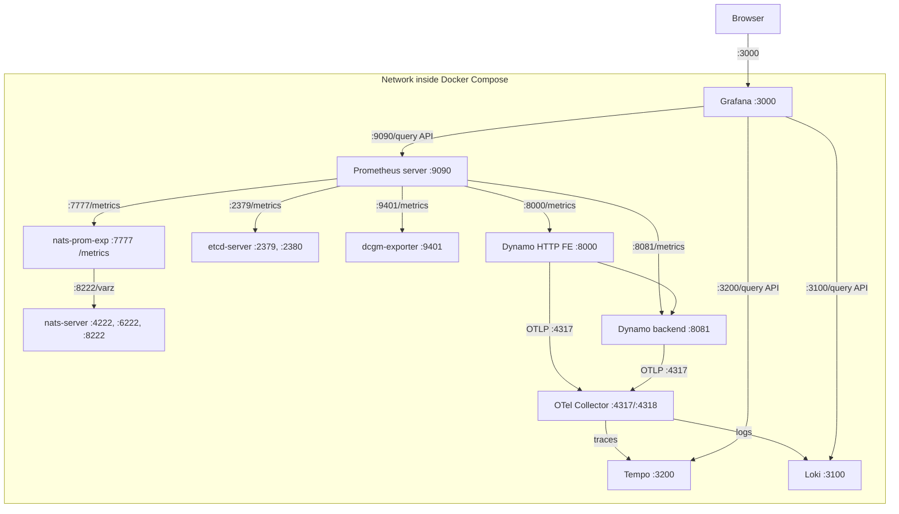

## 快速开始

下面这个示例可以让你在单台机器上快速上手。

### 前置条件

请在你的机器上安装：

- [Docker](https://docs.docker.com/get-docker/)
- [Docker Compose](https://docs.docker.com/compose/install/)

### 启动可观测性栈

Dynamo 提供了基于 Docker Compose 的可观测性栈，包含 Prometheus、Grafana、Tempo、Loki、OpenTelemetry Collector，以及用于指标、追踪、日志与可视化的多种 exporter。

在 Dynamo 根目录下：

```bash
# Start infrastructure (NATS, etcd)
docker compose -f deploy/docker-compose.yml up -d

# Start observability stack (Prometheus, Grafana, Tempo, DCGM GPU exporter, NATS exporter)
docker compose -f deploy/docker-observability.yml up -d
```

详细的安装说明与配置见 [Prometheus + Grafana 配置](prometheus-grafana.md)。

## 可观测性文档

| 指南 | 描述 | 控制环境变量 |
|-------|-------------|----------------------------------|
| [Metrics](metrics.md) | 可用指标参考 | `DYN_SYSTEM_PORT`† |
| [Operator Metrics（Kubernetes）](../kubernetes/observability/operator-metrics.md) | Kubernetes 上的 Operator 控制器与 webhook 指标 | N/A（通过 Helm 配置） |
| [Health Checks](health-checks.md) | 组件健康监控与就绪探针 | `DYN_SYSTEM_PORT`†、`DYN_SYSTEM_STARTING_HEALTH_STATUS`、`DYN_SYSTEM_HEALTH_PATH`、`DYN_SYSTEM_LIVE_PATH`、`DYN_SYSTEM_USE_ENDPOINT_HEALTH_STATUS` |
| [Tracing](tracing.md) | 使用 OpenTelemetry 与 Tempo 的分布式追踪 | `DYN_LOGGING_JSONL`†、`OTEL_EXPORT_ENABLED`†、`OTEL_EXPORTER_OTLP_TRACES_ENDPOINT`†、`OTEL_SERVICE_NAME`† |
| [Logging](logging.md) | 结构化日志与到 Loki 的 OTLP 日志导出 | `DYN_LOGGING_JSONL`†、`DYN_LOG`、`DYN_LOG_USE_LOCAL_TZ`、`DYN_LOGGING_CONFIG_PATH`、`OTEL_SERVICE_NAME`†、`OTEL_EXPORT_ENABLED`†、`OTEL_EXPORTER_OTLP_TRACES_ENDPOINT`†、`OTEL_EXPORTER_OTLP_LOGS_ENDPOINT`† |

**带 † 的变量在多个可观测性系统间共享。**

## 开发者指南

| 指南 | 描述 | 控制环境变量 |
|-------|-------------|----------------------------------|
| [Metrics 开发指南](metrics-developer-guide.md) | 在 Rust 与 Python 中创建自定义指标 | `DYN_SYSTEM_PORT`† |

## Kubernetes

Kubernetes 特定的安装与配置请参阅 [docs/kubernetes/observability/](../kubernetes/observability/metrics.md)。

**Operator 指标**：运行在 Kubernetes 中的 Dynamo Operator 暴露其自身的一组指标，用于监控控制器协调、webhook 校验与资源清单。详见 [Operator Metrics 指南](../kubernetes/observability/operator-metrics.md)。

---

## 拓扑

它提供：
- **Prometheus** 在 `http://localhost:9090` - 指标采集与查询
- **Grafana** 在 `http://localhost:3000` - 可视化仪表盘（用户名：`dynamo`，密码：`dynamo`）
- **Tempo** 在 `http://localhost:3200` - 分布式追踪后端
- **Loki** 在 `http://localhost:3100` - 日志聚合后端
- **OpenTelemetry Collector** 在 `http://localhost:4317`（gRPC） / `http://localhost:4318`（HTTP） - 接收 OTLP 信号，将 trace 路由到 Tempo，将日志路由到 Loki
- **DCGM Exporter** 在 `http://localhost:9401/metrics` - GPU 指标
- **NATS Exporter** 在 `http://localhost:7777/metrics` - NATS 消息指标

### 服务关系图


Docker Compose 网络中的 dcgm-exporter 服务被配置为使用端口 9401 而非默认的 9400。这样调整是为了避免与其他可能同时运行的 dcgm-exporter 实例发生端口冲突。这种配置在 SLURM 等分布式系统中很常见。

### 配置文件

下列配置文件位于 `deploy/observability/` 目录中：
- [docker-compose.yml](https://github.com/ai-dynamo/dynamo/tree/main/deploy/docker-compose.yml)：定义 NATS 与 etcd 服务
- [docker-observability.yml](https://github.com/ai-dynamo/dynamo/tree/main/deploy/docker-observability.yml)：定义 Prometheus、Grafana、Tempo 与各 exporter
- [prometheus.yml](https://github.com/ai-dynamo/dynamo/tree/main/deploy/observability/prometheus.yml)：包含 Prometheus 抓取配置
- [grafana-datasources.yml](https://github.com/ai-dynamo/dynamo/tree/main/deploy/observability/grafana-datasources.yml)：包含 Grafana 数据源配置
- [otel-collector.yaml](https://github.com/ai-dynamo/dynamo/blob/main/deploy/observability/otel-collector.yaml)：OpenTelemetry Collector 配置（trace 路由到 Tempo，日志路由到 Loki）
- [loki.yaml](https://github.com/ai-dynamo/dynamo/blob/main/deploy/observability/loki.yaml)：Loki 日志聚合配置
- [loki-datasource.yml](https://github.com/ai-dynamo/dynamo/blob/main/deploy/observability/loki-datasource.yml)：Grafana Loki 数据源，带 trace ID 关联到 Tempo
- [grafana_dashboards/dashboard-providers.yml](https://github.com/ai-dynamo/dynamo/tree/main/deploy/observability/grafana_dashboards/dashboard-providers.yml)：包含 Grafana 仪表盘 provider 配置
- [grafana_dashboards/dynamo.json](https://github.com/ai-dynamo/dynamo/tree/main/deploy/observability/grafana_dashboards/dynamo.json)：兼顾软硬件指标的通用 Dynamo Dashboard
- [grafana_dashboards/dcgm-metrics.json](https://github.com/ai-dynamo/dynamo/tree/main/deploy/observability/grafana_dashboards/dcgm-metrics.json)：DCGM GPU 指标的 Grafana 仪表盘配置
- [grafana_dashboards/kvbm.json](https://github.com/ai-dynamo/dynamo/tree/main/deploy/observability/grafana_dashboards/kvbm.json)：KVBM 指标的 Grafana 仪表盘配置
