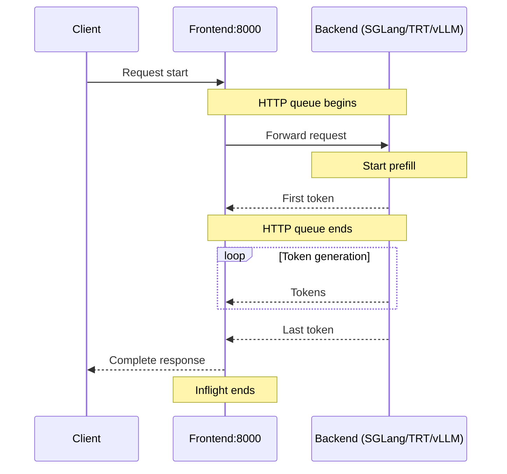

## 概览

Dynamo 通过 Dynamo metrics API 提供内置的指标（metrics）能力，只要使用 `DistributedRuntime` 框架，该能力就自动可用。本文档作为 Dynamo 中所有可用指标的参考。

**关于可视化的搭建说明**，请参阅 [Prometheus and Grafana Setup Guide](prometheus-grafana.md)。

**关于自定义指标的创建**，请参阅 [Metrics Developer Guide](metrics-developer-guide.md)。

## 环境变量

| 变量 | 说明 | 默认值 | 示例 |
|----------|-------------|---------|---------|
| `DYN_SYSTEM_PORT` | 后端组件的指标 / 健康检查端口 | `-1`（已禁用） | `8081` |
| `DYN_HTTP_PORT` | 前端 HTTP 端口（也可通过 `--http-port` 配置） | `8000` | `8000` |
| `NIXL_TELEMETRY_ENABLE` | 启用 NIXL 遥测（参见 [NIXL Telemetry Metrics](#nixl-telemetry-metrics)）。可选值：`y`、`n` | `n`（已禁用） | `y` |

## 快速开始

下面是单机示例。

### 启动可观测性（observability）栈

要使用 Prometheus 与 Grafana 可视化指标，请启动可观测性栈。详见 [Observability Getting Started](README.md#getting-started-quickly)。


### 启动 Dynamo 组件

启动一个前端和一个 vLLM 后端来测试指标：

```bash
# Start frontend (default port 8000, override with --http-port or DYN_HTTP_PORT env var)
$ python -m dynamo.frontend

# Enable backend worker's system metrics on port 8081
$ DYN_SYSTEM_PORT=8081 python -m dynamo.vllm --model Qwen/Qwen3-0.6B  \
   --enforce-eager --no-enable-prefix-caching --max-num-seqs 3
```

等待 vLLM worker 启动后，发送请求并查看指标：

```bash
# Send a request
curl -H 'Content-Type: application/json' \
-d '{
  "model": "Qwen/Qwen3-0.6B",
  "max_completion_tokens": 100,
  "messages": [{"role": "user", "content": "Hello"}]
}' \
http://localhost:8000/v1/chat/completions

# Check metrics from the backend worker
curl -s localhost:8081/metrics | grep dynamo_component
```

## 暴露的指标

Dynamo 在 `/metrics` HTTP 端点上以 Prometheus Exposition Format 文本暴露指标。所有 Dynamo 自身产生的指标都使用 `dynamo_*` 前缀，并附带标签（`dynamo_namespace`、`dynamo_component`、`dynamo_endpoint`）以标识来源组件。

**Prometheus Exposition Format 文本示例：**

```
# HELP dynamo_component_requests_total Total requests processed
# TYPE dynamo_component_requests_total counter
dynamo_component_requests_total{dynamo_namespace="default",dynamo_component="backend",dynamo_endpoint="generate"} 42

# HELP dynamo_component_request_duration_seconds Request processing time
# TYPE dynamo_component_request_duration_seconds histogram
dynamo_component_request_duration_seconds_bucket{dynamo_namespace="default",dynamo_component="backend",dynamo_endpoint="generate",le="0.005"} 10
dynamo_component_request_duration_seconds_bucket{dynamo_namespace="default",dynamo_component="backend",dynamo_endpoint="generate",le="0.01"} 15
dynamo_component_request_duration_seconds_bucket{dynamo_namespace="default",dynamo_component="backend",dynamo_endpoint="generate",le="+Inf"} 42
dynamo_component_request_duration_seconds_sum{dynamo_namespace="default",dynamo_component="backend",dynamo_endpoint="generate"} 2.5
dynamo_component_request_duration_seconds_count{dynamo_namespace="default",dynamo_component="backend",dynamo_endpoint="generate"} 42
```

### 指标类别

Dynamo 暴露多种类别的指标：

- **前端指标**（`dynamo_frontend_*`）—— 请求处理、token 处理与延迟测量
- **组件指标**（`dynamo_component_*`）—— 请求计数、处理时间、字节传输与系统正常运行时间
- **专用组件指标**（如 `dynamo_preprocessor_*`）—— 组件特有的指标
- **引擎指标**（透传）—— 后端引擎暴露其自身指标：[vLLM](../backends/vllm/vllm-observability.md)（`vllm:*`）、[SGLang](../backends/sglang/sglang-observability.md)（`sglang:*`）、[TensorRT-LLM](../backends/trtllm/trtllm-observability.md)（`trtllm_*`）

## 运行时层级

Dynamo metrics API 同时在 `DistributedRuntime`、`Namespace`、`Component`、`Endpoint` 上可用，提供与 Dynamo 分布式架构匹配的层级化指标采集方式：

- `DistributedRuntime`：覆盖整个 runtime 的全局指标
- `Namespace`：作用范围为某个 dynamo_namespace 的指标
- `Component`：某个 namespace 内特定 dynamo_component 的指标
- `Endpoint`：某个组件内单独 dynamo_endpoint 的指标

这种层级结构允许你在合适的粒度上为监控需要创建指标。

## 可用指标

**注意：** 带标签的指标（`HistogramVec`、`CounterVec`、`GaugeVec`）注册的是一组指标 *family*，而不是单条时间序列。某个标签组合的序列只有在第一次为该组合调用 `with_label_values(...)` 之后才会出现在 `/metrics` 中——也就是在第一条匹配的请求被服务之后。例如，`dynamo_frontend_request_duration_seconds{model="Qwen/Qwen3-0.6B"}` 在刚启动的前端上不会出现，直到处理过该模型的一次请求。这是 Prometheus client 的预期行为，并非指标缺失。

### 后端组件指标

**后端 worker**（`python -m dynamo.vllm`、`python -m dynamo.sglang` 等）在系统状态端口（通过 `DYN_SYSTEM_PORT` 配置，默认禁用）上暴露 `dynamo_component_*` 指标。在 Kubernetes 中，operator 通常将其设为 `DYN_SYSTEM_PORT=9090`；本地开发时必须显式设置（例如 `DYN_SYSTEM_PORT=8081`）。

Dynamo 后端核心系统在 `/metrics` 端点上以 `dynamo_component_*` 前缀暴露指标，覆盖所有使用 `DistributedRuntime` 框架的组件：

- `dynamo_component_inflight_requests`：当前正在处理的请求数（gauge）
- `dynamo_component_request_bytes_total`：请求中接收到的字节总数（counter）
- `dynamo_component_request_duration_seconds`：请求处理时间（histogram）
- `dynamo_component_requests_total`：处理过的请求总数（counter）
- `dynamo_component_errors_total`：处理请求时遇到的错误总数（counter，带 `error_type` 标签）。参见 [Component Error Types](#component-error-types)。
- `dynamo_component_response_bytes_total`：响应中发送的字节总数（counter）
- `dynamo_component_uptime_seconds`：DistributedRuntime 正常运行时间（gauge）。在每次 Prometheus 抓取前自动更新，前端（端口 8000 的 `/metrics`）和系统状态服务器（设置了 `DYN_SYSTEM_PORT` 时其 `/metrics`）都会更新。

**访问后端组件指标：**
```bash
# Set DYN_SYSTEM_PORT to enable the system status server
DYN_SYSTEM_PORT=8081 python -m dynamo.vllm --model <model>
curl http://localhost:8081/metrics
```

#### 组件标签

后端 `dynamo_component_*` 序列携带两组标签：Dynamo runtime 自身发出的，以及 Prometheus/Kubernetes 在抓取时附加的。

**Dynamo runtime 自动注入**（由 `lib/runtime/src/metrics.rs` 中的 `create_metric()` 为每个通过 namespace/component/endpoint 层级注册的指标添加）：

| 标签 | 说明 | 示例 |
|-------|-------------|---------|
| `dynamo_namespace` | Dynamo runtime 命名空间——同一部署中所有组件（router / prefill / decode / encode）共享的逻辑作用域。**不是** K8s namespace。 | `dynamo_cloud_vllm_v1_disagg_router_071de157` |
| `dynamo_component` | 服务角色：见下文 [Component Names](#component-names)。 | `backend`、`prefill`、`router` |
| `dynamo_endpoint` | 该组件内的 RPC：见下文 [Endpoint Names](#endpoint-names)。 | `generate`、`clear_kv_blocks`、`worker_kv_indexer_query_dp0` |
| `worker_id` | 该 endpoint 的 discovery 实例 ID（十六进制编码），提供与 Kubernetes 无关的稳定 per-worker 身份。仅当 endpoint 层级具有 connection ID 时注入。 | `1a2b3c4d` |

**注册时由后端代码添加**（worker 调用 `serve_endpoint()` 时通过 `metrics_labels=` 传入——非自动注入，是否存在取决于后端）：

| 标签 | 说明 | 示例 |
|-------|-------------|---------|
| `model` | 提供服务的模型（OpenAI 风格的标签）。由 vLLM、SGLang、TRT-LLM worker 在推理 endpoint 上添加；像 `worker_kv_indexer_query_dp{N}` 这样的内部 endpoint 上不存在。 | `Qwen/Qwen3-0.6B` |
| `model_name` | 同一模型标识符的第二个标签名，为兼容引擎原生与 dashboard 而保留。由 vLLM 和 TRT-LLM worker 添加；SGLang **不** 添加。 | `Qwen/Qwen3-0.6B` |

**由指标自身添加**：

| 标签 | 说明 | 示例 |
|-------|-------------|---------|
| `error_type` | 仅出现在 `dynamo_component_errors_total` 上——失败类别。参见 [Component Error Types](#component-error-types)。 | `generate`、`publish_response` |

**Prometheus / Kubernetes 注入（由抓取器添加，不在指标自身中）：**

| 标签 | 说明 | 示例 |
|-------|-------------|---------|
| `instance` | 抓取目标，格式为 `<podIP>:<metricsPort>`。 | `192.168.133.236:9090` |
| `pod` | Kubernetes pod 名；副本级别的区分符。 | `vllm-v1-disagg-router-vllmdecodeworker-...` |
| `container` | pod 内容器名（通常是 `main`）。 | `main` |
| `namespace` | pod 所在的 Kubernetes namespace。**不同于** `dynamo_namespace`。 | `dynamo-cloud` |
| `job` | Prometheus 抓取任务名，`<k8s-namespace>/<service-name>`。 | `dynamo-cloud/dynamo-worker` |
| `endpoint` | Prometheus 抓取的 K8s `Service` 上的命名端口。**不同于** `dynamo_endpoint`。 | `system` |

> **当心这些命名冲突：**
> - `dynamo_namespace`（Dynamo 部署作用域）与 `namespace`（K8s namespace）。
> - `dynamo_endpoint`（Dynamo RPC）与 `endpoint`（K8s Service 端口名）。

#### 组件名（Component Names）

`dynamo_component_*` 序列上 `dynamo_component` 标签可能出现的取值。HTTP 前端（`python -m dynamo.frontend`）**不在** 此列表中——它暴露自己的 `dynamo_frontend_*` 指标 family，而非 `dynamo_component_*`。

| 取值 | 含义 |
|-------|---------|
| `router` | 独立的 KV router（`python -m dynamo.router`）。 |
| `Planner` | planner 组件（`python -m dynamo.planner`）。注意大写的 `P`。 |
| `prefill` | 解耦（disaggregated）服务中的 prefill worker（所有后端）。 |
| `backend` | vLLM、SGLang 与 mocker 在解耦服务中的 decode worker，**以及** vLLM 在聚合（aggregated）模式下的合并 worker。 |
| `tensorrt_llm` | TRT-LLM 在解耦服务中的 decode worker。 |
| `tensorrt_llm_encode` | TRT-LLM 的 encode worker。 |
| `encode` | vLLM 的 encode worker。 |
| `diffusion` | TRT-LLM 的 diffusion worker。 |

内部子系统（例如 block manager 中的 `kvbm`、KV router 中的 `sequences`）也会创建组件，可能出现在 `dynamo_component_*` 序列中。vLLM/SGLang 的默认值可通过在 worker 命令行传入 `--endpoint dyn://<ns>.<component>.<endpoint>` 覆盖。

> 把 decode worker 命名为 `backend` 是历史遗留。runtime 中有一个 TODO，要引入 `decode` 常量并迁移过去（见 `lib/runtime/src/metrics/prometheus_names.rs::component_names`）。

#### Endpoint 名（Endpoint Names）

后端 worker 上 `dynamo_endpoint` 标签可能出现的取值：

| 取值 | 含义 |
|-------|---------|
| `generate` | 主推理 RPC；每接收一次请求自增一次。在 prefill worker 上，对应 prefill 阶段的 `generate` 调用次数（路由器路由过来的每个请求一次）；在 decode worker 上，对应 decode 阶段的 `generate` 调用次数。 |
| `clear_kv_blocks` | 清空该 worker KV 缓存的管理 RPC。在 prefill 与 decode worker 上都有注册。 |
| `worker_kv_indexer_query_dp{N}` | KV-router 对 worker 本地 KV indexer 关于其缓存前缀块的查询。每个 data-parallel rank 一个 endpoint（`_dp0`、`_dp1`……）。出现在持有路由器要查询的前缀缓存的 worker 上——在解耦服务中即 prefill worker。 |

#### 组件错误类型（Component Error Types）

`dynamo_component_errors_total` 计数器以 `error_type` 标签标识请求处理的哪个阶段失败：

| `error_type` | 阶段 | 含义 |
|--------------|-------|---------|
| `deserialization` | 入站 | 无法解析传入的请求负载。 |
| `invalid_message` | 入站 | 传入消息存在线格式违规。 |
| `response_stream` | 调用 generate 之前 | worker 收到了请求但无法打开回到前端的响应流（在 `generate` 被调用前出现传输问题）。 |
| `generate` | 引擎 | 引擎的 `generate()` 自身返回错误。这是反映引擎/推理失败的计数器。 |
| `publish_response` | 流式 | 引擎产生了响应分片但 worker 无法把其中之一发回前端（流中途写入失败）。**客户端取消时也会触发**——前端在流结束之前断开——因此该计数器可能被用户中止的请求放大。 |
| `publish_final` | 终结 | 所有响应分片已发送完毕，但 worker 未能投递最后的流完成标记。连接在结尾处刚好断掉。 |

### 专用组件指标

部分组件会暴露其特有的额外指标：

- `dynamo_preprocessor_*`：预处理器组件特有的指标

### 前端指标

**重要：** 前端与后端 worker 是分开的组件，并在不同端口上暴露指标。后端指标见 [Backend Component Metrics](#backend-component-metrics)。

Dynamo HTTP 前端（`python -m dynamo.frontend`）默认在端口 8000 上的 `/metrics` 端点暴露 `dynamo_frontend_*` 指标（可通过 `--http-port` 或 `DYN_HTTP_PORT` 配置）。多数指标包含包含模型名的 `model` 标签：

- `dynamo_frontend_active_requests`：当前由前端处理的请求数，从 HTTP handler 进入起到响应流结束（gauge）。这是顶层的 in-flight 计数，不区分阶段。
- `dynamo_frontend_stage_requests`：当前位于某个前端流水线阶段的请求数（gauge，标签：`stage`、`phase`）。详见下文 [Stage 与 phase 标签](#stage-and-phase-labels)。
- `dynamo_frontend_inflight_requests`：在途请求数（gauge）。**已弃用**——为兼容保留；推荐使用语义相同但名字更清晰的 `dynamo_frontend_active_requests`。
- `dynamo_frontend_queued_requests`：HTTP 处理队列中的请求数（gauge）。**已弃用**——为兼容保留；现在的"等待首 token"窗口是 `dynamo_frontend_stage_requests` 在 `preprocess`、`route`、`dispatch` 三个阶段上的总和。
- `dynamo_frontend_disconnected_clients`：已断开的客户端数（gauge）
- `dynamo_frontend_input_sequence_tokens`：输入序列长度（histogram）
- `dynamo_frontend_cached_tokens`：每个请求的已缓存 token 数（前缀缓存命中）（histogram）
- `dynamo_frontend_inter_token_latency_seconds`：token 间延迟（histogram）
- `dynamo_frontend_output_sequence_tokens`：输出序列长度（histogram）
- `dynamo_frontend_output_tokens_total`：生成的输出 token 总数（counter）
- `dynamo_frontend_request_duration_seconds`：LLM 请求时长（histogram）
- `dynamo_frontend_requests_total`：LLM 请求总数（counter）
- `dynamo_frontend_time_to_first_token_seconds`：首 token 时延（histogram）
- `dynamo_frontend_model_migration_total`：因 worker 不可用而发生的请求迁移总数（counter，标签：`model`、`migration_type`）

**访问前端指标：**
```bash
curl http://localhost:8000/metrics
```

#### Stage 与 phase 标签

`dynamo_frontend_stage_requests` 把一个活跃前端请求的生命期拆为三个顺序的流水线阶段。某一时刻一个请求只会被计入一个 stage（通过在阶段进入时自增、退出时自减的 RAII guard 实现），并在整个生命期内被计入 `dynamo_frontend_active_requests`。在两个阶段之间——以及 `dispatch` 退出后后端正在流式吐 token 的阶段——请求仍在 `active_requests` 中，但不在任何 `stage_requests` 桶内。

**`stage` 标签取值：**

| Stage | 涵盖范围 | 进入时机 | 离开时机 |
|-------|----------------|-------------|------------|
| `preprocess` | tokenization 与 chat 模板应用 | 前端进入 `preprocess_request` | 预处理返回 |
| `route` | 选择 worker（包含等待 worker 时在 KV-router 队列中等待） | 调用了 router 的 `generate()` | 选中了 worker，或请求已入队等待 worker |
| `dispatch` | 序列化、传输到所选 worker，以及等待后端首条响应（包含后端的 prefill 时间） | 在 `AddressedPushRouter` 中调用 `generate()` | 收到后端的首条响应 |

**`phase` 标签取值：**

| Phase | 含义 |
|-------|---------|
| `prefill` | 在解耦服务中由 prefill worker 处理 |
| `decode` | 在解耦服务中由 decode worker 处理 |
| `aggregated` | 聚合（非解耦）服务——单个 worker 同时承担 prefill 与 decode |
| `""`（空） | 该阶段不区分 phase（`preprocess` 使用此值） |

**运维方常需的派生信号。** 这些是跨所有前端 pod 的集群级总量。`stage_requests` 没有 `model` 标签，因此不能按 model 拆分；如需 per-pod 视角可在下面的 `sum(...)` 上加 `by (pod)` 或 `by (instance)`。显式使用阶段过滤 `stage=~"preprocess|route|dispatch"` 是为了在未来添加新阶段（例如 `postprocess`）时，"首 token 之前"的语义保持稳定。

- **等待 worker 开始生成的请求数（旧的"queued"语义）：** `sum(dynamo_frontend_stage_requests{stage=~"preprocess|route|dispatch"})` —— 即仍在 `preprocess`、`route` 或 `dispatch` 中。
- **当前由后端 worker 处理的请求数：** 使用 worker 侧 gauge `sum(dynamo_component_inflight_requests{dynamo_component="backend",dynamo_endpoint="generate"})` —— 这是权威计数，只要 worker 上设置了 `DYN_SYSTEM_PORT` 即可使用（见 [Backend Component Metrics](#backend-component-metrics)）。
    - *前端视角的变体*（在 worker 指标未被抓取，或对前端 pod 而非 worker 容量评估时有用）：`sum(dynamo_frontend_active_requests) - sum(dynamo_frontend_stage_requests{stage=~"preprocess|route|dispatch"})`。它与 worker gauge 不同，因为其窗口从首 token 到达前端开始，并延伸到向客户端的流式传输结束，因此包含传输与客户端缓冲时间。
- **router 饱和：** `sum(dynamo_frontend_stage_requests{stage="route"})` 飙升表示无法足够快地选出 worker（例如所有后端都忙、KV-router 队列满）。
- **后端 prefill 饱和：** `sum(dynamo_frontend_stage_requests{stage="dispatch"})` 飙升表示后端产生首 token 太慢。


#### 已弃用的前端 gauges

下列 gauges 仍在发出，但将在未来版本中移除。它们在前端指标重构（PR #8162）中被上面的 gauges 取代。dashboard 与告警应迁移走。

| 已弃用指标 | 替代项 |
|-------------------|-------------|
| `dynamo_frontend_inflight_requests` | `dynamo_frontend_active_requests`（语义相同，命名更清晰） |
| `dynamo_frontend_queued_requests` | `sum(dynamo_frontend_stage_requests{stage=~"preprocess\|route\|dispatch"})` |

#### 模型配置指标

前端还以 `dynamo_frontend_model_*` 前缀暴露模型配置指标（位于端口 8000 的 `/metrics`）。这些指标在 worker 向系统注册时由 worker 后端注册服务填充。所有模型配置指标都包含 `model` 标签。

**Runtime Config 指标（来自 ModelRuntimeConfig）：**
这些指标来自 worker 后端在注册时提供的运行时配置。

- `dynamo_frontend_model_total_kv_blocks`：服务该模型的某 worker 可用的 KV 块总数（gauge）
- `dynamo_frontend_model_max_num_seqs`：服务该模型的某 worker 的最大序列数（gauge）
- `dynamo_frontend_model_max_num_batched_tokens`：服务该模型的某 worker 的最大 batched token 数（gauge）

**MDC 指标（来自 ModelDeploymentCard）：**
这些指标来自 worker 后端在注册时提供的 Model Deployment Card 信息。注意：当多个 worker 实例以相同模型名注册时，只有第一个实例的配置指标（runtime config 与 MDC 指标）会被填充；后续重名实例的配置指标更新会被跳过。

- `dynamo_frontend_model_context_length`：服务该模型的某 worker 的最大上下文长度（gauge）
- `dynamo_frontend_model_kv_cache_block_size`：服务该模型的某 worker 的 KV cache 块大小（gauge）
- `dynamo_frontend_model_migration_limit`：服务该模型的某 worker 的请求迁移上限（gauge）

### 请求处理流程

> **已弃用的表述。** 下文的二指标模型（inflight 与 HTTP queue）描述的是历史上的 `dynamo_frontend_inflight_requests` 与 `dynamo_frontend_queued_requests`，仅为帮助阅读已有 dashboard 的运维方而保留。新工作应使用 `dynamo_frontend_active_requests` 以及 [Stage 与 phase 标签](#stage-and-phase-labels) 中描述的按阶段 `dynamo_frontend_stage_requests`。

本节解释用于跟踪请求处理的两个关键指标的区别：

1. **Inflight**：跟踪从 HTTP handler 开始到完整响应结束的请求
2. **HTTP Queue**：跟踪从 HTTP handler 开始到首 token 生成开始（含 prefill 时间）的请求

**示例请求流程：**
```
curl -s localhost:8000/v1/completions -H "Content-Type: application/json" -d '{
  "model": "Qwen/Qwen3-0.6B",
  "prompt": "Hello let's talk about LLMs",
  "stream": false,
  "max_tokens": 1000
}'
```

**时间线：**


**并发示例：**
假设后端允许 3 个并发请求，并有 10 个客户端持续打到前端：
- 全部 10 个请求都计入 inflight（从开始直到完整响应）
- 大多数时间有 7 个请求在 HTTP queue 中
- 有 3 个请求在被实际处理（介于首 token 与末 token 之间）

**关键差别：**
- **Inflight**：度量包含处理时间在内的请求总生命期
- **HTTP Queue**：度量处理开始之前的排队时间（含 prefill 时间）
- **HTTP Queue ≤ Inflight**（HTTP queue 是 inflight 时间的子集）

### Router 指标

router 暴露用于监控路由决策与开销的指标。定义在 `lib/llm/src/kv_router/metrics.rs`。

router 部署模式见 [Router Guide](../components/router/router-guide.md)。router 的 flag 与调优见 [Configuration and Tuning](../components/router/router-configuration.md)。

#### 各配置下的指标可用性

并非所有指标都会出现在每种部署中。下表列出每种配置下哪些指标组会被 **注册** 与 **填充**：

| 指标组 | Frontend + KV（聚合） | Frontend + KV（解耦） | Frontend + non-KV（round-robin/random/direct） | 独立 Router |
|---|---|---|---|---|
| `dynamo_component_router_*`（请求指标） | 已注册并填充 | 已注册并填充 | 已注册，**始终为零** | 已填充（在 `DYN_SYSTEM_PORT` 上） |
| `dynamo_router_overhead_*`（路由开销） | 已注册并填充 | 已注册并填充 | **未注册** | **未创建** |
| `dynamo_frontend_router_queue_*`（队列深度） | 已注册；当设置了 `--router-queue-threshold` 时填充 | 已注册；当设置了 `--router-queue-threshold` 时填充 | **未注册** | **未创建** |
| `dynamo_component_kv_cache_events_applied`（indexer） | 收到 KV 事件时填充 | 收到 KV 事件时填充 | **未注册** | 收到 KV 事件时填充 |
| `dynamo_frontend_worker_*`（per-worker 负载/计时） | 已注册并填充 | 已注册并填充（`worker_type`=`prefill`/`decode`） | 已注册并填充（`worker_type`=`decode`） | **未创建** |

**说明：**
- **已注册并填充**：指标会出现在 `/metrics` 中且带真实值
- **已注册，始终为零**：指标会出现在 `/metrics` 中，但 counter/histogram 永远不被自增（对要求该指标存在的 dashboard 有用）
- **未注册 / 未创建**：指标根本不会出现在 `/metrics` 中

**抓取端点：**
- 前端：HTTP 端口（默认 8000，可通过 `--http-port` 或 `DYN_HTTP_PORT` 配置）上的 `/metrics`
- 独立 router：`DYN_SYSTEM_PORT` 上的 `/metrics`（必须显式设置；默认 `-1` / 禁用）
- 后端 worker：`DYN_SYSTEM_PORT` 上的 `/metrics`（与前端指标分离）

#### Router 请求指标（`dynamo_component_router_*`）

汇聚级请求统计的 histogram 与 counter。通过 `from_component()` 与 DRT `MetricsRegistry` 层级一同 eager 注册。在前端，通过 `drt_metrics` 桥接在 HTTP 端口（默认 8000）的 `/metrics` 上暴露；在独立 router（`python -m dynamo.router`）上，当 `DYN_SYSTEM_PORT` 设置时暴露。当 `--router-mode kv` 启用时按请求填充；非 KV 模式下以零值注册。

所有指标都带标准的层级标签（`dynamo_namespace`、`dynamo_component`、`dynamo_endpoint`）。

| 指标 | 类型 | 说明 |
|--------|------|-------------|
| `dynamo_component_router_requests_total` | Counter | router 处理的请求总数 |
| `dynamo_component_router_time_to_first_token_seconds` | Histogram | 首 token 时延（秒） |
| `dynamo_component_router_inter_token_latency_seconds` | Histogram | 平均 token 间延迟（秒） |
| `dynamo_component_router_input_sequence_tokens` | Histogram | 输入序列长度（token） |
| `dynamo_component_router_output_sequence_tokens` | Histogram | 输出序列长度（token） |
| `dynamo_component_router_kv_hit_rate` | Histogram | 路由时刻预测的 KV cache 命中率（0.0-1.0） |

#### 单请求路由开销（`dynamo_router_overhead_*`）

跟踪每个请求路由决策中各阶段所耗时间的 histogram（毫秒）。注册在前端端口（默认 8000）的 `/metrics` 上，带 `router_id` 标签（前端的 discovery 实例 ID）。这些指标只有在前端启用了 DRT discovery（即 `--router-mode kv`）时才会创建；非 KV 模式下不出现，独立 router 上也不出现。

| 指标 | 类型 | 说明 |
|--------|------|-------------|
| `dynamo_router_overhead_block_hashing_ms` | Histogram | 计算 block hash 的时间 |
| `dynamo_router_overhead_indexer_find_matches_ms` | Histogram | 在 indexer 的 find_matches 中耗时 |
| `dynamo_router_overhead_seq_hashing_ms` | Histogram | 计算序列 hash 的时间 |
| `dynamo_router_overhead_scheduling_ms` | Histogram | 调度器选择 worker 的时间 |
| `dynamo_router_overhead_total_ms` | Histogram | 单请求路由总开销 |

#### Router 队列指标（`dynamo_frontend_router_queue_*`）

跟踪在 router 调度器队列中等待的请求数的 gauge。仅在设置了 `--router-queue-threshold` 时注册。带 `worker_type` 标签以在解耦模式下区分 prefill 与 decode 队列。

| 指标 | 类型 | 说明 |
|--------|------|-------------|
| `dynamo_frontend_router_queue_pending_requests` | Gauge | 在 router 调度器队列中等待的请求数 |

**标签：** `worker_type`（`prefill` 或 `decode`）

#### KV Indexer 指标

跟踪应用到 router 的 radix 树索引上的 KV cache 事件。仅当 `--router-kv-overlap-score-weight` 大于 0（默认）且 worker 在发布 KV 事件时出现。如果设置了 `--router-kv-overlap-score-weight 0`，或没有收到任何 KV 事件，则不会出现。

| 指标 | 类型 | 说明 |
|--------|------|-------------|
| `dynamo_component_kv_cache_events_applied` | Counter | 应用到索引的 KV cache 事件数 |

**附加标签：** `status`（`ok` / `parent_block_not_found` / `block_not_found` / `invalid_block`）、`event_type`（`stored` / `removed` / `cleared`）

#### 单 worker 负载与计时 gauges（`dynamo_frontend_worker_*`）

这些指标在 worker 注册并开始处理请求后出现。它们注册在前端的本地 Prometheus 注册表（不在组件作用域内），不带 `dynamo_namespace` 或 `dynamo_component` 标签。这些指标只在前端可用，独立 router 上没有。

| 指标 | 类型 | 说明 |
|--------|------|-------------|
| `dynamo_frontend_worker_active_decode_blocks` | Gauge | 每个 worker 的活跃 KV cache decode 块数 |
| `dynamo_frontend_worker_active_prefill_tokens` | Gauge | 每个 worker 排队的活跃 prefill token 数 |
| `dynamo_frontend_worker_last_time_to_first_token_seconds` | Gauge | 每个 worker 最近观测到的 TTFT（秒） |
| `dynamo_frontend_worker_last_input_sequence_tokens` | Gauge | 每个 worker 最近观测到的输入序列长度 |
| `dynamo_frontend_worker_last_inter_token_latency_seconds` | Gauge | 每个 worker 最近观测到的 ITL（秒） |

**标签：**

| 标签 | 示例值 | 说明 |
|-------|---------------|-------------|
| `worker_id` | `7890` | worker 实例 ID（etcd lease ID） |
| `dp_rank` | `0` | data-parallel rank |
| `worker_type` | `prefill` 或 `decode` | worker 角色 |

在解耦模式下，`worker_type` 标签会出现 `"prefill"` 与 `"decode"` 两种取值；在聚合模式下，所有 worker 都报告为 `"decode"`。

## NIXL 遥测指标

[NIXL](https://github.com/ai-dynamo/nixl) 在 **与 Dynamo 指标不同的端口** 上暴露自己的 Prometheus 指标。这些指标跟踪 KV cache 与 embedding 的数据传输，仅在 **解耦服务（disaggregated serving）** 或 **多模态 embedding 传输** 期间被填充。

要启用，在 worker 进程上设置以下环境变量：

```bash
# Prefill worker
NIXL_TELEMETRY_ENABLE=y NIXL_TELEMETRY_EXPORTER=prometheus \
  NIXL_TELEMETRY_PROMETHEUS_PORT=19090 DYN_SYSTEM_PORT=8081 \
  python -m dynamo.vllm --model <model> --disaggregation-mode prefill

# Decode worker (different NIXL port to avoid collision)
NIXL_TELEMETRY_ENABLE=y NIXL_TELEMETRY_EXPORTER=prometheus \
  NIXL_TELEMETRY_PROMETHEUS_PORT=19091 DYN_SYSTEM_PORT=8082 \
  python -m dynamo.vllm --model <model> --disaggregation-mode decode

# Scrape NIXL metrics (separate from Dynamo metrics on 8081/8082)
curl http://localhost:19090/metrics
```

完整的指标列表、配置项与架构细节，请参考上游的 [NIXL Telemetry documentation](https://github.com/ai-dynamo/nixl/blob/main/docs/telemetry.md) 与 [Prometheus exporter README](https://github.com/ai-dynamo/nixl/blob/main/src/plugins/telemetry/prometheus/README.md)。Kubernetes 相关请见 [Enable NIXL Telemetry](../kubernetes/observability/metrics.md#enable-nixl-telemetry-optional)。

## 相关文档

- [Distributed Runtime Architecture](../design-docs/distributed-runtime.md)
- [Dynamo Architecture Overview](../design-docs/architecture.md)
- [Backend Guide](../development/backend-guide.md)
