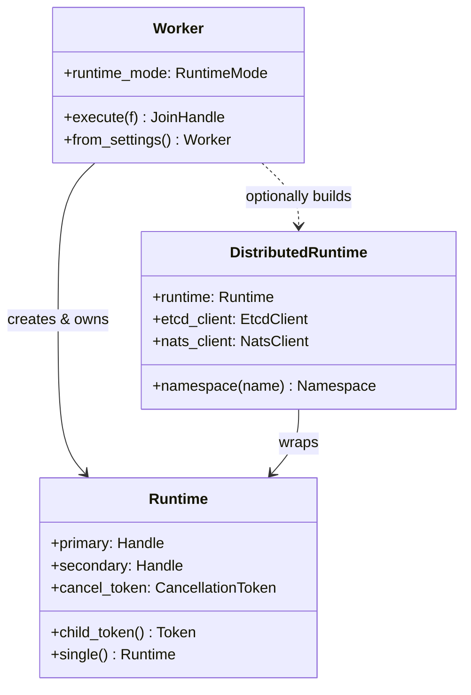
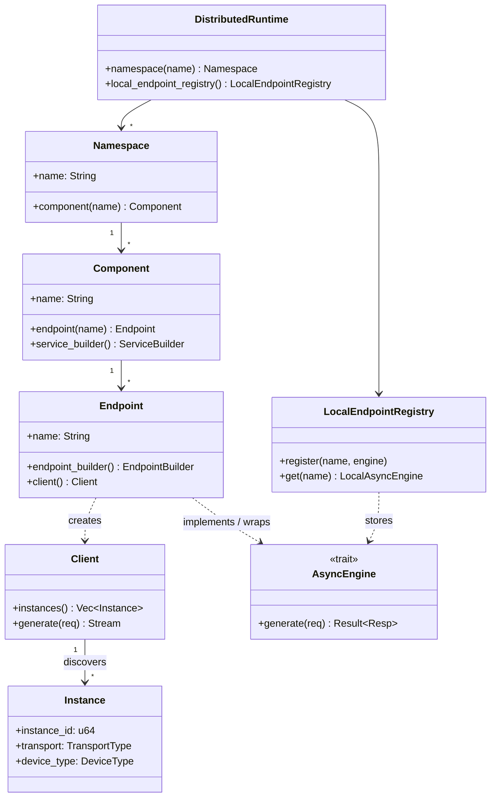
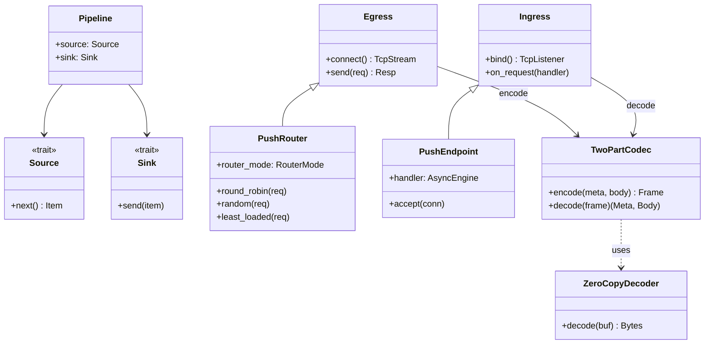
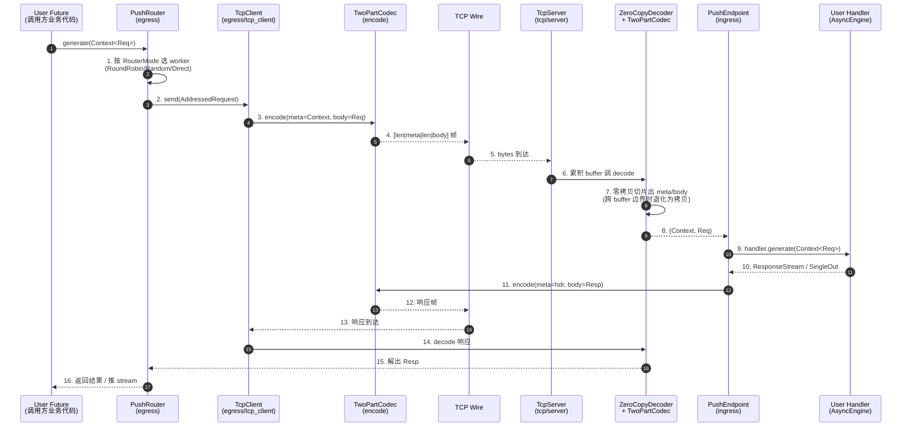
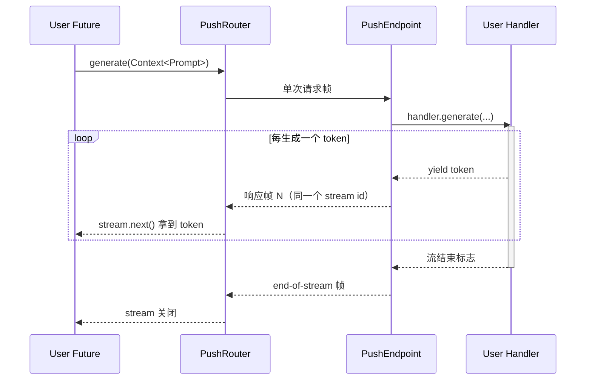
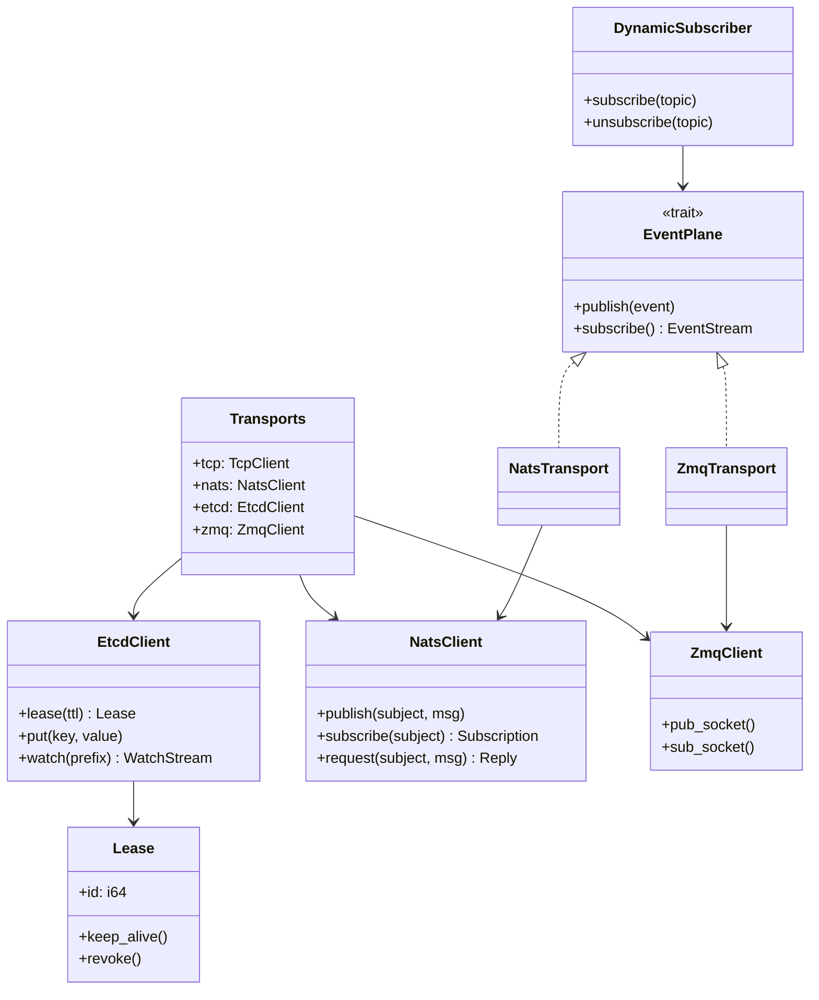
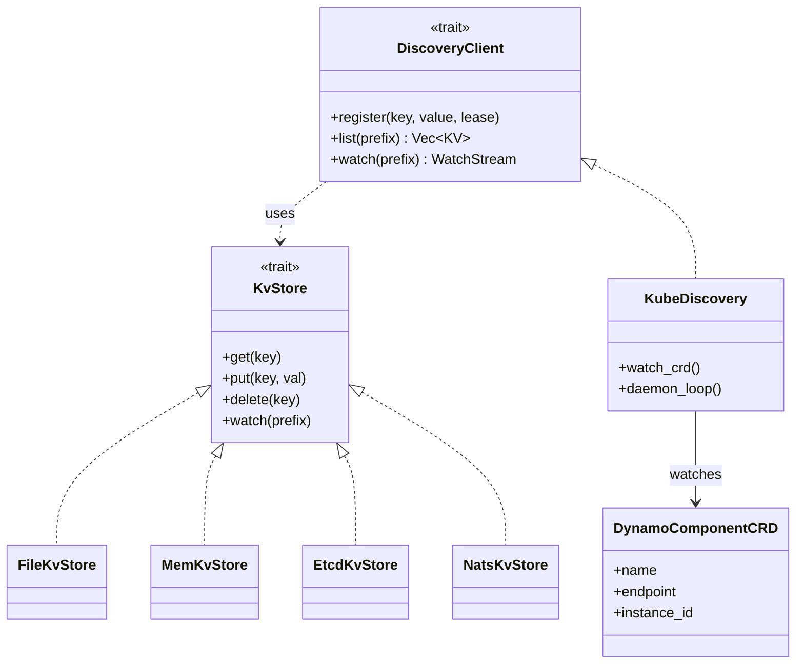
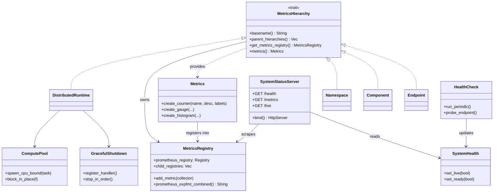
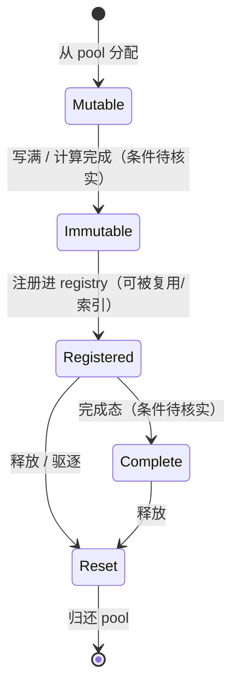
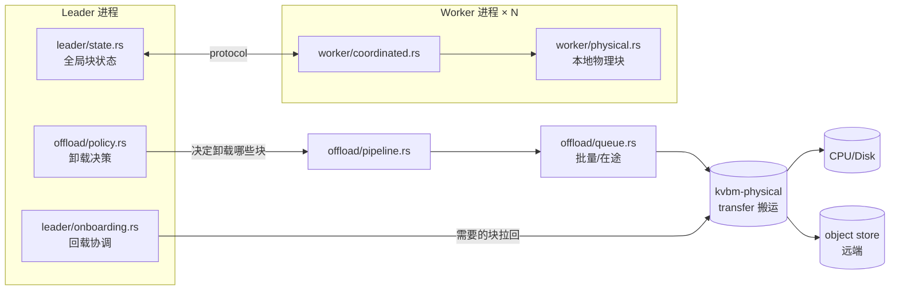

# Dynamo 项目系统性学习规划

> 目标：从零到能改动核心代码、能在 K8s 上部署、能定位性能/故障问题。
> 时间预估：全职 4–6 周；每天 2–3 小时约 10–14 周。
> 跟踪方式：每个阶段完成后在本文末尾「进度记录」追加一行。

---

## 学习心法

1. **自顶向下 → 自底向上**：先跑通、看架构图，再切到源码细节；遇到不懂的概念再回到文档对照。
2. **每个模块都做三件事**：① 读关键源码 ② 跑一个最小可运行示例 ③ 写一段自己的话总结（不超过 200 字）。
3. **优先 Rust 核心**：`lib/runtime` + `lib/llm` + `lib/kv-router` 是项目的"骨头"，先吃透。
4. **不要陷入细节**：第一遍只求"知道在哪里、做什么"；第二遍才深挖某一条调用链。
5. **善用现有中文资料**：`README.md`、`CODE_MAP.zh.md`、`docs/design-docs/*.zh.md`、`docs/development/*.zh.md`。

---

## 阶段 0 — 准备环境（0.5–1 天）

**产出**：本地能从源码跑起 frontend + 一个 mock backend，完成一次 chat 请求。

- [ ] 阅读 `README.md`（中文）、`CODE_MAP.md` / `CODE_MAP.zh.md`，建立全局印象。
- [ ] 装 Rust（`rustup`）+ `uv` + Docker。
- [ ] `docs/getting-started/building-from-source.zh.md` 跑一遍：
  - `cd lib/bindings/python && maturin develop --uv`
  - `uv pip install -e .`
- [ ] `docker compose -f deploy/docker-compose.yml up -d` 起 etcd+NATS。
- [ ] 用 `dynamo.mocker` 跑通端到端：
  - `python3 -m dynamo.frontend --http-port 8000 --discovery-backend file`
  - `python3 -m dynamo.mocker --model-path Qwen/Qwen3-0.6B --discovery-backend file`
  - `curl localhost:8000/v1/chat/completions ...`
- [ ] 在 IDE 里把 Rust workspace 打开（`dynamo.code-workspace`），让 rust-analyzer 跑通。

**自检**：能解释 frontend、router、worker、KVBM、planner 五者的职责差异。

---

## 阶段 1 — 架构总览（2–3 天）

**产出**：手画一张数据流图 + 一份名词表。

| 序号 | 必读文档 | 关注点 |
|---|---|---|
| 1 | `docs/design-docs/architecture.md` | 总览，组件边界 |
| 2 | `docs/design-docs/dynamo-flow.md` | 一次请求的完整生命周期 |
| 3 | `docs/design-docs/distributed-runtime.zh.md` | Component / Endpoint / Pipeline 概念 |
| 4 | `docs/design-docs/discovery-plane.md` | etcd / 文件 / K8s 三种发现方式 |
| 5 | `docs/design-docs/request-plane.md` | TCP 请求通道协议 |
| 6 | `docs/design-docs/event-plane.md` | NATS / KV 事件平面 |
| 7 | `docs/design-docs/disagg-serving.zh.md` | Prefill/Decode 分离 |
| 8 | `docs/design-docs/router-design.md` | KV 感知路由 |
| 9 | `docs/design-docs/kvbm-design.md` | 多层 KV 缓存 |
| 10 | `docs/design-docs/planner-design.md` | SLA 自动扩缩容 |

**练习**：在白板/notes 上绘制 `client → frontend → router → worker → KVBM → metrics → planner` 的链路，标注每条边走的协议（HTTP / TCP / NATS / etcd）。

---

## 阶段 2 — Rust Runtime 底座（4–5 天）

**目标**：理解 `dynamo-runtime`（57K 行）如何把"分布式服务"抽象成 `Runtime → Worker → Component → Endpoint → Pipeline` 五层模型，并能写出最小可运行的 RPC 服务。

**辅助阅读**：`docs/development/runtime-guide.zh.md`、`cargo doc -p dynamo-runtime --open`。

**整体策略**：每个子阶段都按"读 → 跑 → 写"三步走 —— 先读源码 + 注释，再跑一个最小示例（或既有测试），最后用 ≤200 字写一段自己的话总结。

### 2.1 全局骨架与启动序列（0.5 天）

**读什么**
- `lib/runtime/src/lib.rs`（模块再导出地图）
- `lib/runtime/src/prelude.rs`（最常用的对外 API）
- `lib/runtime/src/runtime.rs`、`worker.rs`、`distributed.rs`、`service.rs`
- `lib/runtime/src/config.rs` + `config/environment_names.rs`（环境变量约定）

**回答这些问题**
- `Runtime` vs `DistributedRuntime` vs `Worker` 的职责边界是什么？
- 一次 `Worker::new(...).execute(async move { ... })` 启动时，按顺序做了哪些事（Tokio runtime / signal handler / 子任务）？
- 哪些字段是全局共享的，哪些是 per-component 的？

**关系类图**



**实操**
- [ ] 在仓库根目录搜 `Worker::from_settings`、`DistributedRuntime::from_settings`、`Runtime::single`，画一张"调用方 → runtime → component"的初始化时序图。
- [ ] 跑 `cargo test -p dynamo-runtime -- --test-threads=1 worker`，挑两条 trace 跟读。

**自检**：能用一段话描述 `python3 -m dynamo.frontend` 启动到挂载第一个 endpoint 之前都发生了什么。

---

### 2.2 Component / Namespace / Endpoint 抽象（1 天，重点）

**读什么**（按顺序）
1. `lib/runtime/src/component.rs`（聚合入口、Builder）
2. `lib/runtime/src/component/namespace.rs` → `component.rs` → `endpoint.rs`
3. `lib/runtime/src/component/registry.rs`、`local_endpoint_registry.rs`、`instances.rs`
4. `lib/runtime/src/component/service.rs`（把 endpoint 装成可服务的 unit）
5. `lib/runtime/src/component/client.rs`（消费端如何拿到一个 endpoint 的实例集合）
6. `lib/runtime/src/traits.rs`、`engine.rs`（`AsyncEngine` / 处理函数 trait）

**回答这些问题**
- `Namespace` / `Component` / `Endpoint` 三层命名是怎样映射成发现键（discovery key）的？
- 为什么需要 `local_endpoint_registry` + `instances`？远端和本地的查询路径是分叉的吗？
- `AsyncEngine` 的接口形状是什么？返回流式响应时数据怎么跨 await 边界传递？

**关系类图**



**实操**
- [ ] 写一个 ≤150 行的二进制：进程 A 注册 `demo.namespace/echo` endpoint，进程 B 用 `client.generate(...)` 调用它，传输用 TCP + file discovery。
- [ ] 故意让进程 A 在处理中 panic，看 client 端拿到的 error；记录 error 的传播路径（哪个文件、哪一层 wrap）。

**自检**：用三句话描述 Component、Endpoint、Pipeline 的关系。

---

### 2.3 Pipeline / Source / Sink / Network 节点（1 天）

**读什么**
- `lib/runtime/src/pipeline.rs`（聚合入口）+ `pipeline/context.rs`、`registry.rs`、`error.rs`
- `lib/runtime/src/pipeline/nodes/{sources,sinks}/` —— 流式节点 trait
- `lib/runtime/src/pipeline/network/` 整体：
  - `manager.rs`、`tcp.rs`、`codec.rs`、`ingress.rs`、`egress.rs`
  - 重点子文件：`network/tcp/{client,server}.rs`、`network/codec/two_part.rs`、`network/codec/zero_copy_decoder.rs`
  - 进出口对：`network/egress/{push_router,addressed_router,tcp_client}.rs` 与 `network/ingress/{push_endpoint,shared_tcp_endpoint,unified_server}.rs`

**回答这些问题**
- 一次请求从 client `push_router` 出去，到 server `push_endpoint` 收到的完整 frame 是怎么编解码的？`two_part` codec 的两部分各装什么？
- `zero_copy_decoder` 的零拷贝在哪个层级实现？什么场景下会退化成拷贝？
- `shared_tcp_endpoint` 解决了什么问题（多 endpoint 共用一个 TCP server）？

**关系类图**



**模块分层（按职责分组）**

```text
pipeline/                                  ← 抽象层：定义 IO 契约 + 节点 trait
├── pipeline.rs                  入口 + 4 种调用模式 (Unary / ClientStreaming / ServerStreaming / Bidi)
├── context.rs                   Context<T>：请求元数据 + 取消信号（跨阶段/跨进程传递）
├── error.rs                     PipelineError / TwoPartCodecError
├── registry.rs                  本地 pipeline 注册表
└── nodes/                       Source / Sink / Service / Operator trait
    ├── sources/{base,common}.rs   输入节点：第一个 producer
    └── sinks/{base,network,segment,pipeline}.rs  输出节点：终结消费者

network/                                   ← 实现层：跨进程跑起来
├── manager.rs                   网络资源管理器（连接池 / 监听器生命周期）
├── tcp.rs                       TCP 传输统一入口
├── tcp/{client,server}.rs       底层 TCP 收发（不感知业务语义）
├── codec.rs                     codec 入口
├── codec/two_part.rs            ★ 核心帧编解码：[meta | body] 两段式
├── codec/zero_copy_decoder.rs   ★ 零拷贝解码（直接用底层 buffer 切片）
├── egress.rs                    出口入口
├── egress/push_router.rs        ★ 客户端主路由器（含 RouterMode: RoundRobin/Random/...）
├── egress/addressed_router.rs   按指定 worker 地址路由
├── egress/tcp_client.rs         egress 的 TCP 出口实现
├── egress/{nats,http,unified}_client.rs  其他协议出口
├── ingress.rs                   入口入口
├── ingress/push_endpoint.rs     ★ 服务端 endpoint：把请求交给 user handler
├── ingress/push_handler.rs      请求处理胶水
├── ingress/shared_tcp_endpoint.rs  ★ 多 endpoint 共用一个 TCP server
├── ingress/unified_server.rs    多协议统一入口
└── ingress/{nats,http}_*.rs     其他协议入口
```

**关键文件功能速查**

| 文件 | 职责（一句话） | 类比 |
|---|---|---|
| `pipeline.rs` | 定义 `SingleIn/ManyIn/SingleOut/ManyOut` + 4 种 `*Engine` 别名 | gRPC stub 类型族 |
| `context.rs` | 请求上下文：trace_id、cancel token、元数据 | Spring `ServerWebExchange` |
| `nodes/sources` | 流的源头（产生数据） | Reactor `Publisher` |
| `nodes/sinks` | 流的尾部（消费/转发） | Reactor `Subscriber` |
| `nodes/sinks/network.rs` | sink 把流发到网络出口 | Netty `ChannelOutboundHandler` |
| `network/manager.rs` | 网络资源生命周期管理 | Netty `Bootstrap` |
| `network/codec/two_part.rs` | 帧格式：`[control meta\|payload body]` 两段；meta 用 bincode/JSON，body 是原始字节 | gRPC HEADERS + DATA frame |
| `network/codec/zero_copy_decoder.rs` | 直接借用底层 `Bytes` 切片，避免拷贝；仅当 payload 跨 buffer 边界时退化 | Netty `ByteBuf.slice()` |
| `network/tcp/server.rs` | accept 循环 + per-connection task | Netty `ServerBootstrap` |
| `network/tcp/client.rs` | 连接复用 + 写半双工 | Netty `Bootstrap.connect()` |
| `egress/push_router.rs` | 客户端按策略选 worker 推送 | Ribbon `ILoadBalancer` |
| `egress/addressed_router.rs` | 直接指定 worker 地址（绕过 LB） | gRPC `pick_first` |
| `egress/tcp_client.rs` | egress 的实际 TCP 写入 | — |
| `ingress/push_endpoint.rs` | 单个 endpoint 的服务端实现 | gRPC `BindableService` |
| `ingress/shared_tcp_endpoint.rs` | 同一 TCP 端口承载多个逻辑 endpoint，按 header 分发 | gRPC ALPN + service multiplex |
| `ingress/unified_server.rs` | 在一个 server 同时接 TCP/NATS/HTTP 入口 | Spring Cloud Gateway |

**端到端调用时序（一次 Unary 请求）**



**流式响应（ServerStreaming，LLM token 生成场景）**



**端到端并发模型（白板答案）**

```text
用户 Future
   │ (1) await
   ▼
PushRouter ── 普通函数调用，无独立 task ──┐
   │                                       │
   ▼                                       │
TcpClient (mpsc::Sender<Frame>)            │
   │ send().await                          │
   ▼                                       │
[ writer task ]  per-connection            │ 三个角色 1:1 绑定到一条 TCP 连接：
   │ tokio::spawn 长任务，循环 recv frame    │   writer task  → 把 frame 串行写出
   ▼ socket.write_all                      │   reader task  → 持续 read，喂给 decoder
══════════ TCP wire ══════════              │   pending map  → request_id → oneshot::Sender
   │                                       │
   ▼ socket.read 累积进 BytesMut            │
[ reader task ]  per-connection            │
   │ ZeroCopyDecoder.decode 切出 frame      │
   ▼                                       │
PushEndpoint dispatch ─ tokio::spawn ──────┘
   │ 一个请求 = 一个 handler task
   ▼
User Handler (AsyncEngine)
   │ ServerStreaming: yield 出 ResponseStream
   ▼
Response 帧反向走 writer task 出去
```

要点：
- **每条 TCP 连接 = 1 reader task + 1 writer task + 1 pending request map**（多路复用，类似 HTTP/2 stream id）
- **每个请求 = 1 handler task**（spawn 后独立）；流式响应通过 `mpsc::Sender<Frame>` 把每个 token 喂给 writer task
- **取消通过 `Context` 的 cancel token 传播**：客户端 drop → 触发 cancel → handler task 感知并停止生产
- `shared_tcp_endpoint` 的玩法：reader task 解出 frame 后，根据 frame header 的 endpoint_id 分发到不同的 `PushEndpoint`，实现"一个端口跑 N 个逻辑 endpoint"

**实操**
- [ ] 给一次本地 echo 请求开 `RUST_LOG=dynamo_runtime::pipeline=trace`，捕获完整 ingress/egress 日志并对照代码逐条解释。
- [ ] 改 `codec/two_part.rs` 加一行 `tracing::info!`，重跑测试观察触发次数。
- [ ] 在 `push_router.rs` 的 `RouterMode::match` 处加日志，发 20 个请求确认负载分布。
- [ ] 启用 `shared_tcp_endpoint`，注册 2 个 endpoint 到同一端口，验证 frame header 的 endpoint_id 分发是否正确。

**自检**：在白板上画出"用户 future → push_router → tcp_client → tcp server → push_endpoint → user handler"，标出每段的并发模型（task / channel / stream）。

---

### 2.4 Transports：TCP / NATS / etcd / ZMQ + Event Plane（1 天）

**读什么**
- `lib/runtime/src/transports.rs`、`tcp.rs`、`nats.rs`、`etcd.rs`、`zmq.rs`、`utils.rs`
- `transports/etcd/{lease,lock,kv,connector}.rs` —— 服务发现的最小积木
- `transports/event_plane/`：`mod.rs`、`traits.rs`、`frame.rs`、`codec.rs`、`transport.rs`、`{nats,zmq}_transport.rs`、`dynamic_subscriber.rs`

**回答这些问题**
- TCP 用于"请求面"，NATS/ZMQ 用于"事件面"，etcd 用于"发现面" —— 三者的可靠性/有序性/广播语义各是什么？
- etcd lease 是怎么和 endpoint 注册联动的？lease 失效时 endpoint 多快从其它进程的视野里消失？
- `event_plane` 的 `dynamic_subscriber` 在做什么？什么时候用 ZMQ 而不是 NATS？

**关系类图**



**实操**
- [ ] 启 etcd + NATS：注册一个 endpoint，`etcdctl get --prefix /` 查看键空间；杀掉进程观察 lease 过期。
- [ ] 用 `transports/event_plane/zmq_transport.rs` 中的测试发布一条事件，写个临时订阅者打印它。

**自检**：能在脑里把"请求/事件/发现"三条平面分别画清楚（端点形态、协议、谁是 server）。

---

### 2.5 Discovery：File / etcd / Kubernetes（0.5 天）

**读什么**
- `lib/runtime/src/discovery/mod.rs`（trait 抽象）+ `kv_store.rs`、`metadata.rs`、`utils.rs`、`mock.rs`
- `lib/runtime/src/discovery/kube.rs` + `kube/{crd,daemon,utils}.rs`
- `lib/runtime/src/storage/kv.rs` + `storage/kv/{file,mem,etcd,nats}.rs` —— discovery 的底层 KV 抽象

**回答这些问题**
- 三种 discovery（`--discovery-backend file|etcd|kube`）实际共享哪一层抽象？
- K8s 模式下，daemon 是 watch CRD 还是 EndpointSlice？watcher 的重连/重放策略？
- file backend 是怎么做 atomic write + watch 的？同机多进程会冲突吗？

**关系类图**



**实操**
- [ ] 切换 `--discovery-backend` 三种值各跑一遍 frontend + mocker，观察启动日志差异。
- [ ] 读 `discovery/kube/crd.rs` 列出所有用到的 K8s 资源类型。

**自检**：选 backend 时的决策树是什么？（开发 / 单机 / 集群 / 多集群）

---

### 2.6 Metrics / Health / 横切关注点（1 天）

**读什么**
- `lib/runtime/src/metrics.rs` + `metrics/`：
  - `prometheus_names.rs`（指标命名约定）
  - `request_plane.rs`、`work_handler_perf.rs`、`work_handler_pool.rs`、`transport_metrics.rs`
  - `tokio_perf.rs`、`frontend_perf.rs`
- `lib/runtime/src/system_health.rs`、`health_check.rs`、`system_status_server.rs`、`engine_routes.rs`
- `lib/runtime/src/compute/`（计算池：`pool.rs`、`thread_local.rs`、`metrics.rs`、`validation.rs`、`macros.rs`）
- `lib/runtime/src/storage.rs` + `storage/kv*.rs`
- `lib/runtime/src/utils.rs` + `utils/{tasks/,pool,task,stream,graceful_shutdown,ip_resolver,typed_prefix_watcher}.rs`
- `lib/runtime/src/{logging,error,protocols,slug,nvtx}.rs`

**回答这些问题**
- 一个 endpoint 默认会自动暴露哪些 prometheus 指标？标签维度是什么？
- `system_status_server` 暴露的 HTTP 接口有哪些？谁会调用它？
- `compute::pool` 解决了什么问题？为什么不直接用 tokio 默认线程池？
- `graceful_shutdown` 的顺序：先停 ingress 还是先停下游？

**关系类图**



**实操**
- [ ] 启动 frontend 后 `curl :PORT/metrics`，挑 5 个最关键指标在源码里定位定义点。
- [ ] 给 demo endpoint 加一个自定义 prometheus counter（参考 `metrics/prometheus_names.rs` 的命名规范）。
- [ ] 用 `tokio-console` 或 `tokio_perf` 指标观察一次请求的任务调度行为。

**自检**：能列出 runtime 提供的 5 个最关键"横切能力"以及对应入口文件。

---

### 阶段 2 总验收

- [ ] 提交一个自己写的 `runtime_demo`（独立 binary 或 example），包含：1 个 component、2 个 endpoint、双进程互调、暴露 metrics、支持 graceful shutdown。
- [ ] 在 notes 里画一张「请求面 + 事件面 + 发现面 + 健康面」四张子图合一的整体架构图。
- [ ] 用 600 字总结 `dynamo-runtime` 的设计哲学（你认为它跟 tonic / axum / actix 之类相比解决了什么独特问题）。

---

## 阶段 3 — Frontend 与请求生命周期（2–3 天）

**目标**：从 HTTP 入口跟到 worker 出口。

**核心代码**：

- `lib/llm/src/http/` —— OpenAI 兼容路由、SSE 流式
- `lib/llm/src/grpc/`
- `lib/llm/src/preprocessor/` —— 模板渲染、tokenize、chat 转 completion
- `lib/llm/src/protocols/` —— wire types
- `components/src/dynamo/frontend/` —— Python 入口（含 multimodal 预处理）
- `lib/llm/src/entrypoint/`、`engines.rs`、`model_card.rs`

**实操**：
- [ ] 跑 `cargo run -p dynamo-llm --bin generate-frontend-openapi`，读生成的 `docs/reference/api/openapi.json`。
- [ ] 用 mocker 后端发一次 `/v1/chat/completions` 流式请求，配合 `RUST_LOG=debug` 看日志。
- [ ] 在 `lib/llm/src/http/service/openai.rs` 等关键 handler 上下断点（或加 `tracing::info!`），手动跟一次链路。

---

## 阶段 4 — KV 感知路由（4–5 天，重点）

**总目标**：理解 prefix tree、cost model、KV 事件如何驱动调度；能解释一次请求是怎么被路由到"最划算"的 worker 的，并能调参验证假设。

**整体策略**：和阶段 2 一致 ——"读 → 跑 → 写"三步走。先建心智模型（prefix tree / cost / KV event 三件套），再分模块吃透，最后做一个端到端实验闭环。

**辅助阅读 / 资源汇总**
- `docs/design-docs/router-design.md`（必读，最权威的设计意图）
- `lib/kv-router/README.md` + `README.zh.md`（仓库内最高密度的导览）
- `lib/kv-router/src/indexer/README.md`（indexer 原理 + 数据结构选型）
- `lib/kv-router/src/indexer/concurrent_radix_tree_compressed/{README.md,CLAUDE.md}`（并发压缩 radix tree 的实现笔记）
- `lib/kv-router/src/sequences/{README.md,CLAUDE.md}`、`lib/kv-router/src/standalone_indexer/CLAUDE.md`、`lib/kv-router/src/scheduling/CLAUDE.md`、`lib/llm/src/kv_router/publisher/README.md`
- `lib/kv-router/src/zmq_wire/README.md`（事件线协议）
- `docs/digest/flash-indexer/`、`docs/digest/agentic-inference/`

**前置准备**
- [ ] 阶段 0–3 已通；本地能用 mocker 跑通一次 `/v1/chat/completions`。
- [ ] 心中能画出"frontend → router → worker"的请求路径，知道 router 是个独立的 component（而不是 lib）。
- [ ] 在 IDE 里把 `lib/kv-router`、`lib/llm/src/kv_router`、`components/src/dynamo/router` 三个目录 pin 住。

---

### 4.1 全局心智模型与必读骨架（0.5 天）

**为什么先做这步**：KV 路由是 Dynamo 最复杂的子系统之一，直接读 `radix_tree.rs` 会迷路。先建立"三件套"心智模型：① 索引（谁缓存了什么前缀） ② 调度（怎么选 worker） ③ 事件（缓存状态怎么同步）。

**读什么**
- `docs/design-docs/router-design.md` 全文
- `lib/kv-router/README.zh.md` + `lib/kv-router/README.md`
- `lib/kv-router/src/lib.rs`（模块再导出地图：indexer / scheduling / sequences / zmq_wire / standalone_*）
- `lib/kv-router/src/protocols.rs`（router 暴露的核心 wire type：`LocalBlockHash`、`RouterRequest`、`KvCacheEvent` 等）
- `lib/llm/src/kv_router/mod.rs` + `metrics.rs`（router 在 LLM 侧的外壳与指标命名）

**回答这些问题**
- "KV 感知" 比纯 round-robin / least-load 多解决了哪两类问题？
- `lib/kv-router`（基础设施）和 `lib/llm/src/kv_router`（LLM 侧封装）的职责边界在哪？
- "indexer / scheduler / publisher / subscriber" 四个角色分别跑在哪里（router 进程 / worker 进程 / 独立进程）？

> **我的答案（Q1：KV 感知多解决哪两类问题）** — 2026-05-30
>
> RR/random 既不看负载也不看缓存；least-load 只看负载；**KV 感知同时看「前缀缓存命中」和「worker 实时负载」**，多解决两类问题：
>
> 1. **提高前缀缓存命中率 → 省 prefill**：把有共同前缀的请求路由到已缓存该前缀 KV 的 worker，命中已有 KV、跳过重复 prefill 计算 → TTFT 下降 + GPU 算力节省。这是 RR/random 完全做不到的（不知道谁缓存了什么）。
>    - 代码：`radix_tree.rs::find_match_details`（读路径，算每个 worker 命中多长前缀）→ 结果装入 `OverlapScores`（`protocols.rs:817`）。
> 2. **追求命中的同时不牺牲负载均衡**：只看命中会产生热点（请求全挤到缓存最全的 worker）；只看负载又会丢缓存。KV 感知用 **cost model 把两个信号一起算**：`缓存命中收益(overlap)` ⊕ `实时负载(KV 占用/prefill 队列)`，权衡后选"最划算"的 worker。
>    - 代码：负载信号 `ActiveLoad`（`protocols.rs:387`，含 `kv_used_blocks`/`active_prefill_tokens`）；两路信号在 `scheduling/{policy.rs,selector.rs}` 合成最终决策。

> **我的答案（Q2：两个目录的职责边界）** — 2026-05-30
>
> **核心：依赖单向** —— `lib/llm` 依赖 `dynamo-kv-router`（`lib/llm/Cargo.toml:57`），反过来不依赖。这决定了一切。
>
> **判据（看 import 就知道在哪层）**：
> - `lib/kv-router` 里**永远不会**出现 `dynamo_runtime::component::Client/Endpoint`、NATS、etcd → **纯算法/数据结构库**。
> - `lib/llm/src/kv_router` 里**到处是** `dynamo_runtime::{component,discovery,pipeline}`（`kv_router.rs:23-33`）→ **把算法接到真实运行时的集成层**。
>
> | 维度 | `lib/kv-router`（dynamo-kv-router） | `lib/llm/src/kv_router` |
> |---|---|---|
> | 角色 | 引擎核心：算法+数据结构 | 把引擎装进车里：集成+业务组件 |
> | 依赖 | 不依赖 runtime 服务（纯内存） | 依赖 dynamo-kv-router + dynamo-runtime |
> | 提供 | radix tree 索引（并发/压缩/分片）、scheduling policy/selector/queue、sequences、protocols(wire types)、zmq_wire、standalone indexer | KvPushRouter/DirectRoutingRouter、StickySessionRouter、PrefillRouter(disagg)、AgentController、publisher(发事件)、indexer(subscriber 消费喂树)、scheduler(粘合)、metrics |
> | I/O | 输入"事件+block 哈希"，输出"打分+选谁"，可单测/bench | 输入真实 OpenAI 请求+真实 worker 实例，输出"发到哪个 worker 的网络调用" |
>
> **一句话**：kv-router 回答"给定缓存状态和请求该选谁"（纯计算）；llm/kv_router 回答"在真实集群里怎么拿到缓存状态、怎么把决策变成一次真实 worker 调用"（工程集成）。证据：`kv_router.rs:11-22` 拿 kv-router 纯类型，`:23-33` 拿 runtime 能力，`:39-42` 把 kv-router 的 protocols/scheduling/selector 原样重导出（上层门面）。

**实操**
- [ ] 用 mocker 后端起一遍：`python3 -m dynamo.frontend --router-mode kv ...` + 多个 `dynamo.mocker`；`curl /v1/chat/completions`，观察 `RUST_LOG=dynamo_llm::kv_router=debug,dynamo_kv_router=debug` 下打印的关键日志，确认"看到了什么、不懂什么"。
- [ ] 画一张 1 页纸的"三件套 + 数据流" 草图（手画即可），作为后续子阶段的参照。

**自检**：能用 5 句话向同事讲清楚 "KV 感知路由比朴素 LB 强在哪 / 多付出了什么成本"。

---

### 4.2 Indexer：prefix tree 与并发压缩 radix tree（1.5 天，重点中的重点）

**目标**：吃透"前缀匹配"这一核心数据结构，理解为什么需要并发压缩 radix tree、它如何在保持低锁竞争的前提下支持 insert/remove/match。

**读什么**（按顺序）
1. `lib/kv-router/src/indexer/README.md`（设计动机 + 选型对比）
2. `lib/kv-router/src/indexer/mod.rs`（统一入口 + 公共类型）
3. `lib/kv-router/src/indexer/traits.rs`、`types.rs`、`metrics.rs`
4. `lib/kv-router/src/indexer/radix_tree.rs`（最基础的单线程 radix tree，先吃这个）
5. `lib/kv-router/src/indexer/concurrent_radix_tree.rs`（加锁版本，理解锁粒度）
6. `lib/kv-router/src/indexer/concurrent_radix_tree_compressed/`：
   - `README.md` + `CLAUDE.md` 先读
   - `types.rs` → `node.rs` → `node_state.rs` → `store.rs`
   - `sync_impl.rs`（核心同步原语）、`matches.rs`（前缀匹配主路径）
   - `remove.rs`、`repair.rs`、`dump.rs`（删除 / 修复 / 调试导出）
7. `lib/kv-router/src/indexer/branch_sharded.rs` + `anchor_aware_branch_sharded.rs`（按分支分片，进一步降低竞争）
8. `lib/kv-router/src/indexer/kv_indexer.rs`、`local.rs`、`lower_tier.rs`、`lower_tier_indexers.rs`、`positional.rs`、`pruning.rs`、`thread_pool.rs`

**回答这些问题**
- "block hash"（`LocalBlockHash`）是怎么算出来的？为什么按 block（而非 token）做索引？
- compressed radix tree 的"压缩"压的是什么？相比普通 radix tree 节省了多少内存 / 提高了多少匹配速度？
- 并发版本是用 `RwLock` / `Mutex` / 还是 lock-free？锁的粒度是树级还是节点级？
- `pruning` 在什么时机触发？它和 `lower_tier`（CPU/SSD 缓存）是什么关系？
- `branch_sharded` 把树按什么维度切？为什么 anchor-aware 版本能减少跨 shard 操作？

**实操**
- [ ] 跑 `cargo test -p dynamo-kv-router indexer:: --nocapture`，挑 3 个 case（`radix_tree`、`concurrent_radix_tree_compressed::tests`、`indexer::tests`）单步跟读。
- [ ] 写一个 ≤100 行的 micro-benchmark：构造 N 个有共同前缀的 token 序列，对比 `radix_tree` vs `concurrent_radix_tree_compressed` 的 insert / match 延迟。
- [ ] 用 `dump.rs` 把一棵活的 tree 序列化出来，肉眼检查节点结构是否符合预期。

**自检**：能在白板上画出 4 个 token 序列插入后的 compressed radix tree 形态，并解释一次 prefix match 走过哪些节点 / 触发了哪些锁。

---

### 4.3 Publisher / Subscriber：KV 事件平面（0.5 天）

**目标**：理解 worker 怎么把"我缓存了/释放了哪些 block"告诉 router，router 又怎么消费这些事件更新 indexer。

**读什么**
- `lib/llm/src/kv_router/publisher/README.md`
- `lib/llm/src/kv_router/publisher/mod.rs` + 子文件：
  - `event_processor.rs`（事件主循环）
  - `batching.rs`（批量发送，减少 NATS / ZMQ 压力）
  - `dedup.rs`（去重）
  - `sinks.rs`（发送目的地抽象）
  - `worker_metrics.rs`（顺带把 worker 负载指标也带出去）
  - `zmq_listener.rs`（接收侧）
- `lib/llm/src/kv_router/indexer/`：
  - `subscriber.rs`、`remote.rs`、`worker_query.rs`、`jetstream.rs`
- `lib/kv-router/src/zmq_wire/`：`README.md`、`types.rs`、`convert.rs`、`filter.rs`、`extra_keys.rs`、`deserialize.rs`

**回答这些问题**
- KV 事件的"事件" 到底承载了哪些字段（block hash / worker id / store/free / 时间戳…）？
- 为什么有的链路走 NATS（JetStream），有的走 ZMQ？两者的可靠性/延迟/广播语义差异是什么？
- batching + dedup 的窗口策略是什么？事件丢失 / 乱序是怎么兜底的（看 `recovery/` 模块）？
- worker 重启时，indexer 怎么知道要清掉它之前所有的 block？

**实操**
- [ ] 启 mocker 后端，`tcpdump` 或 `nats sub '>'` 看真实事件流，对照 `zmq_wire/types.rs` 解码字段。
- [ ] 关掉 KV 事件：`--kv-events-config '{"enable_kv_cache_events": false}'`，观察缓存命中率掉到接近 0、延迟回升的现象，记录数字。

**自检**：能描述一条 KV event 从 worker 内 vLLM/SGLang/TRTLLM 内部 → publisher → 传输层 → subscriber → indexer 更新的完整路径。

---

### 4.4 Sequences / Recovery：跨请求的状态承接（0.5 天）

**目标**：理解 router 怎么把"同一个会话 / prompt prefix" 在多轮间维持住，以及连接抖动/重启时如何恢复。

**读什么**
- `lib/kv-router/src/sequences/README.md` + `CLAUDE.md`
- `lib/kv-router/src/sequences/`：
  - `mod.rs`、`single.rs`、`multi_worker.rs`、`topology.rs`
  - `prefill_tracker.rs`、`block_tracker.rs`
  - `prompt_registry.rs`、`prompt_membership_trie.rs`、`request_maps.rs`
- `lib/kv-router/src/recovery/{mod.rs,cursor.rs}`、`lib/kv-router/src/cleanup.rs`、`lib/kv-router/src/active_set.rs`
- `lib/llm/src/kv_router/{sequence.rs,sticky_sessions.rs}`

**回答这些问题**
- "sequence" 在 KV 路由语境下指什么？它和 OpenAI request 的关系是 1:1 还是 1:N？
- `prompt_membership_trie` 解决了什么 `radix_tree` 解决不了的问题？
- sticky session 是按什么 key 做亲和性的？破坏 sticky 会引发什么后果？
- recovery cursor 在什么时机推进？崩溃恢复的最小信息单元是什么？

**实操**
- [ ] 多轮对话场景：发 3 次同一 conversation 的请求，看是否落到同一 worker、缓存是否被复用（看日志 + 指标）。
- [ ] 手动 kill 一个 worker，观察 router 的 cleanup / recovery 日志，记录"多久从可路由集合里被剔除"。

**自检**：在白板上画"会话 - sequence - prefix block - worker"四层映射。

---

### 4.5 Scheduling / Cost Model / Push Router：怎么选 worker（1 天）

**目标**：理解前缀命中率、worker 负载、prefill 队列等多个信号怎么合成最终的路由决策。

**读什么**
- `lib/kv-router/src/scheduling/CLAUDE.md`
- `lib/kv-router/src/scheduling/`：
  - `mod.rs`（入口）、`config.rs`、`types.rs`
  - `policy.rs`（核心 policy trait）、`selector.rs`（候选 worker 选择）
  - `prefill_load.rs`（prefill 排队负载估算）
  - `local.rs`、`queue.rs`
- `lib/llm/src/kv_router/`：
  - `scheduler.rs`（LLM 侧调度器，把基础设施和业务粘起来）
  - `push_router.rs`（最终的"按决策推送"组件）
  - `prefill_router/{mod.rs,inner.rs,types.rs,execution.rs,activation.rs}`（disagg 场景下的 prefill 专用路由）
  - `shared_cache.rs`、`agent_controller.rs`

**回答这些问题**
- cost function 的各项权重是哪些？分别衡量什么（前缀命中、KV 占用、prefill 队列、token 速率…）？
- `selector` 输出的是 "Top-1 worker" 还是 "Top-K 候选"？谁负责最终采样 / fallback？
- disagg（prefill/decode 分离）模式下，prefill_router 和普通 scheduler 是同一条路径吗？什么时候分叉？
- agent 控制器（`agent_controller.rs`）在干嘛？和 docs/digest/agentic-inference 的关系？

**实操**
- [ ] 在 `scheduling/policy.rs` 或 `selector.rs` 的关键节点加 `tracing::info!` 打印候选 worker 列表 + 各项 cost；发 10 条不同前缀的请求，观察决策。
- [ ] 调整 cost function 的某个权重（推荐先改 prefill 队列权重或缓存命中权重各一次），对比延迟分布 / 缓存命中率 / 负载均衡度的变化，记录 before/after 数据。

**自检**：能用一个公式或决策树写出 "给定 N 个 worker + 1 个新请求，最终选谁" 的完整逻辑。

---

### 4.6 Standalone Indexer / Shared Cache：跨进程 / 跨节点的扩展（0.5 天）

**目标**：理解为什么有时候 indexer 要独立成进程（甚至独立集群），它和 in-process indexer 的取舍。

**读什么**
- `lib/kv-router/src/standalone_indexer/CLAUDE.md`
- `lib/kv-router/src/standalone_indexer/`：
  - `mod.rs`、`server.rs`、`indexer.rs`
  - `zmq.rs`、`listener.rs`、`registry.rs`、`recovery.rs`、`metrics.rs`
  - `runtime/mod.rs`
- `lib/kv-router/src/standalone_shared_cache/{mod.rs,server.rs}`
- `lib/llm/src/kv_router/shared_cache.rs`

**回答这些问题**
- 什么场景会触发"把 indexer 独立部署"？延迟 / 内存 / 多 router 共享是哪一个驱动因素？
- standalone indexer 跟 LLM router 之间用什么协议通信？为什么是 ZMQ？
- shared cache 在 indexer 之外又解决了什么问题？

**实操**
- [ ] 启动一个 `standalone_indexer` 进程（参考 `server.rs` 的 main），让 frontend 通过它做路由；对比 in-process 模式的吞吐 / 延迟。

**自检**：能给出 "in-process indexer / standalone indexer / standalone shared cache" 三种部署形态的选型建议。

---

### 4.7 Python 侧组件 + 端到端联调（0.5 天）

**目标**：搞清 `components/src/dynamo/router` 和 `dynamo.global_router` 怎么把 Rust 路由能力暴露给上层。

**读什么**
- `components/src/dynamo/router/`（按目录里实际文件读，重点看 `__main__.py` / `main.py` 类入口、配置解析、与 frontend 的对接）
- `components/src/dynamo/global_router/`（全局路由，跨 cluster 场景）
- `lib/bindings/python/` 中 router 相关绑定
- `docs/components/router/`（如存在）

**回答这些问题**
- Python 端 router 进程的启动参数有哪些？哪些参数会透传到 Rust 侧的 cost / indexer 配置？
- global_router 和普通 router 是父子关系还是平等关系？怎么注册自己 / 发现彼此？

**实操**
- [ ] 起一个 router 进程 + 多个 mocker 后端 + 1 个 frontend，跑 50 条混合前缀请求，记录：缓存命中率、worker 负载方差、p50/p99 延迟。
- [ ] 关闭 KV 事件 / 改 cost 权重 / 切换到 standalone indexer 三组对照实验，把数据填进表格。

**自检**：能用一张表说明"4 种路由模式（random / round-robin / KV-aware / KV-aware+standalone）"在你测试场景下的指标差异。

---

### 阶段 4 总验收

- [ ] 提交一份"KV 路由实验报告"（≤2 页）：
  - 4 种模式（random / RR / KV in-process / KV standalone）在同一负载下的命中率 + p99 表
  - cost 权重 1 项的 ±2 倍调参对结果的影响
  - 关闭 / 开启 KV 事件的对比
- [ ] 画一张「indexer + scheduler + publisher + subscriber + recovery」五子系统的整体架构图，标出各自跑在哪个进程、用什么通信。
- [ ] 用 ≤600 字总结：相比 vLLM 自带的 scheduler 或常规反向代理（nginx/envoy），Dynamo KV router 多解决了什么、付出了什么复杂度成本。

---

## 阶段 5 — 后端集成（3–4 天）

**目标**：理解三种 backend 的统一抽象与差异。

**先读骨架**：`docs/development/backend-guide.zh.md`，再分别看：

| Backend | 目录 | 关键文件 |
|---|---|---|
| vLLM | `components/src/dynamo/vllm/` | `llm_engine.py`、`handlers.py`、`instrumented_scheduler.py` |
| SGLang | `components/src/dynamo/sglang/` | `unified_main.py`、`init_llm.py`、`request_handlers/` |
| TRT-LLM | `components/src/dynamo/trtllm/` | `engine.py`、`workers/`、`logits_processing/` |
| 共享 | `components/src/dynamo/common/` | `backend/`、`forward_pass_metrics.py` |

**实操**：
- [ ] 至少跑通 vLLM 或 SGLang 一个 backend（CPU 上可以用 `--device cpu` 或更小模型）。
- [ ] 看 `examples/custom_backend/` 模板，画出"加一个新 backend 需要实现什么"清单。

---

## 阶段 6 — KVBM 多层 KV 缓存（4 天，重点）

**总目标**：理解 KVBM（KV Block Manager）如何把 KV cache 在 **GPU↔CPU↔Disk↔远端/对象存储** 之间分层管理与迁移；能解释一个 KV block 的完整生命周期（分配→注册→卸载→回载→释放），并能跑通一次 offload/onboard 实验、看懂日志流转。

**整体策略**：和阶段 2/4 一致 ——「读 → 跑 → 写」三步走。先建立「分层 + 块状态机」心智模型，再**自底向上**逐 crate 吃透（config → physical → logical → kernels → engine），最后看 `lib/llm/src/block_manager` 这层 LLM 侧集成，并做端到端实验。

**KVBM 六个 crate 的分层（自底向上，依赖方向向下）**

```text
lib/llm/src/block_manager/   ← LLM 侧集成层：接 vLLM/SGLang，提供 storage 后端 + connector + 分布式 + KV 整合
        │ 依赖
        ▼
lib/kvbm-engine/             ← 组装层：leader/worker 协调 + offload 流水线 + collectives(NCCL) + object/pubsub + runtime
        │
        ├──────────────┬───────────────┐
        ▼              ▼               ▼
lib/kvbm-logical/   lib/kvbm-physical/  lib/kvbm-kernels/
块的逻辑视图：       物理层：内存布局      CUDA 拷贝内核
状态机/池/注册表/事件  layout + 搬运 transfer  (FFI)
        │              │
        └──────┬───────┘
               ▼
lib/kvbm-config/  （各子系统配置）   lib/kvbm-common/（公共基础类型，很薄）
```

> ⚠️ 上图依赖方向为「按目录职责的推测分层」，**第一件事就是用 `cargo tree` 核实真实依赖边**（见 6.1 实操）。

**辅助阅读 / 资源汇总**（均真实存在）
- `docs/design-docs/kvbm-design.md` + `kvbm-design.zh.md`（必读，最权威设计意图）
- `docs/components/kvbm/kvbm-guide.md` + `kvbm-guide.zh.md` + `README.md`（使用向导）
- `lib/kvbm-engine/docs/`（★ 高密度设计文档群）：`architecture.md`、`runtime.md`、`leader.md`、`worker.md`、`worker-group.md`、`offload.md`、`offload-developer.md`、`onboarding.md`、`object.md`、`session.md`、`testing.md`
- 各 crate 内中文笔记：`lib/kvbm-engine/{README.zh.md,CLAUDE.zh.md}`、`lib/kvbm-logical/{README.zh.md,CLAUDE.zh.md}` + `docs/advancements.md`、`lib/kvbm-physical/README.zh.md` + `docs/v1_migration.md`、`lib/kvbm-kernels/{README.zh.md,CLAUDE.zh.md}`
- `lib/llm/src/block_manager.zh.md`、`lib/llm/src/block_manager/README.zh.md`、`lib/llm/src/block_manager/distributed/README.zh.md`

**前置准备**
- [ ] 阶段 2（runtime）+ 阶段 4（kv-router 的 KV event / StorageTier 分层）已通；理解「StorageTier = Device/HostPinned/Disk/External」这套分层标签（阶段 4 已学）。
- [ ] 在 IDE 里 pin 住 6 个 `lib/kvbm-*` 目录 + `lib/llm/src/block_manager`。
- [ ] 准备一个能跑 KVBM 的环境（GPU 最佳；无 GPU 时先用单测 + 读文档，集成测试见 6.8）。

---

### 6.1 全局心智模型与必读骨架（0.5 天）

**为什么先做这步**：KVBM 横跨 6 个 crate，直接钻 `offload/pipeline.rs` 会迷路。先建立「为什么要分层 + 块状态机 + offload/onboard 两个方向」的骨架。

**读什么**
- `docs/design-docs/kvbm-design.zh.md` 全文
- `docs/components/kvbm/kvbm-guide.zh.md`
- `lib/kvbm-engine/docs/architecture.md`（总览）
- 6 个 crate 各自的 `lib.rs`（模块再导出地图）+ 已有的 `README.zh.md` 快速扫一遍

**回答这些问题**
- 为什么 KV cache 要分 GPU/CPU/Disk/远端多层？KVBM 相比 vLLM 自带的 paged attention / prefix caching 多解决了什么？
- 6 个 crate 的真实依赖方向是什么（用 `cargo tree` 验证上面那张推测图）？
- `lib/kvbm-*`（独立 crate）和 `lib/llm/src/block_manager`（LLM 侧）的职责边界在哪？（类比阶段 4 学过的 kv-router 两层边界）
- KVBM 的 block 分层和阶段 4 的 `StorageTier` 是同一套概念吗？谁定义、谁消费？

**实操**
- [ ] `cargo tree -p kvbm-engine -p kvbm-logical -p kvbm-physical -p kvbm-kernels -p kvbm-config --depth 1`，画出真实依赖图，订正本阶段开头那张推测图。
- [ ] 把 `lib/kvbm-engine/docs/` 下 11 个 md 的标题列成一张「文档地图」，标注每篇大概对应哪个 crate / 子系统。

**自检**：能用一句话分别说清 6 个 crate + `block_manager` 各自的职责，并说出依赖方向。

---

### 6.2 kvbm-common + kvbm-config：地基与配置（0.25 天）

**读什么**
- `lib/kvbm-common/src/lib.rs`（公共基础类型，很薄）
- `lib/kvbm-config/src/`：`lib.rs`、`cache.rs`、`offload.rs`、`onboard.rs`、`nixl.rs`、`object.rs`、`events.rs`、`discovery.rs`、`messenger.rs`、`rayon.rs`、`tokio.rs`

**回答这些问题**
- config 被切成了哪几个子系统（cache / offload / onboard / nixl / object / events / messenger / rayon / tokio）？光看这些文件名能否反推出 engine 有哪些可调旋钮？
- `nixl.rs` / `object.rs` 指向的是什么后端？（提示：NIXL 是 NVIDIA 的传输库，object 指对象/远端存储）
- `rayon.rs` vs `tokio.rs`：为什么 KVBM 同时需要 rayon 线程池和 tokio 运行时？（联系阶段 2 学的 runtime 与 `lib/runtime/docs/rayon-tokio-strategy.zh.md`）

**实操**
- [ ] 对每个 config 结构 `grep` 它在哪个 crate / 文件被消费，确认「配置项 → 使用点」的对应。

**自检**：能列出 KVBM 的主要配置维度，并说出 offload 与 onboard 是一对相反方向的配置。

---

### 6.3 kvbm-physical：物理层 —— 块怎么排布、怎么搬（0.75 天）

**目标**：理解 KV block 在显存里的**物理排布（layout）**，以及在各介质间**搬运（transfer）**的策略。

**读什么**（按顺序）
- `lib/kvbm-physical/README.zh.md` + `docs/v1_migration.md`
- `lib/kvbm-physical/src/lib.rs`
- `layout/`：`mod.rs` → `config.rs` → `kv_block_layout.rs` → `fully_contiguous.rs` → `layer_separate.rs` → `physical.rs` → `builder.rs` → `serialize.rs` → `validation.rs`
- `manager/`：`mod.rs`、`local.rs`、`remote.rs`、`metadata.rs`、`handle.rs`
- `transfer/`：`mod.rs`、`strategy.rs`、`capabilities.rs`、`preferences.rs`、`context.rs`、`options.rs`、`checksum.rs`、`fill.rs`、`validation.rs`

**回答这些问题**
- `fully_contiguous` vs `layer_separate` 两种 layout 的区别是什么？分别适合什么场景（联系注意力的 KV 张量形状）？
- 一个 KV block 在显存里到底长什么样（层数 × KV × head × dim 怎么映射到一段内存）？看 `kv_block_layout.rs`。
- `transfer/strategy.rs`：搬运策略怎么根据源/目的介质选择（D2D / D2H / H2D / 跨节点 RDMA）？`capabilities.rs` / `preferences.rs` 在决策里扮演什么角色？
- `checksum.rs` 为什么需要？（数据完整性 / 调试）`local` manager 与 `remote` manager 的分工？

**实操**
- [ ] `cargo test -p kvbm-physical --lib`，挑 `layout::tests`、`transfer::*` 跟读 1–2 条。
- [ ] 在 `transfer/strategy.rs` 的策略选择处加 `tracing::info!`，跑测试看不同源/目的下选了哪条策略。

**自检**：在白板上画一个 KV block 从「GPU 显存」搬到「CPU pinned 内存」的物理路径，标出经过 layout 描述 → transfer strategy → 实际拷贝的哪些环节。

---

### 6.4 kvbm-logical：逻辑层 —— 块状态机 / 池 / 注册表 / 事件（0.75 天，重点）

**目标**：吃透 KV block 的**生命周期状态机**与**池化管理**——这是 KVBM 的核心抽象。

**读什么**（按顺序）
- `lib/kvbm-logical/README.zh.md` + `CLAUDE.zh.md` + `docs/advancements.md`
- `lib/kvbm-logical/src/lib.rs`
- `blocks/`：`state.rs`（★ 状态定义）、`mutable.rs`、`immutable.rs`、`registered.rs`、`complete.rs`、`mod.rs`
- `pools/`：`mod.rs`、`active.rs`、`reset.rs`、`tests.rs`
- `registry/`：`mod.rs`、`registration.rs`、`handle.rs`、`attachments.rs`、`tests.rs`
- `manager/`：`builder.rs`、`mod.rs`、`tests.rs`
- `events/`：`mod.rs`、`manager.rs`、`batcher.rs`、`policy.rs`、`publisher.rs`、`protocol.rs`、`tests.rs`
- `sequence/`：`mod.rs`、`store.rs`

**回答这些问题**
- 块状态机：`mutable / immutable / registered / complete` 各代表什么阶段？转换的触发条件是什么？（以 `blocks/state.rs` 为准）为什么要把 immutable 和 registered 分开？
- `pools/active.rs` 与 `pools/reset.rs`：块用完后怎么回收复用？这和阶段 4 `lib/llm/src/kv` 里 `AvailableBlocks`/`ReservedBlocks` 的设计有什么异同？
- `registry/` 注册的 key 是什么（block hash？）？它和 kv-router 的 radix tree 索引是什么关系——谁是源、谁是消费方？
- `events/` 这层发出的事件，和阶段 4.3 学的「KV event（发给 router 的 store/free 事件）」是同一条吗？看 `events/protocol.rs` 的字段对照阶段 4 的 `KvCacheEvent`。

**块生命周期状态机（骨架，转换条件以 `blocks/state.rs` 源码为准）**



**实操**
- [ ] `cargo test -p kvbm-logical --lib`，重点跑 `pools::tests`、`registry::tests`、`manager::tests`、`events::tests`，挑 2 条跟读。
- [ ] 读完后回到上面的状态机图，**用源码订正每条转换的真实触发条件**，把「待核实」去掉。

**自检**：能在白板上画出 block 完整生命周期状态机（含真实转换条件），并说清 pool / registry / events 三者在生命周期各环节的介入点。

---

### 6.5 kvbm-kernels：CUDA 拷贝内核（0.25 天）

**读什么**
- `lib/kvbm-kernels/README.zh.md` + `CLAUDE.zh.md`
- `lib/kvbm-kernels/src/lib.rs`、`tensor_kernels.rs`
- `lib/kvbm-kernels/build.rs`（CUDA 编译 / 链接逻辑）

**回答这些问题**
- 这层 kernel 做的是什么粒度的拷贝（block / tensor）？Rust 怎么通过 FFI 调到 CUDA？看 `tensor_kernels.rs` 的 `extern "C"` 声明。
- 它和阶段 4 看过的 `lib/llm/src/kernels`（`block_copy.cu`）、以及 `block_manager` 里链接的 `vectorized_copy.fatbin` 是什么关系？谁才是生产路径？（阶段 4 笔记里有相关观察）
- `build.rs` 里 CUDA 是怎么被编译并链接进来的？无 GPU / 无 nvcc 时会怎样降级？

**实操**
- [ ] 通读 `build.rs`，列出它依赖的环境（nvcc / CUDA_HOME / feature flag）。

**自检**：能说清「Rust 调用 CUDA 拷贝内核」这条 FFI 链路，以及它在整个 KVBM 搬运中被谁调用。

---

### 6.6 kvbm-engine：组装成分布式 cache 引擎（1 天，重点）

**目标**：理解 KVBM 怎么把 logical + physical + kernels 拼成一个**分布式、可 offload/onboard 的 cache 引擎**——leader/worker 协调 + 卸载流水线。

**读什么**（先文档后代码）
- 文档：`lib/kvbm-engine/CLAUDE.zh.md` + `README.zh.md`，然后 `docs/`：`runtime.md` → `leader.md` → `worker.md` → `worker-group.md` → `offload.md` → `offload-developer.md` → `onboarding.md` → `object.md` → `session.md`
- 代码：
  - `runtime/`：`mod.rs`、`builder.rs`
  - `leader/`：`mod.rs`、`instance.rs`、`state.rs`、`onboarding.rs`、`accessor.rs`、`types.rs`
  - `worker/`：`mod.rs`、`coordinated.rs`、`physical.rs`、`protocol.rs`
  - `offload/`：`mod.rs`、`engine.rs`、`pipeline.rs`、`policy.rs`、`queue.rs`、`batch.rs`、`pending.rs`、`source.rs`、`handle.rs`、`cancel.rs`
  - `collectives/`：`mod.rs`、`nccl.rs`、`bootstrap.rs`、`stub.rs`
  - `object/mod.rs`、`pubsub/`：`mod.rs`、`nats.rs`、`stub.rs`

**回答这些问题**
- **leader vs worker** 的角色分工？leader 持有什么全局状态？worker 负责什么本地动作？（看 `leader/state.rs`、`worker/coordinated.rs`）
- **offload 流水线**（`offload/pipeline.rs`）分哪几个阶段？`policy.rs` 在什么条件下决定「该把这些块从 GPU 卸载下去」？`queue.rs` / `batch.rs` / `pending.rs` 怎么管理在途任务？`cancel.rs` 怎么取消半途的卸载？
- **onboard（反向：把块从低层加载回 GPU）** 在 `leader/onboarding.rs` 里何时触发？和 offload 是对称的吗？
- `collectives/nccl.rs`：多 GPU / 多节点之间用 NCCL 做什么集合通信？`stub.rs` 是无 GPU 时的替身吗？
- `object/mod.rs` + `pubsub/nats.rs`：对象存储后端存什么？NATS 在 engine 里传递什么消息（和阶段 4 的事件平面是同一套 NATS 吗）？

**关系图（角色 + offload 数据流，骨架）**



**实操**
- [ ] `cargo test -p kvbm-engine --lib`，重点跑 `offload::*`（含 `cancel_tests`），跟读一次完整 offload 的调用链。
- [ ] 在 `offload/policy.rs` 的决策点 + `offload/pipeline.rs` 的阶段切换点加 `tracing::info!`，跑测试观察「何时触发卸载、经过哪些阶段」。

**自检**：能画出「leader 决策 → 通知 worker → 走 offload pipeline → 调 physical transfer → 落到 CPU/Disk/object」的完整时序，并说清 onboard 的反向路径。

---

### 6.7 lib/llm/src/block_manager：LLM 侧集成层（0.75 天）

**目标**：搞清 KVBM 怎么真正接到 vLLM/SGLang，以及多种物理存储后端如何统一。

**读什么**
- `lib/llm/src/block_manager.zh.md`（入口模块文档）、`block_manager/README.zh.md`、`block_manager/distributed/README.zh.md`
- `lib/llm/src/block_manager.rs`（模块入口，注意是上一级同名文件）
- `storage/`：`mod`(`storage.rs`)、`cuda.rs`、`disk.rs`、`nixl.rs`、`object.rs`、`torch.rs`、`arena.rs`（★ 6 种后端）
- `block/`：`state.rs`、`transfer.rs`、`registry.rs`、`locality.rs`、`factory.rs`、`data.rs`
- `pool.rs` + `pool/managed.rs`
- `distributed/`：`leader.rs`、`worker.rs`、`nccl_bootstrap.rs`、`zmq.rs`、`transfer.rs`、`utils.rs`
- `connector/`：`protocol.rs`、`scheduler.rs`（★ 接引擎的桥）
- `controller/`：`client.rs`、`handler.rs`
- `kv_consolidator/`：`mod.rs`、`publisher.rs`、`subscriber.rs`、`tracker.rs`、`config.rs`
- `offload/`：`filter.rs`、`pending.rs`、`request.rs`；`layout/`：`nixl.rs`、`utils.rs`
- `v2.rs`、`config.rs`、`events.rs`、`metrics_kvbm.rs`、`numa_allocator.rs`

**回答这些问题**
- `storage/` 的 6 种后端（`cuda` / `disk` / `nixl` / `object` / `torch` / `arena`）分别对应什么介质 / 用途？它们怎么映射到阶段 4 学的 `StorageTier`？
- `connector/`：KVBM 怎么作为「connector」接进 vLLM 的调度（`scheduler.rs`）？`protocol.rs` 定义了什么交互契约？
- `kv_consolidator/` 解决什么问题（把分散的 KV 块整合 / 去重 / 上报）？它的 publisher/subscriber 和阶段 4 的 KV event 链路如何衔接？
- 这一层（`block_manager`）与 `kvbm-engine` 的关系：谁调用谁？`distributed/{leader,worker}.rs` 是对 `kvbm-engine` 的 leader/worker 的封装吗？
- `v2.rs` 代表什么版本迁移？（对照 `lib/kvbm-physical/docs/v1_migration.md`）

**实操**
- [ ] `cargo test -p dynamo-llm block_manager`，挑 storage / pool 的单测跟读。
- [ ] 画一张「vLLM 请求 → connector → block_manager（pool/storage）→ kvbm-engine（offload）→ kvbm-physical（transfer）」的调用栈。

**自检**：能说清「6 种 storage 后端 ↔ StorageTier ↔ kvbm-engine」三者怎么对应，并讲清 connector 是如何把 KVBM 嵌进推理引擎的。

---

### 6.8 端到端实验与总验收（0.75 天）

**实操（集成测试，需 GPU 环境）**
- [ ] 通读 `tests/kvbm_integration/README.zh.md`、`common.py`，看清测试如何拉起带 KVBM 的部署。
- [ ] 跑 `pytest tests/kvbm_integration/test_kvbm.py`（基础）与 `test_kvbm_vllm_integration.py`（vLLM 集成）；挑一个用例开 `RUST_LOG=dynamo_llm::block_manager=debug,kvbm_engine=debug`，跟踪一次 offload/onboard 的完整日志流转。
- [ ] 跑 `test_consolidator_router_e2e.py` / `test_consolidator_config_unit.py`，把 kv_consolidator 和阶段 4 的 router 串起来看。
- [ ] 对比两份 engine 配置 `engine_config_with_cuda_graph_and_kvbm.yaml` vs `..._without_kvbm.yaml`，列出开启 KVBM 多了哪些配置项。
- [ ] （无 GPU 时）退化为：只跑各 crate 的 `cargo test --lib` + 通读 `lib/kvbm-engine/docs/testing.md`，把 offload/onboard 时序在纸上推演。

**阶段 6 总验收**
- [ ] 画一张 **KVBM 分层总架构图**：6 个 crate + `block_manager` + 各 storage 后端 + 与 kv-router（事件/索引）/ 推理引擎（connector）的关系，标注依赖方向与通信方式（FFI / NCCL / ZMQ / NATS / NIXL）。
- [ ] 画 **block 生命周期状态机图**（含真实转换条件）+ **一次 offload 和一次 onboard 的完整时序图**（leader↔worker↔physical）。
- [ ] 用 ≤600 字总结：KVBM 相比 vLLM 原生 paged KV cache / prefix caching 多解决了什么（容量扩展、跨 worker 复用、分级存储），又付出了什么复杂度成本（一致性、搬运开销、分布式协调）。

---

## 阶段 7 — Planner 与 Profiler（2–3 天）

**目标**：搞清 SLA 驱动的扩缩容如何决策。

- `docs/design-docs/planner-design.md`
- `components/src/dynamo/planner/` —— `core/`、`connectors/`、`monitoring/`、`offline/`
- `components/src/dynamo/profiler/` —— `rapid.py`、`thorough.py`、`profile_sla.py`、`interpolation.py`
- `docs/components/planner/planner-guide.md`

**实操**：
- [ ] 用 `dynamo.profiler` 对一个 mocker 部署做一次画像。
- [ ] 读 planner 输入输出的指标字段，列在 notes 里。

---

## 阶段 8 — Kubernetes 与 Operator（3–4 天）

**目标**：能用 Helm/Operator 把 Dynamo 部到一个 kind/minikube 集群。

- `deploy/operator/` —— Go 编写的 Kubebuilder 项目；先看 `api/`（CRD 定义）和 `internal/controller/`
- `deploy/helm/charts/`
- `deploy/inference-gateway/`
- `recipes/` —— 挑一个最简单的（如 `qwen3-32b/vllm/agg/`）通读
- `docs/kubernetes/` —— 部署指南

**实操**：
- [ ] kind 集群上 `helm install dynamo-platform ...`，部署一个 `DynamoGraphDeployment`。
- [ ] 改一个 CRD spec 字段，看 operator reconcile 行为。

---

## 阶段 9 — 进阶专题（按需选 2–3 个，每个 2–3 天）

| 专题 | 入口 |
|---|---|
| 多模态 E/P/D | `lib/llm/tests/data/media/`（已删）→ `components/src/dynamo/{vllm,sglang,trtllm}/multimodal*` + `docs/digest/agentic-inference/` |
| Agentic 推理 | `lib/llm/src/agents/`、`docs/agents/`、`docs/digest/agentic-inference/` |
| 工具调用 | `lib/parsers/`、`docs/agents/tool-calling.md`、Skill `tool-parser-generator` |
| 容错 / 请求迁移 | `lib/llm/src/migration.rs`、`tests/fault_tolerance/`、`docs/fault-tolerance/` |
| LoRA | `lib/llm/src/lora/`、`components/src/dynamo/common/lora/` |
| Mocker / 回放 | `lib/mocker/`、`components/src/dynamo/mocker/`、`docs/mocker/` |
| 可观测性 | `lib/runtime/src/metrics/`、`deploy/observability/` |
| 安全审计 | `lib/llm/src/audit/`、Skill `security-review` |

---

## 阶段 10 — 贡献回馈（持续）

- [ ] 阅读 `CONTRIBUTING.md` + `docs/contribution-guide.md`。
- [ ] 浏览 `https://github.com/ai-dynamo/enhancements`（DEP 提案库），用 Skill `dep-status` 看活跃 DEP。
- [ ] 挑一个 `good first issue` 或自己常踩的小坑修一发 PR；用 Skill `requesting-code-review`。
- [ ] 必要时按 `docs/development/jail-stream.zh.md` 流程跑严格隔离测试。

---

## 推荐阅读顺序速查表

```
README.md
  └─► CODE_MAP.zh.md
       ├─► docs/design-docs/architecture.md
       ├─► docs/design-docs/dynamo-flow.md
       ├─► docs/design-docs/distributed-runtime.zh.md
       │     └─► lib/runtime/src/{component,pipeline,transports}
       ├─► docs/design-docs/router-design.md
       │     └─► lib/kv-router/src + lib/llm/src/kv_router
       ├─► docs/design-docs/disagg-serving.zh.md
       │     └─► components/src/dynamo/{vllm,sglang,trtllm}
       ├─► docs/design-docs/kvbm-design.md
       │     └─► lib/kvbm-*
       └─► docs/design-docs/planner-design.md
             └─► components/src/dynamo/{planner,profiler}
```

---

## 常用命令速查

```bash
# 构建
cd lib/bindings/python && maturin develop --uv && cd -
uv pip install -e .

# 起本地依赖
docker compose -f deploy/docker-compose.yml up -d

# 跑前端
python3 -m dynamo.frontend --http-port 8000 --discovery-backend file

# 跑 mocker 后端（无 GPU 也可）
python3 -m dynamo.mocker --model-path Qwen/Qwen3-0.6B --discovery-backend file

# 生成 OpenAPI
cargo run -p dynamo-llm --bin generate-frontend-openapi

# 运行特定 Rust crate 的测试
cargo test -p dynamo-runtime
cargo test -p dynamo-kv-router

# Python 测试（按 marker 过滤）
pytest tests/router -m "not gpu"

# 调试日志
RUST_LOG=dynamo_runtime=debug,dynamo_llm=debug python3 -m dynamo.frontend ...
```

---

## 进度记录

> 完成一个阶段就追加一行：`YYYY-MM-DD — 阶段 N — 一句话感想/卡点`

- 2026-05-21 — 阶段 0 起步 — 计划创建。

---

## 备忘 / 待澄清问题（学习中遇到不懂就记到这里，后面集中查）

-
