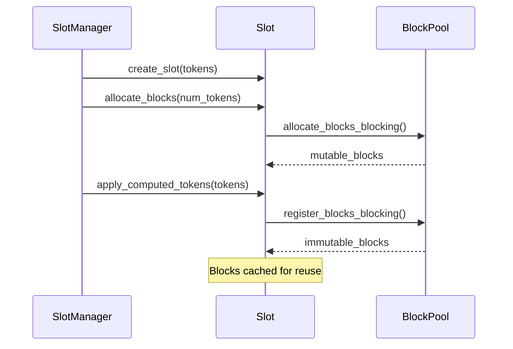
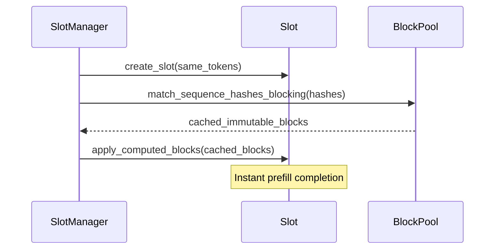

# SlotManager 块管理测试计划

## 概述

本文档为 `SlotManager` 块（block）管理功能勾画了一份完整的测试策略，重点关注两条主要的块操作路径，以及它们的各种约束、依赖与边缘情况。

## 核心块操作

### 1. Cache Miss 路径：分配 → 应用 token → 注册块



**关键校验点：**
- 在应用 token 前先分配块
- 块容量足以装下 token
- 成功从 mutable → immutable 过渡
- 块在 pool 缓存中注册成功
- 正确生成 sequence hash

### 2. Cache Hit 路径：查找 → 应用缓存块



**关键校验点：**
- sequence hash 匹配的准确性
- 应用缓存块时无需再做 token 校验
- **共享块 ID**：多个 slot 使用同一组块
- 相比 cache miss 的性能提升
- 与 cache miss 路径在状态上等价

## 测试实现阶段

### 阶段 1：基本块操作

#### 测试：`test_cache_miss_block_allocation_and_registration`
```rust
// Test the complete cache miss workflow
create_slot() → allocate_blocks() → apply_tokens() → verify_registration()
```

**校验：**
- `get_block_ids()` 返回已分配的块 ID
- 随着 token 应用，`num_tokens(Computed)` 增加
- 块成功在 pool 缓存中注册

#### 测试：`test_cache_hit_block_lookup_and_application`
```rust
// Test cache hit after cache miss
slot1: cache_miss_workflow() → slot2: cache_hit_workflow()
```

**校验：**
- 两个 slot 的 `get_block_ids()` 返回 **同样的块 ID**
- 在相同 token / salt 下 `sequence_hashes()` 一致
- 比 cache miss 路径执行更快

### 阶段 2：顺序依赖与约束

#### 测试：`test_required_operation_orders`
```rust
// Validate mandatory operation sequences
✅ allocate_before_apply: allocate() → apply_tokens()
❌ apply_without_allocation: apply_tokens() without allocate()
```

#### 测试：`test_mutual_exclusivity_validation`
```rust
// Ensure cache hit XOR cache miss
❌ both_tokens_and_blocks: apply_tokens() + apply_cached_blocks()
✅ tokens_only: apply_tokens()
✅ cached_blocks_only: apply_cached_blocks()
```

### 阶段 3：高级工作流场景

#### 测试：`test_progressive_token_application`
```rust
// Apply tokens incrementally (work around assertion bug)
allocate_blocks(total_capacity) → apply_token(1) → apply_token(2) → ...
```

#### 测试：`test_cross_slot_cache_validation`
```rust
// Verify block sharing across slots
slot1(tokens, salt1) → slot2(tokens, salt2) // Different hashes
slot3(tokens, salt1) → slot4(tokens, salt1) // Shared blocks
```

**核心断言：**
```rust
assert_eq!(slot3.get_block_ids(), slot4.get_block_ids());
```

### 阶段 4：错误场景与边界情况

#### 测试：`test_validation_failures`
```rust
// Test various failure scenarios
insufficient_allocation() → apply_tokens() // Should fail
mismatched_sequence_hashes() → apply_cached_blocks() // Should fail
```

#### 测试：`test_resource_constraint_handling`
```rust
// Test resource exhaustion scenarios
exhaust_block_pool() → allocate_blocks() // Should fail gracefully
```

### 阶段 5：集成测试

#### 测试：`test_end_to_end_cache_miss_to_hit_cycle`
```rust
// Complete workflow validation
create_slot1() → cache_miss_workflow() → destroy_slot1()
create_slot2(same_tokens) → cache_hit_workflow() → verify_equivalence()
```

**状态等价性校验：**
```rust
assert_eq!(slot1.num_tokens(All), slot2.num_tokens(All));
assert_eq!(slot1.sequence_hashes(All), slot2.sequence_hashes(All));
// But potentially shared block IDs for efficiency
```

#### 测试：`test_multi_slot_parallel_processing`
```rust
// Multiple slots with different token sequences
slots[0..n].each { |slot| independent_block_management(slot) }
```

## 关键 API 与校验模式

### 主要的 SlotManager API
```rust
// Slot lifecycle
manager.create_slot(request_id, salt, tokens) → Vec<SequenceHash>
manager.update_slot(update, block_manager) → Result<BlockStates>
manager.get_block_ids(request_id) → Vec<BlockId>
manager.num_tokens(request_id, position) → usize
manager.free_blocks(request_id) → Result<()>
manager.drop_slot(request_id) → Result<()>
```

### 块 ID 共享校验
```rust
// When slots share cached blocks, they should have identical block IDs
let slot1_blocks = manager.get_block_ids("slot1");
let slot2_blocks = manager.get_block_ids("slot2");
assert_eq!(slot1_blocks, slot2_blocks); // Shared blocks
```

### Sequence Hash 确定性
```rust
// Same tokens + salt = same hashes
let hashes1 = manager.create_slot("req1", salt, tokens.clone());
let hashes2 = manager.create_slot("req2", salt, tokens);
assert_eq!(hashes1, hashes2);
```

## 成功标准

### 功能性需求
- Cache miss 路径正确工作
- Cache hit 路径高效复用块
- 块被缓存时块 ID 共享
- cache hit 与 cache miss 路径状态一致
- 错误处理与校验恰当

### 性能需求
- Cache hit 显著快于 cache miss
- 块复用减少内存分配
- 块生命周期内无内存泄漏

### 正确性需求
- sequence hash 生成确定
- 互斥关系得到强制
- 资源约束被优雅处理
- Debug 断言绕开机制正常工作

## 实施策略

1. **从基本操作起步**（阶段 1）
2. **加入约束校验**（阶段 2）
3. **实现高级场景**（阶段 3）
4. **覆盖错误条件**（阶段 4）
5. **以集成测试收尾**（阶段 5）

每个测试都应使用顶层的 SlotManager API，关注可观察行为而非内部实现细节。

> 关键洞见：最重要的测试，是验证当多个 slot 共享缓存块时 `get_block_ids()` 返回相同的块 ID——这证明缓存机制确实在起作用。
