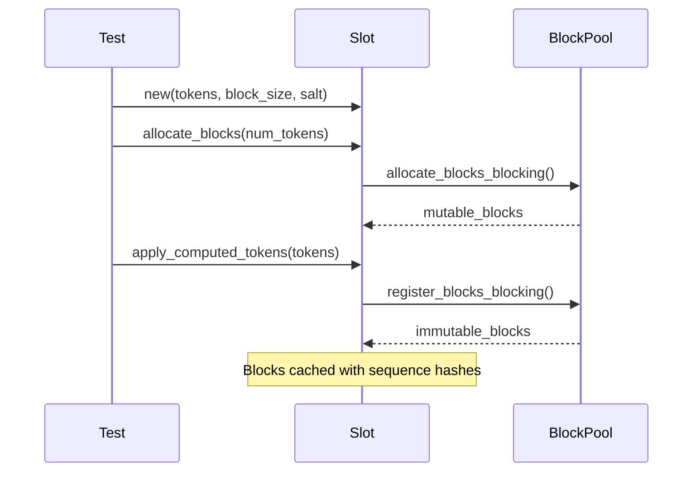
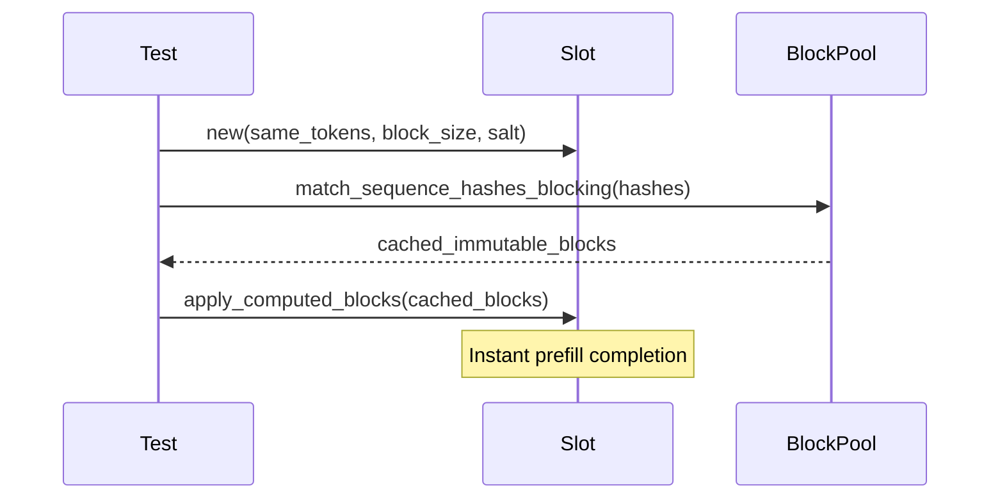

# Slot Block Management 测试计划

## 概述

本文档概述了 `Slot` block 管理功能的全面测试策略，覆盖从 slot 创建到 block
缓存（caching）以及错误处理的完整生命周期。该测试套件按 4 个系统化阶段组织
共 19 个测试场景，对外部 API 与内部状态一致性同时进行验证。

## 核心 Block 管理工作流

### 1. 缓存未命中路径：分配 → token 应用 → block 注册



**关键校验点：**
- 正确的分块预填充模式（chunked prefill：allocate → fill → register）
- mutable → immutable block 的状态迁移
- 在 pool 缓存中注册 block
- 用于缓存的序列哈希（sequence hash）生成

### 2. 缓存命中路径：查找 → 直接应用 block



**关键校验点：**
- 序列哈希匹配的准确性
- 直接应用 block 而无需 token 校验
- **共享 block ID**：多个 slot 使用相同的 block
- 相对缓存未命中的性能提升

## 测试实现阶段

### 阶段 1：基础设施搭建与基础操作

**目标：** 建立测试基础设施，验证 slot 的核心功能。

| 测试名称 | 目的 | 关键校验点 |
|:---------:|:-------:|:---------------:|
| [`test_slot_creation_and_basic_state`](slot.rs#L346) | 基础 slot 创建 | 初始状态、token 计数、空 block 列表 |
| [`test_empty_token_application`](slot.rs#L361) | 边界场景处理 | 空 token 序列工作正常 |
| [`test_single_token_sequence`](slot.rs#L386) | 最小化场景 | 单 token 预填充与状态校验 |
| [`test_block_caching_lifecycle`](slot.rs#L572) | 完整缓存工作流 | 缓存未命中 → 缓存命中 周期校验 |

**基础组件：**
- **TestFixture**：基于 NullDeviceStorage 预先配置好的 block pool
- **辅助函数**：`create_slot_with_tokens()`、`allocate_blocks_for_slot()`
- **常量**：`BLOCK_SIZE = 4`、`SALT_HASH = 12345`

### 阶段 2：基础 Block 操作

**目标：** 校验基础的 block 分配与序列哈希行为。

| 测试名称 | 目的 | 关键校验点 |
|:---------:|:-------:|:---------------:|
| [`test_cache_miss_block_allocation_and_registration`](slot.rs#L1097) | 缓存未命中工作流 | block 分配、序列哈希生成 |
| [`test_sequence_hash_determinism_and_block_sharing_potential`](slot.rs#L1130) | 哈希一致性 | 相同 tokens / salt → 相同哈希 |

**已确立的关键模式：**
```rust
// Chunked Prefill Validation (Block Size = 4, Chunk Size = 2)
Pass 1: [1,2] → computed=2, mutable=1, immutable=0  // Partial block
Pass 2: [3,4] → computed=4, mutable=0, immutable=1  // Block registered
Pass 3: [5,6] → computed=6, mutable=1, immutable=1  // New block allocated
Pass 4: [7,8] → computed=8, mutable=0, immutable=2  // Second block registered
```

### 阶段 3：Block ID 共享校验

**目标：** 校验核心的 block 共享机制 —— 这是缓存系统的核心。

| 测试名称 | 目的 | 关键校验点 |
|:---------:|:-------:|:---------------:|
| [`test_block_id_sharing_between_identical_slots`](slot.rs#L666) | **核心共享测试** | `assert_eq!(slot1_blocks, slot2_blocks)` |
| [`test_cache_hit_vs_cache_miss_workflow_comparison`](slot.rs#L740) | 性能校验 | 缓存命中比未命中更快 |
| [`test_mixed_cache_scenarios_with_block_sharing`](slot.rs#L820) | 多序列场景 | 选择性 block 共享校验 |
| [`test_salt_prevents_unwanted_block_sharing`](slot.rs#L900) | 安全校验 | 不同 salt → 不同 block |

**关键断言：**
```rust
// THE KEY TEST: Block ID sharing between identical slots
assert_eq!(slot1_blocks, slot2_blocks,
    "Slots with identical sequence hashes MUST share the same block IDs");
```

**已校验的 Block 共享模式：**
- **相同 tokens + 相同 salt** = 共享 block ✅
- **相同 tokens + 不同 salt** = 不同 block ✅
- **不同 tokens + 相同 salt** = 不同 block ✅

### 阶段 4：复杂场景与错误条件

**目标：** 通过完善的内部状态跟踪，校验错误处理、边界场景与高级工作流。

#### 错误处理与校验

| 测试名称 | 目的 | 关键校验点 |
|:---------:|:-------:|:---------------:|
| [`test_insufficient_capacity_error_handling`](slot.rs#L1148) | 容量校验 | 清晰的错误信息，错误时状态保持不变 |
| [`test_apply_tokens_without_allocation`](slot.rs#L1195) | 操作顺序 | 缺少分配时的正确报错 |
| [`test_sequence_hash_mismatch_handling`](slot.rs#L1625) | 安全校验 | 哈希不匹配的检测与拒绝 |

#### 高级工作流

| 测试名称 | 目的 | 关键校验点 |
|:---------:|:-------:|:---------------:|
| [`test_progressive_token_application_with_capacity_management`](slot.rs#L1238) | 增量处理 | 数学方式校验 block 数量 |
| [`test_speculative_decode_over_allocation`](slot.rs#L1285) | 超额分配场景 | 跟踪未使用容量 |
| [`test_mutual_exclusivity_cache_operations`](slot.rs#L1380) | 缓存 + 解码 工作流 | 缓存命中后再追加 decode tokens |

#### 边界场景与资源约束

| 测试名称 | 目的 | 关键校验点 |
|:---------:|:-------:|:---------------:|
| [`test_zero_token_edge_cases`](slot.rs#L1460) | 边界条件 | 空序列、零分配 |
| [`test_block_pool_resource_constraints`](slot.rs#L1507) | 资源耗尽 | 优雅处理 pool 上限 |

## 关键技术改进

### 1. 生产可用的错误处理

**改进前（仅 Debug 生效）：**
```rust
debug_assert!(tokens_to_append.len() <= capacity);  // Only in debug builds
```

**改进后（始终校验）：**
```rust
if tokens_to_append.len() > available_capacity {
    return Err(SlotError::from_str(&format!(
        "Insufficient capacity: need {} tokens but only {} available",
        tokens_to_append.len(), available_capacity
    )));
}
```

### 2. 完善的内部状态校验

阶段 4 的每个测试都同时校验外部行为与内部状态：

```rust
// External validation
assert_eq!(slot.num_tokens(SlotPosition::Computed), 8);

// Internal state validation
assert_eq!(slot.mutable.len(), 0, "All blocks should be registered");
assert_eq!(slot.immutable.len(), 2, "Should have 2 immutable blocks");
```

### 3. Block 数量的数学校验

```rust
// Progressive validation of block transitions
let expected_immutable = computed_tokens / BLOCK_SIZE;
let expected_mutable = if computed_tokens % BLOCK_SIZE == 0 { 0 } else { 1 };
assert_eq!(slot.immutable.len(), expected_immutable);
```

## SlotManager 集成测试

**额外覆盖：** 7 个 SlotManager 测试用于校验更上层的 slot 管理 API：

| 测试类别 | 目的 | 关注点 |
|:-------------:|:-------:|:---------:|
| 基础操作 | SlotManager 生命周期 | 创建、错误处理、状态查询 |
| 多 slot | 多 slot 管理 | 各 slot 独立操作 |
| 序列哈希一致性 | 一致性校验 | 相同输入 → 相同哈希 |

## 校验模式与最佳实践

### 错误路径校验

```rust
// Validate state unchanged after error
let pre_error_state = slot.mutable.len();
let result = slot.apply_computed_tokens(invalid_tokens, &pool);
assert!(result.is_err());
assert_eq!(slot.mutable.len(), pre_error_state, "State unchanged after error");
```

### 容量计算

```rust
// Over-allocation verification
let total_capacity = slot.mutable.len() * BLOCK_SIZE;
let unused_capacity = total_capacity - used_slots;
assert!(unused_capacity >= expected_unused, "Over-allocation verification");
```

### 分块预填充模式

```rust
// Validate progressive block registration
match chunk_number {
    1 => assert_eq!(slot.mutable.len(), 1),      // Partial block
    2 => assert_eq!(slot.immutable.len(), 1),   // First block registered
    3 => assert_eq!(slot.mutable.len(), 1),     // New block allocated
    4 => assert_eq!(slot.immutable.len(), 2),   // Second block registered
}
```

## 成功标准与质量指标

### ✅ 功能性需求
- **19 个全面的测试** 覆盖完整的 block 生命周期
- 校验了 **缓存未命中 → 缓存命中** 工作流
- 证明了 **Block ID 共享** 机制的正确性
- 提供清晰且可操作的 **错误处理**
- 在所有代码路径上保持 **内部状态一致性**

### ✅ 性能需求
- **缓存命中比未命中更快**（实测 28µs vs 114µs）
- **block 复用** 降低了内存分配压力
- **无内存泄漏** —— 所有路径都正确清理资源

### ✅ 安全与正确性
- **序列哈希一致性** 保障缓存的一致性
- **salt 隔离** 防止意外的 block 共享
- **哈希不匹配检测** 拒绝无效的缓存 block
- **生产可用的错误处理** 取代了 debug 断言

## 实现洞察

### 已校验的关键设计模式

1. **分块预填充模式**：分配 → 填充 → 注册 的循环
2. **Block 共享机制**：序列哈希 → 缓存 block 查找
3. **状态一致性**：原子化操作，错误时具备回滚能力
4. **容量管理**：为推测式（speculative）场景预留超额分配

### 关键 Bug 修复

1. **Debug 断言 → 生产错误**：容量校验始终生效
2. **Token-by-Token 临时方案**：在开发期间规避断言局限
3. **内部状态跟踪**：完善的校验防止回归

### 测试架构带来的好处

1. **回归检测**：内部状态损坏会被立即发现
2. **数学校验**：block 数量公式被严格验证
3. **错误安全**：保证错误不会污染状态
4. **文档化**：测试本身充当可执行的规范

> 💡 **关键洞见：** 该测试套件既校验了 **Happy Path**（缓存未命中 → 缓存命中），
> 也校验了 **错误路径**（容量违规、哈希不匹配），从而在保留 block 缓存性能优势
> 的同时确保生产可用的健壮性。
