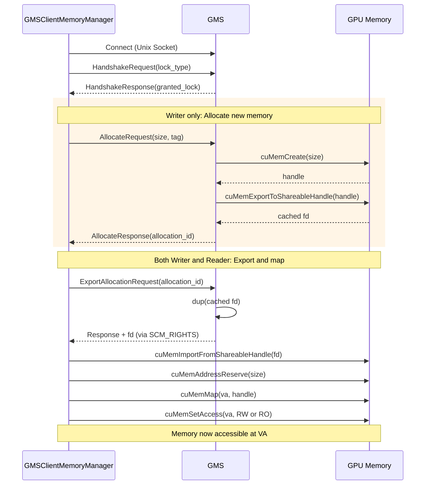
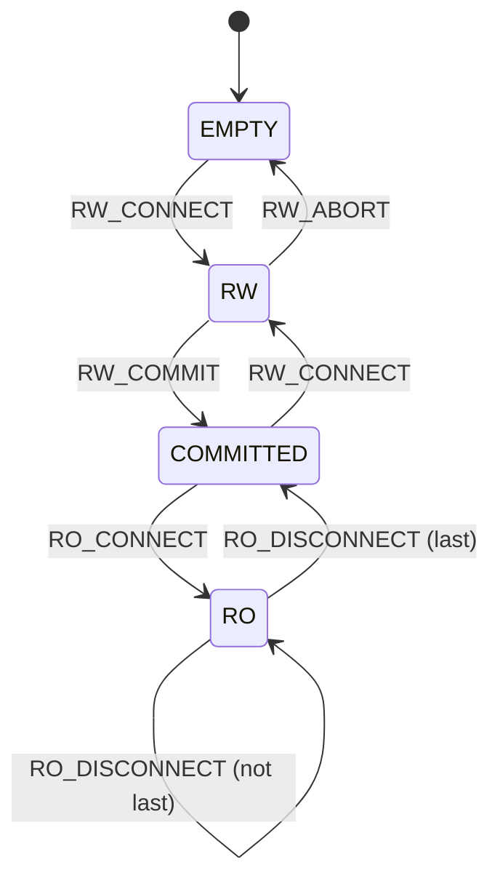
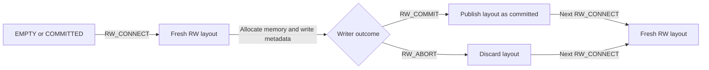
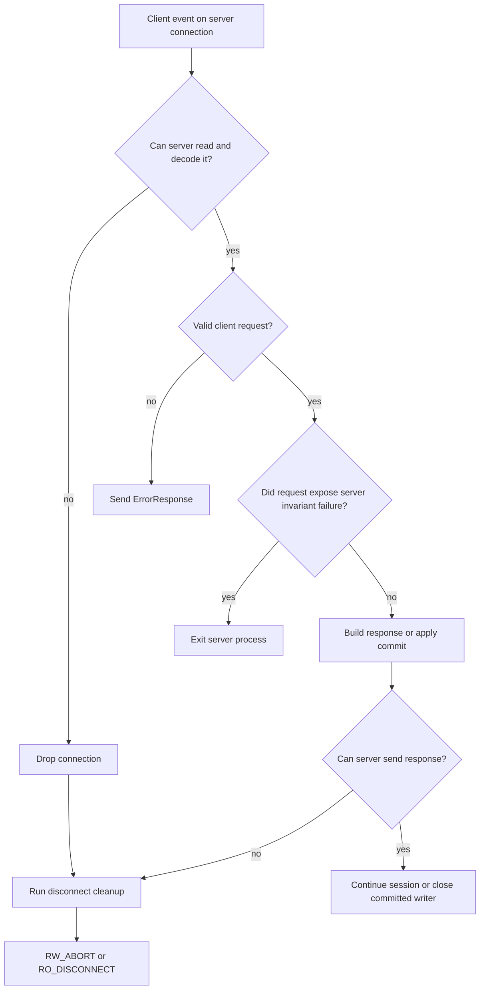
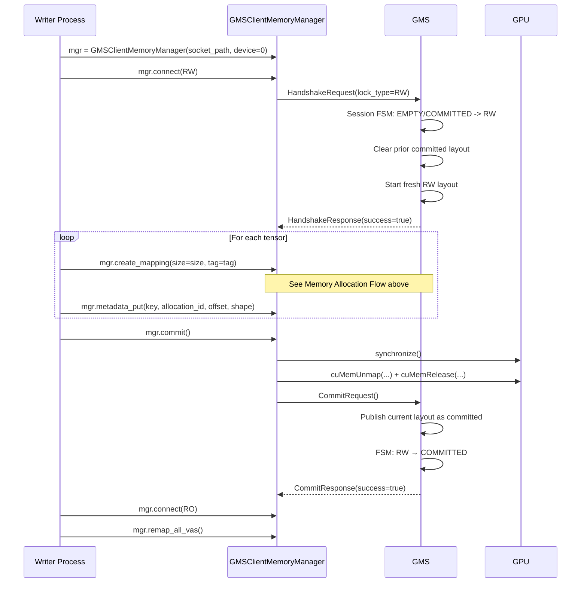
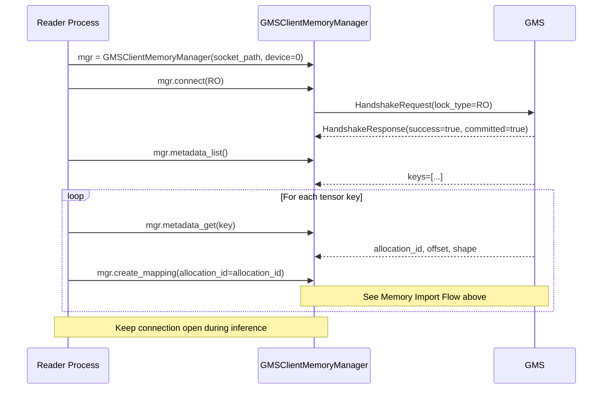
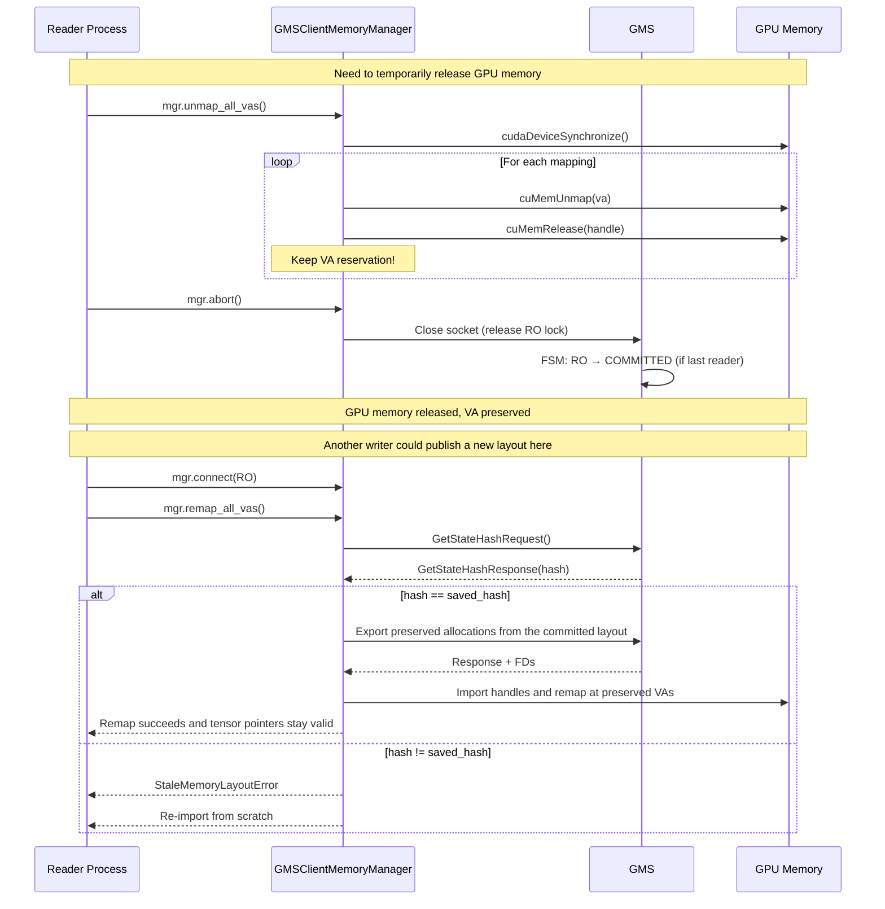

# GPU Memory Service（GMS）

## 概览

**GPU Memory Service（GMS）** 是一个独立进程外（out-of-process）的 GPU 内存管理器，将 GPU 内存的所有权与使用它的进程解耦。这能实现：

- 多进程间 GPU 内存的**零拷贝共享**
- 进程崩溃后**数据继续存活**
- 后续 worker 通过内存导入而非磁盘 I/O **快速加载模型**

GMS 通过 `CUDAPluggableAllocator` 与 PyTorch 集成，并为 **vLLM**、**SGLang** 等推理（inference）框架提供预制集成。

## 问题背景

在传统 LLM 推理部署中，每个 worker 进程：
1. 从磁盘/网络将模型权重加载到 GPU 内存
2. 在进程生命期内持有该 GPU 内存
3. 无法与同一 GPU 上的其他 worker 共享权重

带来的问题：
- **worker 启动慢**（权重加载是 I/O 受限）
- **内存浪费**（多 worker 时权重重复存储）
- **无崩溃容灾**（进程死亡时 GPU 内存丢失）

## 解决方案架构

```
┌──────────────────────────────────────────────────────────────────────────────────────┐
│                                                                                      │
│  ┌────────────────────┐                  ┌─────────────────────────────────────────┐ │
│  │        GMS         │                  │    GMSClientMemoryManager (Writer)      │ │
│  │                    │                  │                                         │ │
│  │ ┌────────────────┐ │                  │  ┌─────────────────────────────────┐    │ │
│  │ │ Memory Manager │ │ ◄── Unix ───────►│  │         GMS Session             │    │ │
│  │ └────────────────┘ │    Socket        │  └─────────────────────────────────┘    │ │
│  │                    │       +          │                                         │ │
│  │ ┌────────────────┐ │      FD          │  Writer-only: create_mapping, commit    │ │
│  │ │ Session / FSM  │ │  (SCM_RIGHTS)    └─────────────────────────────────────────┘ │
│  │ └────────────────┘ │                                                              │
│  │                    │                  ┌─────────────────────────────────────────┐ │
│  │ ┌────────────────┐ │                  │    GMSClientMemoryManager (Reader)      │ │
│  │ │ Metadata Store │ │                  │                                         │ │
│  │ └────────────────┘ │ ◄── Unix ───────►│  ┌─────────────────────────────────┐    │ │
│  │                    │    Socket        │  │         GMS Session             │    │ │
│  └────────────────────┘       +          │  └─────────────────────────────────┘    │ │
│                              FD          │                                         │ │
│                          (SCM_RIGHTS)    │  Reader-only: create_mapping (import),   │ │
│                                          │               unmap_all_vas, remap      │ │
│                                          └─────────────────────────────────────────┘ │
│                                                                                      │
└──────────────────────────────────────────────────────────────────────────────────────┘
```

## 核心组件

GMS 采用客户端-服务端架构：**服务端**持有 GPU 内存分配，**客户端**将该内存映射到自身地址空间。关键洞见：socket 连接本身充当分布式锁。

### 服务端

GMS 服务端作为独立进程运行，从不把 GPU 内存映射到自己的地址空间。该设计使服务端可以：

- **承受 GPU 驱动故障** — 不持有 CUDA context 即可避免驱动 reset 的影响
- **比客户端进程更长寿** — 内存在客户端崩溃后仍然存在
- **仲裁访问** — 强制单写者、多读者语义

服务端由三大组件组成：

1. **Memory Manager** — 通过 CUDA VMM（`cuMemCreate`）分配物理 GPU 内存，并对每次分配主动导出（`cuMemExportToShareableHandle`）一个可共享文件描述符（FD）。后续的 export RPC 会 `dup()` 缓存的 FD，而不再回调 CUDA。关键是：它从不调用 `cuMemMap` — 所有虚拟地址映射由客户端处理。分配请求在 OOM 时会重试，直到成功或达到可选的重试超时。

2. **状态机（FSM）** — 管理全局锁状态、等待者协调与断开清理。

3. **Metadata Store / Layout State** — `GMS` 持有元数据表与已提交的 layout hash。分配与元数据存放于一个扁平存储；每次新 writer 连接或 writer 中止时清空。

每个 GMS 服务端只负责管理 1 个 GPU 的内存，且不与其他 GPU 对应的 GMS 服务端交互。

### 客户端

客户端连接服务端以获取锁并访问 GPU 内存。受支持的客户端 API 是：

1. **GMSClientMemoryManager** — 高层客户端，封装了内部 RPC 传输层，并安全地处理用于内存导入与映射的全部 CUDA VMM 操作：
   - 导入 FD 并转换为 CUDA 内存句柄
   - 预留虚拟地址空间并映射物理内存
   - 设置合适的访问权限（writer 为 RW，reader 为 RO）
   - 支持 **unmap/remap**，在内存压力下做 VA 稳定的内存释放

> **注意**：客户端代码请始终通过 `GMSClientMemoryManager` 访问 GMS。底层 RPC 客户端是实现细节，不应直接使用。

### 内存分配与导入流程

下图展示 `GMSClientMemoryManager` 与服务端、GPU 之间的交互。**Writer** 分配新内存而 **reader** 导入既有分配 — 二者共享同一套 export/import/map 序列。



---

## 状态机

服务端维护一个有限状态机（FSM），管理锁获取与内存访问。状态由当前连接情况**派生**得到，而非显式存储。

### 状态与转换



### 状态描述

| 状态 | 描述 | 可连 RW | 可连 RO |
|-------|-------------|:--------------:|:--------------:|
| `EMPTY` | 无连接，无可见的已提交 layout | ✓ | ✗ |
| `RW` | writer 已连接（独占访问） | ✗ | ✗ |
| `COMMITTED` | reader 可见已提交 layout，但当前无活动连接 | ✓ | ✓ |
| `RO` | 一个或多个 reader 已连接（共享访问） | ✗ | ✓ |

### 事件

| 事件 | 触发 | 描述 |
|-------|---------|-------------|
| `RW_CONNECT` | writer 连接 | 获取独占写锁，立即清空之前已提交的 layout，并开始新的 RW layout 构建 |
| `RW_COMMIT` | writer 调用 `commit()` | 将当前 RW layout 发布为已提交 layout，并释放锁 |
| `RW_ABORT` | writer 未提交即断开 | 丢弃当前 RW layout 并回到 `EMPTY` |
| `RO_CONNECT` | reader 连接 | 获取共享读锁 |
| `RO_DISCONNECT` | reader 断开 | 释放共享锁；若是最后一个 reader，则回到 COMMITTED |

### 锁语义

握手成功的 socket 连接**就是**锁：

- **崩溃容灾**：连接关闭（包括进程崩溃）会自动释放锁
- **无显式 unlock**：消除"忘记释放锁"和死锁
- **原子转换**：状态变化与 socket 操作原子发生

唯一例外是运行时巡检探针（`GetRuntimeState`、`GetEventHistory`）：它们连接、抓取诊断、关闭，并不进入锁的 FSM。

### Layout 生命周期

Layout 创建与发布的流程：



- `RW_CONNECT` 启动新的 RW layout 构建。
- `RW_COMMIT` 发布当前 layout；它不会再创建新的 layout。
- `RW_ABORT` 丢弃当前 RW layout 并把系统返回 `EMPTY`。
- `RW -> EMPTY` 不需要先分配新 layout；当 writer 在 commit 前 drop 会话时立即发生。
- 不存在用于"在保留同一 writer 会话的同时清空活动 RW layout"的 RPC。要放弃部分构建的 RW layout，writer 必须断开或调用 `abort()`；任何后续 RW 构建都从新的 `RW_CONNECT` 开始。
- 分配与元数据位于一个扁平存储，会在 `RW_CONNECT` 与 `RW_ABORT` 时被清空。
- RO 请求只对已提交 layout 提供服务；RW 请求只变更活动 layout。
- 读 RPC（`export`、分配查询/列举、元数据查询/列举）都基于该单一活动存储。这是安全的，因为 FSM 阻止 RW 与 RO 会话同时存在。
- `metadata_put` 校验分配所有权与偏移边界，`free` 级联清理元数据，`commit` 拒绝悬空的元数据引用。

### OOM 时的分配回压

当 writer 请求新分配时，GMS 把 CUDA OOM 视为瞬时状况：

- `cuMemCreate` OOM **不会**立即让请求失败。
- 服务端在循环中重试，直到分配成功后才返回成功。
- 服务端 CLI 标志：
  - `--alloc-retry-interval`（默认 `0.5`）
  - `--alloc-retry-timeout`（默认未设 = 无限等待）

这确保"新 writer 获得新分配"的工作流可以等待内存回收，而不是在 OOM 失败上立即失败。

### 保证

- GMS 保证其自身的 RPC 不会混淆已提交与活动两代；并保证 `GMSClientMemoryManager.commit()` 在发布前先做 CUDA 同步，并 unmap writer 本地映射。
- 在本地 unmap 后，`commit()` 不尝试在进程内恢复。非 CUDA 失败抛出异常，而 CUDA VMM 失败将退出进程。
- 唯一不致命的客户端连接失败是锁获取超时。其他客户端 GMS 传输、协议、服务端错误响应都会抛出异常。
- 客户端或服务端任何非 OOM 的 CUDA VMM 失败都是致命的，会退出进程。
- 服务端将不可信客户端连接隔离到该连接：传输丢失与发送响应失败仅展开本连接的状态；只有服务端不变量违反或 CUDA 失败会杀死服务端。
- 运行时状态中的 `allocation_count` 与 `allocations_cleared` 仅报告服务端持有的分配句柄。其他进程中已导入的句柄即便在服务端清空自身 layout 状态后，也可能仍让显存（VRAM）保持存活。
- GMS *无法证明* 已断开或已提交的 writer 在设备上已无未完成的 GPU 工作。本设计的缓解措施是：新 RW layout 使用全新分配，并可在分配成功前等待内存回收。

---

### 服务端信任边界



- `Drop connection` 表示服务端不再信任该 socket，仅展开该连接的锁状态。
- 在 `RW_COMMIT` 之后，断开清理只关闭已提交 writer 的 socket；不会把服务端回滚到 `RW_ABORT`。
- `Valid client request?` 涵盖模式/状态违反、未知请求以及如错误元数据偏移之类的请求校验失败。
- `Did request expose server invariant failure?` 涵盖不可能出现的 layout/FSM 状态以及 commit 时的元数据完整性失败。

## 时序图

### Writer 流程（冷启动）

第一个 worker 从磁盘加载权重并发布到 GMS。



### Reader 流程（热启动）

后续 worker 从 GMS 导入权重而无需从磁盘加载。



### Unmap/Remap 流程（内存压力）

reader 可在保留虚拟地址预留的同时临时释放 GPU 内存。这支持"shadow engine"模式 — 不活跃的 worker 把内存让给活跃的 worker。



### 自动模式（RW_OR_RO）

`RW_OR_RO` 模式根据服务端状态自动选择 writer 或 reader，简化多 worker 部署。

```mermaid
sequenceDiagram
    participant P as Process
    participant C as GMSClientMemoryManager
    participant S as GMS

    Note over P,S: Auto-mode: try RW only when no committed layout exists

    P->>C: mgr = GMSClientMemoryManager(socket_path, device=0)
    P->>C: mgr.connect(RW_OR_RO)
    C->>S: HandshakeRequest(lock_type=RW_OR_RO)

    alt No committed weights AND no RW holder
        S->>S: Grant RW lock
        S->>S: FSM: EMPTY → RW
        S-->>C: HandshakeResponse(granted=RW, committed=false)
        Note over P: First process - load from disk
    else Weights already committed
        S->>S: Grant RO lock
        S->>S: FSM: COMMITTED → RO
        S-->>C: HandshakeResponse(granted=RO, committed=true)
        Note over P: Subsequent process - import from GMS
    else RW held by another
        S->>S: Wait for current writer to either commit or abort
        alt current writer commits
            S->>S: Grant RO from COMMITTED
            S-->>C: HandshakeResponse(granted=RO, committed=true)
            Note over P: Import published weights
        else current writer aborts
            S->>S: Grant RW from EMPTY
            S-->>C: HandshakeResponse(granted=RW, committed=false)
            Note over P: Previous writer gave up; this process becomes the writer
        end
    end
```

---

## 关键设计决策

### 1. 服务端不做 VA 映射

服务端从不把内存映射到虚拟地址（`cuMemMap`）。这意味着：
- 服务端**无需 CUDA context**
- 服务端可承受 GPU 驱动 reset
- 内存管理完全委托给客户端

### 2. Socket 即锁

socket 连接**就是**锁：
- RW 锁：独占连接（同时只有一个 RW）
- RO 锁：共享连接（允许多个 RO）
- 释放锁 = 关闭 socket（崩溃时自动）

收益：
- **崩溃容灾**：reader 崩溃时锁会自动释放
- **无显式 unlock**：不会忘释放锁，也不会死锁

### 3. VA 稳定的 Unmap/Remap

`unmap_all_vas()` 期间：
- 物理内存被释放（`cuMemUnmap` + `cuMemRelease`）
- VA 预留**被保留**（`cuMemAddressReserve` 仍有效）

`remap_all_vas()` 期间：
- 同一 VA 被重新用于映射
- **张量指针保持有效**（无需更新 PyTorch 张量）

### 4. 内存 Layout 哈希

commit 时，服务端对以下内容计算哈希：
- 所有分配的 layout slot、size、aligned size 与 tag
- 所有元数据 key、offset 与 value

`remap_all_vas()` 时校验该哈希：
- 匹配：可安全 remap（layout 未变）
- 不匹配：抛出 `StaleMemoryLayoutError`（必须重新导入）

哈希与当前已提交 layout 绑定，writer 一旦获取 RW 即被清空。

**重要**：它检测**结构性**变化，不检测**内容**变化。
只要结构保持不变，权重值可以原地修改（如 RL 训练更新）。

---

## Wire 协议

### 消息格式

```
┌──────────────┬────────────────────────────────────────┐
│ Length (4B)  │  msgpack-encoded Message               │
│ big-endian   │                                        │
└──────────────┴────────────────────────────────────────┘
```

### FD 传递

文件描述符通过 Unix socket 的 `SCM_RIGHTS` 带外传递：

```python
# Server side (send FD)
socket.send_fds(sock, [message_bytes], [fd])

# Client side (receive FD)
data, fds, _, _ = socket.recv_fds(sock, bufsize, maxfds=1)
fd = fds[0] if fds else -1
```

---

## API 参考

### GMSClientMemoryManager

API 分为两层。**Tier 2（便捷层）** 是集成方常用的；**Tier 1（原子层）** 暴露各个独立操作，供高级使用者使用。

```python
class GMSClientMemoryManager:
    def __init__(socket_path: str, *, device: int = 0): ...

    # Properties
    @property granted_lock_type: Optional[GrantedLockType]
    @property is_connected: bool
    @property is_unmapped: bool
    @property total_bytes: int

    # --- Tier 1: Connection ---
    def connect(lock_type: RequestedLockType, timeout_ms: Optional[int] = None) -> None
    def abort() -> None

    # --- Tier 1: Handle ops (server-side, RW only) ---
    def allocate_handle(size: int, tag: str = "default") -> Tuple[str, int]  # Returns allocation_id, layout_slot
    def export_handle(allocation_id: str) -> int                     # Returns FD
    def get_handle_info(allocation_id: str) -> GetAllocationResponse
    def free_handle(allocation_id: str) -> bool
    def commit() -> bool                                             # Sync + unmap local mappings + publish; raises on non-CUDA failure after unmap
    def get_memory_layout_hash() -> str
    def list_handles(tag: Optional[str] = None) -> List[GetAllocationResponse]

    # --- Tier 1: VA ops (local) ---
    def reserve_va(size: int) -> int                                 # Returns VA
    def map_va(fd, va, size, allocation_id, tag) -> int              # Returns handle
    def unmap_va(va: int) -> None                                    # Keeps VA reservation
    def free_va(va: int) -> None                                     # Releases VA reservation

    # --- Tier 1: Metadata ---
    def metadata_put(key: str, allocation_id: str, offset_bytes: int, value: bytes) -> bool
    def metadata_get(key: str) -> Optional[Tuple[str, int, bytes]]
    def metadata_list(prefix: str = "") -> List[str]
    def metadata_delete(key: str) -> bool

    # --- Tier 2: Convenience ---
    def create_mapping(allocation_id=None, size=0, tag="default") -> int  # Allocate or import
    def destroy_mapping(va: int) -> None
    def unmap_all_vas() -> None          # Sync + unmap all, preserve VA reservations
    def remap_all_vas() -> None          # Re-import at preserved VAs (checks layout hash)
    def reallocate_all_handles(tag="default") -> None  # Fresh server handles for preserved VAs
    def close() -> None
```

---

## 框架集成（vLLM / SGLang）

GMS 为 vLLM 与 SGLang 提供预制集成。在启动引擎时通过 `--load-format gms` 启用 GMS。

### 工作原理

设置 `--load-format gms` 后：

1. **目标 GPU 设备上必须已运行一个 GMS 服务端**。引擎通过基于 GPU UUID 的 Unix socket 连接它。
2. 引擎默认使用 `RW_OR_RO` 模式：若不存在已提交 layout 且无 writer 持锁，则首个进程获得 RW 并从磁盘加载权重。若已有 writer 活跃，则后续客户端等待该 writer 提交或中止；其 commit 后获 RO 导入已发布权重，其 abort 后某个客户端可成为新的 RW writer。
3. 权重与 KV 缓存（KV cache）都由 GMS 管理，但使用不同 tag：
   - `weights`：发布/导入流程（先 `RW_OR_RO`，commit 后转 `RO`）
   - `kv_cache`：用于可变 KV 缓存内存的独立 RW-only tag

#### vLLM

```bash
python -m dynamo.vllm \
  --model <model> \
  --load-format gms \
  --worker-cls gpu_memory_service.integrations.vllm.worker:GMSWorker \
  --enable-sleep-mode \
  --gpu-memory-utilization 0.9
```

该集成使用自定义 worker 类（`GMSWorker`），它：
- 在 `init_device()` 早期建立 GMS 连接，便于 vLLM 的 `MemorySnapshot` 正确计入已提交权重
- 为 `gms` 加载格式注册自定义模型加载器（`GMSModelLoader`）
- 打补丁 `torch.cuda.empty_cache` 以避免释放 GMS 管理的内存
- 在 GPU 上使用两个 GMS tag：
  - `weights`：常规发布/导入流程（先 `RW_OR_RO`，commit 后转 `RO`）
  - `kv_cache`：用于可变 KV 缓存内存的独立 RW-only tag
- 通过由对应 GMS tag 支持的 `CUDAPluggableAllocator` 路由权重与 KV 缓存分配

#### SGLang

```bash
python -m dynamo.sglang \
  --model-path <model> \
  --load-format gms \
  --enable-memory-saver \
  --mem-fraction-static 0.9
```

该集成对 `torch_memory_saver` 打补丁，使权重与 KV 缓存操作都经 GMS：
- 权重（`"weights"`）使用 `weights` GMS tag
- KV 缓存（`"kv_cache"`）使用独立的 RW-only `kv_cache` GMS tag
- GMS 模式不支持其他 tag
- 必须传 `--enable-memory-saver` 以激活 memory saver 路径

### Shadow Engine 故障切换（Sleep / Wake）

两个集成都支持释放与回收 GPU 内存以实现 shadow engine 模式。API 名称因框架而异：

- **vLLM**：`sleep` / `wake_up`（通过 `/engine/sleep` 与 `/engine/wake_up` HTTP 端点）
- **SGLang**：`release_memory_occupation` / `resume_memory_occupation`（通过对应 HTTP 端点）

底层上，sleep 调用 `unmap_all_vas()` + `abort()` 释放 GPU 内存而保留 VA 预留。Wake 与 tag 相关：

- **weights**：`connect(RO)` + `remap_all_vas()`
- **kv_cache**：`connect(RW)` + `reallocate_all_handles("kv_cache")` + `remap_all_vas()`

由于原始虚拟地址被保留，张量指针仍有效。

这使 shadow engine 可以释放 GPU 内存让主引擎使用 GPU，再在主引擎被杀死后回收内存。可变 KV 缓存在重新分配前总是经由其自身 GMS tag 中的新 RW layout 流转。

### 通过 `model_loader_extra_config` 配置

如要强制只读模式（仅导入，从不从磁盘加载），通过框架的 `--model-loader-extra-config` 标志传 `gms_read_only`：

```bash
--model-loader-extra-config '{"gms_read_only": true}'
```

这会强制 `RO` 锁模式，而非默认的 `RW_OR_RO` 自动检测。引擎将仅导入已存在的已提交权重，若不存在则失败。
