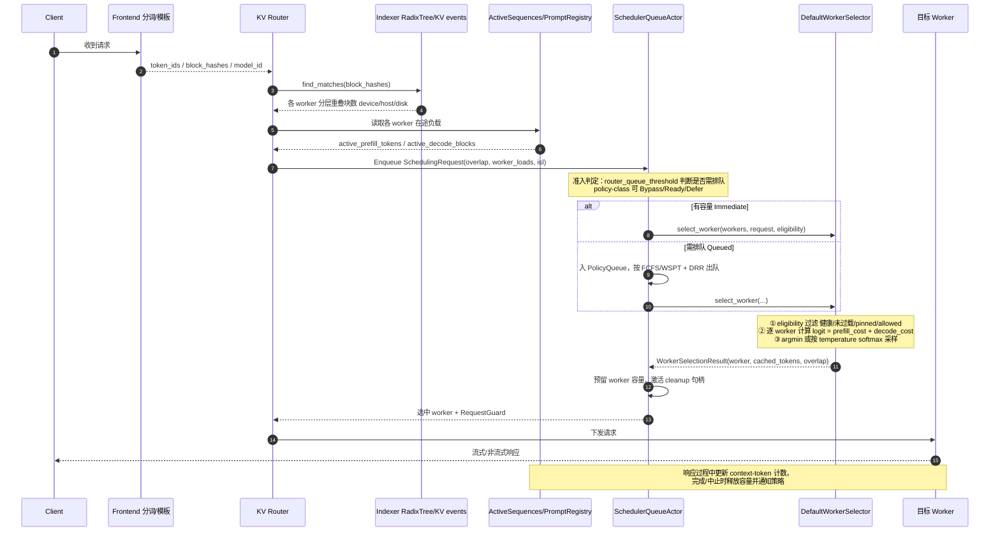

<!--
SPDX-FileCopyrightText: Copyright (c) 2024-2026 NVIDIA CORPORATION & AFFILIATES. All rights reserved.
SPDX-License-Identifier: Apache-2.0
-->

# Dynamo Cache Aware（KV 感知）调度策略详解

> 本文档基于对 `lib/kv-router` 源码的通读，总结 Dynamo 的 cache-aware（KV 感知）
> 路由/调度策略。行文结构参考 SGLang `sgl-model-gateway` 的 `cache_aware.md`，
> 但内容忠实于 Dynamo 的真实实现，并在关键处点明二者的路线差异。

**核心实现**：

- 成本函数（选路打分）：`src/scheduling/selector.rs` — `DefaultWorkerSelector::worker_logit` / `select_worker`
- 参数与默认值：`src/scheduling/config.rs` — `KvRouterConfig`
- 前缀重叠索引（KV 命中估计）：`src/indexer/`（`RadixTree` / `ConcurrentRadixTree`，由 KV events 驱动）
- 多级 overlap 归并：`src/scheduling/overlap.rs`
- 队列准入与派发：`src/scheduling/queue.rs`、`policy_queue.rs`、`CLAUDE.md`
- 在途负载（active prefill / decode）来源：`src/sequences/`（`ActiveSequences` → `PromptRegistry`）

## 一、第一性原理：路由即在线调度

普通 L4/L7 负载均衡器假设「所有健康副本等价」，因此只看队列长度或轮询。
LLM 推理不成立这个假设：每个 worker 的 **KV Cache 中已经驻留了历史请求的前缀**，
把新请求路由到「持有其前缀 KV 的 worker」可以直接复用已算好的 KV，跳过大量 prefill，
显著降低 TTFT 并节省算力。

于是路由问题退化为一个 **在线调度问题**：为每个到达的请求，在「缓存亲和收益」与
「worker 当前负载」之间做权衡，选出**总完成成本最低**的 worker。

Dynamo 与 SGLang cache_aware 的分水岭正在于**如何做这个权衡**：

- **SGLang cache_aware**：双阈值判断系统是否失衡，在「缓存亲和」与「最短队列」两个
  **离散模式**间硬切换（bang-bang）——同一次决策只看一个维度。
- **Dynamo**：把缓存亲和与负载揉进**同一个连续成本函数**（logit），一次性对所有
  eligible worker 打分并取 `argmin`（或按温度做 softmax 采样）——同一次决策**同时权衡**
  缓存与负载。

也就是说，SGLang cache_aware 文档中所设想的「Dynamo 式加权求和」路线，**正是 Dynamo 的现状**。

## 二、成本函数（logit）详解

对每个候选 worker（含 data-parallel rank），`worker_logit` 计算一个标量成本 `logit`，
**越低越好**。选路即：

$$
\text{worker} = \arg\min_{i \in \mathcal{H}} \text{logit}_i
$$

其中 $\mathcal{H}$ 是通过 eligibility 过滤（健康、未过载、满足 pinned/allowed 约束）的候选集合。

### 2.1 公式

对候选 worker $i$，Dynamo 计算：

$$
\begin{aligned}
\mathrm{raw\_prefill\_blocks}_i & =
\begin{cases}
\dfrac{\mathrm{active\_prefill\_tokens}_i
+ \mathrm{uncached\_tokens}_i
+ \mathrm{cached\_tokens}_i}{\mathrm{block\_size}},
& \text{开启 prefill 跟踪且负载已知} \\
\dfrac{\mathrm{isl\_tokens}}{\mathrm{block\_size}},
& \text{开启 prefill 跟踪但负载未知} \\
0, & \text{关闭 prefill 跟踪}
\end{cases} \\
\mathrm{overlap\_credit\_blocks}_i & =
\mathrm{overlap\_score\_credit}
\cdot \mathrm{overlap\_credit\_decay}_i
\cdot \mathrm{device\_overlap\_blocks}_i \\
& \quad + \mathrm{host\_cache\_hit\_weight}
\cdot \mathrm{host\_overlap\_blocks}_i \\
& \quad + \mathrm{disk\_cache\_hit\_weight}
\cdot \mathrm{disk\_overlap\_blocks}_i \\
& \quad + \mathrm{shared\_cache\_multiplier}
\cdot \mathrm{shared\_beyond\_blocks}_i \\
\mathrm{adjusted\_prefill\_blocks}_i & =
\mathrm{raw\_prefill\_blocks}_i
- \mathrm{overlap\_credit\_blocks}_i \\
\mathrm{prefill\_cost\_blocks}_i & =
\mathrm{prefill\_load\_scale}
\cdot \mathrm{adjusted\_prefill\_blocks}_i \\
\mathrm{decode\_cost\_blocks}_i & =
\mathrm{active\_decode\_blocks}_i
+ \mathrm{additional\_active\_blocks}_i \\
\operatorname{logit}_i & =
\mathrm{prefill\_cost\_blocks}_i
+ \mathrm{decode\_cost\_blocks}_i
\end{aligned}
$$

合并后为：

$$
\boxed{
\begin{aligned}
\operatorname{logit}_i ={}&
\mathrm{prefill\_load\_scale}
\Bigl[
\mathrm{raw\_prefill\_blocks}_i \\
&- \mathrm{overlap\_score\_credit}
\cdot \mathrm{overlap\_credit\_decay}_i
\cdot \mathrm{device\_overlap\_blocks}_i \\
&- \mathrm{host\_cache\_hit\_weight}
\cdot \mathrm{host\_overlap\_blocks}_i \\
&- \mathrm{disk\_cache\_hit\_weight}
\cdot \mathrm{disk\_overlap\_blocks}_i \\
&- \mathrm{shared\_cache\_multiplier}
\cdot \mathrm{shared\_beyond\_blocks}_i
\Bigr] \\
&+ \mathrm{active\_decode\_blocks}_i
+ \mathrm{additional\_active\_blocks}_i
\end{aligned}
}
$$

其中：

- $\mathrm{block\_size}$：每个 KV block 包含的 token 数。
- $\mathrm{isl\_tokens}$：请求的输入 token 数。
- $\mathrm{active\_prefill\_tokens}_i$：worker $i$ 当前在途的 prefill token 数。
- $\mathrm{cached\_tokens}_i$：worker $i$ 对本请求的有效缓存 token 数。
- $\mathrm{uncached\_tokens}_i$：扣除有效缓存后仍需计算的 token 数。通常有
  $\mathrm{uncached\_tokens}_i + \mathrm{cached\_tokens}_i = \mathrm{isl\_tokens}$；
  源码保留该运算顺序，以正确处理缓存重叠量超过 prompt 长度等边界情况。
- $\mathrm{device\_overlap\_blocks}_i$、$\mathrm{host\_overlap\_blocks}_i$ 和
  $\mathrm{disk\_overlap\_blocks}_i$：worker $i$ 在对应存储层级命中的前缀 block 数。
- $\mathrm{shared\_beyond\_blocks}_i$：共享缓存中超出 device 前缀的命中 block 数，
  避免与 $\mathrm{device\_overlap\_blocks}_i$ 重复计分。
- $\mathrm{overlap\_score\_credit}$、$\mathrm{host\_cache\_hit\_weight}$、
  $\mathrm{disk\_cache\_hit\_weight}$ 和 $\mathrm{shared\_cache\_multiplier}$：
  各层级缓存命中的权重。
- $\mathrm{overlap\_credit\_decay}_i$：只作用于 device 命中收益的负载衰减因子。
- $\mathrm{prefill\_load\_scale}$：prefill 成本的缩放系数。
- $\mathrm{active\_decode\_blocks}_i$：当前活跃序列占用的 decode block 数。
- $\mathrm{additional\_active\_blocks}_i$：本请求预计新增且未与活跃序列共享的 decode block 数。

所有成本在进入 $\operatorname{logit}_i$ 前都统一换算为 block。最终选择
$\arg\min_i \operatorname{logit}_i$；当 $\mathrm{router\_temperature} > 0$ 时，则根据
$-\operatorname{logit}_i$ 做 softmax 采样。

### 2.2 逐项拆解

**① `raw_prefill_blocks`（原始 prefill 负载，越大越忙）**

当开启 `router_track_prefill_tokens`（默认 true）且已知该 worker 负载时：

$$
\begin{aligned}
\mathrm{raw\_prefill\_tokens}_i & = \mathrm{active\_prefill\_tokens}_i + \mathrm{isl\_tokens} \\
\mathrm{raw\_prefill\_blocks}_i & = \frac{\mathrm{raw\_prefill\_tokens}_i}{\mathrm{block\_size}}
\end{aligned}
$$

即「该 worker **当前在途** prefill token 积压」加上「本请求的完整输入长度 ISL」。
代码实现上先算 $\mathrm{uncached} = \mathrm{isl} - \mathrm{cached}$，再 $+\ \mathrm{cached}$ 加回（`selector.rs:140-156`），
是为了让**缓存折扣完全由 $\mathrm{overlap\_credit\_blocks}$ 承担**，从而支持 $\mathrm{overlap\_score\_credit} > 1.0$
的「超额折扣」。当 $\mathrm{overlap\_score\_credit} = 1.0$ 时二者恰好抵消，等价于
$\dfrac{\mathrm{active\_prefill\_tokens}_i + \mathrm{uncached\_tokens}_i}{\mathrm{block\_size}}$。

**② `overlap_credit_blocks`（缓存命中折扣，抵扣 prefill 负载）**

命中的前缀 block 越多，说明这些 token 无需重新 prefill，故从负载中减去。Dynamo 按
**存储层级**分别加权（见 `overlap.rs`）：

| 层级                                         | 权重参数                  | 默认值                               | 含义                                                                  |
| -------------------------------------------- | ------------------------- | ------------------------------------ | --------------------------------------------------------------------- |
| device（显存）                               | `overlap_score_credit`    | `1.0`                                | 显存直接命中，最有价值；>1.0 可给显存命中额外加成，0.0 则完全忽略前缀 |
| host-pinned（CPU 内存）                      | `host_cache_hit_weight`   | `0.75`                               | 需从 CPU 内存拉回，价值折损                                           |
| disk / external（SSD/远端）                  | `disk_cache_hit_weight`   | `0.25`                               | 需从磁盘/远端拉回，价值最低                                           |
| shared（外部共享缓存，如 SGLang HiCache L3） | `shared_cache_multiplier` | `0.0`（启用共享缓存时 CLI 置 `0.5`） | 仅计 device 前缀**之外**的额外命中（`hits_beyond`），避免重复计分     |

`device_overlap_blocks` 由 indexer 的最长前缀匹配给出——KV events 从各 worker 上报块哈希，
写入按 worker 隔离的 radix tree，`find_matches` 返回每个 worker 的重叠块数。

**③ `overlap_credit_decay`（亲和随负载软衰减，破除热点正反馈）**

若只追 `argmax` 缓存命中，会形成「缓存越热 → 流量越集中 → 缓存越热」的正反馈灾难。
Dynamo 用一个**有理衰减因子**在**同一个成本函数内部**软化亲和收益（`selector.rs:186-197`）：

$$
\mathrm{overlap\_credit\_decay}_i = \frac{1}{1 + \mathrm{overlap\_score\_credit\_decay} \cdot \dfrac{\max\bigl(0,\ \mathrm{active\_prefill}_i - \mathrm{active\_prefill}_{\min}\bigr)}{\mathrm{request\_blocks}}}
$$

各符号含义（对应 `selector.rs:186-197`）：

- $\mathrm{overlap\_credit\_decay}_i$：worker $i$ 的**衰减因子**，取值 $(0, 1]$。仅乘在 device 命中收益上
  （$\mathrm{effective\_overlap\_score\_credit} = \mathrm{overlap\_score\_credit} \cdot \mathrm{overlap\_credit\_decay}_i$），
  host/disk/shared 命中不受影响。因子 $=1$ 表示全额亲和折扣，越接近 $0$ 表示折扣被压得越狠。
- $\mathrm{overlap\_score\_credit\_decay}$：**衰减速率**（可配参数，默认 $0.0$）。$=0$ 时因子恒为 $1$，
  即**关闭衰减**；越大则同样的负载差就把亲和折扣压得越低，路由越早偏向负载均衡。
- $\mathrm{active\_prefill}_i$：worker $i$ **当前在途的 prefill token 积压**（来自 `worker_loads` 快照，
  即 $\mathrm{active\_prefill\_tokens}_i$）。
- $\mathrm{active\_prefill}_{\min}$：所有 eligible worker 中的**最小在途 prefill 积压**，即「最空闲 worker」的负载基准。
- $\max\bigl(0,\ \mathrm{active\_prefill}_i - \mathrm{active\_prefill}_{\min}\bigr)$：worker $i$ **相对最空闲 worker 的超额积压**
  （token 数，负值截断为 $0$）；源码中先除以 $\mathrm{block\_size}$ 换算成 block（`excess_active_prefill_blocks`）。
- $\mathrm{request\_blocks}$：**本请求自身的 block 数**（$\lceil \mathrm{isl\_tokens} / \mathrm{block\_size} \rceil$）。
  用它做分母是为了**按请求规模归一化**：把「超额积压」表达成「相当于多少个本请求」，使衰减强度与请求大小无关。

直观理解：分母那一项 $\dfrac{\text{超额积压 blocks}}{\text{本请求 blocks}}$ 就是 worker $i$「比最闲 worker 多压了几个本请求量」；
乘上速率 $\mathrm{overlap\_score\_credit\_decay}$ 后代入 $\frac{1}{1+x}$ 得到衰减因子。
当某 worker 的 prefill 积压高出「最空闲 eligible worker」越多，其 device 命中折扣被压得越小，
从而更倾向把请求分给更空闲的 worker。**处于负载下限的 worker（超额为 $0$）保留全额 device 命中折扣**。

> 这是对 SGLang「失衡后硬切最短队列」的**软切换（soft）替代**：不做模式跳变，而是让
> 亲和收益随负载连续退火。

**④ `decode_cost_blocks`（decode 侧 KV 占用）**

$$
\mathrm{potential\_decode\_blocks}_i = \mathrm{active\_decode\_blocks}_i + \mathrm{additional\_active\_blocks}_i
$$

（`sequences/prompt_registry.rs:40`），即该 worker 现有 decode KV 占用，加上本请求落地后
**新增且未与现有活跃序列共享**的 block。它衡量 decode 阶段的显存压力，独立于 prefill 负载。

### 2.3 温度与采样

`router_temperature`（默认 `0.0`）控制选路的确定性（`selector.rs:370-404`）：

- `temperature == 0` → **确定性 `argmin`**；多个 worker 并列最小时用蓄水池采样均匀打破平局。
- `temperature > 0` → 对 `−logit` 做 **softmax 采样**（logit 越低被选概率越高）。用于在多个
  近似最优 worker 间分散流量，缓解「羊群效应」与瞬时热点。

## 三、请求从前端到选出 Worker 的时序

选路发生在**预处理（含分词）之后**，请求真正下发 backend 之前。gRPC/HTTP 请求经 Frontend
预处理产出 token，KV Router 查 indexer 得到各 worker 的前缀重叠，再由 SchedulerQueueActor
统一做**准入 + 选路 + 容量预留**。

**关键点：**

- **重叠来自 indexer，负载来自 sequences**：`SchedulingRequest` 携带 `overlap`（分层重叠块）
  与 `worker_loads`（各 worker 在途 prefill/decode）两组快照，`worker_logit` 只读它们，
  **不直接扫描** `ActiveSequences`（见 `scheduling/CLAUDE.md` 护栏）。
- **准入与选路分离**：`router_queue_threshold` 决定是否排队；`RouterQueuePolicy`（`fcfs` 默认 /
  `wspt`）决定排队时的出队顺序；`PolicyQueue` 用 DRR 在 policy-class 间做加权轮转。
  真正的 worker 选择只在 `admit_one` 内发生一次，随后**原子预留容量**。
- **选路器无副作用**：selector 不预留容量、不改队列、不改 `PromptRegistry`（护栏要求）。
- **PD 分离**：prefill 池与 decode 池各自维护独立的 selector 与成本口径；decode worker 选路
  日志走 `worker_type = "decode"` 分支（`selector.rs:421`）。
- **pinned / allowed 约束**：若请求被钉在某 worker，则跳过打分直接校验该 worker 是否过载；
  allowed 集合会收窄候选，且必须在选路、队列容量检查、WSPT 优先级三处一致遵守。

## 四、多级 KV 缓存的统一折扣

Dynamo 原生支持 **KVBM 多级缓存**（GPU → CPU → SSD → 远端）以及外部共享缓存。
不同于只看单层命中的策略，Dynamo 把各层命中**按价值加权后汇入同一个 overlap 折扣**：

- device 命中最值钱（权重 1.0），因为无需任何数据搬运；
- host-pinned / disk 命中打折（0.75 / 0.25），反映从下层拉回 KV 的搬运成本；
- 共享缓存只计 device 前缀**之外**的部分（`hits_beyond`），避免与 device 命中重复计分。

这样，一个「显存里没有但 CPU 内存/SSD 里有前缀」的 worker 依然会获得**部分**亲和加分，
使路由能利用整条缓存层级，而非只看显存。

## 四·五、PD 分离下 prefill / decode 的负载估计

PD（Prefill/Decode）分离部署时，prefill 池与 decode 池是**两组独立的 worker**，各自维护
**独立的 selector 与负载表**，但**共用同一个 `worker_logit` 公式**（仅 `worker_type` 标签不同，
`selector.rs:89`）。二者的差别不在公式，而在**同一个 logit 的两个分量各自计入什么**。

每个 worker 的负载以一个 `WorkerLoadProjection` 快照喂给选路器（`prompt_registry.rs:29-42`）：

$$
\begin{aligned}
\mathrm{prefill\_cost\_blocks}_i & =
\mathrm{prefill\_load\_scale} \cdot \bigl(\mathrm{raw\_prefill\_blocks}_i - \mathrm{overlap\_credit\_blocks}_i\bigr) \\
\mathrm{decode\_cost\_blocks}_i & =
\underbrace{\mathrm{active\_decode\_blocks}_i + \mathrm{additional\_active\_blocks}_i}_{\mathrm{potential\_decode\_blocks}_i}
\end{aligned}
$$

**① prefill worker 的 load（prefill 分量主导）**

- $\mathrm{active\_prefill\_tokens}_i$：该 prefill worker **当前在途的 prefill token 积压**，
  由 `ActiveSequences` 跟踪、经衰减后给出（`multi_worker.rs:418`，即 `active_tokens(decay_now)`）。
- $\mathrm{raw\_prefill\_blocks}_i = (\mathrm{active\_prefill\_tokens}_i + \mathrm{isl\_tokens}) / \mathrm{block\_size}$，
  再减去按层级加权的 $\mathrm{overlap\_credit\_blocks}_i$（device/host/disk/shared 命中折扣）。
- prefill worker 处理完即把 KV 交给 decode，通常**没有长期 decode 占用**，故其 $\mathrm{decode\_cost\_blocks}_i$
  一般很小或为 0——即 prefill 池选路**主要看 prefill 积压 + 前缀命中**。

prefill worker 的 logit（记为 $\operatorname{logit}^{P}_i$）：

$$
\begin{aligned}
\operatorname{logit}^{P}_i ={}&
\mathrm{prefill\_load\_scale}
\Bigl[
\frac{\mathrm{active\_prefill\_tokens}_i + \mathrm{isl\_tokens}}{\mathrm{block\_size}} \\
&- \mathrm{overlap\_score\_credit}
\cdot \mathrm{overlap\_credit\_decay}_i
\cdot \mathrm{device\_overlap\_blocks}_i \\
&- \mathrm{host\_cache\_hit\_weight}
\cdot \mathrm{host\_overlap\_blocks}_i \\
&- \mathrm{disk\_cache\_hit\_weight}
\cdot \mathrm{disk\_overlap\_blocks}_i \\
&- \mathrm{shared\_cache\_multiplier}
\cdot \mathrm{shared\_beyond\_blocks}_i
\Bigr]
\underbrace{{}+ \mathrm{potential\_decode\_blocks}_i}_{\approx\, 0\ \text{(prefill 池无长期 decode)}}
\end{aligned}
$$

即 prefill 池上实际退化为 $\operatorname{logit}^{P}_i \approx \mathrm{prefill\_load\_scale}\cdot\bigl(\mathrm{raw\_prefill\_blocks}_i - \mathrm{overlap\_credit\_blocks}_i\bigr)$，
**取 $\arg\min_i \operatorname{logit}^{P}_i$ = 「前缀命中最多、prefill 积压最小」的 prefill worker**。

**② decode worker 的 load（decode 分量主导）**

- $\mathrm{active\_decode\_blocks}_i$：该 decode worker **现有活跃序列占用的 decode KV block 数**
  （`prompt_registry.rs:335`，来自引擎上报的 `active_blocks`）。
- $\mathrm{additional\_active\_blocks}_i = \max(0,\ \mathrm{query\_len} - \mathrm{overlap\_depth})$
  （`prompt_registry.rs:336`）：本请求落地后**新增且未与现有活跃序列共享**的 block，
  即它对 decode 显存的边际占用。
- 二者相加即 $\mathrm{potential\_decode\_blocks}_i$，衡量 decode 阶段的**显存压力**——decode 池选路
  **主要看 decode KV 占用**；若该池也开启 prefill 跟踪，prefill 分量则反映 decode 前的一次性 prefill。

decode worker 的 logit（记为 $\operatorname{logit}^{D}_i$）：

$$
\operatorname{logit}^{D}_i =
\underbrace{\mathrm{prefill\_load\_scale}\cdot\bigl(\mathrm{raw\_prefill\_blocks}_i - \mathrm{overlap\_credit\_blocks}_i\bigr)}_{\text{开启 prefill 跟踪时才非 0：反映落地前的一次性 prefill}}
+ \underbrace{\bigl(\mathrm{active\_decode\_blocks}_i + \mathrm{additional\_active\_blocks}_i\bigr)}_{\mathrm{potential\_decode\_blocks}_i\ \text{(主导项)}}
$$

当 decode 池不跟踪 prefill（常见配置）时退化为 $\operatorname{logit}^{D}_i \approx \mathrm{potential\_decode\_blocks}_i$，
**取 $\arg\min_i \operatorname{logit}^{D}_i$ = 「decode KV 占用（现有 + 本请求边际新增）最小」的 decode worker**。

> 两个公式共享同一个 $\operatorname{logit}_i = \mathrm{prefill\_cost\_blocks}_i + \mathrm{decode\_cost\_blocks}_i$（见第二节）；
> $\operatorname{logit}^{P}$ 与 $\operatorname{logit}^{D}$ 并非两套不同的公式，而是同一公式在两类 worker 上因
> “哪个分量非 0”而自然呈现的不同主导项。

**关键点：**

- **负载来源相同、口径分离**：两池的 $\mathrm{active\_prefill\_tokens}$ / $\mathrm{active\_decode\_blocks}$
  都来自各自 worker 上报的 KV events + `ActiveSequences` 跟踪，但**互不混算**——prefill 池的负载表
  不含 decode 占用，反之亦然。
- **同一公式、不同主导项**：prefill 选路由 prefill 分量主导，decode 选路由 decode 分量主导；
  这不是两套算法，而是同一 logit 在两种 worker 上「自然偏重不同分量」的结果。
- **前缀亲和对两池都生效**：只要对应池的 indexer 记录了前缀命中，$\mathrm{overlap\_credit\_blocks}$
  都会抵扣其 prefill 负载——PD 分离并不关闭 cache-aware，只是把它分别应用到两组 worker 上。

## 五、参数配置

策略参数定义见 `KvRouterConfig`（`src/scheduling/config.rs`），可经环境变量或
`RouterConfigOverride` 按请求覆盖。

| 参数                          | 类型          | 默认值                              | 含义                                                              | 调参影响                                                                                          |
| ----------------------------- | ------------- | ----------------------------------- | ----------------------------------------------------------------- | ------------------------------------------------------------------------------------------------- |
| `overlap_score_credit`        | `f64`         | `1.0`                               | device 前缀命中的折扣乘子（必须有限且 ≥0）                       | 调高 → 更看重显存亲和（易热点）；`=1.0` 与 raw 加回项抵消；`=0.0` 完全忽略前缀，退化为纯负载均衡 |
| `overlap_score_credit_decay`  | `f64`         | `0.0`                               | device 亲和随「高于最空闲 worker 的积压」软衰减的速率             | `0.0` 关闭衰减；调大 → 越早向空闲 worker 让渡亲和，偏均衡                                        |
| `prefill_load_scale`          | `f64`         | `1.0`                               | 折扣后 prefill 负载的整体缩放                                     | 调大 → prefill 负载在 logit 中权重更高，相对压低 decode 权重                                     |
| `host_cache_hit_weight`       | `f64`         | `0.75`                              | host-pinned（CPU 内存）命中权重                                   | 反映从 CPU 拉回 KV 的相对代价                                                                     |
| `disk_cache_hit_weight`       | `f64`         | `0.25`                              | disk / external 命中权重                                          | 反映从磁盘/远端拉回 KV 的相对代价                                                                 |
| `shared_cache_multiplier`     | `f64`         | `0.0`（CLI 启用共享缓存时置 `0.5`） | 共享缓存命中乘子，范围`[0,1]`                                     | 仅计 device 之外的额外命中；越高越信任外部共享缓存                                                |
| `router_temperature`          | `f64`         | `0.0`                               | 选路采样温度                                                      | `0.0` 确定性 argmin；>0 对 −logit 做 softmax 采样，分散流量、削峰                                |
| `router_queue_threshold`      | `Option<f64>` | `None`                              | prefill token 容量的排队阈值（占`max_num_batched_tokens` 的比例） | `None` 关闭排队全部直发；`0.0` 排队最敏感                                                         |
| `router_queue_policy`         | enum          | `fcfs`                              | 排队出队策略                                                      | `fcfs` 优化尾部 TTFT；`wspt`（Smith 规则）优化平均 TTFT，用 cache-aware prefill 成本作权重        |
| `router_track_prefill_tokens` | `bool`        | `true`                              | 是否把 prompt 侧 prefill token 计入在途负载                       | 关闭则`raw_prefill_tokens` 退化为纯 ISL，不感知积压                                               |
| `use_kv_events`               | `bool`        | `true`                              | 是否用 KV events 驱动精确 radix tree（否则用 TTL 近似）           | events 更精确；关闭时用`router_ttl_secs` 做块过期近似                                             |

> 已废弃参数 `overlap_score_weight` 会被映射到 `prefill_load_scale`（且为 0 时同时清零
> `overlap_score_credit`），仅作向后兼容，新配置请勿使用。

### 5.1 `router_queue_threshold`（排队准入阈值）详解

`router_queue_threshold` 是**准入层**的开关，决定「请求是直接派发，还是先入队等待」，
与前文的成本函数（选路层）相互独立。它内部被映射为 policy-class 的
`prefill_busy_threshold_frac`（`policy_config.rs:122`）。

**判定逻辑**（`policy_config.rs:51-59`，`worker_is_busy`）：一个 worker 被判为「忙」当且仅当

$$
\mathrm{active\_prefill\_tokens}_i > \mathrm{router\_queue\_threshold} \cdot \mathrm{max\_num\_batched\_tokens}_i
$$

即该阈值是**在途 prefill token 占该 worker `max_num_batched_tokens` 的比例**（而非绝对值）。

> **`max_num_batched_tokens` 是什么**：它是**推理引擎**（vLLM / SGLang / TensorRT-LLM）侧的配置，
> 表示引擎在**单个 forward step 的一个 batch 中最多能处理的 token 数**，即该 worker 每步的
> prefill 吞吐容量上限。worker 注册时把该值随其它元信息一并上报给 router
> （`SelectionWorkerConfig.max_num_batched_tokens`，`services/selection/types.rs:79`），
> router 便用它把「绝对 token 积压」归一成「占容量的比例」，从而让阈值对不同容量的 worker 通用。
> 若某 worker 未上报该值，则在启用排队（`router_queue_threshold` 非 `None`）时该 worker
> 会被判为 `not_schedulable`（缺少 `max_num_batched_tokens`，见 `services/selection/tests.rs:269-273`）。

准入时的规则是：

- 只要**存在至少一个不忙的 worker**，请求 `Immediate` 直发，走一次 `select_worker` 选路；
- 当**所有 eligible worker 都超过该比例**（全忙）时，请求转入 `Queued`，进入 `PolicyQueue` 等待，
  按 `router_queue_policy`（`fcfs` / `wspt`）出队，待有容量再选路。

**取值影响：**

- `None`（默认）→ **完全关闭排队**，所有请求无条件直发，不检查 `max_num_batched_tokens`
  （此时该字段也非必需）。适合低压或希望最低调度延迟的场景。
- `0.0` → **最敏感**：只要 worker 有任何在途 prefill 就算「忙」，几乎一有积压就排队，最大化背压保护。
- 介于 `(0, 1]` → 允许 worker 的 prefill 队列填到该比例才判忙；越大越晚排队、越偏向直发吞吐，
  越小越早排队、越保护 TTFT。必须 $\ge 0$（`config.rs:746-748` 校验）。

**为什么需要它：** 成本函数只做「在现有 worker 里选最优」，无法阻止在**全体过载**时继续灌入请求。
`router_queue_threshold` 提供了一道**背压闸门**——全忙时把请求挡在队列里而非硬塞给已饱和的 worker，
避免 prefill 队列雪崩、TTFT 失控；同时把「何时排队」（阈值）与「排队后怎么出队」（`router_queue_policy`）解耦。

## 六、下游 Worker 增删的影响

Worker 拓扑变更由上层注册表感知并同步到 indexer 与 sequences 状态。Dynamo 的 cache-aware
私有状态是 **indexer 中的前缀树** 与 **各 worker 的在途负载**：

- **新增 Worker**：其在 indexer 中初期无任何前缀记录 → `device_overlap_blocks = 0`，
  同时在途负载为 0。因此它在 logit 上表现为「负载低但无亲和」，会自然吸纳**无匹配前缀**的新请求，
  并在处理中逐步积累 KV，进入**预热期**。
- **移除 Worker**：其前缀记录与负载状态被清理，原本亲和到它的请求失去 device 命中，
  按新的 logit 重新分布到其他 worker，并在新落点重新 prefill。
- **对均衡的影响**：worker 数变化会改变 `active_prefill_min` 与负载分布，进而影响
  `overlap_credit_decay` 的衰减基准，短时间内会平滑地重新分配亲和权重（因是连续函数，
  **不会像硬切换那样在两模式间抖动**）。

## 七、与 SGLang cache_aware（双模式硬切换）的对比

| 维度       | Dynamo（加权求和 / 连续打分）                                | SGLang cache_aware（双模式硬切换 / bang-bang） |
| ---------- | ------------------------------------------------------------ | ---------------------------------------------- |
| 决策形态   | 单一连续 logit，`argmin`（可 softmax 采样）                  | 离散状态机，缓存亲和 ↔ 最短队列间跳变         |
| 缓存与负载 | **同一次决策同时权衡**                                       | 同一次决策只看一个维度                         |
| 缓存表示   | 按 block 哈希的 radix tree，分 device/host/disk 多级加权     | 每 worker 一棵存原始字符的近似基数树           |
| 多级缓存   | 原生支持（GPU/CPU/SSD/远端/共享）分层折扣                    | 单层近似                                       |
| 热点保护   | `overlap_credit_decay` 软衰减 + 温度采样                     | 双阈值失衡检测后硬切最短队列                   |
| 可解释性   | 较弱：结果是多因子折中                                       | 强：可明确说出当前处于哪种模式                 |
| 抖动风险   | 低（连续过渡）                                               | 阈值边界可能抖动/滞回                          |
| 调参       | 权重需按量纲归一整定（credit / scale / decay / temperature） | 阈值物理含义直观                               |
| 极端保护   | 靠 decay + eligibility 过载过滤 + 队列阈值                   | 天然「失衡必切最短队列」硬保护                 |

一句话：**SGLang 用「硬阈值状态机」，Dynamo 用「连续目标函数」**。二者是同一权衡问题的两条技术路线。

## 八、优缺点、适用场景、局限与演进方向

### 优点

- **单函数同时兼顾亲和与负载**，决策平滑无模式抖动。
- **原生多级缓存感知**：能利用 device/host/disk/共享 整条 KV 层级，而非只看显存。
- **负载口径精细**：prefill 按 token、decode 按 block 分别计量，并支持 WSPT 按 cache-aware
  成本排队，优化平均 TTFT。
- **热点自适应**：`overlap_credit_decay` 软衰减 + 温度采样破除「越热越集中」正反馈。
- **准入与选路解耦**：容量预留原子化，dispatch 失败/取消可安全释放，具备背压能力。

### 缺点

- **可解释性弱**：logit 是多因子加权折中，难以像硬切换那样一句话归因。
- **调参耦合**：`overlap_score_credit` / `prefill_load_scale` / `decay` / `temperature` 相互影响，
  需按负载分布整定，量纲需归一。
- **依赖状态质量**：亲和收益取决于 indexer 前缀树与引擎侧 KV 驻留是否一致；若 events 滞后或
  引擎已淘汰对应 KV，本地估计会偏乐观。

### 适用场景

- 大量请求共享 system prompt / few-shot / RAG 固定上下文等**可复用前缀**。
- 多轮会话、Agent 循环等前缀高度可复用、对 TTFT 敏感的服务。
- 部署了 KVBM 多级缓存、希望路由充分利用 CPU/SSD 缓存层的场景。

### 局限性

- 请求间**几乎无共享前缀**时，overlap 折扣恒为 0，策略退化为按负载做加权均衡（此时可考虑关闭
  前缀相关开销或调低 `overlap_score_credit`）。
- 前缀命中收益依赖引擎侧 KV 未被淘汰；引擎缓存压力大、前缀频繁失效时亲和收益打折。
- 分层权重与队列阈值需按流量规模调参，配置不当会导致偏亲和（热点）或偏均衡（TTFT 收益流失）。

### 演进方向

- **与引擎缓存对齐**：以 KV events 精确反映引擎侧真实驻留/淘汰，减少「本地以为命中、引擎已淘汰」偏差。
- **负载模型化**：`RouterPrefillLoadModel` 已预留按输入长度/前缀估算 prefill 耗时的接口，可将
  decode 侧也纳入更精细的时间预测，让 WSPT 权重更准。
- **自适应权重**：根据实时负载分布在线调整 `overlap_score_credit_decay` / `temperature`，
  在亲和与均衡间自动退火。

## 延伸阅读

- KV Router 概览：[README.md](./README.md) / [README.zh.md](./README.zh.md)
- 调度层内部结构与护栏：[src/scheduling/CLAUDE.md](./src/scheduling/CLAUDE.md)
- Indexer（前缀重叠索引）内部实现：[src/indexer/README.md](./src/indexer/README.md)
- Router 官方指南：[https://docs.nvidia.com/dynamo/components/router](https://docs.nvidia.com/dynamo/components/router)
