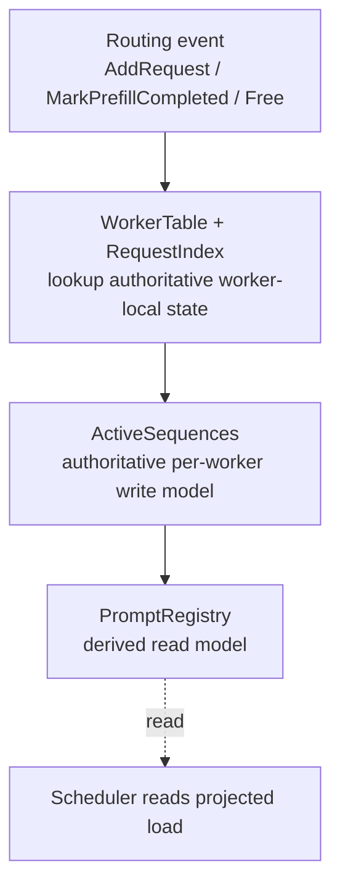

# 序列状态模型（Sequence State Model）

本目录实现了路由（router）的活跃序列（active-sequence）状态，用于本地请求路由与副本同步。

对于本地、非远程的执行路径，该模型被有意组织成一个单向的写入流水线：

## 真值来源

- `topology.rs` 拥有 `WorkerTable`，将 worker 身份映射到其槽位（slot）。
- `request_maps.rs` 拥有 `RequestIndex`，维护 `request_id -> worker` 的映射。
- `single.rs` 拥有 `ActiveSequences`，是每个 worker 上请求、预填充（prefill）以及块（block）状态的权威写入模型。
- `prompt_registry.rs` 拥有 `PromptRegistry`，它**不**是真值来源，而是派生出的路由视图。

`multi_worker.rs` 中的本地编排器读取 `WorkerTable` 与 `RequestIndex`，对所选 worker 的 `ActiveSequences` 进行变更，然后将由此产生的成员关系/负载增量投影到 `PromptRegistry`。

## 为什么这是一个 DAG

在一次本地变更中，数据是单向流动的：

`event -> authoritative state -> derived read model -> scheduler`

`PromptRegistry` 不会回写到 `ActiveSequences` 中，因此本地变更路径上不存在写回回路。

运行时仍然存在一个跨时间的控制回路：调度器（scheduler）读取派生视图，随后再发出下一个 `AddRequest`。这是系统层面的反馈回路，而非状态所有权上的环路。

## 撕裂读取（torn reads）是有意为之的

允许 `PromptRegistry` 与 `ActiveSequences` 之间仅保持最终一致性。

也就是说，读取者可能短暂地观察到：

- 来自某一时刻的 worker 负载快照
- 来自另一时刻的 prompt 成员关系
- 一个组合后的、从未原子存在过的视图

这是有意的取舍。派生读模型旨在降低争用、提升并发度，而不是追求完美的快照一致性。

关键的安全边界是：

- 生命周期与所有权不变量由写入模型（`WorkerTable`、`RequestIndex`、`ActiveSequences`）持有
- 调度质量由读模型（`PromptRegistry`）承载

因此，过期或撕裂的读取可能导致次优的路由选择，但不应造成灾难性的不变量破坏，例如丢失请求所有权或损坏块成员关系。

## 最终一致性契约

- 本地写入会先更新 `ActiveSequences`。
- `PromptRegistry` 之后再从该权威状态投影而来。
- 副本同步与调度器决策可能短暂滞后。
- 系统接受这种滞后，因为读侧仅作为参考使用。

这正是核心设计：在严格的本地写入 DAG 之上，叠加一个最终一致的读投影。
