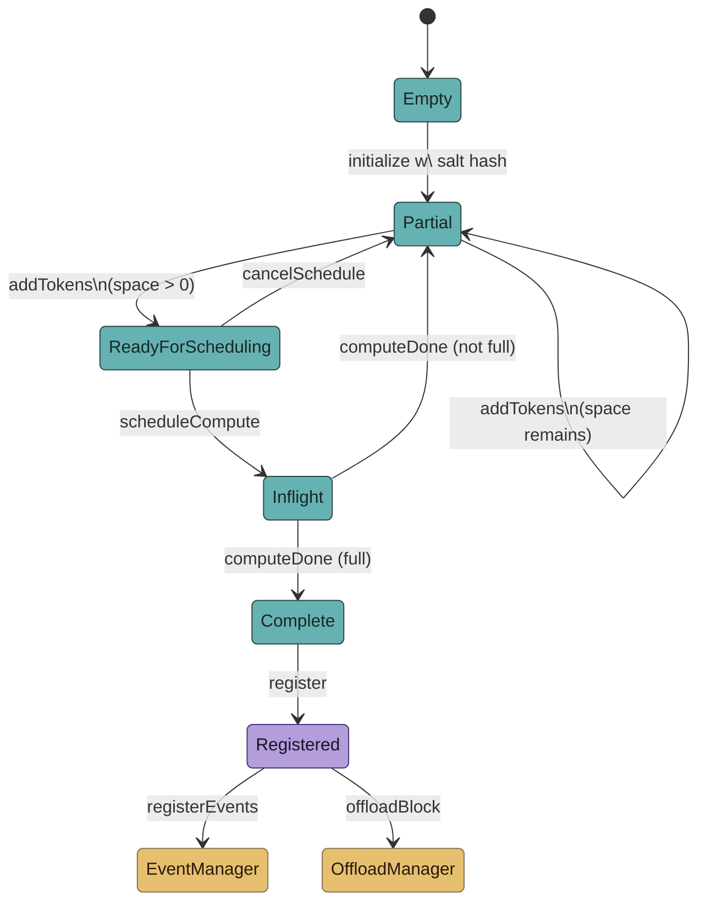
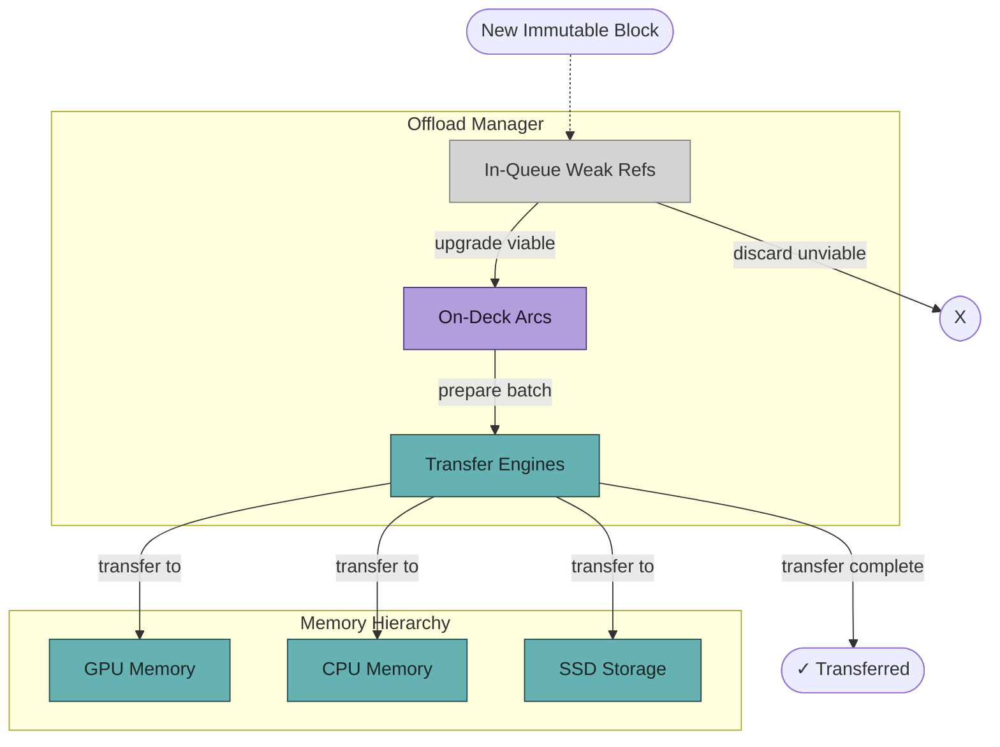

## Block 状态

<!-- Component Diagram - Table Sync -->

注：该配色方案在亮色与暗色模式下都能良好显示：
- 青绿色（teal）表示 block 生命周期中的具体状态（可变 block）
- 紫色（purple）表示 trait（不可变接口 —— Registered 状态）
- 哑光金色（muted gold）表示默认可构造组件（外部 manager）

| 状态 | 描述 |
|-------|-------------|
| Empty | block 初始化之前的初始状态 |
| Partial | block 已部分被 token 填充时的状态 |
| ReadyForScheduling | block 准备好被调度计算时的状态 |
| Inflight | block 正在计算时的状态 |
| Complete | block 计算完成时的状态 |
| Registered | block 计算最终化后的不可变最终状态 |
| EventManager | 用于管理 block 事件的外部系统（见独立的图） |
| OffloadManager | 用于管理 block 卸载（offload）的外部系统（见独立的图） |

## OffloadManager

OffloadManager 编排不可变的已注册 block（Arc<MutableBlock>）在不同存储层级（例如 GPU → CPU → SSD）之间的迁移。它通过三个主要组件管理 block 传输流水线：

1.  **Transfer Engines（传输引擎）**：在不同存储层级之间主动复制 block 序列。针对传输带宽进行了优化。

```mermaid
stateDiagram-v2
    direction LR
    [*] --> InQueueWP:::weakRef : new block (weak ref)

    InQueueWP --> OnDeckQ:::trait : upgrade weak ref
    OnDeckQ --> TransferEng:::concrete : schedule transfer

    TransferEng --> TransferredPS : transfer complete
    TransferredPS --> [*]

    %% Styling
    classDef concrete fill:#66B2B2,stroke:#2A4949,color:#1A2626
    classDef trait fill:#B39DDB,stroke:#4A367A,color:#1A1426
    classDef defaultConstructable fill:#E6C06E,stroke:#8B7355,color:#2B1810
    classDef weakRef fill:#D3D3D3,stroke:#808080,color:#333333
```

2.  **On-Deck Stage（待发阶段）**：block 以共享不可变状态（Arc<MutableBlock>）保留，准备下一步被传输。该队列会优先被填充。
3.  **In-Queue Stage（排队阶段）**：一个保存被降级 block 的弱引用（Weak<MutableBlock>）的优先队列。当 On-Deck 阶段已满时使用。

系统维持持续的流：当 Transfer Engines 完成一组传输后，准备好的 block 会从 On-Deck 队列被取走；随后 In-Queue 中的 block 会被升级为强引用（Arc<MutableBlock>）并迁移到 On-Deck 队列。无法升级的弱引用 block 会被丢弃，新 block 持续从 In-Queue 取出，直到 On-Deck 重新填满。

<!-- Component Diagram - Table Sync -->

| 组件         | 描述                                                                 |
|-------------------|-----------------------------------------------------------------------------|
| InQueueWP         | 保存 block 弱引用（Weak<MutableBlock>）的优先队列。         |
| OnDeckQ           | 处于共享不可变状态（Arc<MutableBlock>）、可立即传输的 block 队列。 |
| TransferEng       | 在不同存储层级间正在进行的传输操作。                      |
| TransferredPS     | 表示 block 已成功传输的伪状态。            |

<!-- Component Diagram - Table Sync -->

| 组件                  | 描述                                                                     |
|----------------------------|---------------------------------------------------------------------------------|
| M_GPU                      | GPU 内存：源存储层级。                                            |
| M_CPU                      | CPU 内存：中间/目的存储层级。                          |
| M_SSD                      | SSD 存储：目的存储层级。                                      |
| IQ In-Queue Weak Refs      | 保存待 offload block 弱引用（Weak<MutableBlock>）的优先队列。 |
| OD (On-Deck Arcs)          | 已可传输的共享不可变 block（Arc<MutableBlock>）队列。        |
| TE (Transfer Engines)      | 管理 block 数据在不同存储位置间的实际复制。              |
| NewBlock                   | 表示进入 offload 系统的一个新不可变 block。                   |
| Discarded                  | 表示无法升级而被丢弃的弱引用 block。 |
| TC (Transferred)           | 表示 block 传输成功完成的状态。          |

注：该配色方案在亮色与暗色模式下都能良好显示：
- 青绿色（`concrete`）：具体组件、内存位置以及活跃过程。
- 紫色（`trait`）：共享不可变 block（Arc<T>）。
- 哑光金色（`defaultConstructable`）：可选构造的组件（此处使用较少）。
- 浅灰色（`weakRef`）：以弱引用持有的 block（Weak<T>）。
