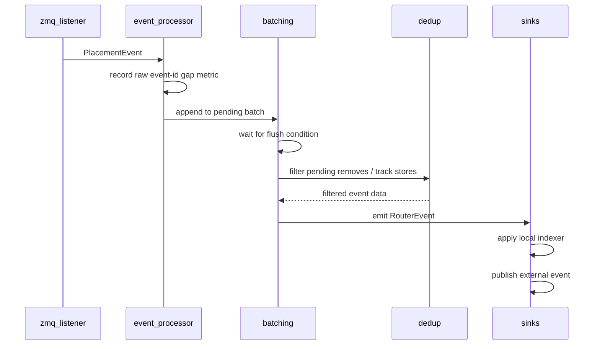

# KV Publisher 事件流水线

本模块将引擎的 KV 缓存（KV cache）事件转换为 Dynamo 路由（router）事件。ZMQ 源
是 vLLM 在生产环境中的常用路径，而事件处理器（event processor）保持下游发布路径
在 Event Plane 与 JetStream 之间共享。

## 文件

- `zmq_listener.rs`：接收引擎 ZMQ 批次，并将线缆事件转换为带放置信息的事件。
- `event_processor.rs`：拥有异步接收循环，并保持事件顺序。
- `batching.rs`：在发布前合并相邻的 store/remove 事件。
- `dedup.rs`：通过每 rank、每层级（tier）的引用计数门控重复的 remove。
- `sinks.rs`：将事件应用到本地 worker 索引器（indexer），并对外发布。
- `worker_metrics.rs`：发出 worker 本地的运行时指标（metrics）。

## 阶段说明

`zmq_listener.rs` 在分配 publisher 本地事件 id 之前会跳过被忽略的原始事件。这
保留了当前的契约：被过滤掉的 ZMQ 事件不会推进核心路由器（core-router）的事件 id。

`event_processor.rs` 会在批处理前检查原始输入事件 id 流的间隙。该指标关注的是
处理器接收到事件之前被丢弃的事件；批处理与去重不会影响该指标。

`batching.rs` 合并兼容的相邻 remove 或 store。在以下情况会触发刷新：事件类型
变化、DP rank 变化、存储层级变化、store 父链断裂、超时到期，或挂起 block 数量
超过上限。

`dedup.rs` 在刷新时应用。Store 会更新引用计数并继续向下传递。Remove 仅在某个
block 的引用计数归零时才会通过；未知的 remove 出于防御性目的会被放行。

`sinks.rs` 在对外发布之前，先将发出的路由事件应用到可选的本地索引器。两个副作用
接收的是同一个 `RouterEvent`。

## 顺序

