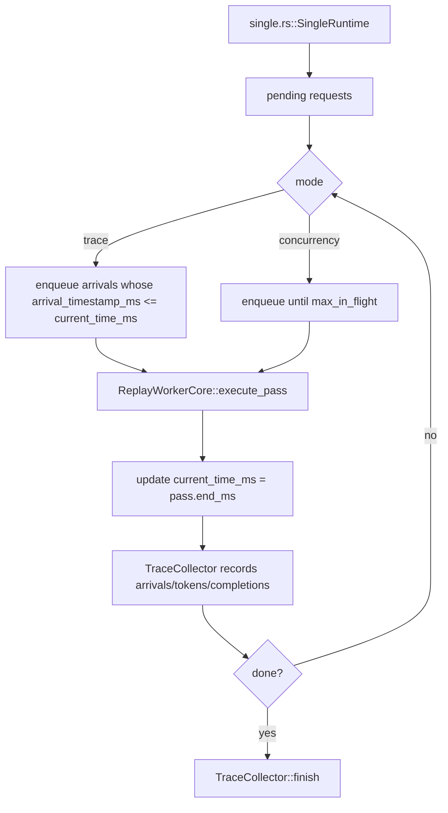
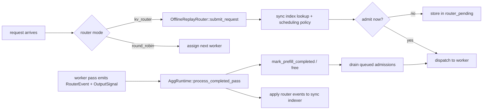

# 离线回放执行器（Offline Replay Harness）

本目录包含 `dynamo_mocker::replay` 使用的进程内离线回放执行器（offline replay harness）。

其目标是模拟 trace 执行，而不启动异步运行时、网络平面或真实 Worker 任务。相反，执行器推进逻辑时钟、直接驱动 mock 引擎核心，并将请求/Token 时序记录到 `lib/mocker/src/replay/collector.rs` 中的 `TraceCollector`。

关于执行器层面的整体图景（load driver → harness → SES/MES → trace collector）以及面向运维的 CLI 文档，请参见 [`docs/benchmarks/mocker-trace-replay.md`](../../../../../docs/benchmarks/mocker-trace-replay.md)。本 README 聚焦离线模式的内部实现：逻辑时钟、事件队列、按 Worker 的状态机。

## 它在哪儿

公共回放入口位于上一层级 `lib/mocker/src/replay/entrypoints.rs`。它们负责：

- 归一化 `MockEngineArgs`
- 加载或接收 `DirectRequest` 或 `loadgen::Trace` 工作负载
- 校验回放参数
- 分派到离线或在线回放

离线回放从 `lib/mocker/src/replay/offline/mod.rs` 开始。

`offline/mod.rs` 在三种实现间做选择：

- `lib/mocker/src/replay/offline/single.rs` 用于 `num_workers == 1` 且 vLLM 引擎的特殊场景
- `lib/mocker/src/replay/offline/agg.rs` 处理其他所有情况，包括聚合多 Worker 回放与 `kv_router` 回放
- `lib/mocker/src/replay/offline/disagg.rs` 用于离线解耦预填充（prefill）/解码（decode）回放

## 文件分布

- `lib/mocker/src/replay/offline/mod.rs`
  在单 Worker 快路径与多 Worker 执行器之间选择。
- `lib/mocker/src/replay/offline/single.rs`
  单 vLLM Worker 的最小回放循环。
- `lib/mocker/src/replay/offline/agg.rs`
  通用离线集群模拟器，用于多 Worker 与 KV 路由回放。
- `lib/mocker/src/replay/offline/disagg.rs`
  含独立 prefill 与 decode 池的两阶段离线回放执行器。
- `lib/mocker/src/replay/offline/state.rs`
  按 Worker 包装 `EngineCore`，包含可选的 KV 事件捕获。
- `lib/mocker/src/replay/offline/events.rs`
  多 Worker 执行器用到的 `SimulationEvent` + `SimulationEventKind` 优先队列类型。
- `lib/mocker/src/replay/offline/core.rs`
  单 Worker 路径使用的小型 `ReplayWorkerCore` 包装。
- `lib/mocker/src/replay/offline/runtime_utils.rs`
  `agg.rs` 与 `disagg.rs` 共用的辅助：`WorkerCompletionPayload`、事件调度、`next_timestamp`。
- `lib/mocker/src/replay/offline/progress.rs`
  `ReplayProgress` —— 基于 indicatif 的进度条。
- `lib/mocker/src/replay/offline/components/`
  从运行时中拆出的共享抽象：
  - `router.rs` —— `OfflineReplayRouter`（同步进程内路由，KV + 轮询模式）与 `OfflineRouterSnapshot`。
  - `engine.rs` —— `EngineComponent`、`EngineEffects`、`EnginePassMode` 对 `EngineCore` 的包装。
  - `admission.rs` —— 准入队列与 trace/工作负载请求门控。
  - `types.rs` —— `WorkerAdmission`、`RouterEffects`、`ScheduledWorkerCompletion`、`TrafficAccumulator`、`TrafficStats`、`ReplayMode`。
  - `mod.rs` —— 重导出。

## 单 Worker 快路径

单 Worker 路径刻意保持简单，只在如下条件下启用：

- `num_workers == 1`
- 引擎类型为 `vllm`

该路径完全跳过集群事件队列与路由机制，但目前同时支持：

- 扁平请求回放
- 通过 `WorkloadDriver` 实现的工作负载驱动回放（多轮/会话 trace）



要点：

- Trace 模式使用 `lib/mocker/src/replay/mod.rs` 中的 `normalize_trace_requests`，使第一个请求从 `0 ms` 起始，再应用 `arrival_speedup_ratio`。
- 并发模式忽略原始到达间隔，将 Worker 一直填满至 `max_in_flight`。
- 工作负载 Trace 模式遵循首轮时间戳与轮间延迟。
- 工作负载并发模式忽略首轮时间戳，但完成后仍会强制执行轮间延迟。
- Worker 本身仍是真实的 mocker 引擎核心；只是简化了调度循环。

## 多 Worker 执行器

通用聚合执行器位于 `lib/mocker/src/replay/offline/agg.rs`。它将集群建模为：

- 一个逻辑时钟 `now_ms`
- 一个待处理请求队列
- 每个 Worker 一个 [`OfflineWorkerState`](/Users/peabrane/Documents/codes/dynamo/lib/mocker/src/replay/offline/state.rs)
- 一个未来完成事件的二叉堆
- 一个可选的同步离线路由

### 主循环

聚合执行器是事件驱动的，不会进行 sleep。`AggRuntime` 反复执行：

1. 选取下一个有意义的时间戳
2. 推进 `now_ms`
3. 应用计划在该时间发生的 Worker 完成事件
4. 准入新到达的请求，可能来自 trace 到达或并发回填
5. 在准备好的 Worker 上启动新的 pass
6. 将新的 `WorkerCompletion` 事件压回二叉堆

`now_ms` 仅会推进到下一个有意义的时间戳：

- 下一个请求到达
- 下一个 Worker 完成事件

### Worker 模型

每个 Worker 由 `lib/mocker/src/replay/offline/state.rs` 中的 `OfflineWorkerState` 表示：

- 包装 `EngineCore`
- 跟踪当前是否有 pass 正在执行
- 与引擎内部状态分离地跟踪 in-flight 请求数
- 当回放使用 `kv_router` 模式时可选启用 KV 事件捕获

pass 的执行仍来自真实调度器核心：

- `VllmCore::execute_pass(...)`
- `SglangCore::execute_pass(...)`

因此离线回放并非玩具模拟。它复用真实的每 pass mocker 调度逻辑，只是以确定性方式驱动。

## 完成事件队列

多 Worker 与解耦执行器使用 `lib/mocker/src/replay/offline/events.rs` 中的 `SimulationEvent` 作为基于 `BinaryHeap` 的最小时间优先队列。事件本身是一个小结构体，包含计划时间戳、用于平局打破的序号、以及类型化的 payload：

```rust
pub(crate) struct SimulationEvent {
    pub(crate) at_ms: f64,
    pub(crate) seq_no: u64,
    pub(crate) kind: SimulationEventKind,
}

pub(crate) enum SimulationEventKind {
    WorkerCompletion { stage, worker_idx, completed_requests, output_signals, kv_events },
    DecodeHandoff { uuid },
    WorkerReady { stage, worker_id },
}
```

- `WorkerCompletion` 在 Worker pass 执行后发出，并在执行器时钟到达 `pass.end_ms` 时被应用。它携带 `stage`（`Aggregated`、`Prefill` 或 `Decode`）、`worker_idx`、`completed_requests`、`output_signals` 以及对路由可见的 `kv_events`。
- `DecodeHandoff` 由解耦执行器使用，在同一逻辑时间戳将请求从 prefill 移交到 decode（见下文）。
- `WorkerReady` 标记 pass 完成后 Worker 重新进入准入池的时刻。

## 路由集成

离线回放可以采用：

- `round_robin`
- `kv_router`

离线模式的路由实现位于 `lib/mocker/src/replay/offline/components/router.rs`（`OfflineReplayRouter`）。

该路由是同步的、进程内运行的：

- 没有异步 Worker 任务
- 没有事件平面
- 没有后台索引线程

它维护：

- 本地 radix tree 索引器
- 本地 `ActiveSequencesMultiWorker` 状态
- 排队请求的待处理队列



### 为什么仅在需要的地方捕获 KV 事件

当离线回放使用 `kv_router` 时，Worker 通过以下方式启用 KV 事件捕获：

- `lib/mocker/src/scheduler/vllm/core.rs` 中的 `VllmCore::new_with_kv_capture`
- `lib/mocker/src/scheduler/sglang/core.rs` 中的 `SglangCore::new_with_kv_capture`

这会让每个 pass 返回对路由可见的 `kv_events`，执行器在 pass 完成后同步地将其应用到离线路由索引器。

在轮询模式下跳过捕获，因为没有消费者。
在离线解耦回放中，仅 prefill Worker 捕获并发布 KV 事件；decode Worker 关闭捕获，因为 decode router 对重叠不敏感且不消费 router 事件。

## 解耦执行器

`lib/mocker/src/replay/offline/disagg.rs` 中的解耦运行时建模两个不同阶段：

- 一个 prefill 路由与 prefill Worker 池
- 一个 decode 路由与 decode Worker 池

它仍只保留一个逻辑时钟和一个完成事件堆，但请求所有权通过两阶段状态机流转，而非聚合的单池生命周期。

prefill 路由由主路由配置派生，且 `router_track_active_blocks = false`。
decode 路由派生时设置：

- 关闭 overlap
- `assume_kv_reuse = false`
- `track_prefill_tokens = false`

prefill 阶段会运行一个隐藏的合成单 token bootstrap 请求。当 prefill 完成时，执行器：

1. 应用任意 prefill KV 事件
2. 在 prefill 路由中标记 prefill 完成
3. 释放 prefill 路由状态
4. 在同一逻辑时间戳将原始请求加入 decode

decode 随后以正常的 collector 可见性运行。公开的回放报告仍仅包含 decode，因此 TTFT 包含 prefill 排队与 prefill 计算。

## Trace 模式与并发模式

单 Worker 与多 Worker 执行器都支持两种准入模式：

- Trace 模式
  - 对扁平请求遵循输入到达时间戳
  - 对工作负载遵循首轮时间戳与轮间延迟
  - 时间戳被归一化，使第一个请求或第一个会话从 `0 ms` 起算
  - `arrival_speedup_ratio` 压缩或拉伸到达间隔与轮间延迟

- 并发模式
  - 忽略原始的首轮间隔
  - 将集群保持最多 `max_in_flight` 个请求在飞
  - 对工作负载，仍仅在完成 + 轮间延迟之后才解锁后续轮次
  - 准入时盖上合成的到达时间戳

这种区分正是 `lib/mocker/src/replay/offline/mod.rs` 同时暴露以下两者的原因：

- `simulate_trace(...)`
- `simulate_concurrency(...)`

## 指标采集

两个执行器都将请求时序写入 `lib/mocker/src/replay/collector.rs` 中的 `TraceCollector`：

- 到达
- 准入
- token 输出
- 完成

执行器自身不增量计算最终的吞吐/延迟指标。它只记录事件，最终由 `TraceCollector::finish()` 从这些事件派生 `TraceSimulationReport`。

## 心智模型

理解离线回放最简单的方式：

1. 复用真实的 mocker 调度 pass 逻辑。
2. 用确定性的逻辑时钟取代真实异步时钟。
3. 可选地用同步进程内路由模型取代联网路由行为。
4. 把同样的请求生命周期时序记录到 `TraceCollector`。

这样既保持执行器快速、可复现，又贴近真实调度器行为，无需启动一个真实运行时。
