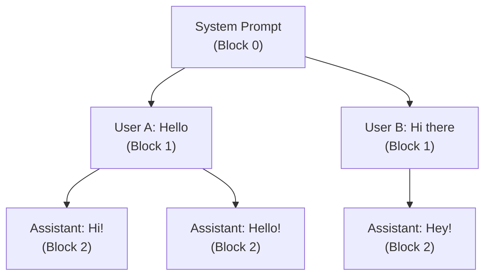
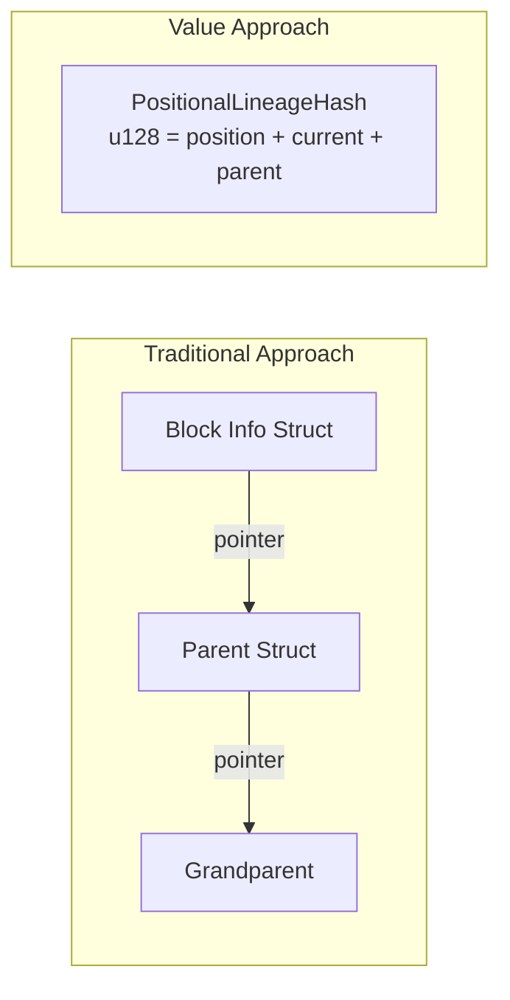
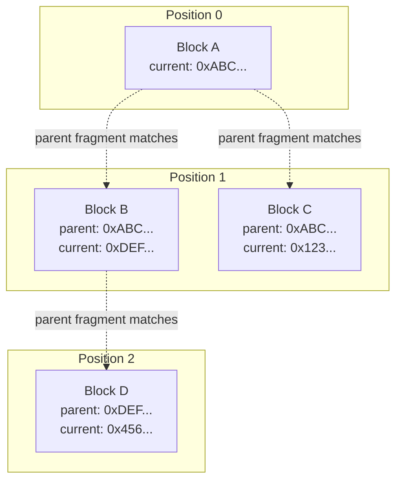
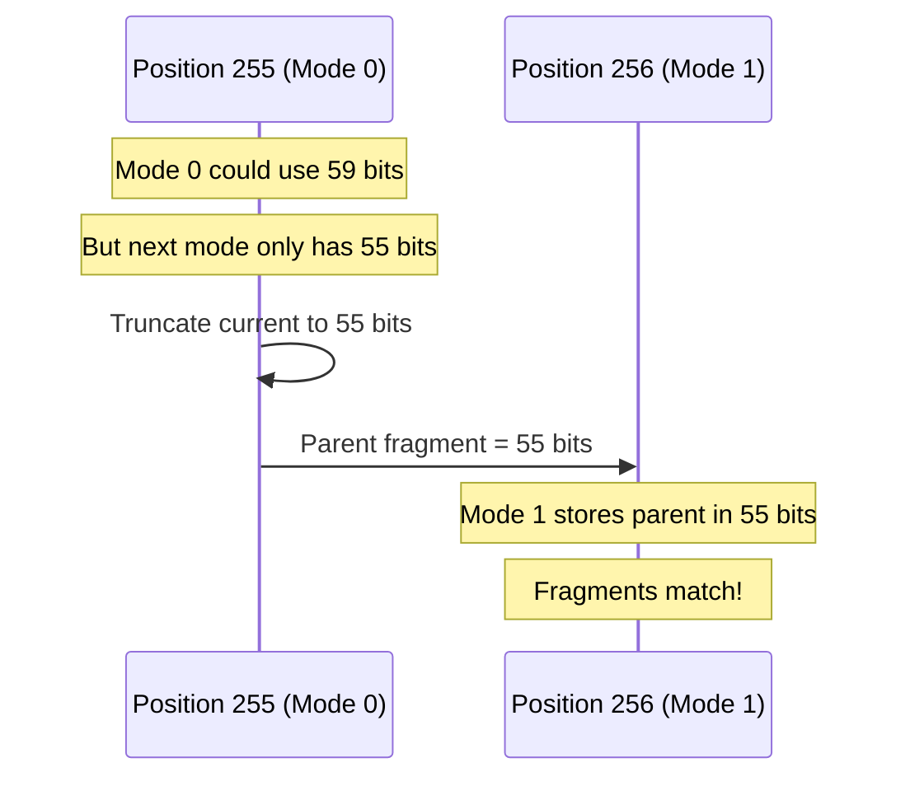
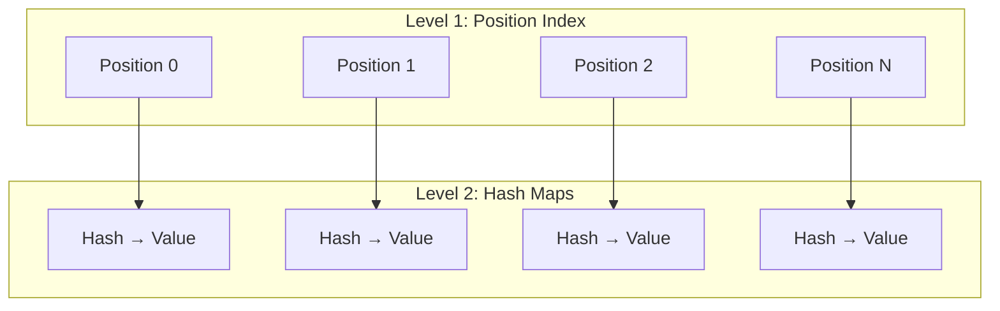
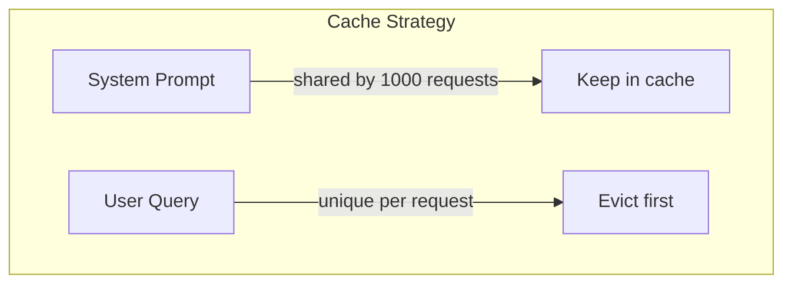
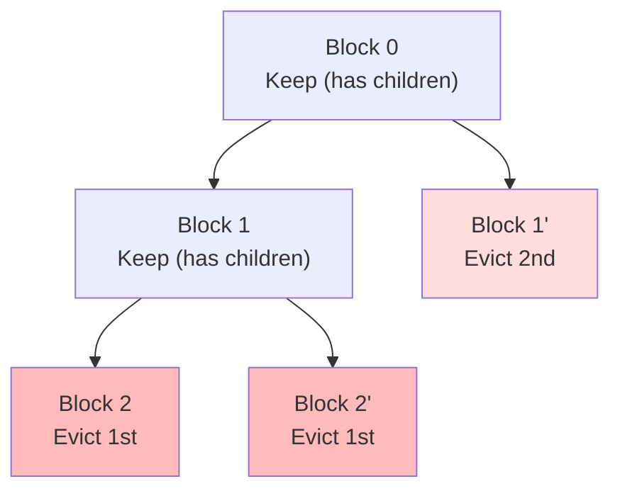

# Token 哈希设计：从序列到谱系

## 摘要

`dynamo-tokens` crate 提供了一族 hash 类型，逐层编码 LLM 推理（inference）系统中 token 序列的丰富信息。其关键创新是 **把复杂的关系打包进简单的值类型**：

- **SequenceHash**（u64）：内容唯一性
- **PositionalSequenceHash**（u128）：内容唯一性 + 位置
- **PositionalLineageHash**（u128）：内容唯一性 + 位置 + 父对齐

通过把传统上需要带指针与堆分配的复杂结构编码进简单的 `u128`，我们获得零成本抽象：O(1) 比较、无锁共享、对缓存友好的访问模式。

---

## 问题：Token 树需要结构

### LLM 推理产生树形结构

当多个用户与 LLM 交互时，他们的对话会共享共同前缀。一个 system prompt 可能在数千个请求中完全相同，之后是发散的用户输入：



### 为什么传统 hash 不够用

朴素的内容 hash 只能告诉我们“这些 token 完全相同”，但丢失了关键信息：

| 问题 | 平面 Hash | 位置 Hash | 谱系 Hash |
|----------|-----------|-----------------|--------------|
| 这些 token 一样吗？ | 是 | 是 | 是 |
| 是否在相同位置？ | ? | 是 | 是 |
| 父节点是谁？ | ? | ? | 是 |

没有位置与谱系信息时，缓存系统无法：
- 区分相同 block 在不同位置的情况
- 在保留共享前缀的前提下高效驱逐叶子
- 不依赖外部数据结构就能浏览父子关系

### 结构体方法不可扩展

可以想象这样一个结构：

```rust
struct BlockInfo {
    content_hash: u64,
    position: u64,
    parent: Option<Arc<BlockInfo>>,  // Heap allocation, reference counting
}
```

它的问题：
- **堆分配**：每个 block 都要内存分配
- **引用计数**：Arc 带来线程安全开销
- **缓存未命中**：跟随指针会导致 cache line miss
- **同步**：引用计数需要原子操作

---

## 解决方案：值编码的 Hash

### 设计原则：所有信息装进 128 位

我们所有的 hash 类型都是简单整数，可以：
- **按值复制**（无堆分配）
- **单条 CPU 指令比较**
- **跨线程共享**且无需锁
- **内联存储**于数据结构（缓存友好）



---

## Hash 类型的演进

### 1. SequenceHash（u64）—— 内容身份

基础：token 内容的 64 位 xxhash。

```
┌────────────────────────────────────────────────────────────────┐
│                     SequenceHash (64 bits)                     │
│            xxhash of [tokens + previous_sequence_hash]         │
└────────────────────────────────────────────────────────────────┘
```

**编码：**“该内容是否唯一？”

**局限：**两个相同的 block 在不同位置上 hash 一致，无法支持位置感知去重。

### 2. PositionalSequenceHash（u128）—— 加入位置

通过自适应编码，在 SequenceHash 之上加入位置感知：

```
┌───────────────────────────────────────────────────────────────────────────────┐
│                     PositionalSequenceHash (128 bits)                         │
├──────────┬─────────────────────────────┬──────────────────────────────────────┤
│  Upper   │  Mode (2) + Position (8-31) │  Local Block Hash (31-54 bits)       │
│ 64 bits  │  Adaptive based on position │  Content signature                   │
├──────────┼─────────────────────────────┴──────────────────────────────────────┤
│  Lower   │                    SequenceHash (64 bits)                          │
│ 64 bits  │                    Full content uniqueness                         │
└──────────┴────────────────────────────────────────────────────────────────────┘
```

**模式选择：**

| 模式 | 位置位数 | 局部 hash 位数 | 最大位置 |
|------|---------------|-----------------|--------------|
| 00   | 8             | 54              | 255          |
| 01   | 16            | 46              | 65,535       |
| 10   | 24            | 38              | 16,777,215   |
| 11   | 31            | 31              | 2,147,483,647|

**编码：**“在相同位置上是否是相同内容？”

**局限：**没有父子关系 —— 无法在树中向后回溯。

### 3. PositionalLineageHash（u128）—— 加入谱系

关键创新：把父子关系也编码进 hash 本身。

```
┌───────────────────────────────────────────────────────────────────────────────┐
│                     PositionalLineageHash (128 bits)                          │
├──────┬───────────┬────────────────────────┬───────────────────────────────────┤
│ Mode │ Position  │  Parent Hash Fragment  │  Current Hash Fragment            │
│ (2)  │ (8-24)    │  (51-59 bits)          │  (51-59 bits)                     │
└──────┴───────────┴────────────────────────┴───────────────────────────────────┘
```

**模式选择：**

| 模式 | 位置位数 | 父位数 | 当前位数 | 最大位置 |
|------|---------------|-------------|--------------|--------------|
| 00   | 8             | 59          | 59           | 255          |
| 01   | 16            | 55          | 55           | 65,535       |
| 10   | 24            | 51          | 51           | 16,777,215   |

**编码：**“位置 + 内容 + 父身份”

---

## 谱系 Hash：深入解析

### 为什么用 Parent Fragment？

给定位置 N 上的一个 block，我们可以：
1. 取出它的 parent fragment
2. 在 radix tree 中查询 N-1 位置
3. 找到所有 current fragment 与我们的 parent fragment 匹配的 block

这就实现了 **无指针的向后遍历**。



### 跨模式边界对齐

**挑战：**位置从 255 跨到 256 时，模式从 0（59 位 fragment）变到 1（55 位 fragment）。如何确保父子匹配仍能工作？

**方案：**预先把当前 hash 的 fragment 截断到下一模式的容量。



在位置 255 上我们已知位置 256 将使用 55 位 fragment 的 Mode 1。因此预先把当前 hash 截断到 55 位，确保位置 256 上的子节点能保存并匹配我们的 fragment。

---

## PositionalHash Trait

一个通用抽象使数据结构可以多态：

```rust
/// Trait for hashes that include position information.
pub trait PositionalHash {
    /// Returns the position associated with the hash.
    fn position(&self) -> u64;
}
```

`PositionalSequenceHash` 与 `PositionalLineageHash` 都实现该 trait，使同一个 radix tree 都能与之配合：

```rust
pub struct PositionalRadixTree<V, K = PositionalSequenceHash>
where
    K: PositionalHash + Hash + Eq + Clone,
{
    map: DashMap<u64, DashMap<K, V>>,
}
```

---

## PositionalRadixTree：稀疏的两级索引

radix tree 利用位置构造稀疏、高效的结构：



**好处：**
- **位置层级内 O(1) 查找**
- **稀疏分配**：仅有数据的位置才有 hash map
- **锁粒度**：不同位置可并发访问
- **节省内存**：空位置无条目

---

## 用例

### 1. 分层 Block 缓存

token block 形成树。缓存层可以利用这一结构：



借助谱系 hash，缓存可以：
- 识别哪些 block 是叶子（无子节点）
- 在父节点之前驱逐叶子
- 尽可能久地保留共享前缀

### 2. 谱系感知驱逐

当内存压力需要驱逐时，按树形顺序驱逐：



**算法：**
1. 找出所有叶子 block（无子节点指向它们）
2. 按 LRU 顺序驱逐叶子
3. 当某个 block 变为叶子时，它就变得可驱逐
4. 直到所有子节点都被驱逐前，父节点自然被保留

### 3. 位置感知的 Block 去重

新 block 到达时：
1. 计算其 lineage hash
2. 检查该位置是否存在相同 hash 的 block
3. 若有，复用已有 block（去重）
4. 位置感知防止跨位置的假匹配

### 4. 无指针的父节点遍历

给定位置 N 上的一个 block：
```rust
fn find_parent(hash: PositionalLineageHash, tree: &PositionalRadixTree<Block>) -> Option<Block> {
    let parent_pos = hash.position() - 1;
    let parent_fragment = hash.parent_hash_fragment();

    // Look up by position, filter by fragment match
    tree.position(parent_pos)?
        .iter()
        .find(|entry| entry.key().current_hash_fragment() == parent_fragment)
        .map(|entry| entry.value().clone())
}
```

无需追指针、无需 Arc 引用，仅靠整数比较。

---

## API 参考

### PositionalLineageHash

```rust
impl PositionalLineageHash {
    /// Create from sequence hashes and position
    pub fn new(
        current_seq_hash: SequenceHash,
        parent_seq_hash: Option<SequenceHash>,
        position: u64,
    ) -> Self;

    /// Get the block position
    pub fn position(&self) -> u64;

    /// Get the current block's hash fragment
    pub fn current_hash_fragment(&self) -> u64;

    /// Get the parent block's hash fragment
    pub fn parent_hash_fragment(&self) -> u64;

    /// Get the encoding mode (0, 1, or 2)
    pub fn mode(&self) -> u8;

    /// Get the raw u128 value
    pub fn as_u128(&self) -> u128;
}
```

### PositionalSequenceHash

```rust
impl PositionalSequenceHash {
    /// Create from components
    pub fn new(
        sequence_hash: SequenceHash,
        position: u64,
        local_block_hash: BlockHash,
    ) -> Self;

    /// Get the sequence hash component
    pub fn sequence_hash(&self) -> SequenceHash;

    /// Get the block position
    pub fn position(&self) -> u64;

    /// Get the local block hash
    pub fn local_block_hash(&self) -> BlockHash;
}
```

### PositionalRadixTree

```rust
impl<V, K: PositionalHash + Hash + Eq + Clone> PositionalRadixTree<V, K> {
    /// Create empty tree
    pub fn new() -> Self;

    /// Get/create the sub-map for a hash's position
    pub fn prefix(&self, key: &K) -> RefMut<u64, DashMap<K, V>>;

    /// Get the sub-map for a specific position
    pub fn position(&self, position: u64) -> Option<RefMut<u64, DashMap<K, V>>>;

    /// Count total entries
    pub fn len(&self) -> usize;
}
```

---

## 后续方向

### 压缩谱系链

对于非常长的序列，可考虑把谱系压缩成 skip-list 风格的 hash，编码多个祖先。

### 分布式协调

值语义的设计便于网络传输 —— 一个 u128 可序列化为 16 字节，使分布式缓存系统能协调 block 状态。

### 与外部缓存集成

这些 hash 类型可作为外部缓存系统（Redis、memcached）的 key，无需序列化开销。

---

## 总结

`dynamo-tokens` crate 展示了如何借助精心的位打包用简单值类型替代复杂数据结构。把位置与谱系信息直接编码进 hash 值后，我们得到：

1. **零成本抽象**：无堆分配，无引用计数
2. **无锁线程安全**：值可自由复制与共享
3. **缓存友好访问**：无指针追逐，内联存储
4. **丰富的语义**：位置感知、父子关系

从 SequenceHash 到 PositionalLineageHash 的演进表明，每一层在保持值语义简单性的同时，逐步增加能力。
