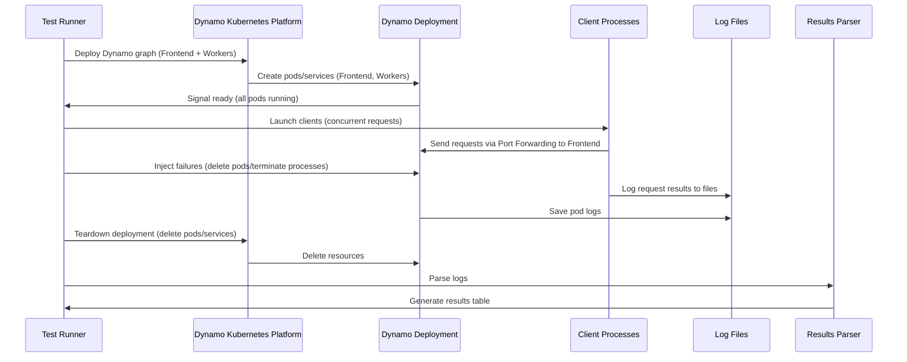
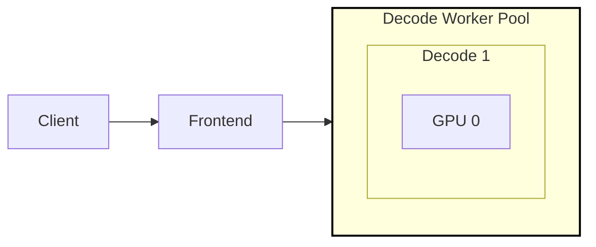
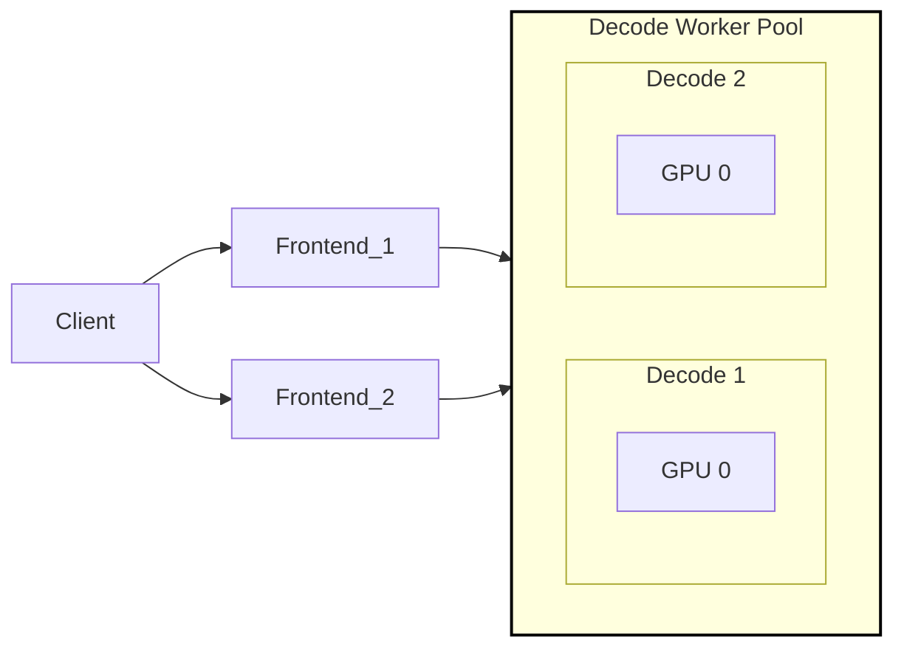
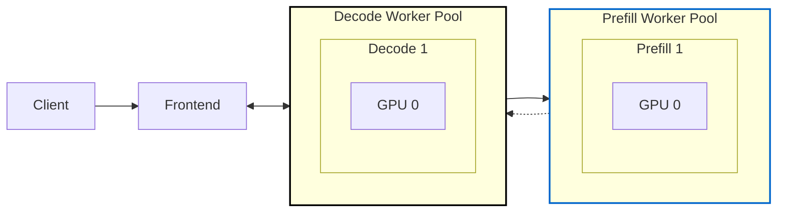
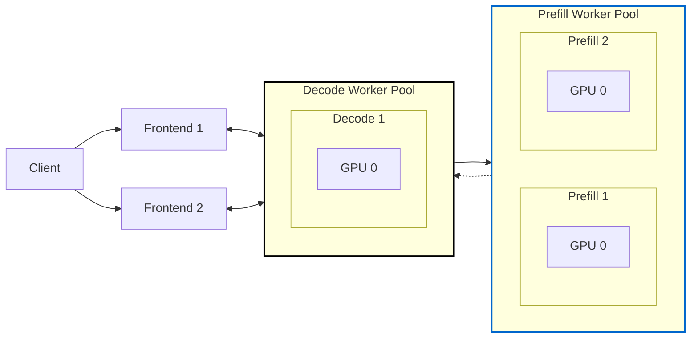

<!--
SPDX-FileCopyrightText: Copyright (c) 2024-2026 NVIDIA CORPORATION & AFFILIATES. All rights reserved.
SPDX-License-Identifier: Apache-2.0

Licensed under the Apache License, Version 2.0 (the "License");
you may not use this file except in compliance with the License.
You may obtain a copy of the License at

http://www.apache.org/licenses/LICENSE-2.0

Unless required by applicable law or agreed to in writing, software
distributed under the License is distributed on an "AS IS" BASIS,
WITHOUT WARRANTIES OR CONDITIONS OF ANY KIND, either express or implied.
See the License for the specific language governing permissions and
limitations under the License.
-->

# 容错测试套件

作为大规模分布式推理服务框架，Dynamo 除了要提供高吞吐与低延迟，还需要在面对意外故障时具备故障检测、容错与快速恢复能力。为测试 Dynamo，我们正在开发一套测试套件，用于注入并测量不同类型故障情形的影响。

## 测试架构

容错测试套件被设计为一组 pytest 配置，在 Kubernetes 环境中启动典型的 dynamo 部署，然后通过终止进程或 pod 注入故障。为测量故障的恢复时间与影响，使用 **AI-Perf（aiperf）** 并行启动一组客户端进行负载生成。每个客户端按可配置的 token 模式发送合成请求。每个 pod 与每个客户端的日志会被存档，并通过解析 AI-Perf 指标的后处理脚本检查。

> [!NOTE]
> 测试通过/失败并不指示恢复或弹性的 SLA。
> 它仅表示测试已被执行且数据已被收集。

###  测试时序图



### 测试场景

测试套件围绕三个核心组件组织：**Deployments（部署）**、**Client Load（客户端负载）** 与 **Failures（故障）**。每个场景组合这些元素以模拟故障条件并测量系统弹性。

#### Deployments

Deployments 表示通过 Dynamo Kubernetes Platform 部署的特定 graph。

下面是一些代表性场景示例：

| 示例场景名                         | 后端 | 类型   | TP | DP | 描述                                             |
|-----------------------------------------------|---------|--------|----|----|---------------------------------------------------------|
| `vllm-agg-tp-1-dp-1`                          | vllm    | agg    | 1  | 1  | 基础聚合 worker。                                |
| `vllm-agg-tp-1-dp-2`                          | vllm    | agg    | 1  | 2  | 启用数据并行的聚合 worker。                |
| `sglang-agg-tp-4-dp-1`                        | sglang  | agg    | 4  | 1  | 启用 tensor parallelism 的聚合 SGLang worker。       |
| `sglang-disagg-prefill-tp-2-decode-tp-2-dp-1`   | sglang  | disagg | 2  | 1  | 启用 tensor parallelism 的解耦 SGLang worker。   |

完整测试矩阵从这些参数生成，覆盖所有配置。

#### Client Load（AI-Perf 配置）

- **负载生成器**：AI-Perf（`aiperf`）配合合成 token 生成
- **并发客户端**：默认 10 个，按场景可调
- **每客户端请求数**：每客户端 150 个请求（可配置）
- **输入/输出 token 配置**：
  - 输入 token：mean=100，stddev=0（长度一致）
  - 输出 token：mean=100，stddev=0（长度一致）
- **并发度**：每客户端按顺序请求（concurrency=1）
- **重试逻辑**：3 次重试以容忍故障
- **流式支持**：可选 `--streaming` 标志获取 TTFT/ITL 指标
- **不预热**：warmup-request-count=0 以避免初始失败

#### Failures

故障被注入到已部署的 pod 中，方法是 pod delete 或向指定进程发送信号。

`scenarios.py` 中定义了下列故障类型：

| 故障名                  | 描述                                        | 注入方式              | 适用后端 |
|-------------------------------|----------------------------------------------------|-------------------------------|---------------------|
| `none`                        | 无故障注入（基线）。                   | N/A                           | 全部                 |
| `frontend`                    | 终止 frontend 进程。                        | 对 `dynamo.frontend` 发送 `SIGINT` | 全部                 |
| `frontend_pod`                | 删除 frontend pod。                               | Kubernetes API 删除 pod   | 全部                 |
| `decode_worker`               | 终止 decode worker 进程。                   | 对 `dynamo.<backend>` 发送 `SIGKILL` | 全部                 |
| `decode_worker_pod`           | 删除 decode worker pod。                          | Kubernetes API 删除 pod   | 全部                 |
| `prefill_worker`              | 终止 prefill worker 进程。                  | 对 `dynamo.<backend>` 发送 `SIGKILL` | 全部                 |
| `prefill_worker_pod`          | 删除 prefill worker pod。                         | Kubernetes API 删除 pod   | 全部                 |
| `vllm_decode_engine_core`     | 终止 VLLM decode engine core 进程。         | 对 `VLLM::EngineCore` 发送 `SIGKILL` | 仅 vllm           |
| `vllm_prefill_engine_core`    | 终止 VLLM prefill engine core 进程。        | 对 `VLLM::EngineCore` 发送 `SIGKILL` | 仅 vllm           |
| `sglang_decode_scheduler`     | 终止 SGLang decode scheduler 进程。         | 对 `sglang::scheduler` 发送 `SIGKILL`| 仅 sglang         |
| `sglang_decode_detokenizer`   | 终止 SGLang decode detokenizer 进程。       | 对 `sglang::detokenizer` 发送 `SIGKILL`| 仅 sglang         |
| `sglang_prefill_scheduler`    | 终止 SGLang prefill scheduler 进程。        | 对 `sglang::scheduler` 发送 `SIGKILL`| 仅 sglang         |
| `sglang_prefill_detokenizer`  | 终止 SGLang prefill detokenizer 进程。      | 对 `sglang::detokenizer` 发送 `SIGKILL`| 仅 sglang         |

#### Token 溢出测试

除进程与 pod 故障外，本套件还包括 **token 溢出** 测试——模型收到的输入 prompt 超出其配置的 `max_seq_len`。这些测试对验证系统能否优雅地拒绝无效请求而不崩溃至关重要。

- **故障注入**：与其他测试不同，此故障在 **客户端** 注入。`aiperf` 客户端被配置为发送一批超长 token 的请求。
- **两阶段执行**：这些测试分两个阶段运行，每个阶段创建独立日志目录：
  1.  **`overflow` 阶段**：发送超长请求。期望结果是大量请求失败（被拒）——服务端正确识别并阻止它们。
  2.  **`recovery` 阶段**：紧接 overflow 阶段，发送有效的正常大小请求。期望结果是高成功率，确认系统已恢复且仍可运行。

两阶段的综合结果展示系统拒绝无效输入的能力以及处理后的稳定性。

#### 示例场景拆解

**场景**：`sglang-agg-tp-2-dp-1-decode_worker`

- **后端**：`sglang`
- **部署**：1 个 decode worker 副本的聚合，TP 使用 2 GPU（`agg-tp-2-dp-1`）。
- **客户端负载**：10 个客户端，每个 100 个请求，最大请求速率 1/秒。
- **故障**：在测试开始 30 秒时终止 1 个 decode worker 进程。

#### 示例场景执行：

运行标准部署与故障场景（默认排除自定义构建）：

```bash
pytest tests/fault_tolerance/deploy/test_deployment.py -s -v --namespace ${NAMESPACE}
```

要包含全部场景（含自定义构建，例如 MoE 模型）：

```bash
pytest tests/fault_tolerance/deploy/test_deployment.py -s -v --namespace ${NAMESPACE} --include-custom-build
```

### 测试结果目录

每个测试场景会创建一个日志目录并经过后处理生成总结。目录结构因所用客户端类型而异。

#### AI-Perf 客户端输出结构（默认）

```
test_fault_scenario[sglang-agg-tp-1-dp-1-frontend]
.
├── client_0/
│   └── attempt_0/
│       ├── profile_export_aiperf.json    # JSON 格式的 AI-Perf 指标
│       ├── profile_export_aiperf.csv     # CSV 格式的 AI-Perf 指标
│       ├── genai_perf.log                # AI-Perf 执行日志
│       └── logs/
│           └── aiperf.log                # 详细的 AI-Perf 日志
├── client_1/
│   ├── attempt_0/                        # 第一次尝试（故障期间可能失败）
│   └── attempt_1/                        # 故障后的重试
│       └── [与上面结构相同]
├── [client_2 到 client_9...]
├── Frontend/
│   ├── fault-tolerance-test-frontend-576bd784dc-jv68q.log
│   ├── fault-tolerance-test-frontend-576bd784dc-jv68q.metrics.log
│   ├── fault-tolerance-test-frontend-576bd784dc-jv68q.previous.log  # 重启前的日志
│   └── fault-tolerance-test-frontend-576bd784dc-jv68q.yaml
├── decode/                                # vLLM 后端为 VllmDecodeWorker
│   └── [与 Frontend 结构相同]
└── test.log.txt
```

| 文件/目录名                | 描述                                                                                      |
|------------------------------------|------------------------------------------------------------------------------------------------|
| **client_N/attempt_M/**            | 客户端 N、第 M 次尝试的 AI-Perf 结果（支持多次重试）                      |
| **profile_export_aiperf.json**     | 完整 AI-Perf 指标，包括延迟（P50/P90/P99）、吞吐、token 计数           |
| **profile_export_aiperf.csv**      | 关键指标的表格格式，便于分析                                                |
| **genai_perf.log**                 | AI-Perf 执行输出（stdout/stderr）                                                       |
| **{Service}/*.log**                | pod（Frontend、decode 等）的当前容器日志                                         |
| **{Service}/*.previous.log**       | 重启前的容器日志（含故障前日志）                                |
| **{Service}/*.metrics.log**        | 来自 `/metrics` 端点的 Prometheus 指标                                                    |
| **{Service}/*.yaml**               | pod spec 与状态切换                                                       |
| **test.log.txt**                   | 主测试执行日志（部署时序、故障注入、恢复事件）               |

#### Legacy 客户端输出结构（使用 `--client-type legacy`）

```
test_fault_scenario[sglang-agg-tp-1-dp-1-frontend]
.
├── client_0.log.txt                       # JSONL 格式：每行一个请求
├── client_1.log.txt                       # 直接 HTTP 请求/响应日志
├── client_2.log.txt
├── client_3.log.txt
├── client_4.log.txt
├── client_5.log.txt
├── client_6.log.txt
├── client_7.log.txt
├── client_8.log.txt
├── client_9.log.txt
├── Frontend/
│   ├── fault-tolerance-test-frontend-576bd784dc-jv68q.log
│   ├── fault-tolerance-test-frontend-576bd784dc-jv68q.metrics.log
│   ├── fault-tolerance-test-frontend-576bd784dc-jv68q.previous.log  # 重启前日志
│   └── fault-tolerance-test-frontend-576bd784dc-jv68q.yaml
├── decode/                                # vLLM 后端为 VllmDecodeWorker
│   └── [与 Frontend 结构相同]
└── test.log.txt
```

| 文件名                      | 描述                                                                                      |
|--------------------------------|------------------------------------------------------------------------------------------------|
| **client_N.log.txt**           | JSONL 格式日志，每行一个请求/响应（支持每请求重试）               |
| **{Service}/*.log**            | pod（Frontend、decode 等）的当前容器日志                                         |
| **{Service}/*.previous.log**   | 重启前的容器日志（含故障前日志）                                |
| **{Service}/*.metrics.log**    | 来自 `/metrics` 端点的 Prometheus 指标                                                    |
| **{Service}/*.yaml**           | pod spec 与状态切换                                                       |
| **test.log.txt**               | 主测试执行日志（部署时序、故障注入、恢复事件）               |

**`client_N.log.txt` 中的 JSONL 内容示例：**
```json
{"time": "2025-10-03T10:30:45", "results": [{"status": 200, "request_elapsed_time": 1.23, "url": "http://localhost:8000/v1/chat/completions", "pod": "frontend-pod"}], "total_time": 1.25}
{"time": "2025-10-03T10:30:47", "results": [{"status": 200, "request_elapsed_time": 1.18, "url": "http://localhost:8000/v1/chat/completions", "pod": "frontend-pod"}], "total_time": 1.20}
```

## 校验框架

### 概述

容错测试套件包含一个自动化校验框架，用于校验测试执行与结果。每次测试完成后校验自动运行，确保：

1. **故障的确被注入**（阶段 1：场景校验）
2. **系统适当恢复**（阶段 2：结果校验）

### 两阶段校验方法

#### 阶段 1：场景校验

通过检查 Kubernetes 事件与 pod 状态校验测试场景是否正确执行：

**对于 Pod 删除（`*_pod` 故障）：**
- 通过 K8s 事件（`Killing`、`Terminating`）确认指定 pod 被删除
- 校验 pod 的重建与生命周期切换
- 记录带时间戳的删除确认

**对于进程终止（非 `*_pod` 故障）：**
- 检查容器重启计数（`restartCount` 字段）
- 查找容器重启事件（`Started`、`BackOff`、`CrashLoopBackOff`）
- **主进程终止**（例如 `decode_worker`）→ 容器重启（可通过 `restartCount` 校验）
- **子进程终止**（例如 `sglang_*_scheduler`、`sglang_*_detokenizer`）→ 不重启容器（子进程变为僵尸/defunct）。这些会产生警告，但属于已知限制（参见下文“后端特定校验”）

**阶段 1 输出示例：**
```
╔══════════════════════════════════════════════════════════════════════════════╗
║                    STAGE 1: SCENARIO VERIFICATION                            ║
║          (Verify test scenario executed correctly)                           ║
╚══════════════════════════════════════════════════════════════════════════════╝

────────────────────────────────────────────────────────────────────────────────
1.1 Verifying Specific Pod Deletion via K8s Events
────────────────────────────────────────────────────────────────────────────────
Target pod(s) for deletion: ['fault-tolerance-test-0-vllmdecodeworker-abc123']

✓ DELETION CONFIRMED: [Normal] Killing - Stopping container main
✓ Pod fault-tolerance-test-0-vllmdecodeworker-abc123 deletion verified via K8s events
✓ STAGE 1.1 PASSED: Pod deletion confirmed via K8s events
```

#### 阶段 2：结果校验

基于部署冗余度校验系统行为：

**高可用（DP > 1）：**
- 成功率：≥99%
- 恢复时间：<60 秒
- 对在飞请求影响最小

**单 worker（DP = 1）：**
- 成功率：≥10%（允许恢复期间的失败）
- 恢复时间：<180 秒
- 系统最终恢复

**基线（无故障）：**
- 成功率：100%
- 无失败请求

**阶段 2 输出示例：**
```
╔══════════════════════════════════════════════════════════════════════════════╗
║                    STAGE 2: RESULTS VERIFICATION                             ║
║                 (Single worker - no redundancy)                              ║
╚══════════════════════════════════════════════════════════════════════════════╝

────────────────────────────────────────────────────────────────────────────────
2.1 Basic Recovery Check
────────────────────────────────────────────────────────────────────────────────
✓ System recovered: 1470 requests succeeded

────────────────────────────────────────────────────────────────────────────────
2.2 Success Rate Validation (Single Worker)
────────────────────────────────────────────────────────────────────────────────
Success rate: 98.00% (1470/1500 requests)
✓ STAGE 2.2 PASSED: Success rate meets threshold (10%)

────────────────────────────────────────────────────────────────────────────────
2.3 Recovery Time Validation
────────────────────────────────────────────────────────────────────────────────
Recovery time: 150.52 seconds
✓ STAGE 2.3 PASSED: Recovery time within acceptable range (180s max)
```

### 校验架构

校验系统使用 **factory 模式** 实现灵活、可扩展的校验：

```
┌─────────────────────────────────────────────────────────────┐
│              test_deployment.py                              │
│           (validation_context fixture)                       │
└──────────────────────┬───────────────────────────────────────┘
                       │
                       │ After test completes
                       │
          ┌────────────▼─────────────┐
          │   checker_factory.py     │
          │   (Checker Factory)      │
          └──────┬───────────┬───────┘
                 │           │
    ┌────────────▼───┐  ┌───▼────────────────┐
    │ Scenario       │  │ Results            │
    │ Checkers       │  │ Checkers           │
    │ (Stage 1)      │  │ (Stage 2)          │
    └────────┬───────┘  └───┬────────────────┘
             │              │
    ┌────────▼───────┐  ┌───▼────────────────┐
    │ k8s_utils.py   │  │ validation_checks  │
    │ - Pod events   │  │ - Success rate     │
    │ - Restart cnt  │  │ - Recovery time    │
    └────────────────┘  └────────────────────┘
```

### Factory 函数

#### `get_checkers_for_scenario(test_name, scenario)`

根据下列内容确定运行哪些 checker：

1. **`scenario.checkers` 中的显式 checker**（最高优先级）
   - 允许场景指定自定义 checker 列表
2. **基于测试名的模式匹配**：
   - 委派给 `get_scenario_checker()` 处理阶段 1
   - 委派给 `get_results_checker()` 处理阶段 2

#### `get_scenario_checker(test_name, scenario)`

根据测试名模式选择阶段 1 的 checker：

- `*-none]` → `NoFailureChecker`（基线）
- `*_pod]` → `PodDeletionChecker`（pod 删除）
- `*decode_worker]`、`*prefill_worker]`、`*frontend]`、`*scheduler]`、`*detokenizer]`、`*engine_core]` → `ProcessTerminationChecker`（进程终止）

#### `get_results_checker(test_name, scenario)`

根据部署冗余度选择阶段 2 的 checker：

- `*-none]` → `BaselineResultsChecker`（要求 100% 成功）
- **DP > 1** → `HighAvailabilityResultsChecker`（≥90% 成功，≤60 秒恢复）
- **DP = 1** → `SingleWorkerResultsChecker`（≥10% 成功，≤180 秒恢复）

### 后端特定校验

#### SGLang 子进程局限

SGLang 存在 **已知限制**：子进程终止会产生僵尸进程且无自动恢复：

**受影响的故障：**
- `sglang_decode_scheduler` - scheduler 子进程变为 `<defunct>`
- `sglang_decode_detokenizer` - detokenizer 子进程变为 `<defunct>`

**期望行为：**
```
进程被杀 → 变为僵尸（PID 存在，状态 Z，<defunct>）
容器不会重启（主进程 PID 1 仍在运行）
不会派生新子进程
系统不会自动恢复
```

**校验方式：**
- 确认容器重启数 = 0（子进程被杀，非容器崩溃）
- 在测试输出中记录该限制
- 不期望恢复

#### vLLM 解耦 prefill worker 弹性

vLLM decode worker 默认使用 `--kv-connector-role kv_both`，使其同时能处理 prefill 与 decode 操作。当 prefill worker 故障时，decode worker 自动接管 prefill 请求，因此成功率为 100%、影响最小。

**期望行为：** prefill worker 故障不会导致请求失败——这是 vLLM 内置的容错，不是测试问题。

### 总结结果

结果从 AI-Perf 指标解析得出，并在每次测试后以表格形式呈现。解析脚本（`parse_results.py`）为每个场景提取全面指标：

#### 单测试输出格式
```
============================================================
FAULT TOLERANCE TEST SUMMARY - AI-PERF
============================================================
╒═══════════════════════════════════╤════════════════════════════════════════════════════╕
│ Metric                            │ Value                                              │
╞═══════════════════════════════════╪════════════════════════════════════════════════════╡
│ Test Directory                    │ test_fault_scenario[sglang-agg-tp-1-dp-1-frontend] │
├───────────────────────────────────┼────────────────────────────────────────────────────┤
│ Number of Clients                 │ 10                                                 │
├───────────────────────────────────┼────────────────────────────────────────────────────┤
│ === Deployment Metrics ===        │                                                    │
├───────────────────────────────────┼────────────────────────────────────────────────────┤
│ Startup Time                      │ 69.00 sec                                          │
├───────────────────────────────────┼────────────────────────────────────────────────────┤
│ Recovery Time                     │ 2.00 sec                                           │
├───────────────────────────────────┼────────────────────────────────────────────────────┤
│ === Request Metrics ===           │                                                    │
├───────────────────────────────────┼────────────────────────────────────────────────────┤
│ Total Requests                    │ 1500                                               │
├───────────────────────────────────┼────────────────────────────────────────────────────┤
│ Successful Requests               │ 1470                                               │
├───────────────────────────────────┼────────────────────────────────────────────────────┤
│ Failed Requests                   │ 30                                                 │
├───────────────────────────────────┼────────────────────────────────────────────────────┤
│ Success Rate                      │ 98.00%                                             │
├───────────────────────────────────┼────────────────────────────────────────────────────┤
│ === Latency Metrics (seconds) === │                                                    │
├───────────────────────────────────┼────────────────────────────────────────────────────┤
│ Mean Latency                      │ 0.502                                              │
├───────────────────────────────────┼────────────────────────────────────────────┤
│ P50 Latency                       │ 0.396                                              │
├───────────────────────────────────┼────────────────────────────────────────────────────┤
│ P90 Latency                       │ 0.422                                              │
├───────────────────────────────────┼────────────────────────────────────────────────────┤
│ P99 Latency                       │ 0.761                                              │
├───────────────────────────────────┼────────────────────────────────────────────────────┤
│ === Throughput Metrics ===        │                                                    │
├───────────────────────────────────┼────────────────────────────────────────────────────┤
│ Total Throughput                  │ 19.72 req/s                                        │
├───────────────────────────────────┼────────────────────────────────────────────────────┤
│ Avg Client Throughput             │ 1.97 req/s                                         │
╘═══════════════════════════════════╧════════════════════════════════════════════════════╛
```

| 指标类别       | 包含的指标                                                            |
|-----------------------|-----------------------------------------------------------------------------|
| **部署指标**| 启动时间、恢复时间                                                |
| **请求指标**   | 总/成功/失败请求数、成功率                             |
| **延迟指标**   | 平均、P50、P90、P99 延迟（秒）                                |
| **Token 指标**     | TTFT（首 token 时间）、ITL（token 间延迟），启用流式时可得 |
| **吞吐指标**| 总与每客户端请求吞吐                                    |

## 部署架构示例

下列架构在多种故障场景下被测试：

### 聚合 Worker

#### 无冗余

为了演示在每个进程仅有一个实例时的故障与恢复时间，我们运行了一个简单的 "agg-tp-1-dp-1" 配置。




#### 冗余 Worker（超额配置）

为了演示存在每个进程多个实例（除 frontend 外）时的故障与恢复时间，我们运行了一个简单的 "agg-tp-1-dp-2" 配置。


1. 通过即时检测 decode worker 故障，Dynamo 可将失败限制在最小范围，并把请求重新路由到健康 worker，影响最小。

### 解耦 Worker

#### 无冗余

为了演示解耦部署中各进程仅有一个实例时的故障与恢复时间，我们运行了一个简单的 `disagg-tp-1-dp-1` 配置。



#### 总结：


1. prefill worker 引擎故障会导致 decode 引擎故障。

2. 当 prefill worker 优雅失败时，decode worker 会自动接管 prefill。


#### 冗余 Worker

为了演示存在每个进程多个实例（除 frontend 与 decode worker 外）时的故障与恢复时间，我们运行了一个简单的 "disagg-tp-1-dp-2" 配置。





#### 总结：


1. 冗余 prefill worker 能够吸收负载。

2. 当 prefill worker 下线时，decode worker 也能在本地执行 prefill。

## 快速开始

### 安装 Dynamo Platform

按 [说明](../../../docs/kubernetes/installation-guide.md) 在你的 Kubernetes 集群安装 `Dynamo`。

### 挂载工作区与 kube 配置

确保你能直接从主机运行 `Dynamo` 部署。

然后运行开发容器，挂载工作区与 kube 配置。

```
./container/run.sh --mount-workspace -it -v ~/.kube:/root/.kube
```

### 运行测试

#### 默认：仅运行标准测试

默认情况下需要自定义构建（例如 MoE 模型）的测试 **会自动排除**：

```bash
# 仅标准测试
pytest tests/fault_tolerance/deploy/test_deployment.py -s -v \
  --namespace ${NAMESPACE} \
  --image ${IMAGE}
```

#### 包含自定义构建测试

要运行包括需要自定义构建（例如 MoE 模型）在内的所有测试：

```bash
pytest tests/fault_tolerance/deploy/test_deployment.py -s -v \
  --namespace ${NAMESPACE} \
  --image ${IMAGE} \
  --include-custom-build
```

#### 仅运行自定义构建测试

要仅运行需要自定义构建的测试：

```bash
pytest tests/fault_tolerance/deploy/test_deployment.py -s -v \
  --namespace ${NAMESPACE} \
  --image ${IMAGE} \
  -m "custom_build"
```

#### 列出可用测试

```bash
# 查看默认会运行哪些测试（排除 custom_build）
pytest tests/fault_tolerance/deploy/test_deployment.py --collect-only -q

# 查看哪些测试被排除
pytest tests/fault_tolerance/deploy/test_deployment.py --collect-only -m "custom_build" -q
```

> **注意：** 需要自定义构建的测试以 `@pytest.mark.custom_build` 标记，包括：
> - MoE（Mixture-of-Experts）模型，例如 DeepSeek-V2-Lite
> - 需要特殊 Docker 镜像配置的测试
> - scenarios.py 中带 `requires_custom_build=True` 的任何场景


### 在需要额外凭据时运行的注意事项

在需要额外认证（例如 `AKS`）的集群上运行时，你需要在容器中进行认证并安装相应 cli。例如，在 `AKS` 集群运行测试前需要：

```
# 如果你有多个配置
export KUBECONFIG=~/.kube/dynamo-kubeconfig

curl -sL https://aka.ms/InstallAzureCLIDeb
az aks install-cli
az login
```
## 容错测试的双客户端实现

### 概述

本节描述容错测试中双客户端支持的实现，使测试可使用 **AI-Perf** 客户端或 **legacy 自定义客户端**。

### 动机

需要同时支持两种客户端，原因包括：
- 在两种实现间对比性能与结果
- 由 legacy 渐进迁移到 AI-Perf
- 支持不同用例（AI-Perf 提供全面指标，legacy 适合简单测试）

### 架构

实现使用 **factory 模式**，干净地分离客户端实现与解析器，同时提供统一接口。

```
┌─────────────────────────────────────────────────────────────┐
│                    test_deployment.py                        │
│                     (Test Runner)                            │
└──────────────────────┬──────────────────────┬────────────────┘
                       │                      │
                       ├──────────────────────┤
                       │                      │
          ┌────────────▼─────────┐ ┌─────────▼──────────┐
          │  client_factory.py   │ │ parse_factory.py   │
          │  (Client Selection)  │ │ (Parser Selection) │
          └──────┬───────┬───────┘ └──────┬──────┬──────┘
                 │       │                │      │
         ┌───────▼───┐ ┌─▼──────────┐ ┌──▼──────▼───────────┐
         │ client.py │ │legacy_     │ │parse_   │legacy_    │
         │ (AI-Perf) │ │client.py   │ │results  │parse_     │
         └───────────┘ └────────────┘ │.py      │results.py │
                                      └─────────┴───────────┘
```

### 用法

#### 通过命令行选项运行测试

可通过 `--client-type` pytest 参数动态选择客户端类型：

##### **使用 AI-Perf 客户端（默认）**
```bash
# 默认——无需 flag
pytest tests/fault_tolerance/deploy/test_deployment.py -s -v \
  --namespace ${NAMESPACE} \
  --image ${IMAGE}

# 或显式指定
pytest tests/fault_tolerance/deploy/test_deployment.py -s -v \
  --namespace ${NAMESPACE} \
  --image ${IMAGE} \
  --client-type aiperf
```

##### **使用 Legacy 客户端**
```bash
pytest tests/fault_tolerance/deploy/test_deployment.py -s -v \
  --namespace ${NAMESPACE} \
  --image ${IMAGE} \
  --client-type legacy
```

##### **以 Legacy 客户端运行单个测试**
```bash
pytest tests/fault_tolerance/deploy/test_deployment.py::test_fault_scenario[vllm-agg-tp-1-dp-1-none] -s -v \
  --namespace test-ft \
  --image your-image:tag \
  --client-type legacy
```
Legacy 输出格式

```bash
PASSED[TEST] 2025-10-03T21:02:21 INFO root: Using legacy parser for results

Test Group: vllm-agg-tp-1-dp-2
╒═══════════════════╤═══════════╤═══════════╤══════════╤═══════════╤══════════╤═══════════╤═══════════╤════════════╕
│      Failure      │   Startup │   Success │   Failed │   Success │   Failed │   Latency │   Latency │   Recovery │
│                   │           │    Before │   Before │     After │    After │    Before │     After │            │
╞═══════════════════╪═══════════╪═══════════╪══════════╪═══════════╪══════════╪═══════════╪═══════════╪════════════╡
│ decode_worker_pod │    178.00 │    149.00 │     0.00 │   1349.00 │     2.00 │      1.19 │      1.19 │     163.90 │
╘═══════════════════╧═══════════╧═══════════╧══════════╧═══════════╧══════════╧═══════════╧═══════════╧════════════╛

================================================================================
[TEST] 2025-10-03T21:02:22 INFO root: Using legacy parser for results

Test Group: vllm-agg-tp-1-dp-2
╒═══════════════════╤═══════════╤═══════════╤══════════╤═══════════╤══════════╤═══════════╤═══════════╤════════════╕
│      Failure      │   Startup │   Success │   Failed │   Success │   Failed │   Latency │   Latency │   Recovery │
│                   │           │    Before │   Before │     After │    After │    Before │     After │            │
╞═══════════════════╪═══════════╪═══════════╪══════════╪═══════════╪══════════╪═══════════╪═══════════╪════════════╡
│ decode_worker_pod │    178.00 │    149.00 │     0.00 │   1349.00 │     2.00 │      1.19 │      1.19 │     163.90 │
╘═══════════════════╧═══════════╧═══════════╧══════════╧═══════════╧══════════╧═══════════╧═══════════╧════════════╛

```


